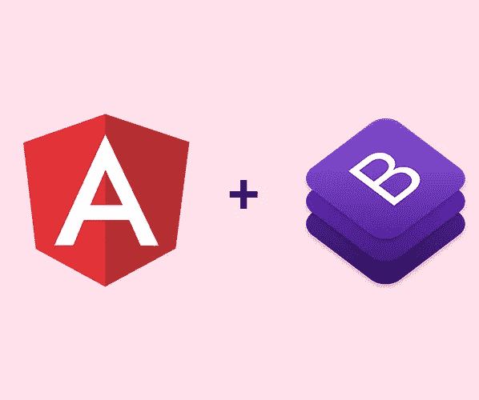
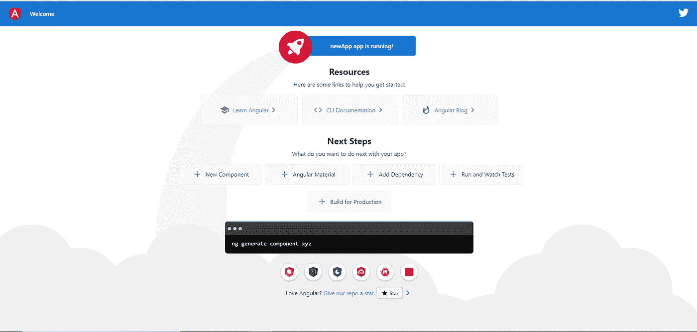

# 使用 Bootstrap 构建 Angular 8 项目

> 原文：<https://javascript.plainenglish.io/build-angular-8-project-with-bootstrap-7b89775e5764?source=collection_archive---------4----------------------->

关于如何使用 Bootstrap 设置和运行 Angular 8 应用程序的教程



Angular + Bootstrap

在本文中，您将学习如何使用 Bootstrap 设置 Angular 8 项目。这是专门为初学者或刚刚谷歌“如何建立 Angular 8 项目”设计的。所以你来对地方了。

在开始之前，您需要安装一些工具。

# **要求**

1.  **Node.js**

*   要安装 Node.js，请转到[Nodejs.org](https://nodejs.org/en/)
*   请确保您获得了 Node.js 的最新版本(即 12.x.x ),因为 Angular 8 至少需要版本 12。在终端/控制台窗口中运行以下命令，检查您的节点版本。

```
node -v
```

2. **NPM 包经理**

*   默认情况下，NPM 客户端命令行界面与 node.js 一起安装。
*   运行以下命令检查您的 npm 版本。

```
npm -v
```

# **安装角形 CLI**

现在我们要为 Angular 安装一个命令行界面。

```
npm install –g @angular/cli
```

此命令将在您的系统中全局安装 Angular CLI。如果没有 **g** 选项，它将只安装在您的当前目录中。通过运行`ng — -version`验证您的 Angular CLI 版本

# **创建新的应用程序**

安装上述工具后，我们就可以创建新的应用程序了。我们将把我们的新应用程序称为 **newApp** 。你可以随便给它起什么名字。

只需运行以下命令:

```
ng new newApp
```

然后，系统会提示并询问您是否要添加角度布线。输入是。还会要求您选择想要使用的样式表格式。我通常选择 SCSS，因为我对它更熟悉，或者你可以从其他几个选项中选择一个。

使用以下命令跳转到项目的根文件夹并运行本地开发服务器:

```
cd newApp
ng serve
```

打开浏览器，转到终端中显示的 url。或者可以`Ctrl +`点击链接 [http://localhost:4200](http://localhost:4200) 。现在，如果编译成功，您将看到以下页面。您也可以运行`ng serve –o`完成后自动打开浏览器。



Default page of Angular 8 application

保持终端运行，并打开一个新的终端以继续下一步。

# **安装引导程序**

有几种方法可以在 Angular 中安装 Bootstrap。但是现在，我将向你展示两种方法。

1.  使用 npm 安装
2.  从 CDN 复制并粘贴

**方法 1:使用 npm 安装**

如果你想要 popover、modal、tooltip 等功能，我们将按照 Bootstrap 4 的要求安装 Bootstrap 以及 **JQuery** 和 **Popper.js** 。要使用 npm 软件包管理器进行安装，只需运行以下命令。

```
npm install bootstrap jquery popper.js –-save
```

接下来，您需要配置您的 **angular.json** 来为您的应用程序包含以下样式和脚本代码。

```
"styles": [
   "src/styles.scss",
   "node_modules/bootstrap/dist/css/bootstrap.min.css"
],"scripts": [
   "node_modules/jquery/dist/jquery.min.js",
   "./node_modules/popper.js/dist/umd/popper.min.js",
   "node_modules/bootstrap/dist/js/bootstrap.min.js"
]
```

**方法 2:从 CDN 复制粘贴**

转到此[链接](https://getbootstrap.com/docs/4.3/getting-started/introduction/)获取以下代码。Bootstrap 的当前版本是 4.3 版。将这 4 行代码放入您的**index.html**中。

半铸钢ˌ钢性铸铁(Cast Semi-Steel)

```
<link rel="stylesheet" href="https://stackpath.bootstrapcdn.com/bootstrap/4.3.1/css/bootstrap.min.css" integrity="sha384-ggOyR0iXCbMQv3Xipma34MD+dH/1fQ784/j6cY/iJTQUOhcWr7x9JvoRxT2MZw1T" crossorigin="anonymous">
```

射流研究…

```
<script src="https://code.jquery.com/jquery-3.3.1.slim.min.js" integrity="sha384-q8i/X+965DzO0rT7abK41JStQIAqVgRVzpbzo5smXKp4YfRvH+8abtTE1Pi6jizo" crossorigin="anonymous"></script><script src="https://cdnjs.cloudflare.com/ajax/libs/popper.js/1.14.7/umd/popper.min.js" integrity="sha384-UO2eT0CpHqdSJQ6hJty5KVphtPhzWj9WO1clHTMGa3JDZwrnQq4sF86dIHNDz0W1" crossorigin="anonymous"></script><script src="https://stackpath.bootstrapcdn.com/bootstrap/4.3.1/js/bootstrap.min.js" integrity="sha384-JjSmVgyd0p3pXB1rRibZUAYoIIy6OrQ6VrjIEaFf/nJGzIxFDsf4x0xIM+B07jRM" crossorigin="anonymous"></script>
```

# 奖金

**安装字体牛逼**

字体 Awesome 是一个字体和图标工具包，在你的 Angular 应用程序中非常有用。下面是使用 npm install 安装 font awesome 的命令。

```
npm install @fortawesome/fontawesome-svg-core
npm install @fortawesome/free-solid-svg-icons
npm install @fortawesome/angular-fontawesome
```

**用法**

让我们看看如何在我们的应用程序中使用 fontawesome。

1.  在`src/app/app.module.ts`中导入 **FontAwesomeModule**

```
import { BrowserModule } from '@angular/platform-browser';
import { NgModule } from '@angular/core';import { AppRoutingModule } from './app-routing.module';
import { AppComponent } from './app.component';
import { FontAwesomeModule } from '@fortawesome/angular-fontawesome';@NgModule({
  declarations: [
    AppComponent
  ],
  imports: [
    BrowserModule,
    AppRoutingModule,
    FontAwesomeModule
  ],
  providers: [],
  bootstrap: [AppComponent]
})export class AppModule { }
```

2.在组件`src/app/app.component.ts`中创建一个属性来保存图标。这里我们尝试显示一个汽车图标。

```
import { Component } from '@angular/core';
import { faCar } from '@fortawesome/free-solid-svg-icons';@Component({
  selector: 'app-root',
  templateUrl: './app.component.html',
  styleUrls: ['./app.component.scss']
})export class AppComponent {
  title = 'newApp';
  faCar = faCar;
}
```

3.使用模板中的图标`src/app/app.component.html`

```
fa-icon [icon]="faCar"></fa-icon>
```

# **结论**

在本文中，您了解了如何使用 Bootstrap(版本 4.3)设置和运行 Angular 8 应用程序，包括 JQuery 和 Popper.js。

您还了解了如何在 Angular 应用程序中安装和使用字体 Awesome 图标。

# **资源**

1.  [https://angular.io/guide/setup-local](https://angular.io/guide/setup-local)
2.  [https://get bootstrap . com/docs/4.3/入门/简介/](https://getbootstrap.com/docs/4.3/getting-started/introduction/)
3.  [https://www . npmjs . com/package/@ fortawesome/angular-font awesome/v/0 . 1 . 0-9](https://www.npmjs.com/package/@fortawesome/angular-fontawesome/v/0.1.0-9)

如果你认为这篇文章是有帮助的，不要忘记与你的朋友分享。