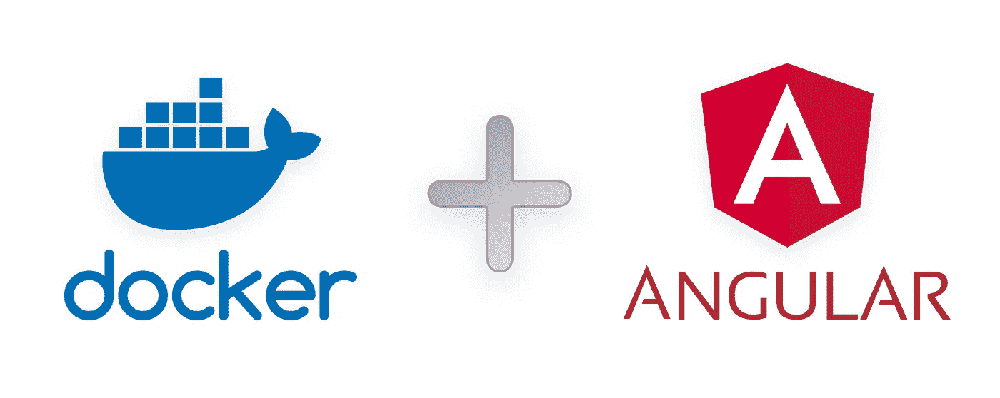

# 如何将 Angular app 部署到 Docker

> 原文：<https://javascript.plainenglish.io/build-angular-application-with-lint-unit-tests-chrome-headless-and-release-to-nginx-inside-bdc84ea9e5ab?source=collection_archive---------0----------------------->

## 使用 lint，单元测试(chrome headless)并发布到 nginx

基于我以前的一些关于 UI 微前端/微服务的帖子，我一直在使用 Docker 为 Angular 应用程序构建创建容器。



在 Docker 内部建造棱角分明的建筑实际上非常简单。让我们直接从基本的角度构建开始，然后发布到 nginx:

```
FROM nginx:alpine as env# fetch dependenciesRUN apk add --no-cache nodejs nodejs-npm && \
apk upgrade --no-cache --available && \
npm config set unsafe-perm true && \
npm install -g @angular/cli npm-snapshot && \
npm cache clean --force# build stepFROM env as dev
COPY . src
WORKDIR src
RUN npm install && \
npm rebuild node-sass && \
ng build# release stageFROM nginx:latest AS release
COPY --from=dev src/dist/ /usr/share/nginx/html/
```

好了，现在我们来分解一下:

# 预构建

```
FROM nginx:alpine as env# fetch dependenciesRUN apk add --no-cache nodejs nodejs-npm && \
apk upgrade --no-cache --available && \
npm config set unsafe-perm true && \
npm install -g @angular/cli npm-snapshot && \
npm cache clean --force
```

这里我使用的是`nginx:alpine`基本图像——我们的 Angular 应用程序最终将通过 nginx 服务器提供服务。

我们正试图在我们所有的微服务中标准化容器，因此我们使用 alpine (linux)基础映像。

您可以将`ngnix:alpine`切换到`node:latest`，这样您就不需要`RUN apk add`步骤，这让我很好地获取我们的依赖项…

因为我们从 alpine 开始，所以我们没有在容器中安装 npm 或 nodejs，所以我们必须在安装 Angular CLI 之前获取并安装它们。

***注意:*** *如果你是基于 nodejs 或者 npm 的话，应该是这样的:*

```
FROM node:latest as envRUN npm config set unsafe-perm true && \
npm install -g @angular/cli npm-snapshot && \
npm cache clean --force
```

# 建设

一旦我们安装了依赖项，现在让我们在容器中构建我们的 Angular 应用程序:

```
# build stepFROM env as dev
COPY . src
WORKDIR src
RUN npm install && \
npm rebuild node-sass && \
ng build
```

在这里，我们将所有文件复制到一个 **/src** 文件夹中，然后使用`npm install`从 npm 安装我们的项目依赖项。

***注意:*** *我在这里包含了一个* `npm rebuild node-sass` *步骤，因为 node-sass 通常绑定到您的操作系统，所以除非您在 alpine 内部进行本地开发，否则您可能会遇到没有它的 diffs，因为您的 package-lock.json 将锁定到您的本地操作系统版本。*

最后，我们可以使用`ng build`运行我们的构建步骤，这会将我们的项目构建到一个 **/src/dist** 文件夹中。

# 释放；排放；发布

现在我们已经准备好将构建好的文件发布到 ngnix 服务器上，方法是将它们复制到 ngnix 的根目录，如下所示。

```
# release stageFROM nginx:latest AS releaseCOPY --from=dev src/dist/<project>/ /usr/share/nginx/html/
```

*注意:根据 Angular 应用程序的构建设置，您可能需要指定将文件构建到哪个文件夹。*

# 棉绒/单元测试

现在，在 Docker 中运行 lint 和单元测试不是很好吗？

为此，我们首先需要获取 alpine 所需的 chrome 驱动程序，将 **RUN apk add** 行改为如下:

```
RUN apk add --no-cache nodejs nodejs-npm bash chromium nss chromium-chromedriver && \
```

让单元测试在 Chrome headless 中运行有点棘手。简而言之，Docker 不太喜欢 Chrome headless，除非你在特权模式下运行你的容器。假设你不是，我们需要告诉 Karma (Angular 的单元测试运行程序)用`--no-sandbox`标志运行 ChromeHeadless。

我发现的最简单的方法是给你的 **src/karma.conf.js** 添加一个 customLauncher，如下所示:

```
customLaunchers: {
  ChromeHeadless_without_sandox: {
    base: 'ChromeHeadless',
    flags: ['--no-sandbox']
  }
},
browsers: ['ChromeHeadless_without_sandox']
```

现在可以添加 lint 和单元测试步骤，如下图:

```
# lint and unit testFROM dev as test
RUN ng lint && \
ng test --watch=false
```

就是这样！现在你应该能够在 Docker 内部构建、测试和发布了。

这里有一个完整的单元测试的工作示例:

Add custom launcher to karma.config.js

Build Angular application with lint and unit tests

> 感谢您花时间阅读我的文章。