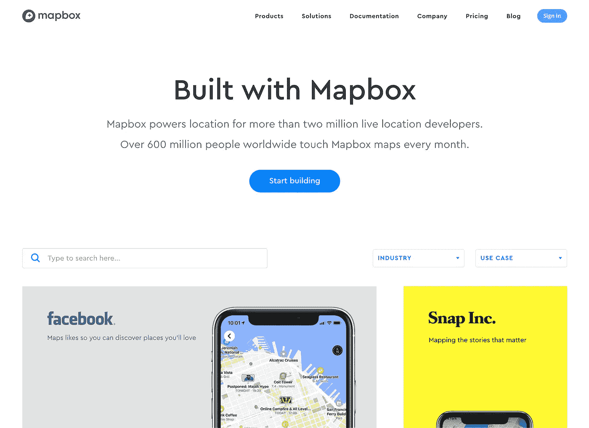
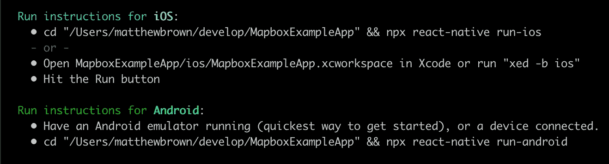
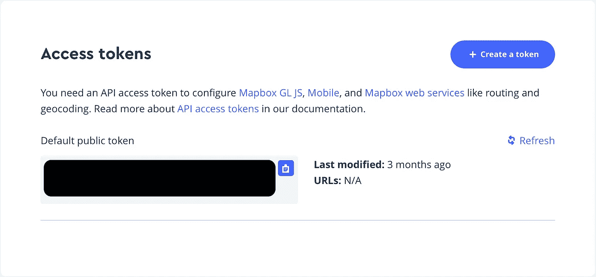
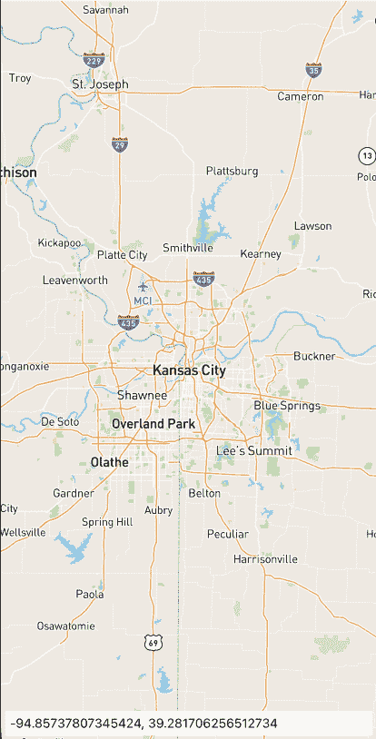
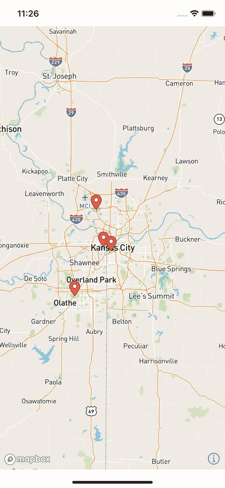
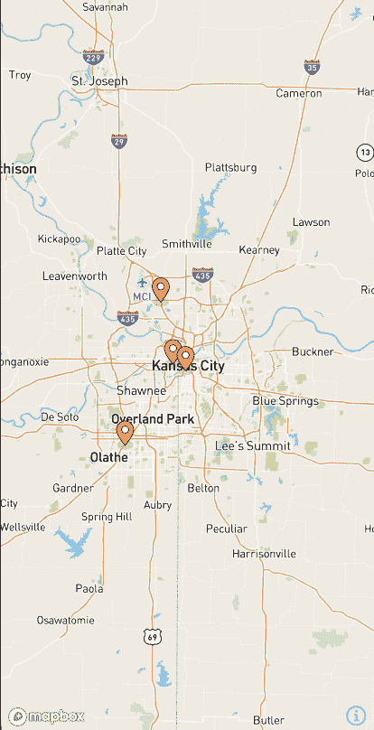

# 使用 React Native 和 Mapbox 构建出色的地图应用程序

> 原文：<https://javascript.plainenglish.io/build-awesome-map-apps-with-react-native-and-mapbox-6f0709fd5efa?source=collection_archive---------6----------------------->


Made by the author in [Canva](https://www.canva.com/)

您是否正在使用 React Native 构建移动应用程序，并希望将地图组件添加到项目中？别再往前看了，我们将在本文中讨论这个主题。我们将浏览一个使用 Mapbox SDK 构建 React 本地应用程序的示例。

如果你不熟悉 Mapbox，这是一个你可以在几乎任何平台上开发的地图服务。对于本文，我们将利用 React Native SDK，它使构建地图变得轻而易举。Mapbox 有一个非常慷慨的免费层，覆盖多达 25，000 名每月活跃用户。你可能在某个时候见过 Mapbox 地图，因为它被许多大公司广泛使用。

Mapbox 提供的地图具有漂亮的外观，并且可以非常简单地添加地图组件所需的功能。让我们开始构建一个示例应用程序来展示这是如何工作的。



Screenshot by the author

# 示例应用程序

为了演示 Mapbox 与 React Native 配合使用有多简单，我们将构建一个简单的示例应用程序。首先，我们需要生成一个新的空 React 本地项目，然后才能开始编写代码。您需要首先安装 React Native CLI，然后可以在终端中运行以下命令来引导我们的新项目。

***注:*** *为设置您的本地环境进行 React 原生开发遵循* [*本文档来自 React 原生文档*](https://reactnative.dev/docs/environment-setup) *。*

```
npx react-native init MapboxExampleApp
```

这将需要几分钟的时间来完成，一旦完成，您将会看到在您的终端上运行您的应用程序的说明，如果您使用的是 macOS，它将类似于我下面的屏幕截图。



在运行应用程序之前，我们还需要完成一个步骤，那就是安装 Mapbox React Native SDK。请注意，这是一个非官方的库，它利用官方的 Mapbox iOS 和 Android SDKs 在 React Native 中构建 Mapbox。你可以在他们的 Github 页面上阅读更多关于这个库的信息。

让我们在终端中运行下面的命令来添加地图库。

```
cd /MapboxExampleApp
npm install @react-native-mapbox-gl/maps --save/* Extra step for iOS 
npx pod-install
```

在 IDE 中打开新项目后，我们要做的第一步是清理现有的 ***App.js*** 文件，为我们的代码腾出空间。打开并更新内容以反映以下内容。

让我们说，首先，我们想建立一个最简单的地图的例子。我们可以通过更新我们的代码来做到这一点。你需要做的第一件事是在[地图框](https://www.mapbox.com/)上注册一个账户，如果你还没有注册的话。这样做是免费的，你甚至不需要输入信用卡就可以开始使用免费层。

登录到您的帐户后，您将看到一个 API 密钥，我们需要将它添加到我们的代码中以开始使用。



Screenshot by the author

从您的 Mapbox 仪表板中复制访问令牌，您将希望将它添加到我们下面的示例应用程序的更新代码中。

使用以下代码，如果您在模拟器或设备上重新加载应用程序，地图应该看起来像下面的截图，地图相机位于堪萨斯城的中心。


Screenshot by the author

# 地图交互

我们有了一个良好的开端。我们的应用程序中有一个地图，用户可以与之交互并四处拖动。接下来，让我们通过添加一些交互来使它变得更有趣一些。我们将为`onPress`添加一个处理程序，它将捕获当前所在州的纬度和经度，并在我们的地图上显示这些信息。

要实现此功能，请更新代码以匹配下面的示例。

应该可以了。重新加载应用程序，并看到下面的屏幕截图，我们的工作在行动中。



Screen capture by the author

# 地图点

现在效果很好。接下来，让我们在地图上添加一些点，让事情变得更有趣一些。下面就为 KC 我最喜欢的几个烧烤店补充几点吧。

将代码更新为以下内容，在地图上添加一些点。

你可以在代码中看到，增加点数非常简单。我们为每个想要在地图上显示的坐标添加了一个`PointAnnotation`组件。



Screenshot by the author

我们在地图上有一些点，但是如何与这些点互动呢？如果用户可以选择一个点，并将餐馆的显示名称添加到地图底部带有坐标的数据弹出窗口中，岂不是很酷？让我们将代码更新为下面的代码来实现它。

您可以看到我们为`onSelect`事件的点添加了一个事件处理程序，它捕获了地图上所选点的`id`和坐标。

在下面的屏幕截图中查看结果。



Screen capture by the author

# 包裹

这只是触及了 Mapbox 包含的所有功能的表面，但这是如何开始将 Mapbox 添加到 React 本机应用程序的快速介绍。正如你所看到的，这是非常简单的起床和去。感谢阅读！