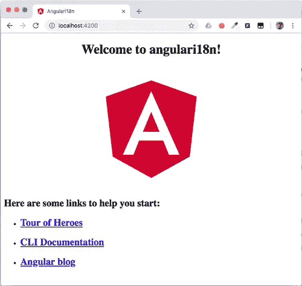
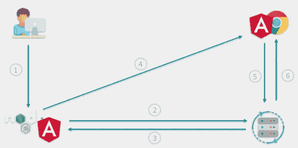
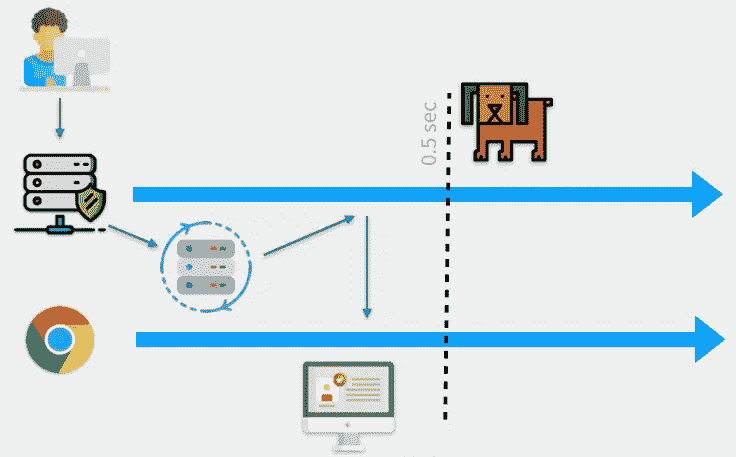
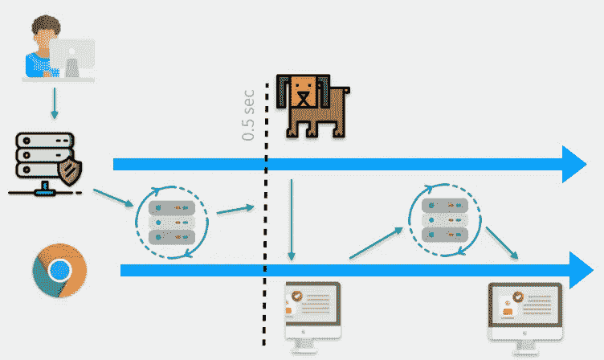

# 使用 Angular Universal、TransferState 服务和 API 看门狗构建更快的 JavaScript Web 应用程序

> 原文：<https://javascript.plainenglish.io/build-faster-javascript-web-apps-with-angular-universal-a-transferstate-service-and-an-api-b7e4afd0fe9c?source=collection_archive---------2----------------------->


搜索引擎优化(SEO)对于大多数 web 应用程序来说至关重要。你可以用 [Angular Universal](https://angular.io/guide/universal) 构建 SEO 友好的 Angular 应用，但是这样一个应用的性能和效率如何呢？这篇文章将向您展示如何构建快速的 Angular 应用程序，在提供用于 SEO 目的的服务器端渲染(SSR)的同时，高效地使用客户端和服务器资源。

在本帖中，我们将:

*   创建一个[角度的](https://angular.io)应用程序
*   使用[角度通用](https://angular.io/guide/universal)添加服务器端渲染
*   用 [TransferState](https://angular.io/api/platform-browser/TransferState) 服务建立一个`HTTP_INTERCEPTOR`，以防止对服务器资源的重复调用
*   创建一个路由解析器来防止缓慢的外部 API。

为了完成这篇文章中的任务，你需要安装 [Node.js 和 npm](https://nodejs.org/)(node . js 安装也会安装 NPM)以及 [Angular CLI](https://cli.angular.io/) 。用于 [macOS](https://curl.haxx.se/dlwiz/?type=source&os=Mac+OS+X) 、 [Linux](https://curl.haxx.se/download.html) 或 Windows 10 的 cURL([包含在](https://stackoverflow.com/questions/9507353/how-do-i-install-and-use-curl-on-windows)的内部版本 1803 和更高版本中)和 [Git](https://git-scm.com/downloads) 在说明中有所提及，但不是必需的。

要从这篇文章中最有效地学习，你应该具备以下条件:

*   打字稿和角度框架的工作知识
*   熟悉角度可观测量和依赖注入

在 [GitHub](https://github.com/maciejtreder/angular-universal-transfer-state) 上有这篇文章的配套项目。本文中的每个主要步骤在存储库中都有自己的分支。

# 创建角度项目

每个 Angular 项目都是从软件包的安装和初始化开始的。在命令提示符下，在要创建项目目录的目录中键入以下内容:

```
ng new angular-universal-transfer-state --style css --routing true --directory angularApp
```

项目初始化后，导航到其目录:

```
cd angular-universal-transfer-state
```

并通过键入以下命令运行应用程序:

```
ng serve
```

您应该在控制台中看到以下输出:

打开命令输出中提供的 URL 后， [http://localhost:4200，](http://localhost:4200,)您应该会在浏览器中看到以下内容:



# 使用 Angular Universal 添加服务器端渲染

在命令提示符下键入以下内容以安装角度通用模块:

```
ng add @ng-toolkit/universal
```

我们可以通过运行我们的应用程序并对其执行 curl 请求来检查 Angular Universal 是否正常工作:

```
npm run build:prod;npm run servercurl http://localhost:8080
```

如果您不想使用 curl，您可以在浏览器中打开 url 并检查页面源代码。如下所示，结果应该是相同的。

以下代码中的省略号(“`...`”)表示为简洁起见而编辑的部分。

您可以运行以下命令来赶上项目中的这一步:

```
git clone [https://github.com/maciejtreder/angular-universal-transfer-state.git](https://github.com/maciejtreder/angular-universal-transfer-state.git)
cd angular-universal-transfer-state
git checkout step1
cd angularApp
npm install
npm run build:prod
npm run server
```

# 创建外部 API

大多数应用程序执行对一个或多个 API 的调用，无论是在应用程序自己的服务器上还是在第三方主机上。我们的应用程序将调用我们将在 Node.js 服务器上创建并运行的服务，该服务的端口地址(8081)不同于应用程序的端口(4200)和服务器端呈现端口(8080)。

在创建服务之前，我们将构建一个简单的 Node.js 应用程序，它有两个端点，我们将使用服务在应用程序内部使用这些端点。在`angular-universal-transfer-state`应用程序的目录结构之外创建一个`externalApi`目录。在该目录中创建一个文件`externalApi.js`(因此相对路径是:`../externalApi/externalApi.js`)并将以下代码放入其中:

因为我们使用 Node.js 的 [Express](https://www.express.com/) web framework 来提供来自该应用程序的内容，所以我们需要将其初始化为 npm 项目并安装依赖项。在`externalApi`目录下创建一个`package.json`文件，并将以下内容放入其中:

通过在`externalApi`目录中运行以下命令，初始化 npm 应用程序并安装依赖项:

```
npm install
```

# 调用外部 API

现在我们将创建一个服务，它将使用我们刚刚创建的`externalApi`中的端点。通过在控制台的`angular-universal-transfer-state/angularApp`目录中键入以下命令来生成它:

```
ng g s custom --spec false
```

将`CustomService`实现放在`src/app/custom.service.ts`中:

我们需要在我们的应用程序中导入一个`HttpClientModule`,因为我们正在[向`CustomService`注入](https://en.wikipedia.org/wiki/Dependency_injection)一个`HttpClient`服务。用以下代码替换`src/app/app.module.ts`文件的内容:

创建两个组件来显示来自我们服务的响应。首先，一个为`fast`端点:

```
ng g c fast -m app -s -t --spec false
```

将以下代码放入`src/app/fast/fast.component.ts`中:

二、一为“延迟”`slow`端点:

```
ng g c slow -m app -s -t --spec false
```

将下面的代码放在`src/app/slow/slow.component.ts`中:

# 应用程序路由

将`src/app/app-routing.module.ts`文件中的代码替换为:

在`src/app/app.component.html`中放置导航链接:

如果您想赶上项目中的这一步，请使用以下命令:

```
git clone [https://github.com/maciejtreder/angular-universal-transfer-state.git](https://github.com/maciejtreder/angular-universal-transfer-state.git)
cd angular-universal-transfer-state
git checkout step2
cd externalApi
npm install
cd ../angularApp
npm install
```

# 干(C):不要重复你的电话

到目前为止，我们所拥有的是一个 Angular 应用程序，它成功地执行了对外部 API 的调用。感谢 Angular Universal，它也是搜索引擎优化的，来自这些呼叫的响应显示在服务器端呈现的构建中。

但是有一个陷阱。让我们围绕 API 调用进行一些调查。

在一个控制台窗口中，运行`externalApi`目录中的`externalApi.js`:

```
node externalApi.js
```

在另一个控制台窗口中，构建并运行`angular-universal-transfer-state`目录中的应用程序:

```
npm run build:prod
npm run server
```

使用您最喜欢的浏览器导航到位于 [http://localhost:8080](http://localhost:8080/) 的应用程序。呈现主页视图并检索来自外部 API 的数据。让我们看看`externalApi`正在运行的控制台窗口中发生了什么):

```
node externalApi.js
Listening
fast endpoint hit
fast endpoint hit
```

如您所见，我们对 API 执行了两次调用，两次命中了`fast`端点。怎么可能，我们只打开了一次网站？

这要“归功于”服务器端渲染。事情发生的顺序如下:

1.  Node.js 中的用户请求页面
2.  Node.js 在向客户端提供 Angular 服务时调用`externalApi` `fast`端点，
3.  externalApi 快速端点返回一个响应，Node.js 将其添加到生成的 HTML 中
4.  HTML 和 Angular JavaScript 被发送到浏览器
5.  Angular 在浏览器中启动，并再次调用`externalApi` `fast`端点
6.  将`externalApi` `fast`端点响应返回给浏览器，并放置在应用程序视图中。

可以在下图中查看该过程:



你觉得是不是超高效？我同意你的观点。

# 转移状态服务

我们将通过创建`TransferState`服务来提高应用程序的效率，该服务是 Node.js 服务器和浏览器中呈现的应用程序之间交换的键值注册中心。我们将通过一个`HTTP_INTERCEPTOR`机制来使用它，这个机制将驻留在`HttpClient`服务中，它将操纵请求和响应。

键入以下命令以生成新服务:

```
ng g s HttpInterceptor --spec false
```

用以下代码替换`src/app/http-interceptor.service.ts`的内容:

我们在这里放了很多代码。大家讨论一下。

我们的服务实现了`HttpInterceptor`接口，所以我们需要实现相应的方法:

```
public intercept(request: HttpRequest<any>, next: HttpHandler): Observable<HttpEvent<any>>
```

每当在`HttpClient`服务上执行任何 API 调用时，都会调用这个方法。

在我们的演示中，为了简单起见，我们希望只对 GET 调用使用`TransferState`注册表。我们需要检查来电是否符合该标准:

```
if (request.method !== 'GET') {
     return next.handle(request);
}
```

如果是，我们就根据请求 URL 生成一个密钥。我们将使用键-值对来存储或检索请求响应，这取决于是在服务器端还是在浏览器端处理请求:

```
const key: StateKey<string> = makeStateKey<string>(request.url);
```

为了区分服务器和浏览器，我们使用了来自`@angular/common`库的`isPlatformServer`方法和`PLATFORM_ID`注入令牌:

```
if (isPlatformServer(this.platformId)) {
    //serverSide
} else {
    //browserSide
}
```

在服务器端代码中，我们希望执行调用并将其响应存储在`TransferState`注册表中:

```
if (isPlatformServer(this.platformId)) {
    return next.handle(request).pipe(tap((event) => {
        this.transferState.set(key, (<HttpResponse<any>> event).body);
}));
```

在浏览器端代码中，我们希望检查给定调用的响应是否已经驻留在注册表中。如果有，我们希望检索它，清除注册表(以便将来的调用可以存储新数据)，并将响应返回给调用者(在本例中为`CustomService`)。如果注册表中不存在给定的键，我们只需执行 HTTP 调用:

```
else {
    const storedResponse = this.transferState.get<any>(key, null);
    if (storedResponse) {
        const response = new HttpResponse({body: storedResponse, status: 200});
        this.transferState.remove(key);
        return of(response);
    } else {
        return next.handle(request);
    }
}
```

我们可以在`src/app/app.module.ts`中提供 HTTP 拦截器，用以下代码替换现有代码:

我们需要将两个包含`TransferState`服务的新模块导入我们的应用程序。通过用以下代码替换`src/app/app.server.module.ts`中的现有代码，将`ServerTransferStateModule`包含在服务器端模块中:

通过用以下代码替换`src/app/app.browser.module.ts`中的代码，将`BrowserTransferStateModule`包含在浏览器端模块中:

`src/main.ts`文件中的代码也需要修改。我们需要以稍微不同的方式引导我们的应用程序，以使`TransferState`注册表正常工作；当浏览器发出`DOMContentLoaded`事件时，我们需要引导我们的应用程序。用以下代码替换现有代码:

# 测试 TransferState 服务

重新编译应用程序，并检查对后端进行了多少次调用。

构建并运行服务器:

```
npm run build:prod
npm run server
```

如果您因任何原因停止了`externalApi`过程，您现在应该重启它。

使用浏览器的地址栏导航到第二个组件[http://localhost:8080/slow](http://localhost:8080/slow)。这样做将对服务器执行调用，而不是像单击主页上的链接那样在浏览器中运行本地代码(Angular SPA)。

在控制台窗口中检查`externalApi`过程的输出。它应该如下所示，其中前两个快速端点响应来自之前的测试，最后一行是当前测试的结果:

```
Listening
fast endpoint hit
fast endpoint hit
slow endpoint hit
```

任务完成！后端检索到的响应被传递给`TransferState`注册表中的浏览器。

# 另一种 HTTP 拦截器

作为创建定制`HTTP_INTERCEPTOR`的替代方法，您可以使用`@nguniversal`库中的标准`TransferHttpCacheModule`。这使得实现更加方便，但是它也强加了一个约束:您不能对标准库进行任何更改，所以您不能添加像我们将在接下来的步骤中创建的 API watchdog 这样的功能。

要实现标准传输缓存，请安装依赖项:

```
npm install @nguniversal/common
```

并将`TransferHttpCacheModule`模块导入到`src/app/app.module.ts`中，将内容替换为以下代码:

所有其他步骤保持不变。如果您想赶上这一步，运行:

```
git clone [https://github.com/maciejtreder/angular-universal-transfer-state.git](https://github.com/maciejtreder/angular-universal-transfer-state.git)
cd angular-universal-transfer-state
git checkout step3
cd externalApi
npm install
cd ../angularApp
npm install
```

# 实现性能监视器

还有一件事我们需要考虑。正如你可能注意到的，加载[http://localhost:8080/slow](http://localhost:8080/slow)需要很长时间。肯定不是 SEO 友好的。虽然这是因为我们在创建外部 API 时出于演示目的引入了时间延迟，但现实世界中有许多 API 响应缓慢或根本不响应的例子。

我们将通过在对`SlowComponent`的调用中使用`RouteResolver`来解决这个问题。

通过在用于构建和运行应用程序的控制台窗口中输入以下命令来生成它:

```
ng g s SlowComponentResolver --spec false
```

并将`src/app/slow-component-resolver.service.ts`中的代码替换为以下内容:

稍微检查一下这段代码。我们有一个需要实现的`resolve`方法，因为我们正在实现`Resolve`接口。在方法内部，我们检查代码是否在浏览器或服务器上执行。如果代码正在浏览器中执行，它会通过执行调用来等待调用:

```
if (isPlatformBrowser(this.platformId)) {
    return this.service.getSlow();
}
```

如果代码正在 Node.js 服务器中执行，则使用`rxjs`库中的`timer`方法创建一个可观察对象`watchdog`。`timer`方法创建一个可观察对象，该对象在给定时间(以毫秒为单位)后仅发出一次值:

```
const watchdog: Observable<number> = timer(500);
```

我们将这个可观察对象与`takeUntil`方法一起使用，通过管道传递给请求调用。如果 observable 在 API 发送响应之前发出一个值，它会将`null`推送给组件。否则，它会推送 API 响应。

我们需要更新应用程序的路由来使用这个解析器。用以下内容替换`src/app/app-routing.module.ts`的内容:

用以下代码替换`src/app/slow/slow.component.ts`中的代码，更新“慢速”组件以使用路线解析器:

重新构建应用程序，并检查现在渲染缓慢的组件需要多长时间。

好多了！如果呼叫时间超过 0.5 秒，我们将放弃呼叫，并在浏览器中再次执行。那正是我们要找的。

在下面的插图中，你可以看到我们的新架构是如何工作的。

当 API 快速响应时，响应由服务器处理:



当 API 在看门狗激活前没有回复时，我们向浏览器发送部分呈现的 HTML 并重复调用:



作为一种替代方法，如果您不想在全局设置看门狗机制，您可以通过在`HTTP_INTERCEPTOR`中提供它来实现。

如果您想赶上这一步，运行:

```
git clone [https://github.com/maciejtreder/angular-universal-transfer-state.git](https://github.com/maciejtreder/angular-universal-transfer-state.git)
cd angular-universal-transfer-state
git checkout step4
npm install
npm run build:prod
npm run server
```

# 摘要

今天我们讨论了一个重要的挑战:提高实现服务器端渲染的应用程序的性能和效率。我们用两种方式做到了这一点:使用`TransferState`服务，我们能够限制对可能很慢的 API 的调用。我们还实现了一个看门狗机制来放弃长时间运行的 API 调用，这会对服务器渲染视图所需的总时间产生负面影响。这两种技术都有助于改善 Angular 网站的性能，从而提高用户满意度，并帮助网站在搜索引擎排名中获得更好的分数。

如果你想了解更多关于 Angular Universal 的技术，请查看我在 Twilio 博客上的其他帖子[开始使用 AWS Lambda 上的无服务器 Angular Universal](https://www.twilio.com/blog/angular-universal-javascript-node-js-aws-lambda)和[使用 Angular Universal 和 ngx-translate 模块](https://www.twilio.com/blog/create-search-engine-friendly-internationalized-web-apps-angular-universal-ngx-translate)为 Angular 应用程序创建搜索引擎友好的国际化。

本文中使用的代码的 Git 存储库可以在这里找到:[https://github . com/maciejtreder/angular-universal-transfer-state](https://github.com/maciejtreder/angular-universal-transfer-state)

我是 Maciej Treder，请通过 GitHub、Twitter 和 LinkedIn 上的[contact@maciejtreder.com](mailto:contact@maciejtreder.com)、[https://www.maciejtreder.com](https://www.maciejtreder.com/)或@maciejtreder 与我联系。

*本帖原载于* [*Twilio 博客*](https://www.twilio.com/blog/prevent-memory-leaks-angular-observable-ngondestroy) *。*