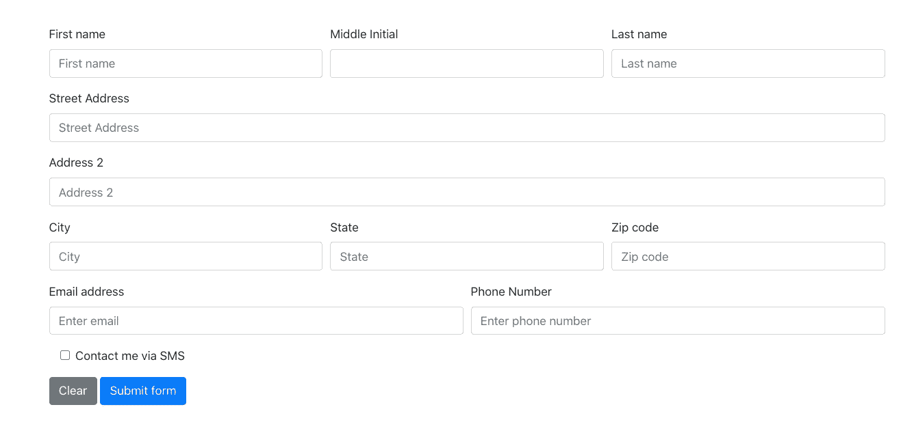
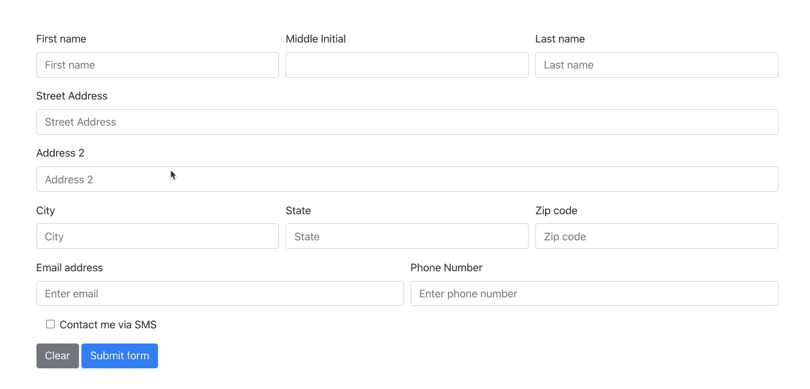

# 用 Formik 构建 React 表单

> 原文：<https://javascript.plainenglish.io/build-react-forms-with-formik-439111c587ff?source=collection_archive---------7----------------------->

## 使用 Formik 和 Yup 验证简化表单构建


Made by the author in [Canva](https://www.canva.com/)

React 中的构建表单可能会变得混乱。如果您有一个只有几个数据输入的小表单，您可以不用表单库来构建它，而且可能不会太复杂。但是，当您开始构建具有大量数据输入和验证规则的表单时，会发生什么呢？

作为一名技术负责人，我一直在寻找不仅能改善用户体验，还能改善开发人员体验的库。我想使用让开发人员事半功倍的工具。

几年来，我一直在 React 应用程序中使用 Formik 来解决这个问题。它使用起来非常简单，如果您试图不用它来构建表单，它可以减少您自己编写的大量样板代码。

在本文中，我将演示在不使用 Formik 的情况下构建表单，然后使用 Formik 进行重新构建，以展示这两种方法之间的区别。我还将介绍 Formik 提供的特性。下面是我们将要构建的内容的截图。



Screenshot by the author

# 先来硬的…

首先，我们将在不使用 Formik 的情况下构建一个表单示例。我将使用 Create React App 生成一个新的 React 项目，并编写一些代码。

我们应该为这个演示构建什么形式？让我们保持简单，建立一些大多数网站需要的东西。对于演示，我们将构建一个新的用户注册表单。我们将为我们的用户收集各种数据点，并基于不同的数据点运行一些验证。

我还将使用`react-bootstrap`通过使用表单组件给我们的表单添加一点风格。

您可以在终端中运行以下命令:

```
npx create-react-app react-formik-demo
cd react-formik-demo
npm install react-bootstrap bootstrap
yarn start
```

这应该让我们知道我们已经生成了一个新的 React 项目，安装了我们的依赖项，并且正在本地运行应用程序。

现在我们准备构建我们的初始表单。创建一个名为`NewUserForm.js`的新文件，添加以下代码。

在继续之前，让我们快速浏览一下这个代码示例。我们已经添加了所有的数据字段。我们已经在状态中初始化了表单值。我们还从表单元素中构建了处理变更事件的函数。

我们需要采取的另一个步骤是将这个表单组件导入到主`App`组件中。

这是我们表单的基础。我们需要添加的另一件事是提交时的字段验证。下面让我们更新代码来实现这一点。

这为我们的表单增加了验证。我们创建一个状态对象来跟踪各个输入字段的错误消息，这样我们就可以显示个性化的错误消息。然后，我们添加一个函数，在每次提交时验证表单。另外一点是，一旦我们更新了各个输入字段，我们就清除了该字段的所有错误。

# 是时候添加 Formik 了&是的

我们已经构建了符合我们要求的表单，但是如果您查看代码，您会发现这个表单组件已经变得相当大了。大多数 web 应用程序都有许多表单，而不仅仅是一个表单，所以考虑为每个表单构建多少样板代码是很重要的。就开发人员构建和维护所有这一切的努力而言，这实际上是加在一起的。

是时候介绍 Formik 了，看看我们可以清理多少表单代码。除了 Formik，我们还将添加 Yup 来以标准方式处理表单验证。Formik 是开放的，允许您选择自己喜欢的方式来处理验证。Yup 和 Formik 经常一起使用，很容易找到一起使用这两个库的好例子和文档。


Screenshot by the author from [Formik’s site](https://formik.org/)

在我们修改代码之前，我们需要通过 npm 安装两个新的包。在终端中从项目目录运行以下命令来添加`formik`和`yup`。

```
npm install formik yup
```

让我们从如何在 Formik 中声明我们的表单开始。

我们很快就会看到完整的代码示例。但是让我们先走一遍。我们声明了`Formik`组件，并向`onSubmit`提供了一个提交函数，还向`initialValues`提供了表单对象的形状。

接下来，我们想在新表单中添加 Yup 验证。通过这个例子您会看到，Yup 提供了一种简单的方法来声明表单中值的类型以及如何验证这些值。我们可以去掉我们的电子邮件验证功能，因为你可以看到 Yup 提供了一种验证电子邮件的方法。没有用于电话号码验证的内置类型，但是您可以看到，通过为电话号码字段提供一个正则表达式，我们可以非常简单地做到这一点。

这就是我们最后的例子。如您所见，我们能够删除第一个示例中必须创建的所有样板代码。默认情况下，Formik 处理验证。因此，当您输入值或点击提交时，它会运行验证，因此在所有表单值都通过之前，它不会允许提交表单。

Formik 为访问和更新表单值提供了一个简单的界面。使用`handleChange`处理更新，而`values`对象保存所有当前表单值。与显示单个字段错误信息的`errors`对象相同。



Screen capture by the author

请看 scre *en capture，了解我们的工作成果！*

*我们的 Formik 演示到此结束。我希望这能让你对 Formik 和 Yup 在应用程序中构建表单的用处有所了解。感谢您的阅读！*

**查看我关于 React 的更多文章:**

[](https://medium.com/javascript-in-plain-english/code-splitting-in-react-apps-with-suspense-2a6e780b703b) [## 带悬念的 React 应用中的代码拆分

### 保持应用程序包较小的简单方法。

medium.com](https://medium.com/javascript-in-plain-english/code-splitting-in-react-apps-with-suspense-2a6e780b703b) [](https://medium.com/swlh/how-to-incorporate-openlayers-maps-into-react-65b411985744) [## 如何在 React 中使用 OpenLayers 贴图

### 让我们把它画出来…

medium.com](https://medium.com/swlh/how-to-incorporate-openlayers-maps-into-react-65b411985744)