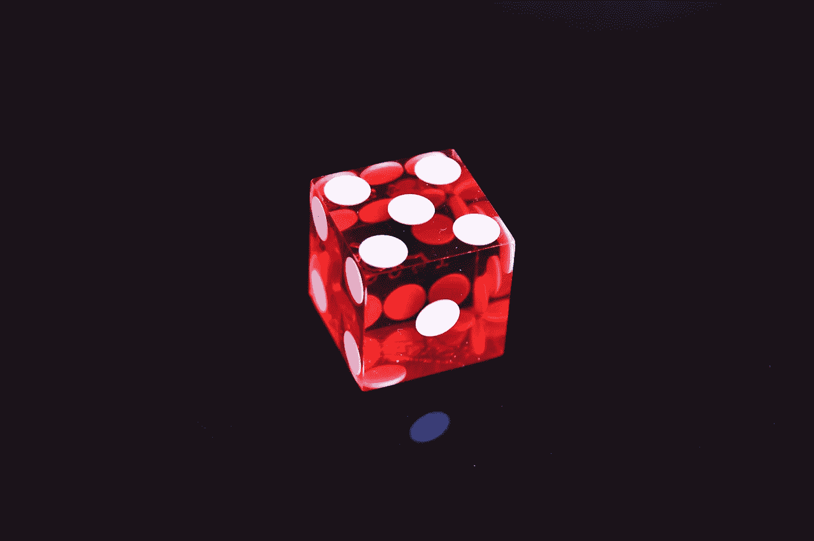

# 使用 JavaScript 构建井字游戏

> 原文：<https://javascript.plainenglish.io/build-tic-tac-toe-game-using-javascript-3afba3c8fdcc?source=collection_archive---------0----------------------->

## 了解如何使用纯 JavaScript 构建简单的井字游戏



Photo by Jonathan Petersson on Unsplash

今天在这个故事中，我们将使用纯 JavaScript 创建一个简单的井字游戏。所以你必须知道一些基本的 html 和 css 和查询选择器功能来创建这个游戏。

让我们进入主题。首先，我们将为我们的游戏创建一个基本的结构。首先确保创建一个用户界面。让我们分解成小块。以便于我们维护。

*   标题
*   3×3 网格
*   显示当前玩家的回合信息。
*   显示谁赢了这场比赛。
*   显示游戏是否以平局结束。
*   重启按钮重启整个游戏。

现在让我们进入点击单元格的游戏流程。

*   追踪所有点击我们手机的信息。
*   检查有效的移动，并确保已播放的单元格是否已被单击。
*   更新游戏状态。
*   验证游戏状态。
*   更新对 UI 所做的更改。
*   重复，最后结束游戏。

现在让我们深入到建造它的项目中。

# 文件夹的结构

让我们开始构建游戏的用户界面。正如我之前提到的，这是一个简单的游戏，所以让我们使用户界面也简单。

该结构包含三个主要文件。

*   index.html(包含用户界面结构)
*   style.css(让我们的游戏看起来更聪明)
*   script.js(包含游戏逻辑)

# 超文本标记语言

```
<!doctype html>
<html lang="en">
<head>
    <meta charset="UTF-8">
    <meta name="viewport"
          content="width=device-width, user-scalable=no, initial-scale=1.0, maximum-scale=1.0, minimum-scale=1.0">
    <meta http-equiv="X-UA-Compatible" content="ie=edge">
    <title>Tic Tac Toe</title>
    <link rel="stylesheet" href="style.css">
</head>
<body>
    <section>
        <h1 class="game--title">Tic Tac Toe</h1>
        <div class="game--container">
            <div data-cell-index="0" class="cell"></div>
            <div data-cell-index="1" class="cell"></div>
            <div data-cell-index="2" class="cell"></div>
            <div data-cell-index="3" class="cell"></div>
            <div data-cell-index="4" class="cell"></div>
            <div data-cell-index="5" class="cell"></div>
            <div data-cell-index="6" class="cell"></div>
            <div data-cell-index="7" class="cell"></div>
            <div data-cell-index="8" class="cell"></div>
        </div>
        <h2 class="game--status"></h2>
        <button class="game--restart">Restart Game</button>
    </section>
<script src="script.js"></script>
</body>
</html>
```

我们将样式表包含在 **< head >** 元素中，以使样式表在 html 之前加载。

我们还在 **< /body >** 上方包含了 **script.js** 文件，以便在 html 之后加载 JavaScript 文件。

我们还包含了 **< h2 >** 元素来显示游戏信息和重启按钮。

每个还包含用于跟踪点击的数据单元索引属性。

# 半铸钢ˌ钢性铸铁(Cast Semi-Steel)

```
body {
    font-family: "Arial", sans-serif;
}
section {
    text-align: center;
}
.game--container {
    display: grid;
    grid-template-columns: repeat(3, auto);
    width: 306px;
    margin: 50px auto;
}
.cell {
    font-family: "Permanent Marker", cursive;
    width: 100px;
    height: 100px;
    box-shadow: 0 0 0 1px #333333;
    border: 1px solid #333333;
    cursor: pointer;
line-height: 100px;
    font-size: 60px;
}
```

我只是想实现**的样式。css 网格的游戏容器。**

我们要构建 3×3 网格，因此确保网格列模板的属性为 3，并重复它。

它将包含的单元格分成 3 列，单元格自动设置它们的宽度。

# Java Script 语言

现在让我们进入游戏逻辑，将 JavaScript 代码分解成小块用于我们的模板。

```
/*
We store our game status element here to allow us to more easily 
use it later on 
*/
const statusDisplay = document.querySelector('.game--status');
let gameActive = true;
let currentPlayer = "X";
let gameState = ["", "", "", "", "", "", "", "", ""];
const winningMessage = () => `Player ${currentPlayer} has won!`;
const drawMessage = () => `Game ended in a draw!`;
const currentPlayerTurn = () => `It's ${currentPlayer}'s turn`;
/*
We set the inital message to let the players know whose turn it is
*/
statusDisplay.innerHTML = currentPlayerTurn();
function handleCellPlayed() {

}
function handlePlayerChange() {

}
function handleResultValidation() {

}
function handleCellClick() {

}
function handleRestartGame() {

}
document.querySelectorAll('.cell').forEach(cell => cell.addEventListener('click', handleCellClick));
document.querySelector('.game--restart').addEventListener('click', handleRestartGame);
```

我们刚刚概述了我们的游戏逻辑。我们将需要处理我们的游戏逻辑。所以让我们创建我们的逻辑。

# handleCellClick

在 handleCellClick 中，我们必须处理两件事。首先，我们必须检查单元格是否已经被点击。如果没有，继续我们的游戏。

让我们看看它是什么样子的。

```
function handleCellClick(clickedCellEvent) {
/*
We will save the clicked html element in a variable for easier further use
*/    
    const clickedCell = clickedCellEvent.target;
/*
Here we will grab the 'data-cell-index' attribute from the clicked cell to identify where that cell is in our grid. 
Please note that the getAttribute will return a string value. Since we need an actual number we will parse it to an 
integer(number)
*/
    const clickedCellIndex = parseInt(
      clickedCell.getAttribute('data-cell-index')
    );
/* 
Next up we need to check whether the call has already been played, 
or if the game is paused. If either of those is true we will simply ignore the click.
*/
    if (gameState[clickedCellIndex] !== "" || !gameActive) {
        return;
    }
/* 
If everything if in order we will proceed with the game flow
*/    
    handleCellPlayed(clickedCell, clickedCellIndex);
    handleResultValidation();
}
```

# handleCellPlayed

在这个处理程序中，我们必须更新两件事。首先更新我们的 ge 状态，然后是用户界面。

```
function handleCellPlayed(clickedCell, clickedCellIndex) {
/*
We update our internal game state to reflect the played move, 
as well as update the user interface to reflect the played move
*/
    gameState[clickedCellIndex] = currentPlayer;
    clickedCell.innerHTML = currentPlayer;
}
```

我们只接受当前被点击的单元格和被点击单元格的索引。

# handleResultValidation

结果验证是我们井字游戏的核心。在这里，我们将只检查游戏是否以赢或平结束。

让我们开始检查当前玩家是否赢得了游戏。

```
const winningConditions = [
    [0, 1, 2],
    [3, 4, 5],
    [6, 7, 8],
    [0, 3, 6],
    [1, 4, 7],
    [2, 5, 8],
    [0, 4, 8],
    [2, 4, 6]
];
function handleResultValidation() {
    let roundWon = false;
    for (let i = 0; i <= 7; i++) {
        const winCondition = winningConditions[i];
        let a = gameState[winCondition[0]];
        let b = gameState[winCondition[1]];
        let c = gameState[winCondition[2]];
        if (a === '' || b === '' || c === '') {
            continue;
        }
        if (a === b && b === c) {
            roundWon = true;
            break
        }
    }
if (roundWon) {
        statusDisplay.innerHTML = winningMessage();
        gameActive = false;
        return;
    }
}
```

如果游戏以平局结束，让我们检查另一个条件。在特定条件下，比赛以平局结束的方式。

```
const winningConditions = [
    [0, 1, 2],
    [3, 4, 5],
    [6, 7, 8],
    [0, 3, 6],
    [1, 4, 7],
    [2, 5, 8],
    [0, 4, 8],
    [2, 4, 6]
];
function handleResultValidation() {
    let roundWon = false;
    for (let i = 0; i <= 7; i++) {
        const winCondition = winningConditions[i];
        let a = gameState[winCondition[0]];
        let b = gameState[winCondition[1]];
        let c = gameState[winCondition[2]];
        if (a === '' || b === '' || c === '') {
            continue;
        }
        if (a === b && b === c) {
            roundWon = true;
            break
        }
    }
if (roundWon) {
        statusDisplay.innerHTML = winningMessage();
        gameActive = false;
        return;
    }
/* 
We will check weather there are any values in our game state array 
that are still not populated with a player sign
*/
    let roundDraw = !gameState.includes("");
    if (roundDraw) {
        statusDisplay.innerHTML = drawMessage();
        gameActive = false;
        return;
    }
/*
If we get to here we know that the no one won the game yet, 
and that there are still moves to be played, so we continue by changing the current player.
*/
    handlePlayerChange();
}
```

# handlePlayerChange

这将改变当前玩家并更新游戏状态。在这里，我们使用三元运算符将值赋给新玩家。

```
function handlePlayerChange() {
    currentPlayer = currentPlayer === "X" ? "O" : "X";
    statusDisplay.innerHTML = currentPlayerTurn();
}
```

# handleRestartGame

这将把我们所有的游戏追踪设置回默认状态。它清除游戏板上的所有信号，并将游戏状态更新到当前玩家消息中。

```
function handleRestartGame() {
    gameActive = true;
    currentPlayer = "X";
    gameState = ["", "", "", "", "", "", "", "", ""];
    statusDisplay.innerHTML = currentPlayerTurn();
    document.querySelectorAll('.cell')
               .forEach(cell => cell.innerHTML = "");
}
```

# 结论

我希望你喜欢很多，并找到井字游戏的基本功能。当然，这是一个基本的，你可以把它变成一个多人游戏。你也可以把这个项目发展成一个更长的项目。

感谢阅读！