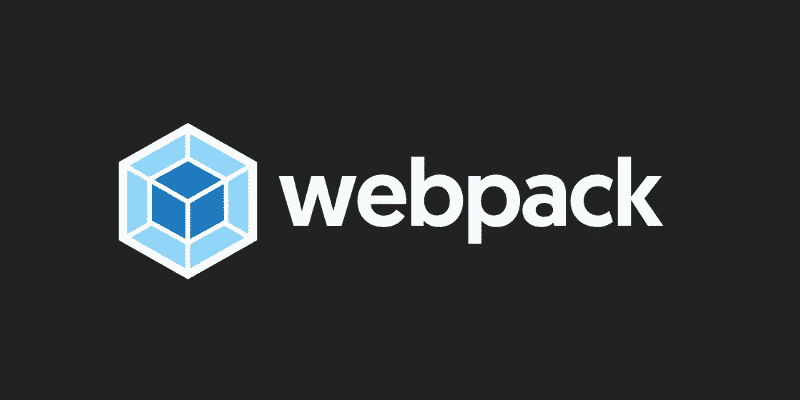
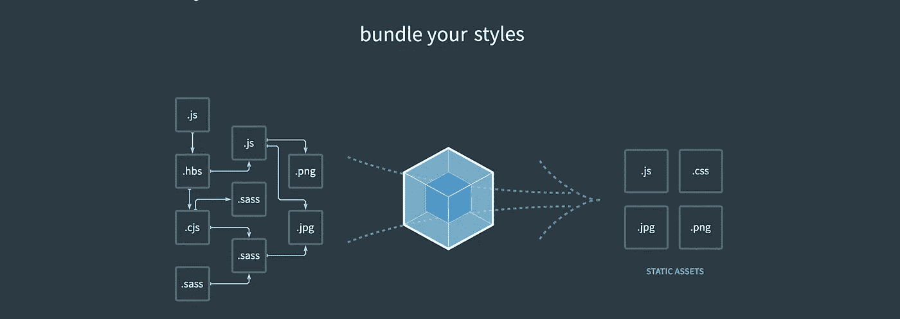
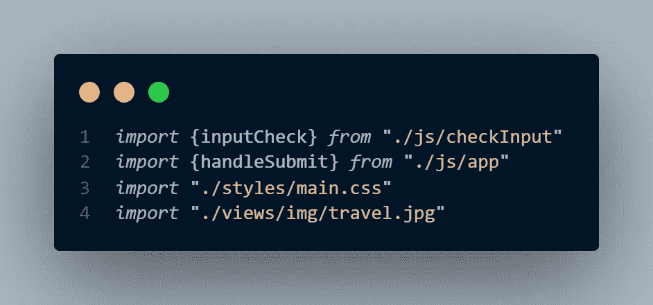
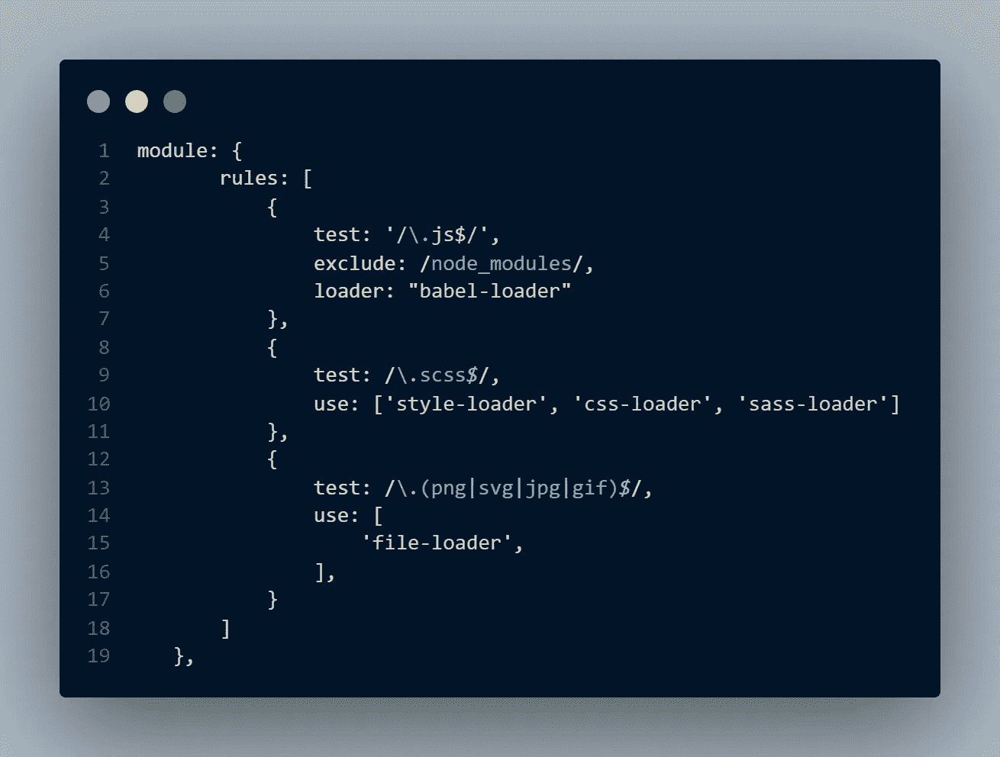
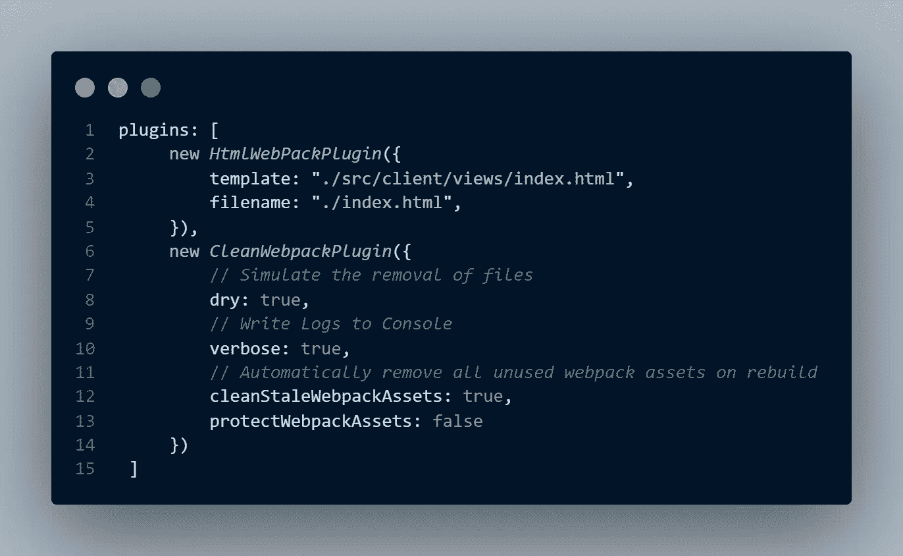

# 构建工具:Webpack 简介

> 原文：<https://javascript.plainenglish.io/build-tools-introduction-to-webpack-92225a1419af?source=collection_archive---------8----------------------->



想象一下，一个网页上有一些样式和动画，可以添加很多东西，为用户创造良好的体验。在它的背后，有许多事情正在进行，许多工具正在使用，例如:

*   引导库
*   JavaScript 框架，如 Vue、React 或 Angular
*   动画库等。

因此，要构建一个相当简单的页面，需要添加很多东西，在一个更广泛的场景中，你正在为客户构建一些东西，应用程序会不时地变化，插入更多的东西，使其管理更难处理。考虑到这种情况，有必要采用构建工具来简化整个管理过程，这就是 Webpack 的亮点！

## 但是 Webpack 到底是什么？

根据文件:

> 就其核心而言，Webpack 是现代 JavaScript 应用程序的静态模块捆绑器。



基本上，Webpack 获取所有的 JavaScript 文件、CSS 文件等，通过插件和加载器运行它们，并将它们分割成包含所有这些文件的更少的文件。上图中的概念是，Webpack 将左边的所有资产“捆绑”或组合成更容易管理的小文件。注意倍数。左边的 js 文件变成了一个。js 文件放在右边，这是因为这两个文件合并成了一个大的。js 文件。

## **入门**

要开始使用 webpack，您可以通过 npm 命令在项目中本地安装它(确保您安装了 Node.js):

```
npm i webpack webpack-cli
```

在 package.json 中，您可以创建一个脚本来运行它:

```
"scripts": {
 "build": "webpack"
}
```

在项目的根目录下创建一个 **webpack.config.js** 文件，并插入下面的 require 语句:

```
**const** path = require("path")
**const** webpack = require("webpack")
module.exports = {
} 
```

您可以运行 **npm run build** ，但是可能会得到一个错误，因为 module.exports 仍然是空的。所以现在是时候填充它了！

## **网络包条目**

为了构建依赖树，我们需要设置一个起点，在这里 Webpack 将能够检查所有将被捆绑的文件，它可以是您选择的任何文件。我将 index.js 文件设置为入口点。



正如您所看到的，index.js 文件包含了我们想要捆绑的一些文件的导入。注意，在您的入口点中，您可以导入任何类型的文件。你这样设置入口点:

```
module.exports = {
    entry: './src/client/index.js'
}
```

现在，在运行 **npm run build** 之后，一个 dist 文件夹将自动创建在您的项目文件夹中，包括**文件**，您可以在其中找到包含在 **index.js** 中的那些文件的精简代码。

## **输出**

顾名思义，Webpack 中的输出是结果，默认情况下是**。/dist/main.js** 。它位于 dist 文件夹中，Webpack 在这里存储了它从我们指定的文件中创建的所有捆绑资产。您也可以设置不同的输出:

```
module.exports = {
    entry: './src/client/index.js',
      output: {
    path: path.resolve(__dirname, 'dist',
    filename: 'newMain.js'
  }}
```

## **装载机**

Webpack 只理解 JavaScript 和 JSON 文件。在这种情况下，Webpack 使用加载器将任何其他类型的文件转换成 Webpack 可以使用的语言。



在上面的例子中，我们可以看到一个包含各种加载器的规则数组，每个加载器告诉它将运行哪种类型的文件，而**测试**指定了一个**正则表达式**来确定它应该期望的文件的确切类型。

一些装载机:

1.  **babel-loader:** 用于将 ES5+代码转换成所有浏览器都能识别的 JavaScript，包括旧版本。巴别塔本身可以是一整篇文章，你可以在这个[链接](https://babeljs.io/docs/en/)上查看更多。
2.  **style-loader:** 使用 **style** 标签将 CSS 添加到 DOM。
3.  **文件加载器:**用于处理图像。

有许多令人惊叹的装载机，你可以在这里找到它们。

## **插件**

> *虽然加载器用于转换某些类型的模块，但插件可用于执行更广泛的任务，如捆绑包优化、资产管理和环境变量注入。*

所以，基本上插件设置了一堆可以包含在你的项目中的额外任务。



上图中使用了两个插件:

1.  **HtmlWebPackPlugin:** 创建 HTML 文件来服务你的包
2.  这个插件对于保持 dist 文件夹整洁非常有用。想象一下，每次我们对一个文件进行修改时，我们都必须删除并重新构建 dist 文件夹来更新它。这个插件只是自动完成这个痛苦的过程，当有东西改变时，它会自动更新 dist 文件夹。你可以在这里查看更多插件[。](https://github.com/webpack-contrib/awesome-webpack#webpack-plugins)

## **模式**

在软件开发过程中，应用程序可以有一些模式，如**开发和生产**模式。在 Webpack 中，production 是默认环境，您可以轻松设置希望在应用程序中使用的环境模式。要设置模式:

```
module.exports = {
    mode: 'development',
}
```

恭喜，你坚持到了最后。🎉Webpack 一开始可能有点难理解，但它是一个非常强大的工具。本文介绍的概念是理解与 Webpack 相关的复杂主题的基础。希望你能从这里学到一些东西，祝你编码愉快！