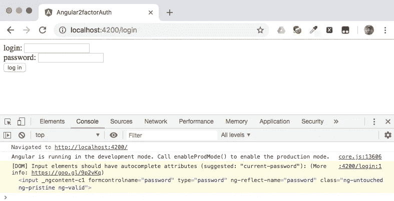
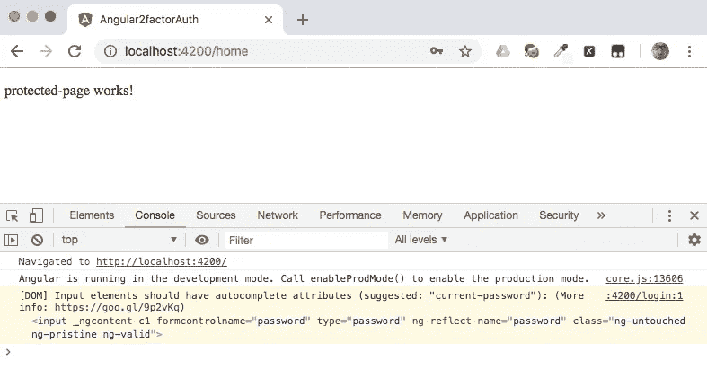
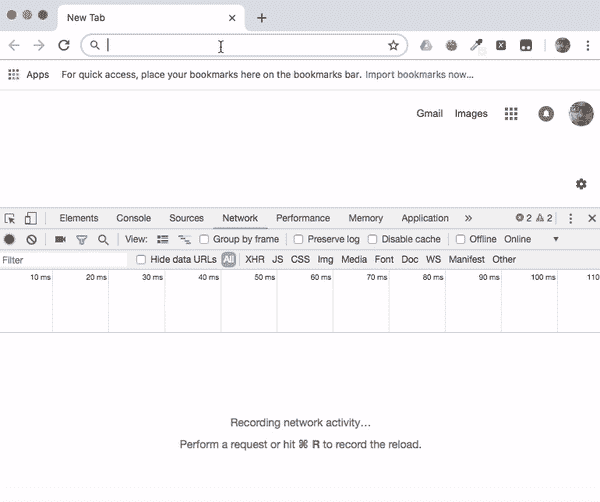
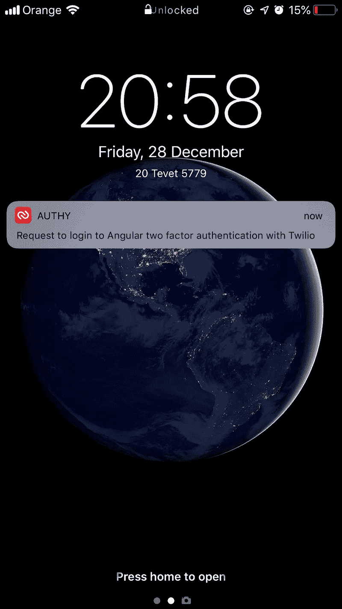
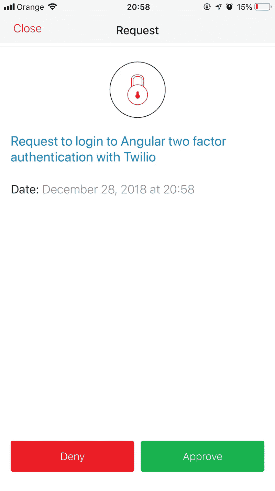
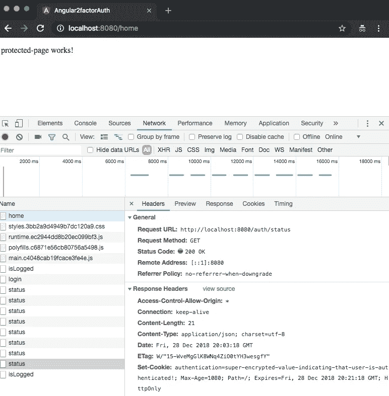

# 使用 Twilio Authy 在 Angular 中构建双因素身份验证

> 原文：<https://javascript.plainenglish.io/build-two-factor-authentication-in-angular-with-twilio-authy-b94f700d1866?source=collection_archive---------0----------------------->


用户身份验证是许多 Angular 应用程序的关键要求，简单地使用用户 ID 和密码登录越来越不够安全。双因素身份认证(2FA)提供了基于设备的安全性，这大大增加了黑客攻击的难度，但构建自己的 2FA 系统是一项艰巨的挑战。 [Twilio Authy](https://www.twilio.com/docs/authy) 让给 Angular 应用添加 2FA 变得很容易。

这篇文章将向你展示如何添加 Authy 到你的 Angular 项目中。您还将了解如何通过使用 Angular Universal 实现登录过程来改善用户体验和应用程序的安全性。

在本帖中，我们将:

*   创建一个带有登录页面的基本 Angular 应用程序
*   建立授权保护服务和授权服务
*   使用[角度通用](https://angular.io/guide/universal)添加服务器端渲染
*   设置服务器端身份验证
*   使用 [Twilio Authy](https://www.twilio.com/authy) 实施双因素认证

# 使用 Angular 和 Authy 进行构建的先决条件

为了完成这篇文章中的任务，你需要:

*   [Node.js 和 npm](https://nodejs.org/)(node . js 安装也会安装 NPM。)
*   [角度 CLI](https://cli.angular.io/)
*   Twilio 账户([注册](https://www.twilio.com/try-twilio)免费账户。)

这些工具在说明中有提及，但不是必需的:

*   [Git](https://git-scm.com/downloads)

要从这篇文章中最有效地学习，你应该具备以下条件:

*   打字稿和角度框架的工作知识
*   熟悉角度观察值、依赖注入和管道

在 [GitHub](https://github.com/maciejtreder/angular-twilio-authy) 上有这篇文章的配套项目。本文中的每个主要步骤在存储库中都有自己的分支。

# 创建角度项目并生成零部件

每个 Angular 项目都是从必要的包的初始化和安装开始的。

转到您想要创建项目的目录，并输入以下命令行指令:

```
ng new angular-twilio-authy --style css --routing true
cd angular-twilio-authy/
ng g c loginPage --spec false
ng g c protectedPage --spec false
```

前面的命令创建了应用程序并生成了两个组件:

*   `LoginPageComponent`用于收集用户 ID 和密码的表单
*   `ProtectedPageComponent`将成为`home`路径目标的页面。

该应用程序将使用一项服务来确定用户是否有权访问应用程序中的特定页面，如页面`ProtectedPageComponent`。

通过在命令行输入以下内容生成`AuthService`:

```
ng g s auth --spec false
```

通过用以下代码替换*src/app/auth . service . ts*的内容来实现服务:

在`auth`方法中，为了简单起见，用户 ID、`login`和`password`的值是硬编码的。在生产应用程序中，在/ *login* 页面上收集并传递给方法的值将根据从持久数据存储(如数据库)中检索的数据进行验证。

如果凭证被验证，布尔标志`authenticated`被设置为真，并且用户被重定向到由`AuthGuardService`传递的 URL。

另一种服务称为*路由保护*，如果`AuthService`提供的值不是`true`，它会将用户从受保护的组件重定向到/ *登录*路由。用这个命令创建`AuthGuardComponent`:

```
ng g s authGuard --spec false
```

通过用以下代码替换*src/app/auth-guard . service . ts*中的现有代码来实现服务:

`AuthGuardService`类实现了`CanActivate`接口，该接口指定了`public canActivate(): boolean`方法。该方法使用`AuthService`来确定用户是否被认证。如果没有，该方法将调用`AuthGuardService`的路由 URL 传递给`AuthService`并返回`false`。当用户成功登录时,`AuthService`会自动将他们引导至登录前想要到达的页面。如果用户通过了身份验证，该方法返回`true`，使用户能够导航到组件。

`LoginPageComponent`、`ProtectedPageComponent`和`AuthGuardService`需要添加到应用程序路由中。用以下内容替换*src/app/app-routing . module . ts*的内容:

应用程序的路由现在包括一个/ *登录*路径和一个/ *主页*路径，它们使用了前面创建的组件。还有一个将根 URL 重定向到/ *home* 路径的路由。

/ *home* 路径使用受`AuthGuardService`服务保护的`ProtectedPageComponent`，如下所示:

当用户导航到应用程序的基本 URL(www.example.com)或/ *home* 路径时，Angular 触发`canActivate`方法，该方法决定用户是否被允许打开给定的资源。

为了简化应用程序呈现的 HTML，从*src/app/app . component . HTML*中移除所有 HTML 元素，以下元素除外:

另外，用以下内容替换*src/app/log in-page/log in-page . component . html*中的登录页面模板:

登录页面的逻辑需要反映页面的设计并实现`AuthService`。将*src/app/log in-page/log in-page . component . ts*的内容替换为:

因为登录组件使用了[反应式表单](https://angular.io/guide/reactive-forms)的概念，所以`ReactiveFormsModule`需要包含在 app 入口点中。这需要对 *src/app/app.module.ts* 文件进行两处修改。

1.  将下面一行添加到文件的顶部:

2.通过添加 ReactiveFormsModule 来更新 imports 部分，如下所示:

通过在命令行输入以下命令，验证应用程序是否正在运行:

```
ng serve
```

打开浏览器的开发工具(F12)并导航至 [http://localhost:4200](http://localhost:4200) 。您应该会看到类似下面的内容:



刚刚发生了什么？您导航到应用程序的根路径，该路径将您重定向到/ *home* 路径，该路径由`AuthGuardService`保护。因为您尚未获得授权，所以您被重定向至*/登录*路径。

输入登录凭证(login: foo 和 password: bar)并提交表单:您应该看到您已经被重定向到 */home* 路径，并显示来自*protected-page.component.html*的 HTML。



回想一下，`ProtectedPageComponent`是作为 *app-routing.module.ts* 中/ *home* 路由的目标提供的，并且登录凭证是硬编码在 *server.ts* 中的。

如果您想赶上这一步，您可以克隆配套 GitHub 库的这个分支，并通过在您想要构建项目的目录中执行下面的命令来运行应用程序。(您需要在您的机器上安装 Git 来克隆存储库。)

```
git clone [https://github.com/maciejtreder/angular-twilio-authy.git](https://github.com/maciejtreder/angular-twilio-authy.git)
cd angular-twilio-authy
git co step1
npm install 
ng serve
```

# 将用户验证移至服务器

将身份验证逻辑保留在浏览器中并不是一个好主意。在这一步中，我们将通过[添加角形通用支架](https://www.twilio.com/blog/faster-javascript-web-apps-angular-universal-transferstate-api-watchdog)来“在一个火上烤两次”。使用角度通用(AU)将:

1.  通过减少到第一次有意义的绘制[和](https://developers.google.com/web/tools/lighthouse/audits/first-meaningful-paint)的时间，改善用户体验并增强搜索引擎优化(SEO)
2.  将授权和身份验证逻辑移到应用程序的服务器端，以获得更高的安全性。

通过输入以下命令，使用 [@ng-toolkit](https://github.com/maciejtreder/ng-toolkit) 安装角形万向支架:

```
ng add @ng-toolkit/universal
```

已经在应用程序前端的浏览器中运行的/ *登录*路径需要替换为服务器后端的 */auth/login* 端点。用以下内容替换*/angular-twilio-authy/server . ts*文件中的代码:

这些更改创建了一个`HttpPost`端点*/认证/登录*，它根据应用程序已知的值来验证用户提供的凭证，如下所示。尽管登录凭证在这里是硬编码的，但是在生产应用程序中，通常会使用查询针对持久性数据存储对它们进行验证。

应用程序中的`AuthService`将消耗服务器的 */auth/login* 端点。要更改`AuthService`的实现，请用以下代码替换*src/app/auth . service . ts*文件中的代码:

因为`auth`方法不再返回`void`，现在返回一个`Observable`，所以`LoginComponent`需要订阅它。将*src/app/log in-page/log in-page . component . ts*文件中`onSubmit()`方法的实现修改如下:

(**注意:代码块中的**省略号(`...`))表示为了简洁而编辑的一段代码。)

现在是检查应用程序是否按预期工作的好时机。使用以下命令编译并运行服务器:

```
npm run build:prod
npm run server
```

在浏览器中打开开发工具(F12)并选择网络选项卡，这样您就可以看到浏览器和服务器之间的通信。导航到 [http://localhost:8080](http://localhost:8080/) 。单页应用程序(SPA)将从后端提供服务。记下最初为页面提供服务时加载的资源，如下图所示。

输入登录凭证，并观察开发人员工具的网络选项卡中的变化。您应该看到浏览器中运行的 SPA 已经对 */auth/login* 端点执行了 REST 调用，并返回了状态代码`200 (OK)`。



如果您想赶上这一步，请运行以下命令:

```
git clone [https://github.com/maciejtreder/angular-twilio-authy.git](https://github.com/maciejtreder/angular-twilio-authy.git)
cd angular-twilio-authy
git co step2
npm install 
npm run build:prod
npm run server
```

(请注意，运行应用程序的命令与上次运行时不同。)

# 在 Angular 中实现双因素身份认证

应用程序现在有了一个安全的服务器端身份验证系统。但是它依赖于一个单一的因素，即用户拥有的用户 ID 和密码。这是用户*知道*的一个因素。众所周知，这些凭证很容易受到各种方式的破坏和滥用，那么如何使应用程序更加安全呢？

最好的方法之一是实现第二认证因子。

除了用户*知道*的东西，双因素认证还需要用户*拥有*(占有)或者*是*(继承)的东西。

生物认证通过要求用户的独特物理特征(如指纹或视网膜图案)来建立他们的身份，从而实现了继承。这种方法非常安全，但是可能需要昂贵的专用硬件。

# Twilio Authy 用于双因素身份验证

[Twilio Authy](https://www.twilio.com/authy) 通过*拥有*提供了第二个因素，通过几乎每个用户*都拥有的东西*:手机(或其他设备)。

如果手机使用面部识别或指纹解锁，也可以实现基于继承的认证:用户需要*知道*他们的用户 ID 和密码，*拥有*他们的手机，并且(可选地)*是拥有解锁手机或电脑所需的面部或手指的用户。不良行为者可能会泄露用户的登录 ID 和密码，但他们要获得与用户相关的凭据、设备和生物特征数据要困难得多，至少在相当长的时间内是如此。*

Authy 具有许多功能，可同时增强用户体验并提供灵活的身份验证选项:

*   推送通知
*   软令牌(一次性代码)
*   短信和语音安全代码
*   适用于 iOS、Android、Windows 和 macOS 的授权应用

该项目的这一部分将展示如何快速添加 2FA 到一个角应用与 Authy 应用。您需要一个 Twilio 帐户来完成这些步骤。你可以在几分钟内注册一个[免费试用账户](https://www.twilio.com/try-twilio)。

一旦你有了 Twilio 账户，登录并导航到 [Twilio 控制台](https://www.twilio.com/console)的授权部分，完成以下步骤。你会在几分钟内完成。

1.  在 Twilio 控制台的 Authy 部分，创建一个新的应用程序。
2.  将应用程序的**生产 API 密钥**复制到安全的地方。(如果您放错了，可以在应用程序的设置中找到密钥。)
3.  在您创建的应用程序中，使用您首选的电子邮件地址和手机号码将自己注册为新用户。
4.  将您刚刚创建的用户的**授权 ID** 复制到一个安全的地方。
5.  在手机上安装 Authy 应用程序。您应该会收到一条文本通知，其中包含获取代码以完成安装的链接。

成功完成上述步骤后，您可以实施双因素身份认证。下图说明了浏览器、服务器和 Twilio 之间的通信流程:


1.  客户端发出 GET /请求
2.  服务器生成登录页面
3.  客户端发送/验证/登录的帖子
4.  服务器向 Authy 请求第二因素身份验证
5.  Authy 用 request_id 响应
6.  服务器将 request_id 传递给浏览器
7.  浏览器询问服务器(重复)用户是否已通过第二个因素授权
8.  服务器向 Twilio 询问状态
9.  Twilio 以授权状态响应
10.  服务器将状态传递给浏览器

返回到项目目录中的命令行，通过执行以下命令在项目中安装必要的依赖项:

```
npm install authy
npm install cookie-parser
```

在服务器上实施双因素身份验证将需要两个新端点，并修改现有的 */auth/login* 端点:

*   */auth/status* 将提供用户对给定授权请求的响应状态(*批准*、*拒绝*、*无响应*)。
*   */auth/isLogged* 将为浏览器提供一个加密的 cookie 来指示用户已登录。
*   除了验证登录凭证之外， */auth/login* 将获得 Authy 过程的结果。

用以下代码替换 *server.ts* 中的代码:

现在用设置 Authy 时从 Twilio 控制台复制的值替换占位符。将**生产 API 关键字**放在声明部分:

为了使演示更简单，我们硬编码了`login`(用户 ID)和`password`的值。在生产应用程序中，您通常会根据持久性数据存储来检查所提供的值。

**如果**用户已经提供了有效的凭证，2FA 中的下一步是使用用户的 Authy ID 向用户的设备触发 Twilio Authy 消息。正如我们跳过了在应用程序中注册用户的过程一样，我们也跳过了以编程方式向 Authy 注册用户的过程。为了使演示更简单，我们对您直接在 Authy 中将自己注册为用户时创建的 Authy ID 进行了硬编码。

在 */auth/login* 端点的代码中，用创建用户时保存的 Authy ID 值替换占位符:

当用户通过应用程序授权时，服务器会发送包含超级加密值的 cookie。客户端将能够通过调用 */auth/isLogged* 端点来确定用户是否登录。

看看 */auth/isLogged* 端点的代码，如下所示。尽管 cookie 的值是硬编码的，但在生产应用程序中，您应该生成一个唯一的加密值。

因为 cookie 有一个`httpOnly`属性，所以它在浏览器中是不可访问的。cookie 是使用包含用户授权范围或其他敏感数据的 [JSON Web 令牌(JWT)](https://jwt.io/) 的好地方。加密的 cookie 还提供保护，防止令牌数据在[跨站点脚本](https://en.wikipedia.org/wiki/Cross-site_scripting) (XSS)攻击中被窃取。

现在新的端点已经在服务器上就位，可以在 AuthService 中使用它们了。用以下代码替换*src/app/auth . service . ts*中的现有代码:

代码太多了。什么变了？

首先，“auth”方法使用带 Authy 的双因素身份验证。当调用 */auth/login* 端点的可观察对象以肯定消息响应时，使用来自 Authy API 的令牌作为参数调用`secondFactor()`方法:

`secondFactor`函数使用`rxjs`库中的`timer`方法，在等待来自服务器上的 */auth/status* 端点的响应时，每秒发出一个数字。如果响应是`approved`，用户被重定向到提供给`auth`功能的 URL。该 URL 是用户在被要求登录之前最初尝试导航到的路径。

如果来自 */auth/status* 的响应为`denied`，或者 60 秒后没有响应，则可观测返回`false`并关闭。

`AuthGuardService`的`canActivate`方法需要通过一个 observable 来消费`AuthService`并返回重定向 URL 而不是一个 boolean。通过将以下代码复制到*src/app/auth-guard . service . ts*文件中来进行这些更改:

`LoginPageComponent`应该让用户了解登录过程的状态。这可以通过 rxjs [BehaviorSubject](https://stackoverflow.com/questions/39494058/behaviorsubject-vs-observable) 来完成，它是一种可观察的类型，使`LoginPageComponent`能够将`login`和`password`的值发送给`auth`方法，并接收认证尝试的状态。

用以下内容替换*src/app/log in-page/log in-page . component . ts*文件的内容:

BehaviorSubject `message`的值可以显示在登录页面上。在*src/app/log in-page/log in-page . component . html*文件中现有代码的底部添加以下代码:

# 使用 Authy 运行和测试双因素身份认证

通过输入以下命令，重新编译并运行应用程序:

```
npm run build:prod
npm run server
```

在浏览器中打开开发工具(F12)并选择网络选项卡，这样您就可以观察服务器和浏览器之间的通信。导航到 [http://localhost:8080](http://localhost:8080/) ，输入登录凭证(登录名: **foo** ，密码:**栏**，点击**提交**。

两件事应该会接连发生:

1.  由于`LoginPageComponent`从`AuthService`中的可观察对象`secondFactor`接收到每秒一次的推送通知，网络选项卡将显示一系列“状态”事件。这些事件将继续发生，直到 Authy 收到您手机上的应用程序的响应或 60 秒过去。
2.  您应该会在移动设备上收到如下所示的推送请求。



批准身份验证请求。移动应用将安全地将批准传输到 Twilio 的 Authy 基础设施，该基础设施将向服务器进程发送推送通知。

在您的浏览器中运行的 Angular SPA 将收到来自服务器上的 */auth/status* 端点的肯定响应以及身份验证 cookie。在下图中，您可以看到`isLogged`响应和 cookie:



如果您想赶上这一步，请执行以下命令:

```
git clone [https://github.com/maciejtreder/angular-twilio-authy.git](https://github.com/maciejtreder/angular-twilio-authy.git)
cd angular-twilio-authy
git co step3
npm install 
npm run build:prod
npm run server
```

# 为生产准备角度和权限

如本案例研究所示，您可以使用 Twilio Authy 和 Angular Universal 在 Angular 应用程序中轻松实现全功能和高性能的双因素身份验证。但是在您的应用程序准备好投入生产之前，还有其他一些考虑事项。

其中最重要的是为浏览器和服务器之间的加密通信实现 TLS/SSL。实现 TLS/SSL 的完整过程超出了本教程的范围，并且将取决于您的操作系统和其他因素，但是您可以轻松地配置上面显示的代码来使用安装在您的开发机器上的自签名 OpenSSL 证书。

用以下代码替换 *local.js* 文件的内容，并根据您的配置需要修改 *localhost.key* 和 *localhost.cert* 的路径:

该代码可以在伙伴库的**步骤 4** 分支中找到。

其他生产考虑因素包括:

*   将用户凭证(用户 ID 和密码)以加密形式存储在持久性数据存储中(如数据库)
*   验证和安全存储与用户账户相关联的电话号码
*   在 Authy 中创建新用户并将他们的 Authy ID 安全地存储在数据存储中
*   使用 JSON Web 令牌(JWT)或其他技术加密用于验证浏览器和服务器之间身份验证的 cookie
*   设置用户 ID 要求和验证电子邮件地址
*   设置密码要求和处理密码重置

在 Twilio 博客上寻找关于这些话题的帖子。

# 摘要:使用 Angular 和 Authy 构建双因素身份认证

我们讨论了所有成熟应用程序面临的一个重要挑战:双因素身份验证(2FA)的安全性。我们看到了如何使用 Angular Universal 在服务器上实现身份验证，这使得该过程快速而安全。我们使用 Twilio Authy 实施了 2FA，这是一套全面的身份验证工具，包括 API、基于 web 的控制台和移动应用。

# 附加角度通用资源

如果你想了解更多关于 Angular Universal 技术的知识，请查看 Twilio 博客上的其他帖子:

*   [开始使用 AWS Lambda 上的无服务器 Angular Universal](https://www.twilio.com/blog/angular-universal-javascript-node-js-aws-lambda)
*   [如何用 Angular Universal 和 ngx-translate 创建搜索引擎友好的国际化网络应用](https://www.twilio.com/blog/create-search-engine-friendly-internationalized-web-apps-angular-universal-ngx-translate)
*   [用 Angular Universal、TransferState 服务和 API 看门狗构建快速高效的 Angular 应用](https://www.twilio.com/blog/faster-javascript-web-apps-angular-universal-transferstate-api-watchdog)

这篇文章中使用的代码可以在 [GitHub](https://github.com/maciejtreder/angular-twilio-authy) 上找到。

我是 Maciej Treder，请通过[contact@maciejtreder.com](mailto:contact@maciejtreder.com)、[https://www.maciejtreder.com](https://www.maciejtreder.com/)或@maciejtreder 在 [GitHub](http://github.com/maciejtreder) 、 [Twitter](https://twitter.com/maciejtreder) 和 [LinkedIn](https://www.linkedin.com/in/maciej-treder/) 上联系我。

*本帖原载于* [*朱婷博客*](https://www.twilio.com/blog/two-factor-authentication-angular-twilio-authy) *。*