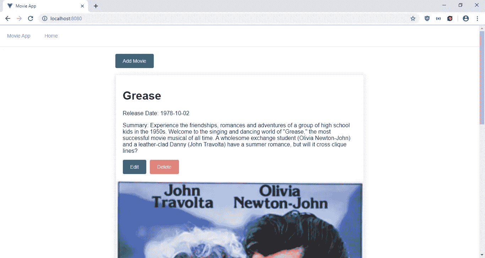
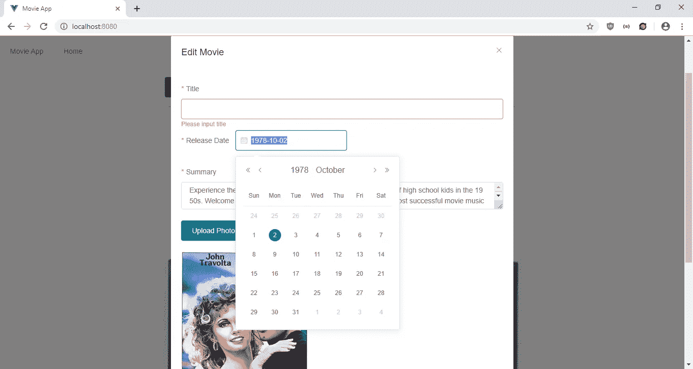
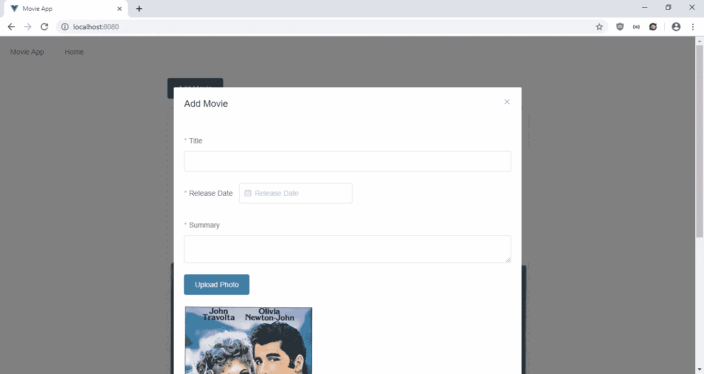

# 用元素 UI 构建 Vue.js UI

> 原文：<https://javascript.plainenglish.io/build-vue-js-ui-with-element-ui-5948a274d670?source=collection_archive---------2----------------------->

Vue.js 的 UI 框架有很多，比较流行的一个是 Element UI。它提供了其他框架所提供的组件。此外，它很容易添加到任何 Vue.js 应用程序中。表单验证也是内置的，这非常有用，因为 Vue.js 没有内置任何表单验证功能。它的表单验证功能会检查模型，所以表单的结构是什么并不重要。

在本文中，我们将构建一个电影数据库应用程序，让用户输入标题、上映日期、摘要，并为每个电影条目添加一张照片。为了启动项目，我们通过运行`npx @vue/cli create movie-app`来运行 Vue CLI。在向导中，我们选择包括 Vuex、Vue 路由器、Babel 和 CSS 预处理器。然后我们通过运行`vue add element`来添加元素 UI。

完成后，我们需要添加 Axios 来发出 HTTP 请求，并添加 Vue-Filter-Date-Format 来显示日期。我们通过运行`npm i axios vue-filter-date-format`来安装它们。

接下来，我们处理代码。在`components`文件夹中，创建一个名为`MovieForm.vue`的文件，并添加:

```
<template>
  <el-form :model="form" :rules="rules" ref="ruleForm">
    <el-form-item label="Title" prop="title">
      <el-input v-model="form.title"></el-input>
    </el-form-item><el-form-item label="Release Date" prop="date">
      <el-date-picker v-model="form.date" type="date" placeholder="Release Date"></el-date-picker>
    </el-form-item><el-form-item label="Summary" prop="summary">
      <el-input v-model="form.summary" type="textarea"></el-input>
    </el-form-item><el-form-item>
      <input type="file" style="display: none" ref="file" [@change](http://twitter.com/change)="onChangeFileUpload($event)" />
      <el-button type="primary" [@click](http://twitter.com/click)="$refs.file.click()">Upload Photo</el-button>
    </el-form-item><el-form-item prop="photo">
      
    </el-form-item><el-form-item>
      <el-button type="primary" [@click](http://twitter.com/click)="submitForm('ruleForm')">Save</el-button>
    </el-form-item>
  </el-form>
</template><script>
import { requestsMixin } from "@/mixins/requestsMixin";export default {
  name: "MovieForm",
  mixins: [requestsMixin],
  props: {
    movie: Object,
    edit: Boolean
  },
  data() {
    return {
      form: {},
      rules: {
        title: [
          {
            required: true,
            message: "Please input title",
            trigger: "blur"
          }
        ],
        date: [
          {
            required: true,
            message: "Please input date",
            trigger: "blur"
          }
        ],
        summary: [
          {
            required: true,
            message: "Please input summary",
            trigger: "blur"
          }
        ],
        photo: [
          {
            required: true,
            message: "Please upload photo",
            trigger: "blur"
          }
        ]
      }
    };
  },
  methods: {
    submitForm(formName) {
      this.$refs[formName].validate(async valid => {
        if (valid) {
          if (this.edit) {
            await this.editMovie(this.form);
          } else {
            await this.addMovie(this.form);
          }
          const { data } = await this.getMovies();
          this.$store.commit("setMovies", data);
          this.$emit("saved");
        }
        return false;
      });
    },
    cancel() {
      this.$emit("cancelled");
    },
    onChangeFileUpload($event) {
      const file = $event.target.files[0];
      const reader = new FileReader();
      reader.onload = () => {
        this.$refs.photo.src = reader.result;
        this.form.photo = reader.result;
      };
      reader.readAsDataURL(file);
    }
  },
  watch: {
    movie: {
      handler(val) {
        this.form = JSON.parse(JSON.stringify(val || {}));
      },
      deep: true,
      immediate: true
    }
  }
};
</script>
```

这是添加和编辑电影条目的表单。该模板具有元素 UI 表单，其中包含名称、发布日期和摘要的文本输入；还有一个照片文件输入。`el-form-item`和`el-input`已经设计好了样式，所以我们不需要自己添加任何样式。`el-input-form`组件的`label`道具中每个字段的标签。数据绑定是通过将`form`对象传递到`el-form`组件的`model`属性中来完成的。

在`script`部分，我们有传递到`el-form`组件的`rules`对象。该对象对`form`对象进行表单验证。因为我们将照片读入一个 Base64 字符串，所以它也对此进行验证。`onChangeFileUpload`函数获取对文件输入的引用，并将内容读入 Base64 字符串。

当点击 Save 按钮时，`submitForm`按钮被调用，因为我们在按钮的`click`处理程序中传递了它。`el-form`有一个名为`ruleForm`的`ref`，所以我们将它作为参数传入，这样我们就可以对表单进行验证。然后在函数中调用 Element UI 提供的`validate`函数做表单验证，然后根据`edit`属性的值编辑或添加一个条目。然后从`getMovies`获得新值，并放入 Vuex 存储器。然后发出`saved`事件来关闭模态。

为了使编辑功能起作用，我们添加了一个`watch`块来监视`movie`属性，当有需要编辑的内容时，我们将把它传递给这个组件。

接下来，我们创建一个`mixins`文件夹，并将`requestsMixin.js`添加到`mixins`文件夹中。在文件中，我们添加了:

```
const APIURL = "[http://localhost:3000](http://localhost:3000)";
const axios = require("axios");export const requestsMixin = {
  methods: {
    getMovies() {
      return axios.get(`${APIURL}/movies`);
    }, addMovie(data) {
      return axios.post(`${APIURL}/movies`, data);
    }, editMovie(data) {
      return axios.put(`${APIURL}/movies/${data.id}`, data);
    }, deleteMovie(id) {
      return axios.delete(`${APIURL}/movies/${id}`);
    }
  }
};
```

这些是我们在组件中用来发出 HTTP 请求以获取和保存数据的函数。

接下来在`Home.vue`中，将现有代码替换为:

```
<template>
  <div class="page" id='top'>
    <h1 class="text-center">Recipes</h1>
    <b-button-toolbar class="button-toolbar">
      <b-button [@click](http://twitter.com/click)="openAddModal()" variant="primary">Add Recipe</b-button>
    </b-button-toolbar> <b-card
      v-for="r in recipes"
      :key="r.id"
      :title="r.name"
      :img-src="r.photo"
      img-alt="Image"
      img-top
      tag="article"
      class="recipe-card"
      img-bottom
    >
      <b-card-text>
        <h1>Ingredients</h1>
        <div class="wrap">{{r.ingredients}}</div>
      </b-card-text> <b-card-text>
        <h1>Recipe</h1>
        <div class="wrap">{{r.recipe}}</div>
      </b-card-text> <b-button
        href="#"
        v-scroll-to="{
          el: '#top',
          container: 'body',
          duration: 500,
          easing: 'linear',
          offset: -200,
          force: true,
          cancelable: true,
          x: false,
          y: true
        }"
        variant="primary"
      >Scroll to Top</b-button> <b-button [@click](http://twitter.com/click)="openEditModal(r)" variant="primary">Edit</b-button> <b-button [@click](http://twitter.com/click)="deleteOneRecipe(r.id)" variant="danger">Delete</b-button>
    </b-card> <b-modal id="add-modal" title="Add Recipe" hide-footer>
      <RecipeForm [@saved](http://twitter.com/saved)="closeModal()" [@cancelled](http://twitter.com/cancelled)="closeModal()" :edit="false" />
    </b-modal> <b-modal id="edit-modal" title="Edit Recipe" hide-footer>
      <RecipeForm
        [@saved](http://twitter.com/saved)="closeModal()"
        [@cancelled](http://twitter.com/cancelled)="closeModal()"
        :edit="true"
        :recipe="selectedRecipe"
      />
    </b-modal>
  </div>
</template><script>
// @ is an alias to /src
import RecipeForm from "@/components/RecipeForm.vue";
import { requestsMixin } from "@/mixins/requestsMixin";export default {
  name: "home",
  components: {
    RecipeForm
  },
  mixins: [requestsMixin],
  computed: {
    recipes() {
      return this.$store.state.recipes;
    }
  },
  beforeMount() {
    this.getAllRecipes();
  },
  data() {
    return {
      selectedRecipe: {}
    };
  },
  methods: {
    openAddModal() {
      this.$bvModal.show("add-modal");
    },
    openEditModal(recipe) {
      this.$bvModal.show("edit-modal");
      this.selectedRecipe = recipe;
    },
    closeModal() {
      this.$bvModal.hide("add-modal");
      this.$bvModal.hide("edit-modal");
      this.selectedRecipe = {};
    },
    async deleteOneRecipe(id) {
      await this.deleteRecipe(id);
      this.getAllRecipes();
    },
    async getAllRecipes() {
      const { data } = await this.getRecipes();
      this.$store.commit("setRecipes", data);
    }
  }
};
</script>
```

在这个文件中，我们有一个元素 UI 卡列表来显示配方条目列表，并让用户打开和关闭添加和编辑模式。我们在每张卡上都有按钮，让用户编辑或删除每个条目。每张卡片的底部都有一张电影图片，是在输入食谱时上传的。

在`scripts`部分，我们用`beforeMount`钩子在页面加载期间用我们在 mixin 中编写的`getMovies` 函数获取所有密码条目。当编辑按钮被点击时，`selectedMovie`变量被设置，我们将它传递给`MovieForm`进行编辑。

要删除一个食谱，我们在 mixin 中调用`deleteOneMovie`向后端发出请求。

接下来在`App.vue`中，我们将现有代码替换为:

```
<template>
  <div id="app">
    <el-menu mode="horizontal">
      <el-menu-item index="1">Movie App</el-menu-item>
      <el-menu-item index="2">Home</el-menu-item>
    </el-menu>
    <router-view />
  </div>
</template><script>
export default {
  name: "app"
};
</script><style>
#app {
  font-family: "Avenir", Helvetica, Arial, sans-serif;
  -webkit-font-smoothing: antialiased;
  -moz-osx-font-smoothing: grayscale;
  color: #2c3e50;
}.page {
  padding: 20px;
  margin: 0 auto;
  max-width: 700px;
}body {
  margin: 0px;
}
</style>
```

在页面顶部添加一个元素 UI 导航条，并添加一个`router-view`来显示我们定义的路线。我们必须自己设置字体，因为元素 UI 没有将它设置为任何特定的字体。我们还必须将主体的边距设置为 0，以便移除它。我们创建了一个`page`类，将最大宽度设置为 700 像素，这样图像就不会太大。

然后在运行`vue add element`时产生的`element-variable.scss`中。我们将现有代码替换为:

```
/*
Write your variables here. All available variables can be
found in element-ui/packages/theme-chalk/src/common/var.scss.
For example, to overwrite the theme color:
*/
$--color-primary: teal;/* icon font path, required */
$--font-path: "~element-ui/lib/theme-chalk/fonts";[@import](http://twitter.com/import) "~element-ui/packages/theme-chalk/src/index";
button,
input,
select,
textarea {
  font-family: inherit;
  font-size: inherit;
  line-height: inherit;
  color: inherit;
}.el-picker-panel__body-wrapper {
  font-family: "Avenir", Helvetica, Arial, sans-serif;
}
```

使我们表单中的字体一致。

接下来在`main.js`中，我们将现有代码替换为:

```
import Vue from "vue";
import App from "./App.vue";
import router from "./router";
import store from "./store";
import './plugins/element.js'
import VueFilterDateFormat from 'vue-filter-date-format';Vue.use(VueFilterDateFormat);
Vue.config.productionTip = false;new Vue({
  router,
  store,
  render: h => h(App)
}).$mount("#app");
```

我们在这里添加了 Vue-Filter-Date-Format 库，以及元素 UI 库。

在`router.js`中，我们将现有代码替换为:

```
import Vue from "vue";
import Router from "vue-router";
import Home from "./views/Home.vue";Vue.use(Router);export default new Router({
  mode: "history",
  base: process.env.BASE_URL,
  routes: [
    {
      path: "/",
      name: "home",
      component: Home
    }
  ]
});
```

将主页包含在我们的路线中，以便用户可以看到该页面。

在`store.js`中，我们将现有代码替换为:

```
import Vue from "vue";
import Vuex from "vuex";Vue.use(Vuex);export default new Vuex.Store({
  state: {
    movies: []
  },
  mutations: {
    setMovies(state, payload) {
      state.movies = payload;
    }
  },
  actions: {}
});
```

将我们的`movies`状态添加到存储中，这样我们就可以在`MovieForm`和`HomePage`组件的`computed`块中观察到它。我们有`setMovies` 函数来更新`passwords`状态，我们通过调用`this.$store.commit(“setMovies”, response.data);`在组件中使用它，就像我们在`MovieForm`中做的那样。

最后，在`index.html`中，我们将现有代码替换为:

```
<!DOCTYPE html>
<html lang="en">
  <head>
    <meta charset="utf-8" />
    <meta http-equiv="X-UA-Compatible" content="IE=edge" />
    <meta name="viewport" content="width=device-width,initial-scale=1.0" />
    <link rel="icon" href="<%= BASE_URL %>favicon.ico" />
    <title>Movie App</title>
    <link
      rel="stylesheet"
      href="[https://unpkg.com/element-ui/lib/theme-chalk/index.css](https://unpkg.com/element-ui/lib/theme-chalk/index.css)"
    />
  </head>
  <body>
    <noscript>
      <strong
        >We're sorry but vue-element-ui-tutorial-app doesn't work properly
        without JavaScript enabled. Please enable it to continue.</strong
      >
    </noscript>
    <div id="app"></div>
    <!-- built files will be auto injected -->
  </body>
</html>
```

改一下标题。

经过所有的努力，我们可以通过运行`npm run serve`来启动我们的应用程序。

为了启动后端，我们首先通过运行`npm i json-server`来安装`json-server`包。然后，转到我们的项目文件夹并运行:

```
json-server --watch db.json
```

在`db.json`中，将文本改为:

```
{
  "movies": [
  ]
}
```

所以我们有了定义在可用的`requests.js`中的`movies` 端点。

经过所有的努力，我们得到了:

