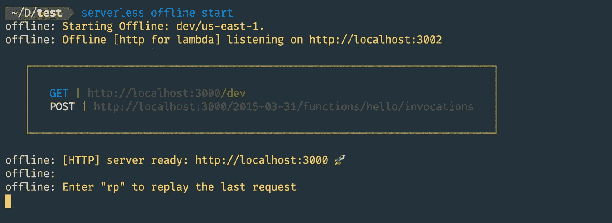
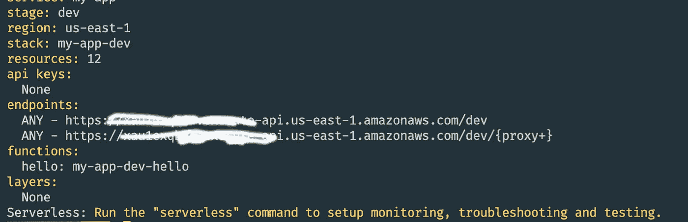

# 使用 AWS Lambda、API Gateway、Express 和 Typescript 构建您的第一个无服务器应用程序— 2020

> 原文：<https://javascript.plainenglish.io/build-your-first-serverless-app-with-aws-lambda-api-gateway-express-and-typescript-2020-4841f54514eb?source=collection_archive---------0----------------------->


本文将向您展示如何使用 AWS Lambda 和 API Gateway 在 Typescript 中构建一个无服务器 Express 应用程序。你会在这里找到代码。我们将在本文中讨论的主题是:

1.  [项目设置](#543d)
2.  [添加 Express.js](#3766)
3.  [部署](#525b)

[无服务器](https://www.serverless.com/)框架是一个更通用的工具，用于部署和管理无服务器应用程序。它简化了功能及其连接服务的配置和部署。[无服务器架构](https://aws.amazon.com/lambda/serverless-architectures-learn-more/)让你执行一段代码，只对你使用的资源收费，不像静态服务器那样即使使用率低也收取固定价格。作为开发人员，这意味着您不必考虑管理服务器和扩展。你只需要专注于代码。本文将指导您使用 [AWS Lamd](https://aws.amazon.com/lambda/) a 和 [AWS API Gateway](https://aws.amazon.com/api-gateway/) 构建一个在 E [xpress.js](https://expressjs.com/) 上运行的无服务器 API 的步骤。Typescript 用于编写代码，因为它支持静态类型，这将减少编译时错误。

开始之前，您需要

1.  Typescript，Node.js，npm，Express.js 的基础知识。
2.  亚马逊网络服务(AWS)帐户。

本文假设您的系统中已经安装了 Node.js 和 npm。

# 项目设置

让我们使用以下命令全局安装[无服务器](https://www.serverless.com/)框架和 [AWS-SDK](https://www.npmjs.com/package/aws-sdk) 模块:

```
npm i -g serverless aws-sdk
```

现在创建一个项目文件夹，并初始化一个 npm 来创建一个`package.json`文件。然后在项目文件夹中创建一个新的无服务器服务。

```
mkdir my-serverless-project
cd my-serverless-project
serverless create --template aws-nodejs-typescript
npm install
```

无服务器框架为应用程序生成样板文件。其中`handler.ts`和`serverless.yml`意义重大。文件`handler.ts`类似于传统 Node.js 应用程序中的`index.js`文件。这是开始执行的文件。

现在我们将安装`[serverless-offline](https://www.npmjs.com/package/serverless-offline)`,这是一个用于在本地主机上运行无服务器框架的插件。这将在您的本地机器上模拟 Lambda 和 API 网关，以加速您的开发周期。否则，您将不得不在每次测试变更时进行部署。

```
npm install -D serverless-offline
```

修改`serverless.yml`文件以包含插件。

```
service:
  name: serverlesscustom:
  webpack:
    webpackConfig: ./webpack.config.js
    includeModules: trueplugins:
  - serverless-webpack
  - serverless-offline
provider:
  name: aws
  runtime: nodejs12.x
  apiGateway:
    minimumCompressionSize: 1024
  environment:
    AWS_NODEJS_CONNECTION_REUSE_ENABLED: 1
functions:
  hello:
    handler: handler.hello
    events:
      - http:
          method: get
          path: /
```

现在，在项目文件夹中运行以下命令来启动无服务器脱机服务器。

```
serverless offline start
```

你会看到下面的屏幕，当你在浏览器中输入`[http://localhost:3000/dev](http://localhost:3000/dev)`时，你会看到服务器的响应。默认情况下，无服务器脱机运行在端口 3000



serverless in localhost:3000

我们已经完成了无服务器应用程序的基本设置。在下一节中，我们将向我们的应用程序添加 Typescript。

# 向我们的应用程序添加 Express.js

首先，我们将安装在我们的项目中运行 express 应用程序所需的必要包。我们必须用`handler.ts`替换`handler.js`文件。

```
npm i aws-lambda serverless-http express @types/express
rm handler.js
touch handler.ts
```

将以下代码添加到我们的`handler.ts`文件中，以初始化我们的两条路由:

1.  一条`/message`路线。
2.  为除`/message`之外的所有路由发送 ***服务器正在运行*** 消息的回退路由

```
import { APIGatewayProxyHandler } *from* 'aws-lambda';
import serverless *from* 'serverless-http';
import express, { Request, Response } *from* 'express';const app = express();app.get('/message', (req: Request, res: Response) => {
  res.send({ message: 'This is message route' });
});app.use((req: Request, res: Response) => {
  res.send({ message: 'Server is running' });
});*export* const hello: APIGatewayProxyHandler = serverless(app);
```

我们需要修改`serverless.yml`来让 hello 函数捕获所有的 HTTP 请求。

```
service: 
  name: serverlesscustom:
  webpack:
    webpackConfig: ./webpack.config.js
    includeModules: trueplugins:
  - serverless-webpack
  - serverless-offline
provider:
  name: aws
  runtime: nodejs12.x
  apiGateway:
    minimumCompressionSize: 1024
  environment:
    AWS_NODEJS_CONNECTION_REUSE_ENABLED: 1
functions:
  hello:
    handler: handler.hello
    events:
      - http: ANY /
      - http: 'ANY {proxy+}'
```

重启服务器并转到`http://localhost:3000/dev/message`查看响应。耶！您已经成功创建了一个无服务器 lambda 函数！

# 部署您的第一个无服务器应用程序

此外，从拥有部署应用程序所需的所有权限的 AWS 帐户获取密钥和机密。运行以下命令将允许您添加密钥和机密。

```
serverless config credentials — provider aws — key <your-access-key-id> — secret <your-secret-key>
```

现在运行以下命令将您的应用程序部署到 AWS。

```
serverless deploy
```

成功部署后，命令行中将显示一个链接。这将是 API 网关链接



我们已经成功地创建了一个 lambda 函数，并将其部署到 AWS。

您可以在这个[库](https://github.com/00karthik/serverless-typescript/)中找到完整的代码。

# 下一步是什么？

1.  现在，您可以将您的路线添加到应用程序中。您需要添加`[body-parser](https://www.npmjs.com/package/body-parser)`作为中间件来解析传入的请求。
2.  添加`[prettier](https://www.npmjs.com/package/prettier)`和`[es-lint](https://www.npmjs.com/package/eslint)`进行代码格式化。
3.  您可以设置 CI/CD 管道来自动化部署过程。

# 参考

1.  https://www.serverless.com/blog/serverless-express-rest-api
2.  [https://medium . com/linkit-intecs/typescript-project-using-server less-framework-C3 bfc 16 C2 a 7 c](https://medium.com/linkit-intecs/typescript-project-using-serverless-framework-c3bfc16c2a7c)
3.  [https://www . freecodecamp . org/news/express-js-and-AWS-lambda-a-server less-love-story-7c 77 ba 0 EAA 35/](https://www.freecodecamp.org/news/express-js-and-aws-lambda-a-serverless-love-story-7c77ba0eaa35/)