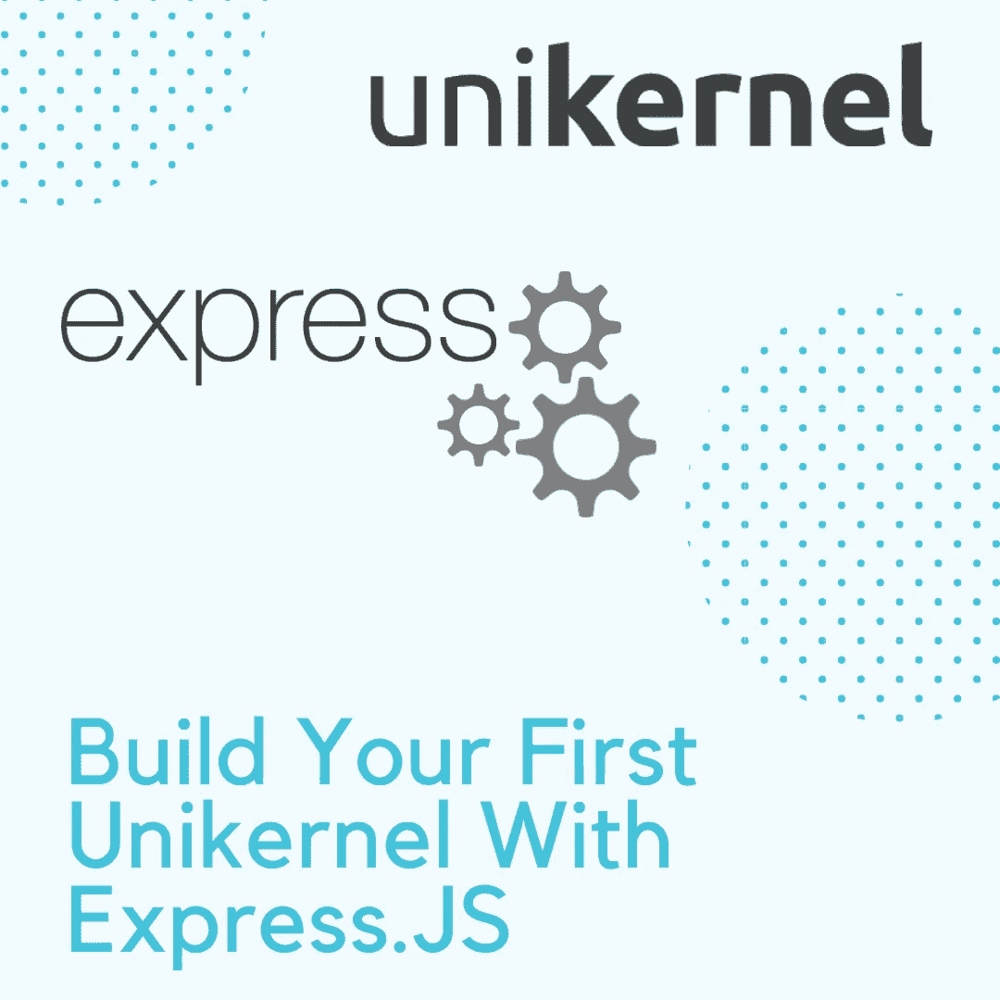
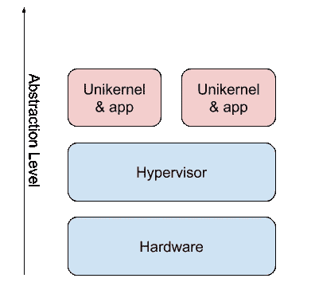

# 用 Express 构建您的第一个单核。JS 和 NanoVMs

> 原文：<https://javascript.plainenglish.io/build-your-first-unikernel-with-express-js-and-nanovms-21d64ff7231c?source=collection_archive---------11----------------------->

## 名列前茅



单核是云计算的下一个时代。与集装箱相比，它们的占地面积更小，安全性更高。在本文中，我将引导您部署一个 Express。使用单内核的 JS 后端。

> *在任何情况下都不要将其用于生产。单核离发布阶段还很远，还缺少很多特性。*

# 什么是单核？



单核本质上是一个容器，但不需要主机操作系统。所有系统调用和操作系统功能都作为库与应用程序捆绑在一起。如果你从来没有听说过 Unikernels，我建议你先[看看这个](https://everyday.codes/linux/unikernel-vs-container-vs-operating-system-side-by-side-comparison/)。

# 步骤 1:创建一个简单的后端

首先，我们将创建一个简单的 Express。JS 后端。Unikernels 仍处于开发的早期阶段，所以我们将保持它非常简单，可以说是一个概念验证。首先创建一个 *npm* 项目(在一个新的项目文件夹中运行这些项目):

```
> npm init
> npm i -S express
```

现在，将这段代码放入`index.js`:

这应该很简单。我们创建了一个 Express 服务器，它监听端口 3000 并以文本消息进行响应。您可以通过运行`node index.js`并在浏览器中打开 [http://localhost:3000](http://localhost:3000) 来验证一切是否正常。

# 步骤 2:安装 OPS

对于本教程，我们将使用 [NanoVMs](https://nanovms.com/) unikernel，因为它支持 JavaScript。这个单核的构建工具叫做 [OPS](https://github.com/nanovms/ops) 。要安装它，请在您的终端中运行以下命令:

```
> curl https://ops.city/get.sh -sSfL | sh
```

按照安装并回答几个问题。一切完成后，通过在一个新的**终端会话中运行`ops version`来验证安装。你的 OPS 版本至少应该是`0.1.9`。**

# 步骤 3:捆绑您的依赖项

现在不可能在单内核中运行`npm i`，所以我们必须将依赖项(`express`)和我们的代码捆绑在一起。为此，我们将使用`rollup`。安装所需的依赖项:

```
> npm i -D rollup @rollup/plugin-commonjs @rollup/plugin-json @rollup/plugin-node-resolve
```

现在，用以下内容创建一个名为`rollup.config.js`的文件:

这告诉 rollup 将我们代码需要的所有东西打包到一个大文件中。要运行它，将以下内容添加到`package.json`中的`scripts`部分:

```
"build": "rollup -c"
```

现在，运行`npm run build`。这应该会在`output`中产生一个`index.js`。

# 步骤 4:运行单内核

现在，我们已经做好了在单核上构建和运行您的应用程序的一切准备。令人惊讶的是，这是最简单的一步，这要归功于 NanoVMs 的 OPS。在项目根目录中，运行:

```
> ops load node_v11.5.0 -a output/index.js -p 3000
```

这个命令告诉 OPS 使用节点 11.5 的基本映像，加载`output/index.js`文件并打开端口 3000。运行它时，您应该会看到以下输出:

```
[node output/index.js] 
booting /home/mk/.ops/images/node.img ... 
assigned: 10.0.2.15 
Example app listening at [http://localhost:3000](http://localhost:3000)
```

恭喜，您刚刚在单内核中运行了您的 Node 应用程序！您可以通过在浏览器中访问 [http://localhost:3000](http://localhost:3000) 来验证一切正常；


# 结束语

感谢您的阅读，希望您成功地用 Unikernels 部署了您的 Node app。敬请关注更多教程！

# 资源

*   [NanoVMs 网站](https://nanovms.com/)
*   [未知 vs 容器 vs 操作系统](https://everyday.codes/linux/unikernel-vs-container-vs-operating-system-side-by-side-comparison/)
*   [Unikernels 项目网站](http://unikernel.org/)