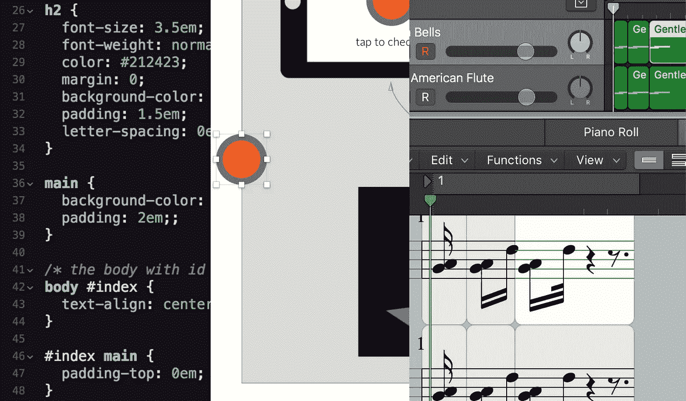

# 构建您的第一个 Web 应用程序——如何从头开始

> 原文：<https://javascript.plainenglish.io/build-your-first-web-app-how-to-get-started-from-scratch-f6ffa1507250?source=collection_archive---------4----------------------->



## 工具、技巧和经验教训，包括代码。

问题，“我如何构建自己的 Web 应用程序？”，是个难题。似乎每个人都有自己的答案。

工程团队通常有自己开发和部署 Web 应用的方式。如果你试图在没有太多经验的情况下独自创业，该怎么办？

您可以使用软件即服务资源，如 Squarespace 或 Wix。但是如果你想从头开始做真正属于自己的东西呢？如今，有这么多的选择。

这篇文章应该可以帮助你像我一样开始。

我将讨论我用来制作一个简单的门铃 Web 应用程序的所有东西，它最初是为 iPad 设计的。该应用程序有一个门铃按钮，当点击它时，它会发送一条松弛的消息，告诉你有人来了。然后，它会暂时转到另一个屏幕，显示有人很快会跟你打招呼。然后它回到门铃按钮屏幕，为另一个访问者做好准备。

我们开始吧！

# 超文本标记语言


超文本标记语言(HTML)是创建网页的标准标记语言。它是你用来给你的页面添加基本内容的，比如文本、图像和按钮。

所有内容都将放在两个 HTML 标签之间，这些标签指定内容应该是什么样子。所有编写的 HTML 代码都将放在通常存在于以*结尾的文件中的标签之间。html* 。

甚至可以包括关于应用程序如何在线和在不同设备上运行的一般内容。例如，如果我想在我的 Web 应用程序上显示大文本“您好，欢迎！”，看起来会是这样的:

```
<h1>Hello and welcome!</h1>
```

标签说我希望这个文本像一个大标题一样。然而，这个大文本不会在屏幕上居中或具有我想要的字体。HTML 只会给你基本的。

只有 HTML，你的内容会在那里，但不会看起来太好。像`<link>`、`<script>`和`<style>` 这样的标签将有助于把你的 HTML 代码和其他东西结合起来，使你的内容看起来很棒。这就是 CSS 的用武之地。

# 半铸钢ˌ钢性铸铁(Cast Semi-Steel)


CSS 和 HTML 就像朋友一样。级联样式表(CSS)是一种样式表语言，用于描述以标记语言编写的文档的表示。

这看起来有点不同于 HTML，但是它与您编写的 HTML 相关，并且存在于一个以*结尾的文件中。css* 。下面是一个如何让我的`<h1>”Hello and welcome!</h1>` 文本看起来更好的例子:

```
h1 {
 font-size: 5.1em;
 font-family: “Alright Sans”;
 color: #F15D22;
}
```

我包含了我想让它看起来更好的标签类型，然后包含了我想要的东西的列表，比如自定义字体系列、大小和颜色。

因为这些都在以*结尾的文件中。css* ，它怎么知道在以*结尾的文件里要改什么。包含我所有 html 内容的 html* ？

你链接一下！有不同的方法可以做到这一点，但一种方法是在*中包含一行代码。html* 文件告诉你在一个单独的 *style.css* 文件中寻找你想要的酷字体和其他东西，这个文件是你假设制作的:

`<link rel=“stylesheet” href=“style.css”/>`

有了 HTML 和 CSS，你的 Web 应用程序上就有了内容，而且看起来相当不错。但它会缺少动感和活力(以及现代感)。

如果你想在你的网络应用程序中的页面之间切换时有奇特的过渡，或者当我按下门铃按钮时播放一个很酷的声音，该怎么办？或者更多，发一些懈怠的消息呢？这就是 JavaScript 的用武之地。

# Java Script 语言


JavaScript 是 HTML 和 CSS 的另一个朋友，这三者共同组成了一个强大的团队。JavaScript(通常称为 JS)是一种面向对象的计算机编程语言，用于在 web 浏览器中创建交互式效果。

它通常负责与动画、运动或发送/接收外部信息有关的任何事情。JS 代码通常存在于以*结尾的文件中。js* ，但是有其他方法可以把它包含在你的 Web 应用中。

例如，不创建单独的*。css* 和*。js* 文件来保存你的 CSS 和 js 代码，你可以把它们都放在你的*里面。html* 文件，只要它包含在`<style>`和`<script>`标签之间。

例如，如果我想要 JS 代码在我的*中。html* 文件告诉我的按钮(在 html 中定义)在被按下时发出声音，我可以在我的*中包含这个脚本。html* 文件:

```
<script>
 function RingRing() {
   var snd = new Audio(“your-audio-file.mp3”);
   snd.play();
 }
</script>
```

为了让我的按钮使用这个 JS 代码，我可以告诉我的按钮查看脚本中名为`RingRing()` 的函数:

`<button onclick=“RingRing()”></button>`

让我们现在说，你想有一个按钮发送一个松散的消息，每当门铃按钮被按下。您可以通过使用 Slack web hooks(Slack 允许您与它们交互的一种方式)和 jQuery 来实现。

简而言之，jQuery 是一个 JavaScript 库。它有一个著名的插件 jQuery.ajax()，可以向网络上任何地方的外部事物发出请求。

首先，您必须确保您的 Web 应用程序知道您想要使用 jQuery。您可以通过在您的*中包含对 jQuery 的引用来做到这一点。html* 文件:

```
<script src=“https://ajax.googleapis.com/ajax/libs/jquery/3.4.1/jquery.min.js”>
</script>
```

现在，您可以使用 jQuery.ajax()告诉 Slack 您想要向它发送消息。这可以放在同一个叫做`RingRing()`的功能中，当按下门铃按钮时，它会发出声音。

它会发送一条信息说，“有人按了你的门铃。”，使用 Slack 可以提供的自定义 Webhook 地址，如果您向他们索要的话:

```
<script>
 function RingRing() {
   var snd = new Audio(“your-audio-file.mp3”);
   snd.play(); 
   //**below is the code for a Slack request**
   var url = “your-custom-Slack-webhook-url-goes-here”;
   var text = “Someone rang the doorbell for you.”;
   $.ajax({
     data: ‘payload=’ + JSON.stringify({“text”: text}),
     dataType: ‘json’,
     processData: false,
     type: ‘POST’,
     url: url
   });
 }
</script>
```

谈到 JavaScript，有很多。HTML、CSS 和 JavaScript 协同工作，但是 Web 应用实际上还没有上线。

要做到这一点，您需要与服务器进行交互。为此，您可以使用 Node 和 Express。

# 节点和 Express


Node(或者更正式的说法是 Node.js)允许您使用 js 创建各种服务器端工具和应用程序。Express 是最流行的节点 web 框架。

一旦 Node 和 Express 连接到您的 HTML、CSS 和 JS 文件，它们就可以帮助服务器获取您的文件并将它们放在一起。你可以自己实现这些，但是好消息是作为一个初学者，从技术上来说你不必这么做。这是因为我使用了一个相当新的资源，叫做 Glitch。

# 小故障


Glitch 是一个友好的社区，帮助您构建 Web 应用程序。一旦你在 Glitch 中创建了一个新项目，它会帮助你把它上线。它为您处理节点和 Express 部分，您所需要做的就是给它您的 HTML、CSS 和 JS 代码。它会自动将所有这些部署到您可以定义的特定网址，突然间，您的 Web 应用程序就活跃起来了。

呜哇！知道应用程序可以上线，它可能需要一些花哨的图形。这就是素描派上用场的地方。

# 素描


对于我的 Web 应用程序中的任何图形，比如自定义门铃按钮图像，我都使用 Sketch。这是一个让我可以做一些平面设计的工具。

在草图*页面*上，你可以创建*元素*并将*元素*组合在一起。我花了很多时间导出图形来使用，包括门铃按钮，我用三个 2D 圆组合成一个线性渐变填充效果。

图形可以作为*资产*添加到 Glitch 中，并作为源代码包含在 HTML 代码中。源代码是 Glitch 可以为您创建的文件名或自定义 URL 的形式。下面是如何在我的按钮代码中使用该源代码的示例:

```
<button onclick=“RingRing()” style=“background: transparent; border: none;”></button>
```

你可能想在你的应用程序中定制一些声音，比如门铃响的声音。逻辑对我很有用。但是如果你没有 Mac，你就不能使用 Logic(也不能使用 GarageBand)。

# 逻辑


甚至音乐专业人士也使用逻辑。Logic Pro 是用于 macOS 平台的数字音频工作站(DAW)和 MIDI 音序器软件应用程序。它带有大量的预设声音。使用它，您可以创建带有不同音频的轨道。

我有一个 Akai MPK 迷你控制器，通过 USB 连接到我的笔记本电脑上，我用它来记录逻辑音频。如果您没有控制器，按下 *Shift + Command + K* 可以让您使用笔记本电脑键盘弹奏音符。

一旦你完成录制，你进入*文件* → *分享* → *歌曲到 iTunes* ，你的音频就可以作为资产从 iTunes 添加到 Glitch！与图像类似，音频文件可以在您的代码中通过其文件名来定义，或者作为 Glitch 提供给您的自定义 URL 来定义。

注:如果不想用逻辑，GarageBand 也很类似。

从不同的语言到设计和音乐软件，这篇文章谈到了我用来制作 Web 应用程序的一些重要工具。

从头开始构建你的第一个真正的 web 应用程序可能看起来很多。但是一旦你弄清楚了你的工具箱和如何使用它，你就开始比赛了。

感谢阅读！