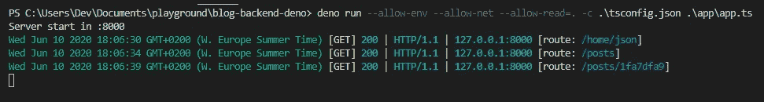
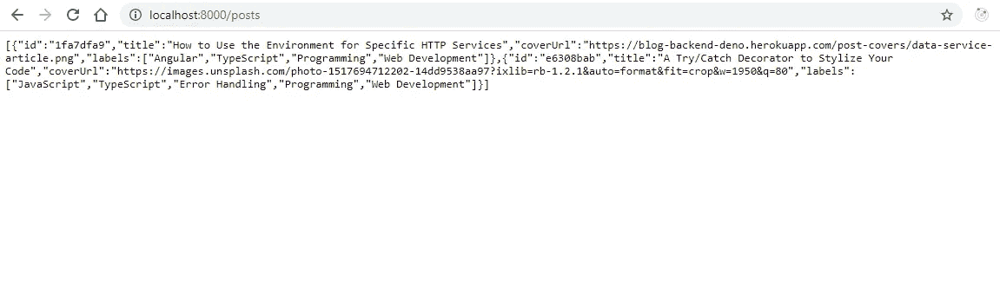
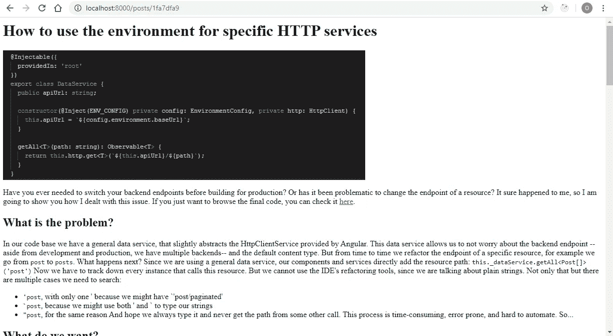

# 使用新技术构建我们自己的博客:Deno

> 原文：<https://javascript.plainenglish.io/build-your-own-blog-with-deno-62c9909c69ce?source=collection_archive---------2----------------------->

## 在这个由两部分组成的故事中，我们将使用两种现代技术开发我们自己的博客:Deno 用于后端，AlpineJS 用于前端。我们将从后端开始。

Photo by [Blanca Paloma Sánchez](https://unsplash.com/@blancapaloma4?utm_source=medium&utm_medium=referral) on [Unsplash](https://unsplash.com?utm_source=medium&utm_medium=referral)

如果你正在读这篇文章，很有可能你以前写过博客，或者你正在考虑这样做。有很多平台可以托管你的博客，比如 [Blogger](https://www.blogger.com) 、 [WordPress](https://wordpress.com/) ，或者 [Medium](https://medium.com/) 。但是有时候，你想拥有自己的博客。这可能是因为你想写的文章类型不适合这些平台。也许你只是想根据你自己的审美风格化。或者你只是想测试一项新技术，就像我一样。

# 我们的项目

如果我们开发自己的博客，我们需要将博客条目存储在某个地方。我们需要访问它们，知道有哪些条目。我们需要一个后端。

我们将使用 Deno 作为我们后端的运行时。在此之上，我们将使用 Alosaur 作为 web 服务器框架。由于 Deno 相当新，我们将保持简单，我们不会连接到任何数据库；一个 JSON 文件将跟踪哪些帖子是可用的，我们将把它们作为 HTML 文件。

# 迪诺？恐龙吗？

不，[Deno](https://deno.land/)——虽然 Deno 的图标是一只可爱的恐龙。

从其网站:

> Deno 是一个简单、现代和安全的 JavaScript 和 TypeScript 运行时，它使用 V8 并内置于 Rust 中。

Deno 是由 Ryan Dahl 创建的，他也被称为 Node.js 的创造者，Deno 开始是作为一个原型来修复 Ryan Dahl 与 Node.js 之间的遗憾，如果你对这些遗憾感兴趣，你可以在[这个视频](https://www.youtube.com/watch?v=M3BM9TB-8yA)中听到 Ryan Dahl 本人的意见。

Deno 于 2018 年开始开发，但就在最近，5 月 13 日，开发团队发布了 1.0.0 版本，这是第一个稳定的、可供部署的版本。

Deno 附带了一个广泛的标准库，包括 I/O、格式化和 UUID 生成等。此外，还存在许多第三方模块。Deno 的开发团队主持了一个由他们中许多人组成的[精选列表](https://deno.land/x)。

## 阿洛索龙

Deno 的第三方模块之一是[Alosaur](https://deno.land/x/alosaur)——保持恐龙主题。

Alosaur 是一个基于控制器的 web 服务器框架。它广泛使用 decorators 来指示路线，类似于 [Nest](https://nestjs.com/) 。如果你熟悉 Nest，Alosaur 会让你有宾至如归的感觉。

# 你好，Alosaur

让我们从 Hello World Alosaur 应用程序开始。从那里，我们将建立和抽象我们的应用程序，直到它的最终结果。

由于 Alosaur 使用了 decorators，我们需要用以下选项声明一个`tsconfig.json`:

我们的 Hello World 应用程序如下所示:

与 Node.js 不同，Deno 既不使用`package.json`也不使用`index.js`主文件。我们使用命令`deno run`并指定我们希望运行的文件。我们还需要用标志`-c`或`--config`来指示我们想要使用的配置文件。关于`run`命令的更多信息，您可以执行`deno run --help`。

让我们运行上面的程序。我们的辉煌结果是什么？

您可能还记得，Deno 的主要功能设计之一是其安全性。用户需要指定应用程序需要的所有权限。幸运的是，Deno 的错误消息指出了我们需要添加哪个标志。所以让我们再试一次:

我们再次遇到类似的错误消息。我们缺少`--allow-net`旗帜。让我们再次运行应用程序:

终于成功了！如果现在我们带着浏览器去`http://localhost:8000/home/text`，迎接我们的将是 *Hello world* 消息。

如果我们检查第一行，应用程序没有从`node_modules`目录或类似目录中导入 Alosaur。事实上，`node_modules`在 Deno 中并不存在。所有 Deno 模块都是通过 URL 导入的。当执行程序时，Deno 从其本地缓存中搜索所需的模块。如果没有找到模块，Deno 将下载模块。如果我们想重新下载模块，我们可以在运行应用程序时传递`--reload`标志。

`@Controller('/home')`表示类是一个控制器，通常用于一种类型的资源，以及访问它的路径。

`@Get('/text')`表示在指定路线上收到`GET`请求时执行该方法，在本例中为`/home/text`。

`@Area()`声明一个控制器模块。

并且一个`App`声明了一组区域。

我们可以使用`Deno.env.get`获得环境变量，在这个例子中，我们获得了要监听的端口。

# 管理依赖关系

Deno 使用 URL 来调用它需要的依赖项。这会变得有点笨拙，特别是如果我们偶然开始使用同一个包的不同版本，因为我们要为每个文件写 URL。

幸运的是，Deno 团队考虑了这个问题，并在他们的[链接到第三方代码](https://deno.land/manual/linking_to_external_code)手册页中描述了`deps.ts`的用法，这是一个导出我们使用的所有依赖项的文件。

对于 Hello World 程序，`deps.ts`文件看起来像这样:

# 数据库ˌ资料库

因为我们想保持简单，我们不会有一个适当的数据库。我们将自己用两个 JSON 文件来管理它:一个用于可用帖子的列表，另一个指示每个帖子的位置。

# 服务

我们将抽象出我们的业务逻辑来为服务中的帖子提供服务。

`getPosts`返回可用帖子的数组，如`post_list.json`中所列。`readJson`是 Deno 标准库中的一个函数，读取 JSON 文件并解析它。

`getPost`以 HTML 的形式发布帖子。首先我们从`post_loc.json`开始读取位置。我们使用`normalize`和`join`生成绝对路径，它们都来自 Deno 的标准库。最后，我们用`serveFile`提供文件，同样来自标准库——你可以看到 Deno 的标准库相当完整。

我们收到的请求是一个 Alosaur 请求。幸运的是，它公开了底层 Deno 的本地服务器请求，这是我们在`serveFile`中需要的。

# 控制器

控制器将管理我们的应用程序路由。

我们在构造函数中将服务声明为属性。在 Alosaur 中，依赖注入是自动处理的；没有必要给服务添加装饰器——除了在这里[记录的特定情况。](https://github.com/alosaur/alosaur/tree/master/src/injection)

`list`在`GET`请求到`/posts`时被调用，并返回可用职位列表。我们可以很容易地返回原始类型或对象，我们不需要直接操纵响应。

在对`/posts/:id`的`GET`请求中，`blogPost`被调用，其中`:id`是请求的帖子 id。`@Param('id')`装饰器将从请求路由中提取 ID。`@Req()`装饰器给出了完整的请求对象，这是我们服务的`getPost`和服务 HTML 文件所需要的。因为我们返回的是一个文件，而不仅仅是某个对象，所以我们不能像在`list`中那样直接`return`。

# 面积

这个区域只是收集控制器。它用于模块化开发。

# 中间件

对于这个应用程序，我们只使用一个中间件，REST logger 中间件，它将记录所有收到的请求。

我们修饰了`Log`类，以表明这个类是一个将在所有路由中执行的中间件(`RegExp('/')`)。它还实现了`MiddlewareTarget`，它定义了在请求解析之前执行的方法`onPreRequest`，以及在请求解析之后执行的方法`onPostRequest`。

因为我们想要打印响应状态，所以我们实现了`onPostRequest`。

我们使用标准库中的 [fmt](https://deno.land/std/fmt) ，标准库为我们提供了用于打印的颜色。这使得我们的日志更容易阅读。

`context`参数具有请求和响应属性。从请求中我们得到方法、URL 和 Deno 的本地服务器请求，这进一步给出了 HTTP 版本和调用的 IP 和端口。
遗憾的是，在撰写本文时，Alosaur 没有返回响应状态，除非在控制器的响应中特别定义。为了得到它，我们要经历一个淘汰过程。

*   我们检查是否有错误。如果是，我们返回错误代码。如果错误没有错误代码，我们返回 500(内部服务器错误)。
*   如果没有错误，并且响应定义了一个状态，我们返回这个状态。
*   否则，请求成功，我们返回 200。

最后，我们一起打印所有内容。

REST logger middleware output

考虑到我们获得状态的迂回方式，它并不完美，在某些情况下可能会失败，比如 404 错误(我们应该在请求`/home/json`时得到 404)。
打印日期来自使用`Logger.log`。它的实现超出了本文的范围，但是如果您对我写它感兴趣，请告诉我。

# 应用

我们终于准备好把所有东西放在一起了！

我们首先用我们的区域(`PostArea`)和中间件(`Log`)来声明我们的`App`。

为了增加一点安全性，我们处理 CORS(跨源资源共享)。Alosaur 使其易于实现。创建的应用程序有`useCors`方法，它接收一个`CorsBuilder`。对于构建器，我们选择接受任何原点，允许任何方法，但是我们将接受的头限制为`Origin`、`X-Requested-With`、`Authorization`、`Content-Type`和`Accept`。
对于起源和方法，我们都可以限制我们所允许的。

写博客时，我们可能会使用自己的图片。我们需要为他们服务。Alosaur 也使得服务静态文件变得容易。我们只需将包含公共资产的根文件夹交给`root`。就是这样。

处理应用程序错误很重要，所以我们需要一个全局错误处理程序。通过使用应用程序中的`error`方法，我们可以对任何抛出的错误做出反应。在我们的例子中，记录它并返回一个错误页面。

最后，我们用给定的端口启动应用程序。

如果您一直在跟踪和编程，让我在您运行应用程序之前打断您一下。Deno 的主要关注点是安全性，未经许可从磁盘读取文件将是相当大的安全漏洞。所以我们需要添加一个标志。我们最后的运行命令是:

我们将读取限制在当前目录。

打开您最喜欢的浏览器，进入`http://localhost:8000/posts`查看可用帖子列表。

或者看帖子。

帖子看起来有点丑。当我们实现前端时，我们将添加适当的样式。

# 锁

现在我们有了博客的后端。但是如果我们想让其他人合作，会发生什么呢？或者，由于依赖项是可能没有指定版本的 URL，当我们重新加载模块时，我们下载了一个有重大变化的新模块？

对于 NPM 和纱线，我们分别有`package-lock.json`和`yarn.lock`。Deno 的开发团队考虑过这个问题，Deno 也提供了一个锁机制。

我们创建一个名为`lock.json`的锁文件，并使用以下命令下载所有依赖项。

# 码头工人

对于大多数开发团队来说，当前工作流的一部分包括使用 Docker，或者拥有相同的工作空间，或者用于部署。因此，让我们看看如何为我们的后端创建一个 Docker 映像。

幸运的是，GitHub 用户 Hayd 一直在开发 Deno 图像以供使用(查看它们[这里](https://github.com/hayd/deno-docker))。我们将遵循模板，并添加一些变化。

Dockerfile 文件是不言自明的。值得注意的是，我们复制了`deps.ts`和`lock.json`来缓存所有的依赖项，并且我们没有将`--allow-read`限制到当前目录，因为 Docker 本身提供了一个安全层。

# 部署

如果我们开发博客是为了让人们阅读，如果我们在`localhost`运行我们的博客，没有多少人能够这样做。因此，让我们部署后端，以便以后我们的前端可以使用它。

Heroku 是一个云平台即服务，支持多种编程语言。我们可以创建一个免费的帐户，不需要介绍和卡的细节，并主持我们的应用程序。问题是 Deno 不是受支持的语言之一。幸运的是，Heroku 允许[构建 Docker 图像](https://devcenter.heroku.com/articles/build-docker-images-heroku-yml)。我们需要添加一个`heroku.yml`文件来指示使用哪个 Dockerfile 文件。

我们可以给出更多的选择，但是对于我们的目的来说，这就是我们所需要的。

然后，我们运行以下命令:

将会出现权限错误。我们只需要注释或删除`USER deno`行，这样我们就可以在 Heroku 容器中以 root 权限运行。修好那条线后，我们再推一次，就行了！

此时，我们可能会问自己，Heroku 在哪个端口运行它的应用程序？因为我们没有设置任何环境变量，我们的 docker 文件公开了端口 8000。Heroku 总是在 80 端口运行，忽略 docker 文件中的`EXPOSE`。它还设置了一个`PORT`环境变量。我们预料到了这一点，这就是为什么我们在应用程序中使用`PORT`的原因，尽管在开发中我们一直使用默认的 8000。

您可以通过在 Heroku 中检查应用程序页面的 URL 或运行`heroku open -a your-blog-name`来打开您的应用程序。

感谢您的阅读！在下一篇文章中，我们将使用 AlpineJS 开发博客的前端。当然这个后端是不可知的，所以可以随意开发任何前端并使用这个后端😉如果我有什么错误或不清楚的地方，请留下评论，我会尽快回答。

# 资源

 [## 德诺

### 编辑描述

德诺.兰德](https://deno.land/)  [## 第三方模块| Deno

### deno.land/x 是一个为 Deno 脚本的 URL 重写服务。代码 URL 的基本格式是 https://deno.land/x/[email…

德诺.兰德](https://deno.land/x)  [## 德诺

### 编辑描述

德诺.兰德](https://deno.land/manual/linking_to_external_code)  [## 阿洛龙/阿洛龙

### 用于构造函数注入的 TypeScript/JavaScript 的轻量级依赖注入容器。塞林格·塞林格…

github.com](https://github.com/alosaur/alosaur/tree/master/src/injection)  [## 德诺

### 编辑描述

德诺.兰德](https://deno.land/std/fmt)  [## hayd/deno-docker

### Dockerhub 上发布的 deno 的 Docker 文件:amazonlinux1 build 用于在 AWS Lambda 上运行 deno。要运行 main.ts…

github.com](https://github.com/hayd/deno-docker)  [## 用 heroku.yml 构建 Docker 图像

### heroku.yml 文件是一个可以用来定义 heroku 应用程序的清单。它允许您:建立 Docker 图像在…

devcenter.heroku.com](https://devcenter.heroku.com/articles/build-docker-images-heroku-yml) 

## **用简单英语写的 JavaScript**

喜欢这篇文章吗？如果有，通过 [**订阅我们的 YouTube 频道**](https://www.youtube.com/channel/UCtipWUghju290NWcn8jhyAw) **获取更多类似内容！**