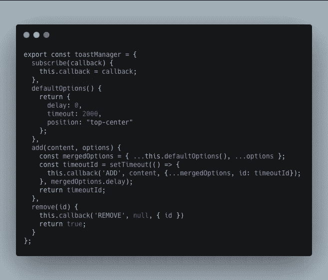
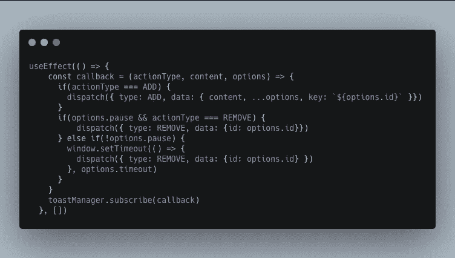
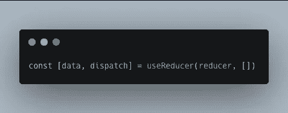
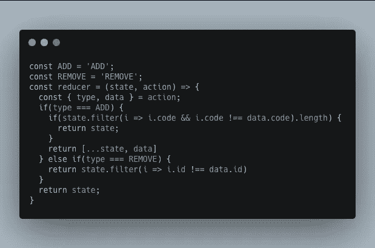
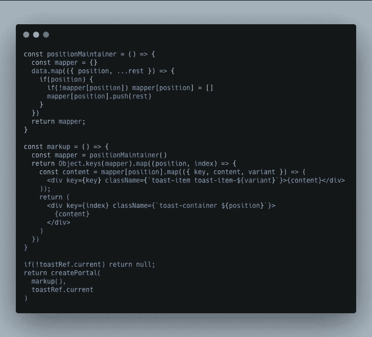
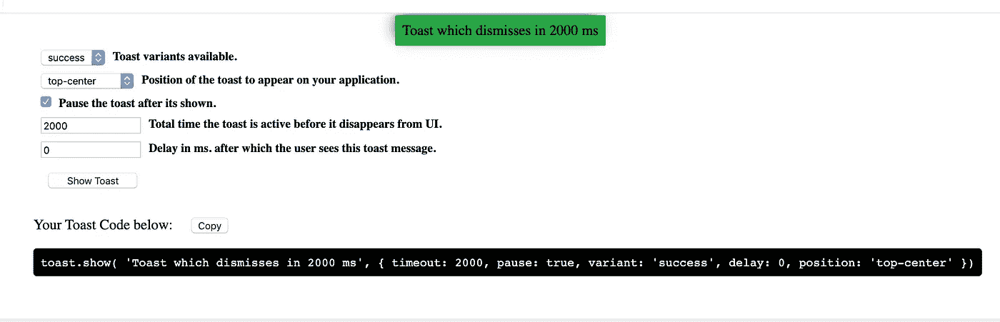
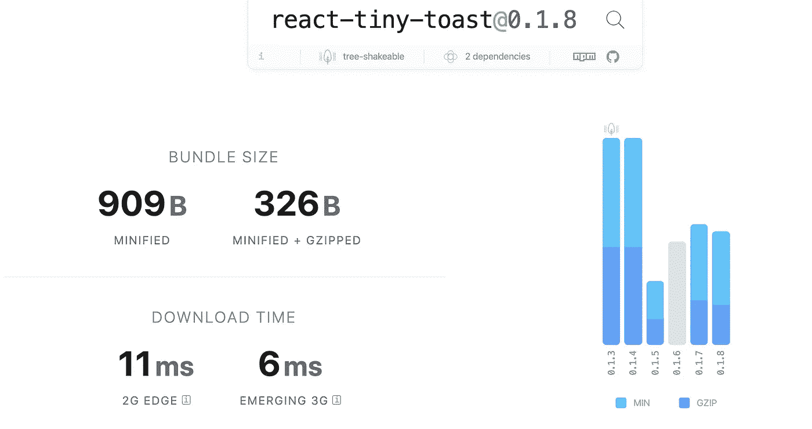

# 从头开始构建您自己的 React toast 通知

> 原文：<https://javascript.plainenglish.io/build-your-own-react-toast-notifications-from-scratch-c5e67357da4d?source=collection_archive---------1----------------------->

## 没有使用库！

## 在现代应用程序的世界里，你可以从互联网上获得任何现成的东西。

但是在某些情况下，你得到的比你需要的多，这可能会让你慢下来。通过我们的前端开发，当使用第三方库时，您会添加更多未使用的代码，并通过增加第一次有意义的绘制的时间来使您的用户体验变得更差。

在创建最小尺寸组件的过程中。我正在用 React 从头开始构建一个 toast 通知库。

*然而，如果你想跳过前面，我把本文中使用的所有代码都变成了一个 npm 包，你可以在这里找到:*[*【https://www.npmjs.com/package/react-tiny-toast】*](https://www.npmjs.com/package/react-tiny-toast)*。*

**有哪些吐司通知？** Toast 通知是简单的非模态弹出窗口，用于对当前活动的、可见的和交互的操作进行反馈。

为了构建通知，我们需要一个 toast 管理器来帮助维护活动 toast 通知的列表。反过来，我们将活动的 toast 通知传递给 react 组件来显示它。在 toast 管理器和 react 组件之间传递数据。我们在吐司管理器中有一个`subscribe`方法。它从我们的 react 组件接受一个`*callback*`方法，每当我们想要更新一个 toast 通知时，`subscribe`方法就调用这个回调。

our toast manager code.

这里，我们的 *subscribe* 方法通过一个*回调函数*传递，回调函数是在我们的 React 组件中定义的，当这个回调函数被新的 toast 消息调用时，我们使用 React 组件构建 toast UI。因此使用它的应用程序需要一个 React 组件( *ToastContainer，我们将在接下来的步骤*中添加)来呈现我们的 toast 消息。

接下来是 *ToastContainer* ，它将*回调*传递给 *subscribe* 方法，每次添加或删除 toast 消息时都会调用这个回调。使用回调，我们的 UI 组件可以了解任何添加或删除的 toast 消息。

On component mount, we subscribe to toastManager to notify our react-component about any new message additions.

结合使用*回调*函数和*分派*函数，我们更新了现有的 Toast 通知 UI。此处*调度*由 *useReducer* 返回以更新我们的状态(参考[此处](https://reactjs.org/docs/hooks-reference.html#usereducer)以了解更多关于 *useReducer* )。

Definition of our state using reducer function. using dispatch function returned by useReducer we update our present component which in turn updates the UI.

基于从我们的回调传递给 *dispatch* 函数的动作，我们使用作为第一个参数传递的 reducer 来更新我们的状态，同时使用 *useReducer* 来定义我们的状态。请参考下面的代码:

在更新这里的状态时，我们的 react 组件用更新的 toast 消息重新呈现。

接下来是用 toast 消息呈现组件的部分。我们的组件已经有了 toast 通知消息。在这样做之前，我们需要确保我们的 toast 通知不会干扰应用程序 UI。为此，我们创建了自己的文档元素，在这里我们安装了 toast 通知。

On component mount, we create a document element and append it to body.

我们使用 *React* *Portals* 将我们的 toast 元素呈现到您的 UI 上。React 门户帮助我们显示 toast 通知，而不考虑我们的组件，其中我们显示我们的 toast 被允许溢出或具有低 z 索引并对用户隐藏。

我们根据位置对 toast 通知进行分组，使用 CSS 样式来分配位置。传入 React 组件以呈现您自己的样式。

Rendering part of our toast message list.

使用演示故事书中的`react-tiny-toast`的 toast 通知示例图像，其代码可以直接在您的应用程序中使用。点击这里[[http://playground.ashr81.now.sh/](http://playground.ashr81.now.sh/)]链接到演示应用[。您只需复制代码并将其粘贴到您的应用程序中。](http://playground.ashr81.now.sh/)

Image from demo site with ready code that can be used on your application

**奖励:**

为了避免为相同的动作多次祝酒，使用唯一的`string`或`number`来传入`uniqueCode`属性。

包装尺寸太小。它嵌入到您的应用程序中，没有任何性能下降。

Package size on Bundlephobia

你可以在这里找到`react-tiny-toast`的演示，带有选项的交互设置:

您可以通过将包添加到项目中来使用它。

在此找到用法说明:

演示链接:[https://playground . ashr 81 . now . sh](https://playground.ashr81.now.sh/?path=/story/toast-options--playaround-with-different-toast-options)

 [## 反应-微小-吐司

### 开始使用"

www.npmjs.com](https://www.npmjs.com/package/react-tiny-toast)  [## ashr 81/反应-微小-吐司

### 此时您不能执行该操作。您已使用另一个标签页或窗口登录。您已在另一个选项卡中注销，或者…

github.com](https://github.com/ashr81/react-tiny-toast/tree/master/packages/react-tiny-toast) 

**目标:**

1.  为了避免臃肿的软件，只添加必需的选项，以保持包的大小非常小。
2.  您可以为 toast 通知添加自己的样式。