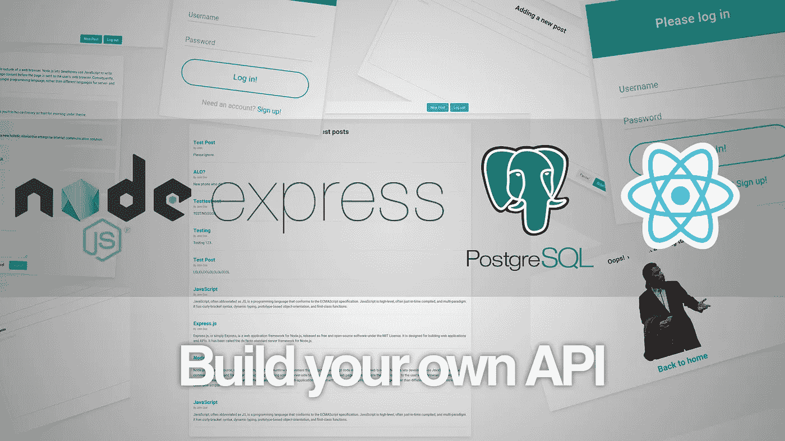

# 使用 Node、Express、Knex 和 PostgreSQL 构建您自己的 REST API

> 原文：<https://javascript.plainenglish.io/build-your-own-rest-api-with-node-express-knex-and-postgresql-aec98fe75e5?source=collection_archive---------4----------------------->



虽然 Rails 是一个完美可行的快速 API 服务器的解决方案，但我必须承认，编程中我最喜欢的一件事就是不断学习。所以最近我决定用我通常不用的工具来构建一个 API，并记录了这个过程，这样你也可以学习。

# 应用程序

我们将使用 Node、Express、PostgreSQL 和 Knex 以及身份验证来构建一个简单的博客 API。将会有两种模式:用户和帖子。我们将使用从用户到帖子的一对多关系。我们开始吧！

# 先决条件:

*   最新版本的 [Nodejs](https://nodejs.org/en/) 。
*   PostgreSQL。
*   createdb —通常随默认 PostgreSQL 安装一起提供的 CLI 命令。
*   快速发电机:`npm i -g express-generator`。
*   Knex: `npm i -g knex`。

# 创建文件结构和数据库

创建一个空的文件夹，并运行`express`。这将创建项目所需的基本文件结构。

然后通过运行`createdb databaseName`创建数据库。我打电话给我的导师。

现在我们需要通过输入`npm i -S knex pg`来安装 knex 和 pg。然后检查您的 package.json 文件，确认一切正常。

# **初始化 knex**

现在键入`knex init`在您的项目根目录下创建一个 knexfile.js。编辑此文件并删除除开发文件之外的所有条目，然后将客户端从“sqlite3”更改为“postgresql ”,并将连接值从对象更改为字符串，并将其值设置为 postgres://localhost/yoursdatabase name。我命名了我的教程，所以我的是这样的:

```
module.exports = {
  development: {
    client: 'postgresql',
    connection: 'postgres://localhost/tutorial'
  }
};
```

# **创建迁移**

现在是通过创建第一个表来定义我们的数据库的时候了。为此，键入`knex migrate:make create-users`并检查新创建的迁移文件夹，寻找一个名为“timestamp_create-users.js”的文件。在里面，你会发现两个函数被上下调用。这是我们定义表结构的地方:

```
exports.up = function (knex) {
     return knex.schema.createTable('users', (table) => {
         table.increments();
         table.string('username');
         table.string('email');
     }); };
  exports.down = function (knex) {
     return knex.schema.dropTable('users');
 };
```

非常简单。我们定义了三个字段:第一个将设置一个 id 字段，自动增量设置为 true，并设置一个唯一的约束。然后我们还有两个字段:一个用于用户名，一个用于电子邮件。我们稍后会回来添加密码。

# **运行迁移并检查数据库**

运行`knex migrate:latest`将新创建的模式加载到数据库中。然后启动一个终端并运行`psql yourDatabaseName`。您会在 Postgres 提示符处着陆，您可以在那里键入`\dt`，如果一切顺利，您应该会看到如下内容:

```
List of relationsSchema |         Name         | Type  | Owner--------+----------------------+-------+-------public | knex_migrations      | table | johnpublic | knex_migrations_lock | table | johnpublic | users                | table | john(3 rows)
```

knex 使用前两个来跟踪我们的迁移，但是注意第三个吗？太好了，那就是我们的用户将被存储的地方，让我们来看看吧！

仍然在 Postgres 提示符下，键入`\d users`来查看里面的内容:

```
Table "public.users"Column  |          Type          | Collation | Nullable |              Default----------+------------------------+-----------+----------+-----------------------------------id       | integer                |           | not null | nextval('users_id_seq'::regclass)username | character varying(255) |           |          |email    | character varying(255) |           |          |Indexes:"users_pkey" PRIMARY KEY, btree (id)
```

太好了！正如我们计划的那样，我们有一个 id 栏、一个电子邮件和一个用户名！现在通过键入`exit`退出 Postgres 提示符。如果你读上面的表格有困难，可以随意粘贴到一个空的 txt 文件中。

# **创建一个种子文件**

没有一些虚拟数据的练习项目是不完整的，所以还是在你的终端里，运行`knex seed:make create_dummy_users`。这将在一个新的`/seeds`文件夹中创建一个名为`create_dummy_users`的新文件。在这个文件中，我们有一个很好的模板来为我们的数据库填充虚拟数据。只需按照给出的格式添加几个用户:

```
exports.seed = function(knex) {
   // Deletes ALL existing entries
   return knex('users').del()
     .then(function () {
       // Inserts seed entries
       return knex('users').insert([
         {username: 'John Doe', email: 'johndoe@example.com'},
         {username: 'Jane Doe', email: 'janedoe@example.com'}
       ]);
     });
 };
```

不过有一点需要注意，最初的模板建议指定 ID 号。这可能适用于其他数据库，但是 Postgres 会自动处理它们，所以我们应该忽略它们以防止冲突。现在，通过键入“knex seed:run”来运行迁移，您的数据库应该在几秒钟内被填充。要检查它是否工作，返回 Postgres 提示符并键入`SELECT * FROM users;`:

```
id | username |        email----+----------+---------------------1 | John Doe | johndoe@example.com2 | Jane Doe | janedoe@example.com(2 rows)
```

在[的下一部分](https://medium.com/javascript-in-plain-english/build-your-own-rest-api-with-node-express-knex-and-postgresql-part-2-d9ff74f6f2fa)中，我们将添加一个文章表、用户认证和表关系。