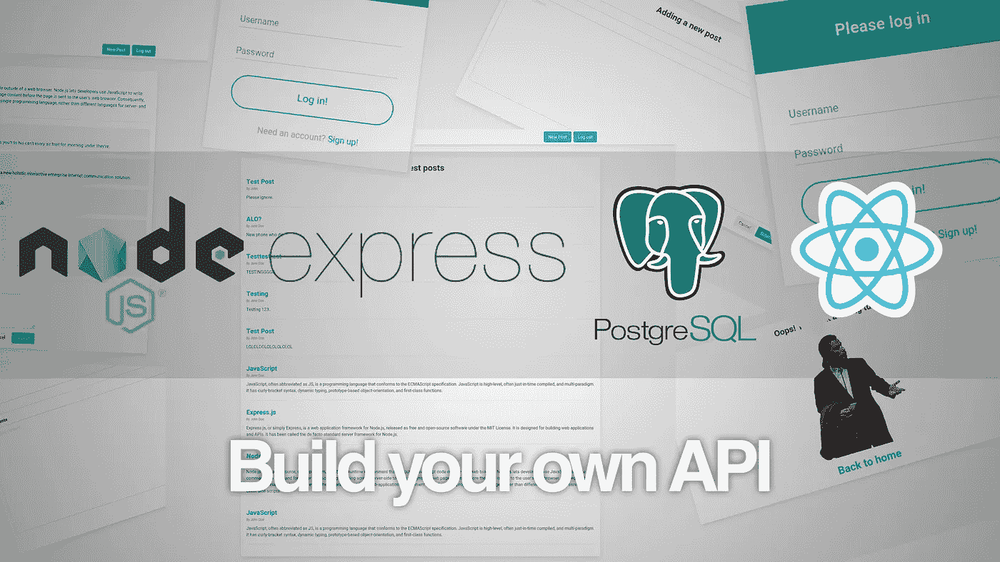

# 用 Node、Express、Knex 和 PostgreSQL 构建自己的 REST API 第 3 部分

> 原文：<https://javascript.plainenglish.io/build-your-own-rest-api-with-node-express-knex-and-postgresql-part-3-c1e904478bfa?source=collection_archive---------2----------------------->



如果你是这个系列的新手，点击这里查看[第一部分](https://medium.com/@fajardocj/build-your-own-rest-api-with-node-express-knex-and-postgresql-aec98fe75e5)和[第二部分](https://medium.com/@fajardocj/build-your-own-rest-api-with-node-express-knex-and-postgresql-part-2-d9ff74f6f2fa)。到目前为止，我们已经处理了我们的数据库模式，但是我们在其他地方没有做太多，所以我们的 api 还没有真正做任何事情。让我们改变这一点。今天，我们将开始添加将成为 API 端点的路由。

# 添加开发依赖项

我们将开始对我们的 API 进行一些补充，所以每次我们添加一个更改时重新启动它将是一个很大的麻烦，所以我们将使用 nodemon 来解决这个问题。我们还增加了 cors 来处理来自任何地方的请求；以及 chai、mocha 和 supertest 来编写我们的测试。所以打开终端，输入:

```
npm i -D supertest mocha nodemon chai cors
```

D 开关是`--save-dev`的简写，它会将任何所需的依赖项添加到 package.json 文件的开发组中。现在，打开 package.json 文件，将以下内容添加到脚本部分，就在 start 之后:

```
"dev": "nodemon",
"test": "(dropdb --if-exists api-server-test && createdb api-server-test) && NODE_ENV=test mocha --exit"
```

不要忘记在 start 后面加一个逗号！

现在，在项目根目录下创建三个新文件夹，分别名为 db、api 和 test:

## 数据库文件夹:

db 文件夹将包含我们数据库的附加配置，以及从其中检索数据所需的查询。在内部，创建一个名为 knex.js 的文件，其内容如下:

```
const environment = process.env.NODE_ENV || 'development';
const config = require('../knexfile');
const environmentConfig = config[environment];
const knex = require('knex');
const connection = knex(environmentConfig);module.exports = connection;
```

然后，仍然在 db 文件夹中，创建另一个名为 dbqueries.js 的文件，并将以下内容放入其中:

```
const knex = require('./knex');module.exports = {
    getAll(table) {
        return knex(table);
    }
}
```

## api 文件夹:

*   api 文件夹将包含我们将使用的路线。在内部，创建三个名为 users.js、posts.js 和 comments.js 的文件。

```
const express = require('express');
const router = express.Router();
const queries = require('../db/queries');router.get('/', (req, res) => {
    queries.getAll('users').then(users => {
        res.json(users);
    })
});module.exports = router;
```

当然，在各自的文件中把`posts`和`comments`改成`'users'`，注意引号。

## 测试文件夹:

*   测试文件夹将包含我们的，你用它，测试。在里面创建三个名为 users.test.js、posts.test.js 和 comments.test.js 的文件，暂时将它们留空。

# app.js 的最后润色

回到你的 app.js 文件，在`const app = express();`后的新一行添加`const cors = require('cors');`。应该在文件的顶部附近。你可能还想把那些老派的`var`改成`const`来保持美观，但这并不是真正必要的。现在删除这两行:

```
var indexRouter = require('./routes/index');
var usersRouter = require('./routes/users');
```

并将它们更改为:

```
const users = require('./api/users');
const posts = require('./api/posts');
const comments = require('./api/comments');
```

另外，添加 cors 来表示:

```
app.use(cors());
```

我们也不需要视图引擎或显示任何东西，所以删除这样的行

```
// view engine setup
app.set('views', path.join(__dirname, 'views'));
app.set('view engine', 'jade');
```

然后将错误处理程序改为输出 json，而不是在屏幕上绘制任何内容:

```
app.use(function (err, req, res, next) {
  res.status(err.status || 500);
  res.json({
    message: err.message,
    error: res.locals.error = req.app.get('env') === 'development' ? err : {}
  });
});
```

# 我们到底做了什么？

我们做了一些改动，让我们来看看:

*   knex.js 文件是我们让 knex 知道它将在什么环境中工作的方式。当我们部署到 Heroku 时，我们会自动获得一个名为 production 的环境变量，它会被检测到。然后，我们导入 knexfile 并导出模块，以使一切可用。
*   dbqueries 文件是大部分数据库操作将要发生的地方，它将与我们的路由密切配合。我们需要从数据库中获取的任何东西都会在这里被请求，目前，我们只有一个简单的请求，相当于一个`SELECT * FROM`查询。
*   然后我们有我们的 api 文件夹。这个文件夹中的每个文件都对应于我们 API 中的一个端点，所以这意味着我们有`/users`、`/posts`和`/comments`可用。我们将向它们添加更多的路由，但是现在，请注意我们是如何在顶部导入查询文件的？这就是我们访问查询的方式，也是我所说的 dbqueries 文件“与我们的路线紧密合作”的意思。然后，我们在每个路由的根级别上有一个简单的 get 操作，它从 dbqueries 文件执行查询，并返回 json 格式的结果。
*   最后，我们设置 app.js 文件来使用我们的路线，并去掉预定义的路线。然后我们去掉了视图引擎，因为我们只需要它输出 json，这就是为什么我们也修改了错误处理程序来这样做。最后，我们添加了 cors。知道使用 cors 有潜在的危险是非常重要的，因为它允许来自任何地方的请求使用您的 API。在现实世界中，您可以限制您的 api 仅响应来自特定 IP 的传入请求。其他的都应该忽略。同时，由于我们处于开发环境中，我们将坚持使用 cors。

# 编写测试

这是拼图的最后一块。每当我们在 api 中添加新的功能时，我们都需要为它编写测试。我们写一个吧！

在你的`test`文件夹中，创建一个`users.test.js`文件。然后把这个贴在上面:

```
const request = require('supertest');
const expect = require('chai').expect;
const knex = require('../db/knex');
const app = require('../app');
```

我们正在导入数据库文件和测试所需的任何依赖项。现在我们需要做的就是调用 describe 函数的第一个任务:

```
describe('Testing users', () => { before((done) => {
        knex.migrate.latest()
            .then(() => {
                return knex.seed.run();
            }).then(() => done())
    });
});
```

这将在我们每次运行测试时运行。如果您检查 package.json 文件，您可以看到其中有一行删除了测试数据库(如果它存在的话),并在我们每次运行测试时创建一个新的数据库。然后，我们的第一个动作是在测试数据库上运行迁移，然后播种它。

现在，我们的第一个测试将是检查我们是否真的得到了我们设定要交付的东西，所以我们将编写一个快速测试来检查我们在`/users`路线上的根路径:

```
it('Lists all users', (done) => {
        request(app)
            .get('/users')
            .set('Accept', 'application/json')
            .expect('Content-Type', /json/)
            .expect(200)
            .then((response) => {
                expect(response.body).to.be.a('array');
                done();
            }).catch((e) => {
                console.log(e);
            });
    });
```

请记住，它仍然在我们的`describe`调用中，就在我们的第一个操作之后和最后一个右括号之前，所以它应该是这样的:

```
describe('Testing users', () => {
    before((done) => {
        knex.migrate.latest()
            .then(() => {
                return knex.seed.run();
            }).then(() => done())
    }); it('Lists all users', (done) => {
        request(app)
            .get('/users')
            .set('Accept', 'application/json')
            .expect('Content-Type', /json/)
            .expect(200)
            .then((response) => {
                expect(response.body).to.be.a('array');
                done();
            }).catch((e) => {
                console.log(e);
            });
    });
});
```

现在，您需要做的就是运行`npm test`，如果一切顺利，您应该会看到类似下面的内容:

```
> api-tutorial@1.0.0 test /home/john/Development/post
> (dropdb --if-exists tutorial-test && createdb tutorial-test) && NODE_ENV=test mocha --exit Testing users
GET /users 200 10.777 ms - 123
    ✓ Lists all users (4ms) 1 passing (105ms)
```

如果此时有问题，请尝试删除开发和测试数据库，然后再次运行测试。

最后，回到控制台并输入`nodemon`，然后启动 postman 并向`http://localhost:3000/users`、`http://localhost:3000/posts`和`http://localhost:3000/comments`发出 get 请求。如果一切顺利，您应该会看到我们输入到 json 格式的种子文件中的数据。

今天就到这里吧！请继续关注[下一部分](https://medium.com/swlh/build-your-own-rest-api-with-node-express-knex-and-postgresql-part-4-44205b1dc7f0)的新功能。