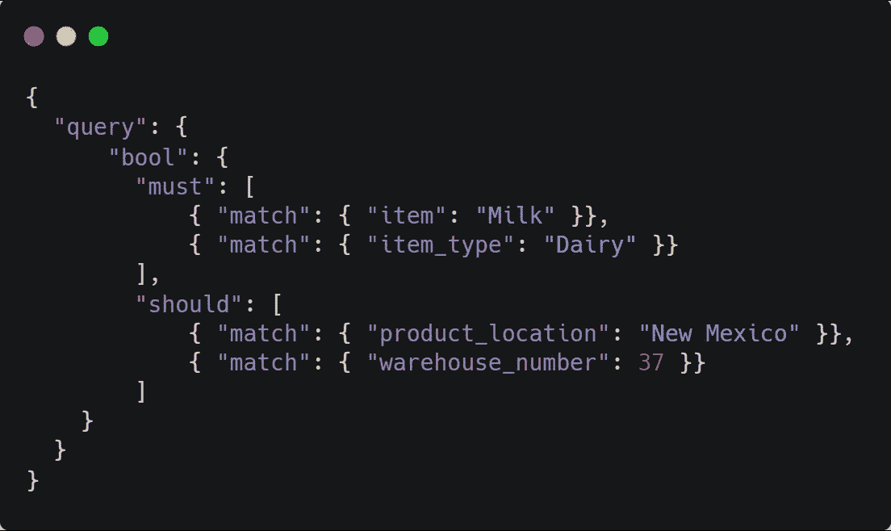

# JavaScript/TypeScript 中的生成器模式

> 原文：<https://javascript.plainenglish.io/builder-pattern-in-javascript-typescript-80341c2d3dea?source=collection_archive---------8----------------------->


这篇文章不仅仅是关于 JS/TS 中的构建器模式，我将解释我背后的思考过程，看看你是否能理解。我相信每个人都有独特的解决问题的方法，希望你能从中学到一些东西。

一个月前，我买了 Imtiaz Ahmed 的这本非常有用的设计模式课程。虽然这个课程是用 Java 编写的，但是我用 Typescript 实现了所有的设计模式。我将会讨论这门课的一个重要任务，在这里提到，

# 业务需求:

公司需要一个方便的 API 来与搜索引擎交互。您需要使用构建器模式来创建下面的 JSON 结构。这个 JSON 结构实际上是一个查询，可以提交给一个名为 Elasticsearch 的搜索引擎。Elasticsearch 是一个开源工具，人们可以下载并使用，但这并不重要。我们公司的开发人员使用您的 builder API 应该能够创建这样的 JSON 请求。



以下是 JSON 结构的**规则**:

1.  在 bool 部分中可以有一个 must 或 should 部分，如图所示。
2.  但是请记住，在每一个“必须”或“应该”中，都可以有嵌套的 bool 部分。匹配部分很简单，可以有任何属性名及其值。

例如，上面的 JSON 查询只过滤那些“牛奶”商品。“item_type”属性的值为“Dairy”。产品位置应为“新墨西哥州”，仓库编号为 37。

当它们被转换成 JSON 格式时，您需要创建几个表示这个 JSON 结构的类。

创建名为 Query、Bool、Must、Match 和 Test 的类。您可能还需要一个名为 QueryBuilder 的类，或者您想给它取什么名字都行。客户端将调用构建器方法来创建 Musts、Shoulds 等的实例。并打印出 JSON 格式的组合对象，以证明 API 按预期工作。

下面是一个开发者如何使用 API 的例子:

```
QueryBuilder builder = new QueryBuilder();builder.bool().mustMatch(“item”, “Milk”).mustMatch(“item_type”, “Dairy”);builder.bool().shouldMatch(“product_location”,”NewMexico”).shouldMatch(“warehouse_number”, 37);
```

请记住，如果需要，开发人员需要能够在 musts 或 shoulds 中嵌套 bools。这是一个嵌套 bool 的例子，在现有的 should 部分中包含一个 must。开发人员希望像这样使用 API:

```
let builder: QueryBuilder = new QueryBuilder();builder.bool().shouldMatch(“lot_number”,307).bool().mustMatch(“expiry_date”, “Jan 2020”);**OR**builder.bool().mustMatch("item", "Milk").mustMatch("item_type", "Dairy");
builder.bool().shouldMatch("product_location", "New Mexico").shouldMatch("warehouse_number", 37);
```

# 解决方案和我的思考过程:

到目前为止，我学习的所有构建器模式都非常容易理解和实现，例如，

```
const myHouse = new HouseBuilder('Adder')
.setFloor(5)
.makeGarden()
.makeParking()
.build();
```

你可以在我的 [**github**](https://github.com/pineshmenat/OOP-Design/tree/master/src/6.Design%20Patterns/3.Builder/HouseExample) 上查看 House Builder 的详细实现。这里需要注意的一点是，我们调用不同方法来构建房子的顺序并不重要，我可以在 makeGarden()之后调用 setFloor(5 ),就像在最后调用构建方法 House obj 被构建时一样。所以顺序在这里并不重要，但这不是我们指派问题的情况。

在我们的 QueryBuilder 赋值中，我们可以在 bool 部分中有一个 must 或 should 部分。我们可以在每个“必须”或“应该”中嵌套 bool 部分。所以这里的顺序非常重要，我通过学习上面的 HouseBuilder 模式获得的知识不足以解决这个问题。

我花了很多时间来思考不同的解决方案，我不想在网上搜索。我不断尝试不同的方法。这里提到了其中一些，

*   为了验证客户端调用 API 函数的顺序，我想使用 if-else，但是当我意识到查询可能是嵌套的，并且验证所有这些都是没有意义的 if-else 时，我放弃了
*   我试图通过多态来达到同样的效果，但是我没有达到我的预期，我不得不放弃这个想法。

最后，我吸收了一段时间的问题，并决定逆向工程。让我来解释一下

这里查询对象最后没有被构建，不像我们调用的 HouseBuilder。在所有创建房屋对象的方法调用结束时使用 build()方法。这让我想到，每次当我们调用 QueryBuilder 方法时，这些方法中的每一个都应该返回一个 class 对象，我们应该能够只调用我们允许的特定方法。

```
builder.bool().shouldMatch(“lot_number”,307).bool().mustMatch(“expiry_date”, “Jan 2020”);
```

*   这里 QueryBulder 应该有一个 bool()方法，它将返回一个 Bool 类的对象。
*   Bool 类将有 shoudMatch()和 mustMatch()方法，它们将分别返回 Should 和 Must 类型的 obj。
*   现在，这个 Should 和 Must 类将拥有 bool()方法，该方法将返回 Bool 类型的 obj。这样我们就可以在查询中的 should 或 must 中嵌套 bool。

让我们深入了解一下[的实现代码](https://github.com/pineshmenat/OOP-Design/tree/master/src/7.Final%20Assignment)，

希望这篇文章对你有帮助，如果是的话，你可以给我一些掌声鼓励我写更多的东西，我不期待起立鼓掌；)谢谢。

# 简单英语的 JavaScript

喜欢这篇文章吗？如果有，通过 [**订阅获取更多类似内容解码，我们的 YouTube 频道**](https://www.youtube.com/channel/UCtipWUghju290NWcn8jhyAw) **！**