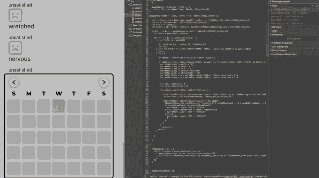

# 使用 SVG 和 React.js 构建日历热图

> 原文：<https://javascript.plainenglish.io/building-a-calendar-heatmap-with-svg-and-react-js-6751b19a2d95?source=collection_archive---------4----------------------->

## 跳舞句法

## 通过数据可视化支持情感自我意识


A Calendar — Photo by [Nick Hiller](https://unsplash.com/@nhillier) on Unsplash.

# 介绍

2016 年，在我大学一年半后，我暂停了我的学术计划，以便在我们的母亲无法照顾我的弟弟妹妹。我的一些非常棒的朋友帮助我，最终收养了她(实际上我也是！).

在我们稳定下来后，我有一种强烈的冲动，想回去学些除了舞蹈以外的东西，最终我去了熨斗学校。我已经有五年没有在类似学校的环境中生活了，所以管理压力和自我照顾是很困难的。我与自我保健意识的斗争启发我开发了一个应用程序来帮助人们更好地管理他们的保健。

在为我的应用程序做前期规划时，我联系了我在脸书的朋友，问他们喜欢和不喜欢自我保健应用程序的什么。几分钟内我收到了 60 多封回复。这些回复帮助我的应用形成了一些用户故事。一个特别的回答是:

> 如果有某种简单的数据可视化工具来显示你每天的感受会很酷，这样你就可以跟踪它，并知道什么时候你需要花更多的时间给自己。像日历这样简单的东西，你用颜色来表示情绪，比如黄色=焦虑，等等。

我认为这将是超级酷的，在阅读这个建议的时候，我不太知道我将如何做，我害怕在编程中使用日期，但我开始完成它，所以让我们做吧！


# 有趣的部分

## 最有价值球员

为了做到这一点，我知道我需要记录一些事情:

*   用户可以从感觉列表中选择
*   每种感觉被映射到该感觉的显示颜色
*   一个动态的、功能性的日历，当感觉被报告时，在给定的一天显示感觉的颜色

我决定最小可行产品，或“滑板”版本，将我的感觉分为“需求满足”和“需求未满足”两类→然后是母词类别→然后是高度具体的感觉词。我这样做是为了支持一个用户深化他们的*情感粒度*(读作:具体理解)。例如，报告你感到被授权比自信更有用、更具体。我做了一些研究，从 217 个感觉词开始。


A portion of the 217 words I collected

我还决定，既然我有这么多单词，我将只把颜色分配给两个最高级别的类别，满意和不满意。这将使事情变得简单，我计划在未来的重构中做更多的研究，寻找更好的词，并将颜色映射到感觉上。

## 环境

我使用 Ruby on Rails 作为后端 API，PostgreSQL 作为我的数据库。我的前端客户端使用 React.js。

## 准备 SVG

对于我的项目，我很高兴与两位设计师 [Anna Wu](https://medium.com/u/4d2e5b0cbc9f?source=post_page-----6751b19a2d95--------------------------------) 和 [Kendra Jenel](https://medium.com/u/86339748ded5?source=post_page-----6751b19a2d95--------------------------------) 合作。他们为我创造了这个图形:


Ex. 1 Concept Calendar with colored squares to indicate feelings reported

从 Figma 导出为 SVG 后，我编辑了 SVG，使单元格具有相同的空白填充颜色，并调整了第一个突出显示 Ex 中当前日期的单元格的大小。1.现在看起来是这样的:


Blank Concept Calendar

从那里我转到 [SVGtoJSX](https://svg2jsx.com/) 以便快速将该 SVG 转化为反应组分。您必须这样做，因为并非所有 SVG 属性在 JSX 都有效。例如:笔画宽度=有效 SVG，笔画宽度=有效 JSX。

SVGtoJSX 还允许您切换标识的存在，确定您想要一个函数组件还是类组件，以及记忆和切换单引号或双引号。

毕竟，我们有一个反应组件可以使用。

目前，显示的月份是一个 SVG `<path>`，这意味着它不是文本，而是作为一系列属性绘制，告诉客户在哪里、如何以及绘制什么。

```
<path id="July" d="M160.477 32.18C159.673 32.18 158.929 32.024 158.245 31.712C157.573 31.388 157.021 30.938 156.589 30.362L157.921 28.76C158.617 29.72 159.451 30.2 160.423 30.2C161.731 30.2 162.385 29.426 162.385 27.878V21.362H157.903V19.4H164.725V27.752C164.725 29.228 164.365 30.338 163.645 31.082C162.925 31.814 161.869 32.18 160.477 32.18ZM177.097 22.388V32H174.955V30.776C174.595 31.208 174.145 31.544 173.605 31.784C173.065 32.012 172.483 32.126 171.859 32.126C170.575 32.126 169.561 31.772 168.817 31.064C168.085 30.344 167.719 29.282 167.719 27.878V22.388H169.969V27.572C169.969 28.436 170.161 29.084 170.545 29.516C170.941 29.936 171.499 30.146 172.219 30.146C173.023 30.146 173.659 29.9 174.127 29.408C174.607 28.904 174.847 28.184 174.847 27.248V22.388H177.097ZM180.043 18.644H182.293V32H180.043V18.644ZM194.247 22.388L189.747 32.774C189.327 33.818 188.817 34.55 188.217 34.97C187.617 35.402 186.891 35.618 186.039 35.618C185.559 35.618 185.085 35.54 184.617 35.384C184.149 35.228 183.765 35.012 183.465 34.736L184.365 33.08C184.581 33.284 184.833 33.446 185.121 33.566C185.421 33.686 185.721 33.746 186.021 33.746C186.417 33.746 186.741 33.644 186.993 33.44C187.257 33.236 187.497 32.894 187.713 32.414L187.875 32.036L183.681 22.388H186.021L189.045 29.498L192.087 22.388H194.247Z" fill="black"/>,
```

为了控制显示哪个月，我制作了这些路径的数组和一个基于状态渲染那个月的函数`<path>`。

Github gist showing the SVG Calendar Month paths

重构点:我可能会在以后回来，把它变成一个对象，用当前月份作为获取月份路径的关键。

最后，我给所有日历的 SVG 矩形一个日期属性设置为`"blank",`，然后我将`<rect></rect>`节点包装成代表周的行组。然后给每一行`<g></g>`一个 id，并将整个日历包装成一组，给它一个 id 和`onClick`事件监听器。


# 日历功能

## 设置

我采取的第一步是定义一些状态来跟踪当天、当月和当年。

Github gist showing some initial code setup

在每个功能中，我定义了一个常数`date`并将其设置为等于`new Date()`。根据市场发展网络:

> JavaScript `**Date**`对象以独立于平台的格式表示时间中的某个时刻。`Date`对象包含表示自 1970 年 1 月 1 日 UTC 以来的毫秒数的`Number`。

当我写这篇文章时，今天是 7 月 29 日星期三，所以不带参数调用`new Date()`给我一个今天日期的 date 对象，时间是我发起 date()调用的时间。它以人类可读的格式显示 GMT 偏移和我的本地时区。

```
new Date()
//=> Wed Jul 29 2020 13:07:23 GMT-0700 (Pacific Daylight Time)
```

我之所以使用`toLocaleString`方法，是为了让这种方法适应不同时区的未来，但我可能会在以后对其进行重构。

下一步是获取给定月份的第一天和给定月份的天数。

我在 Medium 上找到了[Nitin Patel](https://medium.com/@nitinpatel_20236/challenge-of-building-a-calendar-with-pure-javascript-a86f1303267d)的这篇博文，它帮助我找到了如何获得这些数据的方法(谢谢！).Patel 正在使用原始 CSS 和 JavaScript 生成他们的整个日历，这非常酷，所以来看看这个额外的挑战吧。

```
// 1\. Get days in given month, for given year. daysInMonth = (iMonth, iYear) => {
         return 32 - new Date(iYear, iMonth, 32).getDate();
       }a. new Date(2020, 0, 32)
//=> Sat Feb 01 2020 00:00:00 GMT-0800 (Pacific Standard Time)b. new Date(2020, 0, 32).getDate()
//=> 1c. 32 - 1 
//=> 31//Jan 31st!// 2\. Get first day in given month, for given year. let firstDay = (new Date(year, month)).getDay();a. new Date(2020, 0)
//=> Wed Jan 01 2020 00:00:00 GMT-0800 (Pacific Standard Time)b. (new Date(2020, 0)).getDay();
//=> 3//Wednesday!
```

在函数 1 中，`new Date(iYear, iMonth, 32).getDate()`返回当月第一天之后第 32 天的数值。JavaScript 从 0 开始计算月份，方法`getDay()`返回星期几，也从 0 开始计算。我们从 32 中减去这个数字，得到上个月的最后一天。

> **注意:**所有设置状态和填充日历的函数都在`componentDidMount`内调用。

```
componentDidMount(){this.setMonth()this.setYear()this.setCurrent()this.populateCalendar(new Date().getFullYear(), new Date().getMonth())}
```

现在我已经完成了这个初始设置，我可以继续用日期填充日历了。

## 回环-脱环！

现在是有趣的部分:循环！

首先，我向我构造函数添加一个引用，并将该引用附加到代表月份的`<g></g>`上。React refs 为我们提供了一种引用和访问 DOM 节点的方法。您可以通过调用`this.namedRef`上的`.current`来访问附加的节点。

```
constructor(props){
   super(props)
   this.monthRef = React.createRef()
}...further down in file<g id="month" ref={this.monthRef} onClick={this.handleClick}>
...Week rows and Day Rectangles
</g>
```

现在，我将定义我的函数，它将接受一个数字年和月，并定义我将需要开始我的 loopalooza 的变量。这是代码，下面是一步一步的操作。

Github gist showing the code to loop over the calendar nodes.

## 逐步地

1.  使用 for 循环遍历整个月份，`cal.current.children`将返回一个 HTMLCollection，这是我们表示周的行。行迭代的每一步都将把我们带到新的一周。
2.  定义一个代表当前迭代周的子日的变量`<rect></rect>`。
3.  再次遍历该周，定义一个变量来表示当前迭代日`<rect></rect>`。
4.  现在我们已经迭代了整个结构，我们可以开始在每个`<rect></rect>.`上填充日期属性
5.  检查我们是否在第一次迭代，第二次迭代的数值是否小于`firstDay`的值。如果为真，则继续迭代。这将使每个矩形上的日期属性“空白”，直到我们找到一周中合适的一天开始赋值。
6.  检查`date`变量的数值是否大于`daysInMonth`函数返回的数值。如果是真的，我们已经完成了赋值，我们可以打破循环。我们将在循环之外增加`date`
7.  在嵌套循环的当前步骤访问`currentCell`的属性，并用`date`变量的值更新日期值。
8.  检查`date`、`month`、`year`的值在状态下是否等同于今天的日期，如果是，则调整`currentCell`的样式，突出当月的当天。由于高亮显示是矩形周围的黑色轮廓，我不得不减小矩形的大小并绘制轮廓，这将使我的矩形向上移动 2.5 像素，向左移动 3 像素。该块中的最后两行将重新定位单元格，使其与其他单元格正确对应。
9.  对于我们的下一个技巧，即让我们进入更大事物的部分，我们将定义两个变量来存储满意和不满意类别感觉的计数，并映射用户报告的感觉。
10.  在地图中，定义一个变量来保存感觉对象，这是过滤与用户感觉的`“feeling_id”`匹配的特定感觉 ID 的感觉列表的结果
11.  定义一个读取用户感觉的`“created_at”`属性的变量，并获取记录创建日期的数字日号`.getUTCDate()`。

#11 非常重要。在我的开发环境中，PostgreSQL 会将我的“created_at”日期存储为 UTC(协调世界时)的表示形式，格式为 YYYY-MM-DD-HH:MM:SS:MS，但是在 JavaScript 方面，我的记录被转换为 ISO8601 格式字符串，如下所示:`2020–07–01T02:32:21.580Z`

“T”将日期与时间分开，“Z”代表“祖鲁语”，表示 UTC 时间零偏移的区域名称。看看这个例子。

```
Rails/PostGresQL:Records "created_at" stored as UTC:2020-07-01 02:32:21.580076Parse in JS (local time is the default):
new Date(“2020-07-01 02:32:21.580076”)//=> Wed Jul 01 2020 02:32:21 GMT-0700 (Pacific Daylight Time) The same Record's "created_at" on the JavaScript side in ISO8601 format:2020–07–01T02:32:21.580ZParse in JS:
new Date(“2020–07–01T02:32:21.580Z”)//=> Tue Jun 30 2020 19:32:21 GMT-0700 (Pacific Daylight Time)Uh oh! We've lost the offset and it thinks it's the previous daynew Date("2020-07-01T02:32:21.580Z").getDate()//=> 30Fixed!new Date("2020-07-01T02:32:21.580Z").getUTCDate()//=> 1
```

我们需要指定不是假设本地时间，而是希望基于 UTC 计算日期，因此调用`.getUTCDate`会给出不受时区限制的正确日期。

12.既然我们的日期已经被正确解析，我们可以检查一下`currentCell`的新日期值是否等同于用户报告感受的`“created_at”`日期。

13.使用三元组来增加当天满足或不满足的计数

14.最后，我们可以通过比较`satisfiedCount`和`unsatisfiedCount`来检查选择`currentCell`的填充颜色。让我们打开调试器，看看这个宝贝是如何工作的！



Stepping through the iterations to watch the calendar populate.


# 结论

我们成功了！这真的很有趣，也很有挑战性。我感到特别高兴的是，我对如何在 JavaScript 中处理日期有了更好的理解。我有一些未来的重构，但我很高兴它现在正在工作。

你引以为豪的建筑是什么？有什么问题吗？请在评论中告诉我！

1.  [日期构造器— MDN](https://developer.mozilla.org/en-US/docs/Web/JavaScript/Reference/Global_Objects/Date/Date)
2.  [ISO8601 —维基百科](https://en.wikipedia.org/wiki/ISO_8601)
3.  [协调世界时—维基百科](https://en.wikipedia.org/wiki/Coordinated_Universal_Time)
4.  [GMT 与 UTC —时间和日期](https://www.timeanddate.com/time/gmt-utc-time.html)
5.  [用纯 JavaScript 构建日历的挑战](https://medium.com/@nitinpatel_20236/challenge-of-building-a-calendar-with-pure-javascript-a86f1303267d)——[Nitin Patel](https://medium.com/u/fae9d84f67cb?source=post_page-----6751b19a2d95--------------------------------)
6.  [SVGtoJSX](https://svg2jsx.com/)