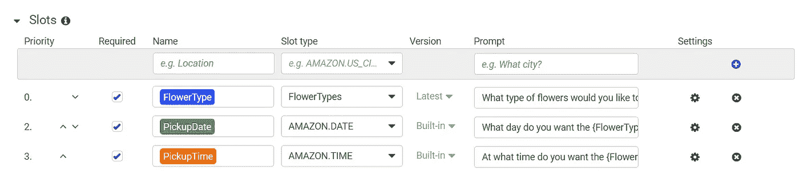

# 用 Vue.js 和 AWS Amplify 构建聊天机器人

> 原文：<https://javascript.plainenglish.io/building-a-chatbot-with-vue-js-and-aws-amplify-6e190d2e8a2e?source=collection_archive---------2----------------------->


Chatbot Waving

在过去的几年里，聊天机器人的流行程度激增。企业和客户都希望在没有人工干预的情况下以最简单的方式执行任务，这是有道理的。但是，如果没有第三方服务，构建自己的聊天机器人可能是一项艰巨的任务。

这就是 AWS Amplify 的交互 API 大放异彩的地方。它利用了亚马逊 Alexa 使用的相同深度学习能力。有了它，你可以快速有效地构建聊天机器人。所以，让我们直接开始设置一个。

# 视频教程

Video Tutorial

# AWS Amplify CLI 设置

如果你还没有账户，去 [AWS](https://aws.amazon.com/) 创建一个。然后打开您的终端并运行以下命令:

```
npm i -g @aws-amplify/cli
```

# Vue 应用程序创建

要创建 Vue 应用程序，请打开您的终端，将 cd 放入您选择的目录，然后运行以下命令:

```
npx vue create aws-amplify-chatbot
```

然后只需选择应用程序的默认设置:
1。请选择一个预设:**默认(babel，eslint)**

# 放大设置

## 扩大账户

现在，在您选择的代码编辑器中打开新创建的 Vue 项目(我使用的是 VS 代码)。然后，在项目的根目录中打开一个新的终端(在 VS 代码中，终端->新终端)。如果您从未使用过 Amplify，请运行以下命令:

```
amplify configure
```

这将引导您完成在 AWS 中设置新 IAM 帐户的步骤。这个帐户将通过 CLI 编程生成我们告诉 Amplify 的所有内容。

## 初始化 Vue 项目中的放大器

然后，我们需要在我们的项目中初始化 Amplify。为此，请在终端中运行以下命令:

```
amplify init
```

**选择以下选项:**

1.  输入项目名称:
    **回车选择默认**
2.  输入环境的名称: **dev**
3.  选择您的默认编辑器:
    **Visual Studio 代码**
4.  选择你正在构建的应用类型:
    **javascript**
5.  你用的是什么 javascript 框架:
    **vue**
6.  源目录路径:
    **回车选择默认** (src)
7.  分发目录路径:
    **回车选择默认** (dist)
8.  构建命令:
    **回车选择默认的** (npm.cmd run-script build)
9.  开始命令:
    **回车选择默认** (npm.cmd run-script serve)
10.  是否要使用 AWS 配置文件？:
    **Y**
11.  选择您在最后一步中设置的帐户

## 添加放大交互

在您的终端中运行以下命令:

```
amplify add interactions
```

**选择以下选项:**

1.  提供一个友好的资源名称，该名称将用于在项目中标记该类别:
    **按回车键选择默认的**
2.  您想从示例聊天机器人开始，导入聊天机器人，还是从头开始？ **从一个样本开始**
3.  选择一个聊天机器人样本:
    **OrderFlowers**
4.  请指出您对该机器人的使用是否受儿童在线隐私保护法(COPPA)的约束。
    **N**

## 将更改推送到云

要让 Amplify 将您的更改推送到云，请在您的终端中运行以下命令:

```
amplify push
```

## AWS 中的视图

要查看已创建的资源，请在终端中运行以下命令:

```
amplify console
```

不幸的是，amplify 控制台没有显示我们的机器人，但它会带你到正确的 was 帐户和地区。控制台打开后，单击顶部菜单中的服务下拉菜单，然后搜索“Lex”。然后点击亚马逊 Lex。


Amazon Lex

在那里，你会看到你的聊天机器人列表。由于我们选择了 OrderFlowers **，**的样本，我们将看到一个名为 OrderFlowers_dev 或类似名称的聊天机器人。点击它进入机器人设置。

## Bot 设置演练

**示例话语** 这些是用户为初始化机器人而键入的第一个单词。它们不必精确，因为 Lex 将对接近指定短语的短语使用自然语言处理。


Sample Utterances

**Lambda 初始化** 在这里你可以指定你是否想要一个 Lambda 函数来触发 bot 的初始化。


Lambda Initialization

把这些想象成机器人将带领用户走过的步骤。每个插槽都有以下内容:

1.  优先级—何时提出问题。
2.  必需—它是否是必需的输入。
3.  名称-输入的变量名。这将在传递数据以完成函数时使用
4.  插槽类型-这些是输入的元字段，用于确定有效的输入数据。您可以选择预定义的插槽或在左侧菜单中创建自己的插槽。有关自定义插槽的示例，请参见 flower type 插槽。
5.  版本—插槽的版本。用于您的自定义插槽。
6.  prompt—bot 将如何提示用户输入数据。以问题的形式输入。



**确认提示** 这是结束 bot 操作的提示。通常，它会重申用户已经选择了什么，以供确认。


**Fulfillment** bot 完成后，你可以启动一个 lambda 函数。在这种情况下，我们会将订单添加到数据库中，或者向花店发送一封包含订单详细信息的电子邮件。


Fulfillment

**响应** 执行完成后，我们可以发送另一个响应。我将添加一条消息，说明“鲜花订单已成功下单”


Response

# 将放大器添加到 Vue

现在我们已经在 AWS 中提供了聊天机器人，我们可以将 Amplify npm 包添加到我们的 Vue 项目中，并初始化 Amplify。在项目的根目录下打开一个终端，并运行以下命令:

```
npm i aws-amplify aws-amplify-vue
```

接下来转到 src/main.js 并添加以下内容:

```
// Import Amplify Modules, Plugins, and aws exports file
import Amplify, * as AmplifyModules from "aws-amplify";
import { AmplifyPlugin } from "aws-amplify-vue";
import awsconfig from "./aws-exports";// Configure Amplify in project
Amplify.configure(awsconfig); // Configure vue to use plugins and modules
Vue.use(AmplifyPlugin, AmplifyModules);
```

## 聊天机器人 UI

幸运的是，Amplify 为我们提供了一个聊天机器人组件，我们可以将它添加到我们的页面中。在 src/App.vue 中，在主应用程序分区中，我们将删除所有内容以添加 chatbot 组件:

```
<amplify-chatbot *v-bind*:*chatbotConfig*="chatbotConfig"></amplify-chatbot>
```

在脚本标签中，我们将使用 chatbotConfig 添加一个数据属性。您需要添加 bot 名称，我可选地添加了 clearComplete 并将其设置为 false。

```
<script>
 *export* *default* {
  name: "App",
  *data*: () => ({
   chatbotConfig: {
    bot: "OrderFlowers_dev",
    clearComplete: false,
   },
  }),
 };
</script>
```

## 处理确认

在我们的演示中，有两种方法可以处理花卉订单的确认。你可以使用 lambda 函数，也可以将数据传回我们的客户端(Vue)。我们将把它传递回我们的项目。

为此，我们需要从 AWS Amplify 包中导入交互类。然后我们将声明一个名为 handleComplete 的方法。在这个方法中，我们将记录任何错误并警告一个已完成的机器人。最后，我们需要在加载时注册函数，这将在挂载的生命周期钩子中完成。

完成后，您的 App.vue 文件将如下所示:

# 演示

就是这样！现在我们可以看看机器人的演示。


Chatbot Demo

# 结论

正如你所看到的，使用 AWS Amplify 可以非常容易地启动并运行一个强大的聊天机器人。我很想知道你打算用它造什么。请在下面的评论中告诉我们。

bit bucket Repo:[https://bit bucket . org/the diligent dev/AWS-chatbot/src/master/](https://bitbucket.org/TheDiligentDev/aws-chatbot/src/master/)

## 进一步阅读

 [## 如何使用最小特权原则自动化 AWS IAM 最佳实践

### 云是一项神奇的技术，可用于构建可扩展的应用程序，轻松提供对弹性计算的访问…

简明英语. io](https://plainenglish.io/blog/how-to-automate-aws-iam-best-practices-using-the-principle-of-least-privilege)