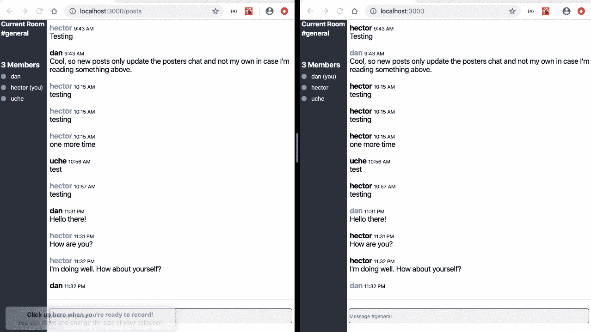
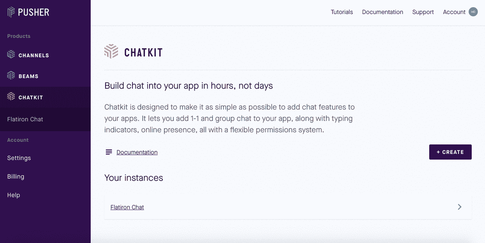

# 使用 ReactJS 和 Pusher 建立聊天室

> 原文：<https://javascript.plainenglish.io/building-a-chatroom-using-reactjs-and-pusher-ec8c33b5f660?source=collection_archive---------1----------------------->

在数字时代，实时通信工具为我们的许多个人和职业互动提供了便利。2014 年，蒂姆·库克表示，苹果在全球范围内“每天处理大约 400 亿条 [iMessage 通知](https://www.businessinsider.com/eddy-cue-200k-imessages-per-second-2016-2)”。鉴于 iMessage 中的每个对话本质上都是一个微型聊天室，我们将通过使用 ReactJS 和 Pusher 构建一个聊天室来探索聊天室的内部工作方式。



你能想象写消息却不能实时看到你的聊天室吗？如果无法通过客户端和服务器进行双向通信，就会发生这种情况。大多数解决方案使用 [Websockets](https://developer.mozilla.org/en-US/docs/Web/API/WebSockets_API) 进行双向通信，但是需要手动部署和配置。今天，我们将使用 Pusher 的[聊天工具 API](https://pusher.com/chatkit) 来实时更新聊天室。

**第一步:下载并打开 Pusher 的 ReactJS 模板**
本教程将主要以 Pusher 的 [repo 中列出的模板和说明为指导](https://github.com/pusher/build-a-slack-clone-with-react-and-pusher-chatkit)。repo 预先配置了 Node.js 服务器的指令，用于处理客户端和服务器端聊天室请求。

**第 2 步:创建 Pusher Chatkit 实例** 转到 Pusher 的[仪表板](https://dash.pusher.com/chatkit)创建 Chatkit 实例。一旦你创建了你的实例，保存你的**实例定位器**和**密钥**值。



**第三步:为 Chatkit API 服务器端交互** 设置 Node.js 服务器在 Pusher 的[第三步](https://github.com/pusher/build-a-slack-clone-with-react-and-pusher-chatkit#step-3-setup-a-basic-node-server)中，客户端交互仅限于用户能够加入聊天室，发送消息，查看其他用户何时在打字。只有当我们通过`npm install --save @pusher/chatkit-server`安装`[@pusher/chatkit-server](https://www.npmjs.com/package/@pusher/chatkit-server)`并用步骤 2 中的值更新`./server.js`时，服务器端的交互(创建和管理用户账户)才会发生。

**第四步:创建登录流程** 参见第四步说明[此处](https://github.com/pusher/build-a-slack-clone-with-react-and-pusher-chatkit#step-4-identifying-the-user)。通过在`./src/components/`文件夹中创建一个名为`UsernameForm.js`的组件来创建一个受控表单。在`UsernameForm.js.`状态下追踪用户名

然后，用一个名为`onUsernameSubmitted(username)`的函数更新父组件`App.js`，该函数从`UsernameForm.js`接收用户名，并向/users route 发出 POST 请求，以创建新的聊天室用户。POST 请求还悲观地将`App.js currentUser`的状态设置为存储在`UsernameForm.js`状态中的用户名值。

最后，将`onUsernameSubmitted(username)`作为道具传递给`UsernameForm.js`，并将道具添加到表单中的 onSubmit 监听器，使循环完整。

**第五步:有条件地呈现聊天室组件** 在`./src`文件夹中创建一个`ChatScreen.js`组件，最终显示用户的消息。为名为`currentScreen`的`App.js`组件中的状态创建一个切换，默认为“登录”。然后，当调用步骤 4 中的`onUsernameSubmitted(username)`函数时，将`currentScreen`更新为“ChatScreen”。只有在登录表单中提交用户名时，才会调用它。更新`App.js`以呈现以下代码:

```
**// App.js component**render() {
   if (this.state.currentScreen === 'Login') {
      return <UsernameForm onSubmit={this.onUsernameSubmitted} />
   }
   if (this.state.currentScreen === 'ChatScreen') {
      return <ChatScreen currentUsername=    
      {this.state.currentUsername} />
   }
}
```

**步骤 6:连接您的 Chatkit 实例** 在步骤 2 中，我们创建了一个 Chatkit 实例，现在，我们准备通过 Pusher 的客户端 API 连接到我们的实例。通过`npm install --save @pusher/chatkit-client`安装`[@pusher/chatkit-client](https://www.npmjs.com/package/@pusher/chatkit-client)`并用以下代码更新`./ChatScreen.js`:

```
**// ChatScreen.js component**componentDidMount () {
   const chatManager = new Chatkit.ChatManager({
      instanceLocator: 'YOUR INSTANCE LOCATOR',
      userId: this.props.currentUsername,
      tokenProvider: new Chatkit.TokenProvider({
        url: 'http://localhost:3001/authenticate',
      }),
    })

    chatManager
      .connect()
      .then(currentUser => {
        this.setState({ currentUser })
     })
     .catch(error => console.error('error', error))
}
```

使用实例定位器实例化、userId(您的用户名)和 token 创建一个 chatManager 对象，该对象将允许用户加入聊天室、发送消息和查看其他用户何时输入。

```
**Note:** If you encounter the **TOKEN EXPIRY TOO FAR AHEAD** error, this means your Node.js server time is ahead of the current time. An easy fix is updating your local machine's time. Click on the time in the upper righthand corner and click "Open Date & Time Preferences" to update your local time. Then, restart your server with npm install.
```

**步骤 7:在 Pusher Chatkit** 中创建聊天室在一个更强大的应用程序中，通过客户端或服务器创建聊天室的功能应该是默认存在的，但是我们在这里通过 Chatkit [仪表盘创建一个聊天室](https://dash.pusher.com/chatkit)。


单击您在步骤 2 中创建的实例。然后，单击页面中上部区域的 Console 选项卡。然后，稍微向左点击房间选项卡，并点击**创建新房间**按钮。创建房间后，记下出现在房间名称下的 ID。您将在步骤 8 中使用 ID。

**步骤 8:订阅新消息** 从概念上讲，如果没有“订阅”或加入聊天室，你就看不到聊天室，所以我们将使用下面的代码更新`./ChatScreen.js`:

```
**// ChatScreen.js component**state = {
   currentUser: {},
   currentRoom: {},
   messages: []
}componentDidMount () {
const chatManager = new Chatkit.ChatManager({
   instanceLocator: 'YOUR INSTANCE LOCATOR',
   userId: this.props.currentUsername,
   tokenProvider: new Chatkit.TokenProvider({
      url: 'http://localhost:3001/authenticate',
   }),
})chatManager
   .connect()
   .then(currentUser => {
      this.setState({ currentUser })
         return currentUser.subscribeToRoom({
            roomId: "YOUR ROOM ID",
            messageLimit: 100,
            hooks: {
               onMessage: message => {
                  this.setState({
                     messages: [...this.state.messages, message],
                  })
               },
            },
         })
      })
      .then(currentRoom => {
         this.setState({ currentRoom })
      })
}
```

将“您的房间 ID”替换为步骤 9 中的房间 ID。当用户登录时，将呈现 ChatScreen 组件，该组件将初始化 ChatManager 对象，该对象使您能够执行客户端和服务器端的操作。我们将向状态添加一个空的 currentRoom 对象和空的 messages 数组。

Chatkit API 有一个**subscribe room**方法，该方法将用户添加到聊天室，并为他们订阅聊天室中发生的所有和任何行为。`subscribeToRoom`采用一个名为`onMessage`的事件处理程序，每次通过 Chatkit 的 webhooks 功能发布新消息时，都会实时调用这个事件处理程序。当一个消息被发布时，它被附加到处于`./ChatScreen.js`状态的消息数组中。

**步骤 9:在聊天室**中渲染消息
在步骤 8 中，我们在`./ChatScreen.js`中创建了一个消息数组，所以现在，我们将在`./src/components`文件夹中创建一个名为`MessageList.js`的组件，它将接收消息数组作为道具。然后,`MessageList.js`组件将遍历数组来呈现 chatbox 中的每条消息。按照[这里的消息列表步骤](https://github.com/pusher/build-a-slack-clone-with-react-and-pusher-chatkit#step-9-subscribe-to-new-messages)在您的聊天室呈现消息。

**第 10 步:允许用户发送消息** 与第 4 步类似，我们可以复制一个`UsernameForm.js`组件，将其重新用作`SendMessageForm.js`。新组件应该有一个“文本”状态，所以 onChange 事件可以更新 this.state.text 和 onSubmit 事件，后者调用一个名为`sendMessage(text)`的新函数。新函数将被传递给`SendMessageForm.js`作为表单提交的道具。

```
**// SendMessageForm.js component**state = {
   text: '',
}

onSubmit(e) {
   e.preventDefault()
   this.props.onSubmit(this.state.text)
   this.setState({ text: '' })
}

onChange(e) {
   this.setState({ text: e.target.value })
   if (this.props.onChange) {
      this.props.onChange()
   }
}<form onSubmit={this.onSubmit}>
   <input
      type="text"
      placeholder="Type a message here then hit ENTER"
      onChange={this.onChange}
      value={this.state.text}
   />
</form> **// ChatScreen.js component**sendMessage(text) {
   this.state.currentUser.sendMessage({
      text,
      roomId: this.state.currentRoom.id,
   })
}render (
   <SendMessageForm onSubmit={this.sendMessage} />
)
```

请记住，第 8 步中的`subscribeToRoom`方法采用一个名为`onMessage`的事件处理程序，每次发布新消息时都会实时调用该处理程序，因此新消息将出现在第 9 步中创建的 MessageList.js 组件中。

**步骤 11:添加实时打字指示器** 在`./src/components`文件夹中创建一个`TypingIndicator.js`组件，在这里使用 Pusher 的[文档中的指令](https://github.com/pusher/build-a-slack-clone-with-react-and-pusher-chatkit#step-11-add-realtime-typing-indicators)。在这一步的最后，您将在`ChatScreen.js`中得到 usersWhoAreTyping 的状态和下面的代码:

```
**// ChatScreen.js component**state = {
   currentUser: {},
   currentRoom: {},
   messages: [],
   **usersWhoAreTyping: [],**
}sendTypingEvent() {
   this.state.currentUser
      **.isTypingIn({ roomId: this.state.currentRoom.id })**
      .catch(error => console.error('error', error))
}return(
**<TypingIndicator usersWhoAreTyping={this.state.usersWhoAreTyping} />**
<SendMessageForm
onSubmit={this.sendMessage}
**onChange={this.sendTypingEvent}**/>
)
```

**步骤 12:添加谁的在线名单** 使用这里的指令在`/src/components`文件夹中创建一个`WhosOnlineList.js`组件。

**步骤 13:为新消息添加自动滚动** message list . js 组件呈现用户发送的所有消息，但我惊讶地看到聊天室没有在我的屏幕底部自动显示最近的消息。我进一步研究了如何让消息列表自动向下滚动到最新的消息，得出了以下代码:

```
**// ChatScreen.js component**state = {
   currentUser: {},
   currentRoom: {},
   messages: [],
   usersWhoAreTyping: [],
   scrolled: false,
}sendMessage = (text) => {
   this.state.currentUser.sendMessage({
   roomId: this.state.currentRoom.id,
   text: text
   })

   this.setState({
      scrolled: false
   })
}onScroll = () => {
   this.setState({
      scrolled: true
   })
}**// MessageList.js component**componentDidUpdate() {
   setInterval(this.updateScroll,1000);
}updateScroll = () => {
   let element = document.querySelector('.message-list-container')
   if (this.props.scrolled === false) {
      element.scrollTop = element.scrollHeight;
   }
}//update the div for message-list-container with onScroll event
<div className="message-list-container" onScroll={() => this.props.onScroll()}>
```

**第 14 步:装饰性插件**
**改变用户帖子的颜色** 我喜欢将登录用户的名字渲染得与其他用户不同，以使帖子易于识别。为了实现这个目标，我在 MessageList.js 组件中编写了下面的三元语句。

```
// MessageList.js component{ this.props.currentUser.id === message.senderId 
  ? <font className="special-text">{message.senderId}</font> 
  : {message.senderId}}
```

每当您或其他用户发布消息时，该消息的 senderId 将被设置为您的用户名。currentUser.id 被设置为等于登录人的用户名。如果三元组为真，则登录人的用户名被包装在一个名为“special-text”的类名中，该类名在步骤 15 中使用 CSS 对用户名进行样式化。

在用户帖子旁边显示时间
这个功能是任何聊天室应用程序的必备功能，但实现起来并不像看起来那么容易。Chatkit API 以 UTC 时间返回消息的时间，格式不像 HH:MM 那么简单。我必须编写一个名为 parseTime 的函数来将 UTC 转换为军用时间，然后将军用时间转换为 AM/PM 指定的标准时间。

```
<span className="message-list-time">{this.parseTime(message.createdAt)}</span>parseTime = (createdMessage) => {
   let date = new Date(createdMessage);
   let hours = date.getHours();
   let mins = date.getMinutes();
   let merid = " AM" if (hours > 12 && mins < 10) {
      hours = hours - 12
      mins = "0" + mins
      merid = " PM"
      return hours + ':' + mins + merid
   } else if (hours > 12 && mins > 10) {
      hours = hours - 12
      merid = " PM"
      return hours + ':' + mins + merid
   } else if (hours < 12 && mins < 10) {
      mins = "0" + mins
     return hours + ':' + mins + merid
   } else {
     return hours + ':' + mins + merid
   }
}
```

**当长度大于 2
时显示“点击返回提交”** Slack 有一个非常酷的功能，设计巧妙，但让经验最少的用户知道当他们键入特定数量的字符时如何在应用程序中交流。

```
// SendMessageForm.js component{
   this.state.text.length > 2 ? 
   <div className="message-form-return">hit return to send</div> :    
   ""
}
```

步骤 15:设计聊天室组件的样式聊天室的标准是在左侧面板上指定一个导航菜单，在同一个左侧面板上显示用户的信息。在面板的右边，聊天室应该显示所有的聊天信息，并在底部有一个文本字段来提交信息。点击这里查看我的样式表来更新你的聊天室应用程序的样式。

现在你已经有了一个内置的聊天室应用程序，你现在对我们社会中最强大的交流工具之一有了更好的理解。聊天室在设计和代码上看起来很简单，但是要满足用户的期望和用户的设计要求，它的功能非常复杂。随意下载 Pusher 的 JS 模板[这里](https://github.com/pusher/build-a-slack-clone-with-react-and-pusher-chatkit)或者查看我的 repo 和所有的附加功能[这里](https://github.com/hdp2112/react-pusher-chatroom)。

来源:
[web sockets API MDN](https://developer.mozilla.org/en-US/docs/Web/API/WebSockets_API)
[搭建一个类似 Slack](https://www.youtube.com/watch?v=a-JKj7m2LIo)
[Pusher 的 Slack 克隆模板](https://github.com/pusher/build-a-slack-clone-with-react-and-pusher-chatkit)