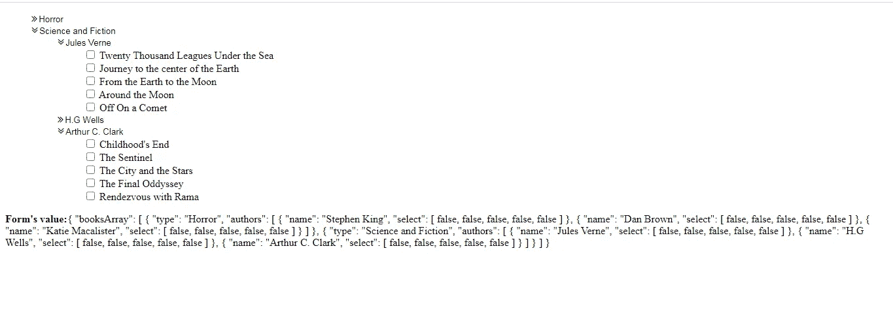
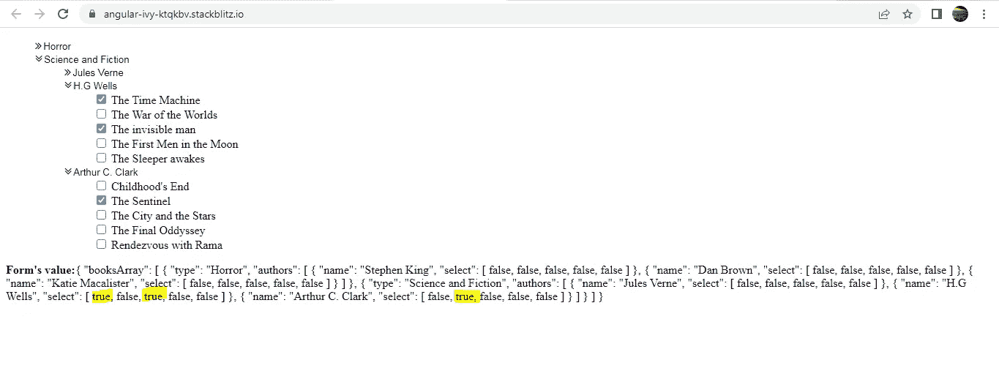

# 如何构建具有角度数组的复选框树

> 原文：<https://javascript.plainenglish.io/building-a-checkbox-tree-with-angular-formarray-eeb972ee41f7?source=collection_archive---------5----------------------->


Photo by [Fotis Fotopoulos](https://unsplash.com/@ffstop?utm_source=medium&utm_medium=referral) on [Unsplash](https://unsplash.com?utm_source=medium&utm_medium=referral)

如果您想了解如何实现单选按钮树，您可以查看以下链接:

[](https://medium.com/@ramya.bala221190/building-a-radio-button-tree-using-angular-formarray-b30c4c49e65c) [## 使用角度公式构建单选按钮树

### 我在许多 web 应用程序中发现了单选按钮树结构。这个故事展示了你可以…

medium.com](https://medium.com/@ramya.bala221190/building-a-radio-button-tree-using-angular-formarray-b30c4c49e65c) 

实现复选框树与单选按钮树非常相似，但略有不同。

以下是我们将使用的数据。这是一系列从**书籍中导出的物品**

每一个对象都描述了书的类型，一些用这种风格写的书的作者，以及他们写的书。

以上数据以复选框树格式填充，如下所示。我们还打印了表单的价值。



Checkbox Tree

**AppComponent 模板:**

1.  从**图书中导出的数组**图书列表**，ts** 对应下面的表格**图书数组**。

```
<ng-container **formArrayName=”booksArray”**>
```

2.books 数组中的每个对象都包含两个属性:类型和作者；类型是一个字符串，作者是一个对象数组。

所以每个对象都是一个 **FormGroup** ，**型字符串**对应**型 FormControl** ，**作者数组**对应**作者数组**。

```
<ng-container formArrayName=”booksArray”>
<ul>
<li *ngFor=”let x of booksFormArray.controls; let i = index” 
[formGroupName]=”i”>
<i #bookType appToggleChevron class=”fa fa-angle-double-right”>
<input type=”text” formControlName=”type” />
</i>
<ng-container formArrayName=”authors”>
```

3.在作者数组中，我们又有了两个属性的对象:名字和书籍；名字是一个字符串，书籍是一个字符串数组。

所以每个对象都是一个 **FormGroup** ， **name property** 对应 **name FormControl** ， **books array** 对应 **select FormArray** 。

```
<li *ngFor=”let y of returnAuthors(x); let j = index” [formGroupName]=”j”>
<i #authorName appToggleChevron class=”fa fa-angle-double-right”>
<input type=”text” formControlName=”name” />
</i>
<ng-container formArrayName=”select”>
```

4.最后，属性书**的每个元素都是一个字符串。所以每个元素都是 **FormControl。****

```
<ul [ngClass]=”[authorName.classList.contains(‘fa-angle-double-right’)? ‘close’: ‘open’]”>
<li *ngFor=”let z of returnBooks(y); let m = index”>
<input type=”checkbox” formControlName=”{{ m }}” [value]=”z.value”/>
{{ data[i].authors[j].books[m] }}
</li>
</ul>
```

现在，让我们来看看 **AppComponent 类**:

我们从**书籍中导出的数据是一个对象数组。我们已经将这个对象数组存储在属性**数据**中。**

因此我们将首先使用 **FormArray** 构建数组，命名为**book array**，如下图所示。数组被初始化为[]。

```
ngOnInit() {
this.checkBoxForm = this.fb.group({
booksArray: this.fb.array([]),
});
this.displayBooks();
}
```

**属性数据**中的每个 book 对象对应一个 FormGroup，基于属性值，该对象中的每个属性对应一个 form control/FormArray/form group。

下面的 **displayBooks()** 将把**属性数据**中的每个 book 对象映射到一个 FormGroup。该映射通过 **createBookFormGroup()完成。**该方法以图书对象为论据。

映射的结果是存储在变量 **transformedBooks** 中的 FormGroups 数组。然后使用 **setControl()将**转换后的图书**设置为形式数组**图书数组**的值。**

```
displayBooks() {
let transformedBooks = this.data.map((book: any) =>
this.createBookFormGroup(book)
);
this.radioForm.setControl(‘booksArray’, this.fb.array(transformedBooks));
}
```

```
createBookFormGroup(book: any) {
return this.fb.group({
type: [book.type],
authors: this.fb.array(this.loadAuthors(book.authors)),
});
}
```

**createBookFormGroup()** 返回一个带有 2 个 FormControls 的新 FormGroup。每个 FormGroup 包含一个名为 **type** 的 FormControl 和一个名为 **authors** 的 FormArray。

FormControl **type** 包含书的类型，而 FormArray **authors** 也是一个对象数组，其中每个对象包含作者的名字和作者写的书。

格式数组 **authors** 由 **loadAuthors()** 填充，它将 book 对象的 **authors 属性**作为参数。

```
loadAuthors(authorsList: any) {
return authorsList.map((author: any) => this.createAuthorFormGroup(author));
}
```

```
createAuthorFormGroup(author: any) {
return this.fb.group({
name: [author.name],
select: this.fb.array(this.loadBooks(author.books)),
});
}
```

我们正在做和以前非常相似的事情。我们将每个 author 对象映射到一个新的 FormGroup。映射是通过**createAuthorFormGroup()**完成的，它将 author 对象作为参数。映射的结果是一个 FormGroups 数组，它被返回给调用者以填充 **authors** FormArray。

上述方法返回的每个 FormGroup 包含 2 个 form control:form control-**name**和一个 FormArray- **select。**

FormControl **name** 对应于 **authors 属性**数组中的 **name 属性**，FormArray **select** 对应于 authors 数组中的数组**属性 books** 。

格式**选择**由 **loadBooks** ()初始化，它以作者对象的 **books 属性**作为参数

```
loadBooks(books: any) {
return books.map((book: any) => new FormControl(false));
}
```

我们只是将 **books 属性**数组中的每本书映射到一个 FormControl，它的**初始值为 false** 。这意味着所有的复选框最初都不会被选中。在 **books 属性**数组中，我们有一个对应于每本书的复选框。

假设您选中了几个复选框，那么表单的值将会更新如下。请观察**选择属性的变化，对于已检查的书籍，该属性的值已从 true 变为 false。**



检查下面的整个工作:

[](https://stackblitz.com/edit/angular-ivy-ktqkbv?file=src/app/app.component.ts) [## 角状常春藤(分叉)- StackBlitz

### 一个基于 rxjs，tslib，zone.js，font-awesome，@angular/core，@angular/forms，@angular/common 的 angular-cli 项目…

stackblitz.com](https://stackblitz.com/edit/angular-ivy-ktqkbv?file=src/app/app.component.ts) 

*更多内容看*[***plain English . io***](http://plainenglish.io/)