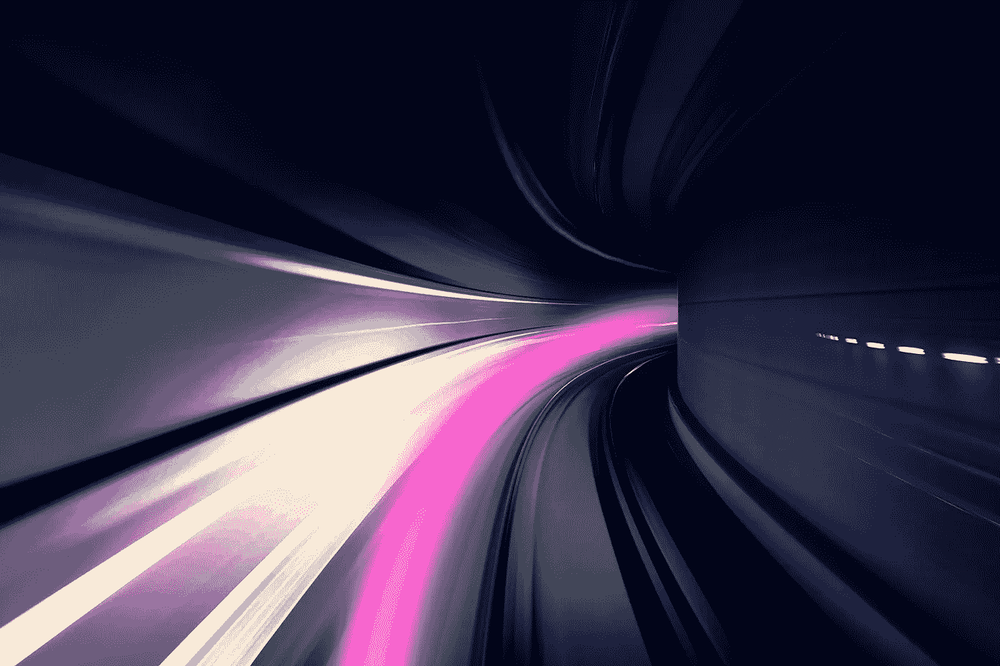
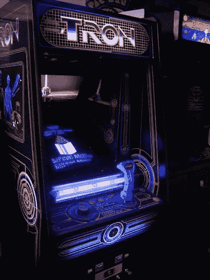

# 用 JavaScript 和 HTML5 画布构建经典街机游戏

> 原文：<https://javascript.plainenglish.io/building-a-classic-arcade-game-with-javascript-and-html5-canvas-18494e4201ba?source=collection_archive---------1----------------------->

## Tron Light 在 240 行 JavaScript 中循环



Photo by [Mathew Schwartz](https://unsplash.com/@cadop?utm_source=unsplash&utm_medium=referral&utm_content=creditCopyText) on [Unsplash](https://unsplash.com/search/photos/speed?utm_source=unsplash&utm_medium=referral&utm_content=creditCopyText), with my own edits

我在学校发现了创光循环游戏。学校 IT 部门禁止了大多数游戏网站，但我们总是能找到黑名单之外的网站:其中一个网站有 Tron Light Cycles 的 Flash 版本。尽管以现代标准来看这很简单，但这个 1982 年的游戏仍然让人上瘾——而且竞争相当激烈！

现在，Flash 即将被弃用，而 HTML 和 JavaScript 却一如既往地强大。因此，在本文中，我们将使用 HTML `canvas`和 JavaScript 重新创建一个轻量级的多人版 Tron Light Cycles 游戏。

# 我们将创造什么

在深入研究代码之前，让我们先看看我们将要创建什么。

Tron 是一个双人游戏，目标是比你的对手活得更久。不能碰墙，不能碰自己的小道，不能碰对手的小道！

玩家 1 使用箭头键，玩家 2 使用 WASD:

This tutorial’s version of Tron Light Cycles, but a bit smaller (so it fits inside the CodePen!)

现在，我们将深入研究与此相关的代码。如果你发现自己在教程中迷失了，看看这里的最终回购:[https://github.com/BretCameron/tron-light-cylces](https://github.com/BretCameron/tron-light-cylces)。



An original Tron arcade game

# 步骤 HTML 和 CSS

## index.html

我们将使用的 HTML 大部分是样板文件。我们的游戏唯一需要的标签是`canvas`——另外我们需要确保链接到我们的`style.css`和`tron.js`文件:

```
<!DOCTYPE html>
<html lang="en"><head>
  <meta charset="UTF-8">
  <meta name="viewport" content="width=device-width, initial-scale=1.0">
  <meta http-equiv="X-UA-Compatible" content="ie=edge">
  **<title>Tron Light Cycles</title>
  <link rel="stylesheet" href="style.css">
  <link href="https://fonts.googleapis.com/css?family=Bungee&display=swap" rel="stylesheet">** </head><body> **<canvas id="tron" width="750" height="750"></canvas>
  <script src="tron.js"></script>**</body></html>
```

## style.css

为了向原作致敬，我们将在黑暗的背景上制作我们版本的创光循环。这是一些初始的样式，所以我们可以看到我们在做什么:

```
body {
  background: #000;
  text-align: *center*;
  font-family: 'Bungee', *cursive*;
}#tron {
  border: 1px *solid* #777;
  outline: 1px *solid* #333;
  outline-offset: 5px;
}
```

从现在开始，我们做的几乎所有事情都将发生在我们的`tron.js`文件中。

# 步骤 2:设置画布和上下文

当使用 HTML5 canvas 元素时，我们需要选择用来绘制元素的上下文。我们的游戏将是 2D，所以打开`tron.js`并输入以下代码:

```
const canvas = document.getElementById('tron');
const context = canvas.getContext('2d');
const unit = 15;
```

上面，我还添加了一个`unit`变量，因为这将在我们代码的多个点上有所帮助。我们的网格将由 15px 的正方形组成，我们也希望我们的光周期一次移动 15px。

# 步骤 3:定义玩家和控制

## 演员

我们将从两名球员开始，但最终，我们可能需要多达四名球员。因此，为了便于创建玩家，我们将使用一个类:

```
class Player {
  constructor(x, y, color) {
    *this.*color = color || '#fff';
    *this*.dead = false;
    *this*.direction = '';
    *this*.key = '';
    *this*.x = x;
    *this*.y = y;
    *this*.startX = x;
    *this*.startY = y; *this*.constructor.counter = (*this*.constructor.counter || 0) + 1;
    *this*._id = *this*.constructor.counter;

    Player.allInstances.push(*this*);
  };
};Player.allInstances = [];
```

我们的`Player`类有很多属性:

*   `color`告诉我们每个玩家的颜色，
*   `dead`是一个布尔值，告诉我们玩家是否还活着，
*   `direction`告诉我们玩家实际前进的方向，
*   `key`告诉我们玩家*尝试*进入的最后一个方向，
*   `x`和`y`在任一时刻给我们玩家的坐标，
*   `startX`和`startY`在游戏开始时记录玩家的坐标，这样我们可以很容易地重置游戏
*   `_id`根据玩家开始游戏的时间，给他们一个号码。

在类下面，我们还创建了一个包含所有播放器实例的数组。每次调用`constructor`时，它都会将新玩家添加到我们的数组中。这将有助于我们确定有多少玩家，并对每个玩家实例应用动作。

现在我们准备创建我们的前两个玩家:

```
let p1 = new Player(unit * 6, unit * 6, '#75A4FF');
let p2 = new Player(unit * 43, unit * 43, '#FF5050');
```

## 设定玩家的方向

我们需要一个通用函数来控制玩家的移动。它们可以在 2D 平面上向任何方向移动，但是它们不能立即返回:例如，如果你要向左走，你不能不先向上或向下就立即向右走。

我们将把这些规则放在一个通用函数中。这意味着我们可以轻松地选择一个玩家，并为`up`、`right`、`down`和`left`分配键码:

```
function setKey(key, player, up, right, down, left) {
  switch (key) {
    case up:
      if (player.direction !== 'DOWN') {
        player.key = 'UP';
      } 
      break;
    case right:
      if (player.direction !== 'LEFT') {
        player.key = 'RIGHT';
      } 
      break;
    case down:
      if (player.direction !== 'UP') {
        player.key = 'DOWN';
      } 
      break;
    case left:
      if (player.direction !== 'RIGHT') {
        player.key = 'LEFT';
      } 
      break;
    default:
      break;
  };
};
```

`setKey`功能被设计为可重复使用。该功能将允许我们使用容易理解的字符串来引用动作，而不是被键码所迷惑:`'UP'`、`'RIGHT'`、`'DOWN'`和`'LEFT'`。

但是为了让我们的`setKey`函数生效，我们需要指定哪些键将影响哪些播放器，并创建一个事件监听器来监听那些被按下的键:

```
function handleKeyPress(event) {
  let key = event.keyCode; if (key === 37 || key === 38 || key === 39 || key === 40) {
    event.preventDefault();
  }; setKey(key, p1, 38, 39, 40, 37); *// arrow keys* setKey(key, p2, 87, 68, 83, 65); *// WASD* };document.addEventListener('keydown', handleKeyPress);
```

在上面的代码中，我们分配了箭头键来控制玩家 1，分配了`WASD`来控制玩家 2。我们还防止了箭头键的默认行为，停止不必要的滚动。

# 第四步:建立董事会

## 确定可播放的单元格

在游戏真正开始之前，我们能做的计算越多，性能就越好。一种策略是在开始时创建一个包含所有可播放单元的`Set`。

当每个玩家遍历棋盘时，我们将从列表中删除一个单元格。然后，我们不用依靠复杂的`if`或`switch`语句来确定一个玩家是否已经死亡，我们可以简单地看到他们是否在一个可玩的细胞上！

```
function getPlayableCells(canvas, unit) {
  let playableCells = new Set();
  for (let i = 0; i < canvas.width / unit; i++) {
    for (let j = 0; j < canvas.height / unit; j++) {
      playableCells.add(`${i * unit}x${j * unit}y`);
    };
  };
  return playableCells;
};let playableCells = getPlayableCells(canvas, unit);
```

## 制作背景

我们终于可以把视觉元素放到屏幕上了！使用这段代码创建了一个微妙的网格模式:

```
function drawBackground() {
  context.strokeStyle = '#001900';
  for (let i = 0; i <= canvas.width / unit + 2; i += 2) {
    for (let j = 0; j <= canvas.height / unit + 2; j += 2) {
      context.strokeRect(0, 0, unit * i, unit * j);
    };
  }; context.strokeStyle = '#000000';
  context.lineWidth = 2;
  for (let i = 1; i <= canvas.width / unit; i += 2) {
    for (let j = 1; j <= canvas.height / unit; j += 2) {
      context.strokeRect(0, 0, unit * i, unit * j);
    };
  };
  context.lineWidth = 1;
};drawBackground();
```

这也是确定我们球员首发位置的一个好点:

```
function drawStartingPositions(players) {
  players.forEach(p => {
    context.fillStyle = p.color;
    context.fillRect(p.x, p.y, unit, unit);
    context.strokeStyle = 'black';
    context.strokeRect(p.x, p.y, unit, unit);
  });
};drawStartingPositions(Player.allInstances);
```

您可能已经注意到，我们将许多流程包装在它们自己的函数中。除了是好的实践，这允许我们稍后在我们的`resetGame`函数中重用代码。

# 第五步:游戏中的逻辑

我们现在准备好开始游戏的动态部分了。首先，我们将向全局名称空间添加三个新变量:

```
let outcome, winnerColor, playerCount = Player.allInstances.length;
```

接下来，我们将创建一个`draw`函数，它以 100 毫秒的固定间隔重复触发:

```
function draw() {
  if (Player.allInstances.filter(p => !p.key).length === 0) { *// in-game logic...* };
};const game = setInterval(draw, 100);
```

在这里，`if`声明要求游戏只有在每个玩家都选择了开始键后才开始。

在本节的剩余部分，我们将要讨论的所有代码都在`draw`函数内部(以及`if`语句内部)。我们准备开始移动我们的球员！

## 添加运动

在`draw`函数中，添加以下代码:

```
Player.allInstances.forEach(p => { if (p.key) { p.direction = p.key; context.fillStyle = p.color;
    context.fillRect(p.x, p.y, unit, unit);
    context.strokeStyle = 'black';
    context.strokeRect(p.x, p.y, unit, unit); if (!playableCells.has(`${p.x}x${p.y}y`) && p.dead === false) {
      p.dead = true;
      p.direction = '';
      playerCount -= 1;
    } playableCells.delete(`${p.x}x${p.y}y`); if (!p.dead) {
      if (p.direction == "LEFT") p.x -= unit;
      if (p.direction == "UP") p.y -= unit;
      if (p.direction == "RIGHT") p.x += unit;
      if (p.direction == "DOWN") p.y += unit;
    }; };});
```

尝试按箭头键或`WASD`。我们的光周期现在移动了！

如果我们分解上面的代码，我们会注意到每次`draw`函数运行时:

*   我们为每个玩家画一个新的正方形，在他们选择的方向上 1 个单位。
*   如果一个玩家移动到一个不可玩的格子上，我们把它标记为死亡。
*   我们从集合`playableCells`中移除刚刚被遍历的单元。

这个功能也只有在每个玩家都选择了一个键的情况下才运行(防止玩家因为保持静止而杀死自己)。

我们就要完成了，但是游戏仍然没有结束的可能！

## 结束游戏

我们现在将检查游戏是否已经结束。在`draw`函数的顶部，添加以下代码:

```
if (playerCount === 1) {
  const alivePlayers = Player.allInstances.filter(p => p.dead === false);
  outcome = `Player ${alivePlayers[0]._id} wins!`;
} else if (playerCount === 0) {
  outcome = 'Draw!';
}if (outcome) {
  console.log(outcome);
  clearInterval(game);
}
```

一旦调用`draw`函数，它将检查玩家人数是否已降至`1`或`0`。在`1`，它宣布最后一名活着的玩家为获胜者。如果玩家数量下降到`0`，则意味着剩余玩家在同一帧中死亡。

就是这样！您的结果现在应该被记录到控制台，但是当然，您可以将它发送到您喜欢的任何地方。你现在有一个功能游戏！

# 第 6 步:结果和重置

最后，不要简单地登录到控制台，让我们创建一个可视化的方法来告诉我们的玩家谁赢了，以及一个让他们重置游戏的方法。

我们可以用 HTML 创建我们的结果页面，但是我之前说过我们会坚持使用 JavaScript，所以我已经走过了冗长的 JavaScript 路线…

```
function createResultsScreen(color) {
  const resultNode = document.createElement('div');
  resultNode.id = 'result';
  resultNode.style.color = color || '#fff';
  resultNode.style.position = 'fixed';
  resultNode.style.top = 0;
  resultNode.style.display = 'grid';
  resultNode.style.gridTemplateColumns = '1fr';
  resultNode.style.width = '100%';
  resultNode.style.height = '100vh';
  resultNode.style.justifyContent = 'center';
  resultNode.style.alignItems = 'center';
  resultNode.style.background = '#00000088' const resultText = document.createElement('h1');
  resultText.innerText = outcome;
  resultText.style.fontFamily = 'Bungee, cursive';
  resultText.style.textTransform = 'uppercase'; const replayButton = document.createElement('button');
  replayButton.innerText = 'Replay (Enter)';
  replayButton.style.fontFamily = 'Bungee, cursive';
  replayButton.style.textTransform = 'uppercase';
  replayButton.style.padding = '10px 30px';
  replayButton.style.fontSize = '1.2rem';
  replayButton.style.margin = '0 auto';
  replayButton.style.cursor = 'pointer';
  replayButton.onclick = resetGame; resultNode.appendChild(resultText);
  resultNode.appendChild(replayButton);
  document.querySelector('body').appendChild(resultNode); document.addEventListener('keydown', (e) => {
    let key = event.keyCode;
    if (key == 13) // 'Enter'
      resetGame();
  });
};
```

为了让 reset 按钮更加用户友好，我添加了一个事件监听器，这样就可以通过按下`Enter`键来触发它。

我们现在需要一个`resetGame`函数。因为我们将代码分解成可重用的函数，所以我们节省了大量的工作:

```
function resetGame() { *// Remove the results node* const result = document.getElementById('result');
  if (result) result.remove(); *// Remove background then re-draw it* context.clearRect(0, 0, canvas.width, canvas.height);
  drawBackground();

  *// Reset playableCells* playableCells = getPlayableCells(canvas, unit); *// Reset players* Player.allInstances.forEach(p => {
    p.x = p.startX;
    p.y = p.startY;
    p.dead = false;
    p.direction = '';
    p.key = '';
  });
  playerCount = Player.allInstances.length;
  drawStartingPositions(Player.allInstances); *// Reset outcome* outcome = '';
  winnerColor = ''; *// Ensure draw() has stopped, then re-trigger it* clearInterval(game);
  game = setInterval(draw, 100);};
```

最后，记得呼叫`createResultsScreen`，回到我们呼叫`console.log(outcome)`的地方。

```
if (outcome) {
  createResultsScreen(winnerColor);
  clearInterval(game);
};
```

就这样结束了！你现在有一个功能的双人游戏！

要查看这段代码的工作版本，请查看我的 GitHub 库:[https://github.com/BretCameron/tron-light-cylces](https://github.com/BretCameron/tron-light-cylces)。

# 接下来呢？

有很多方法可以扩展我们已经创建的代码。

例如，对于四人游戏，您可以创建以下玩家:

```
const p1 = new Player(unit * 6, unit * 6, 'blue');
const p2 = new Player(unit * 43, unit * 43, 'red');
const p3 = new Player(unit * 43, unit * 6, 'green');
const p4 = new Player(unit * 6, unit * 43, 'orange');
```

你可以编辑我们的`handleKeyPress`功能，为我们的四个玩家提供以下控制:

```
function handleKeyPress(event) {
  let key = event.keyCode;
  setKey(key, p1, 38, 39, 40, 37); *// arrow keys* setKey(key, p2, 87, 68, 83, 65); *// WASD* setKey(key, p3, 73, 76, 75, 74); *// IJKL* setKey(key, p4, 104, 102, 101, 100); *// numpad 8456* };
```

另一种选择是通过调用`new Image()`和`new Audio()`来添加艺术和声音。

我很想补充一点——但还没有掌握——电脑控制的播放器。到目前为止，我的尝试有一个习惯，那就是很快就会遇到问题。

我希望你喜欢这篇文章。特别是，如果你是 HTML5 画布或浏览器内游戏编码的新手，我希望这有助于向你展示什么是可能的。如果有任何问题，一定要留下评论！