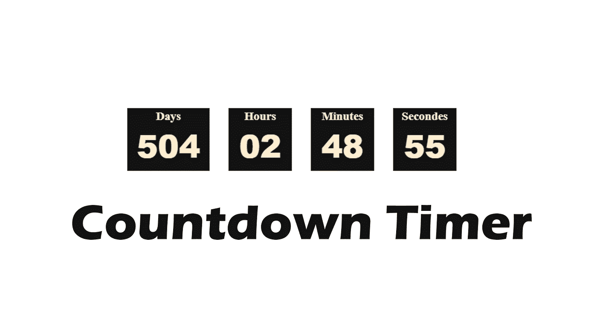

# 用普通 JavaScript 构建倒计时器

> 原文：<https://javascript.plainenglish.io/building-a-countdown-timer-with-vanilla-javascript-d78d2ca7f180?source=collection_archive---------6----------------------->

## 让我们用普通的 JavaScript 构建一个倒计时器

Image Created with❤️️ By Mehdi Aoussiad.

# 介绍

倒计时器是你可以用 JavaScript 构建的美丽的东西之一。这可能是有用的，例如，当你在你的网站上组织一个活动，你想告诉球迷关于活动开始的剩余时间。上个月，我做了一个简单的倒计时，这是我在代码挑战 100 天中尝试过的项目之一。所以在尝试这个项目之前，你需要对 **HTML** 、 **CSS** 、 **JavaScript** 有基本的了解。让我们看看这个简单的项目是什么样子的。

# 项目演示

正如你在上面的例子中看到的，这个项目的想法非常简单。您将拥有一个包含日、小时、分钟和秒的递减计数器。当计数器结束时，页面上会显示一个警告，告诉用户事件已经结束。

# 让我们从 HTML 开始

首先，我们将创建一个名为 container 的 div，其中包含四个 div(天、小时、分钟等)。之后，我们需要另一个 div 来显示计数器计时结束时用户看到的警报。现在就让我们来看看吧。

The HTML Structure.

# 让我们来设计我们的元素

所以现在，我们将使用 CSS 样式化我们的元素。您可以阅读下面的代码来查看我们的样式表。

Styling Our Elements with CSS.

# JavaScript 部分

现在，这是令人兴奋的部分，将使我们的计数器功能。在我们的 JavaScript 逻辑中，我们创建了一个名为“最终日期”的变量，其中我们以毫秒为单位输入了事件的结束日期。然后，我们还创建了另一个变量“diff ”,用于表示最终日期和当前日期之间的差异。所有这些都将由一个名为“定时器”的函数来执行，这个函数将包含我们所有的逻辑。您可以查看下面的代码了解更多细节。

Our JavaScript Code.

现在恭喜你，你已经用普通的 JavaScript 轻松地创建了一个简单的倒计时器。

# 结论

成为一名优秀的开发人员的最好方法是实践你所学到的东西。熟能生巧。构建一个 JavaScript 项目将帮助你练习和提高你的编码技能。所以，感谢你的阅读，希望你觉得有用。