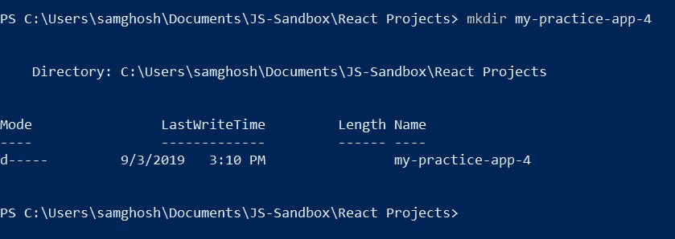
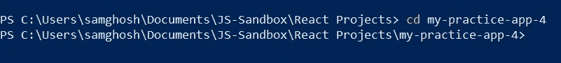
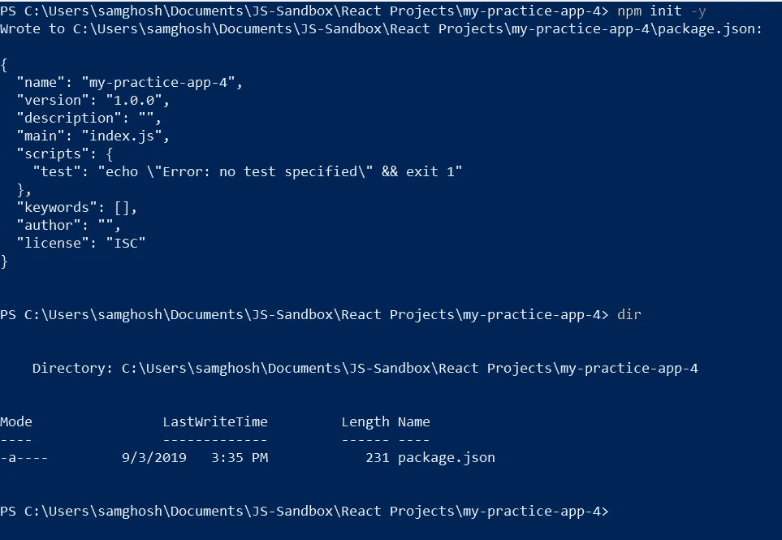
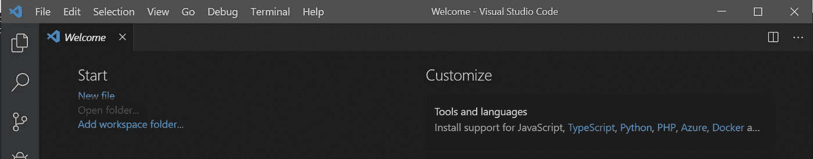
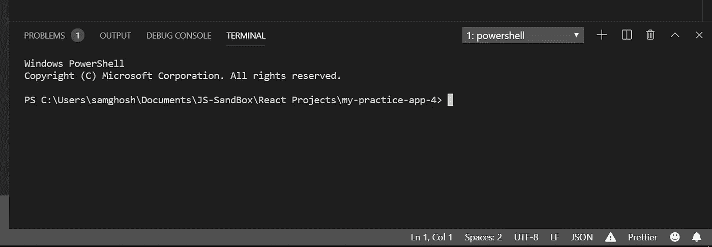
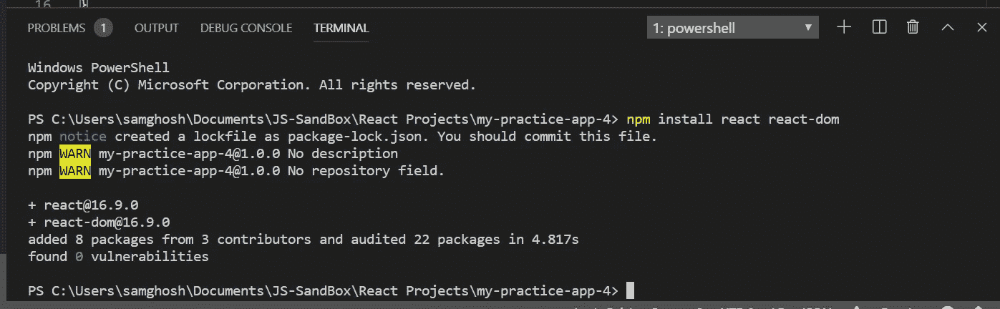
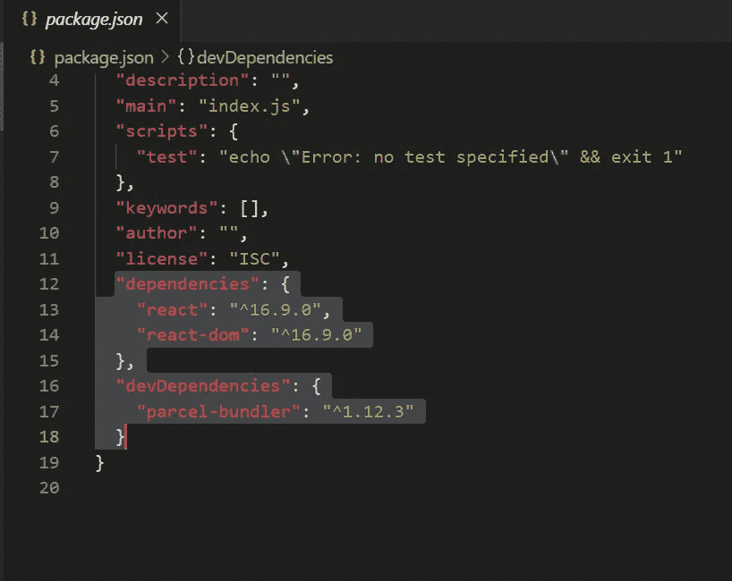
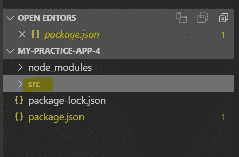
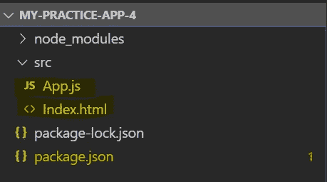
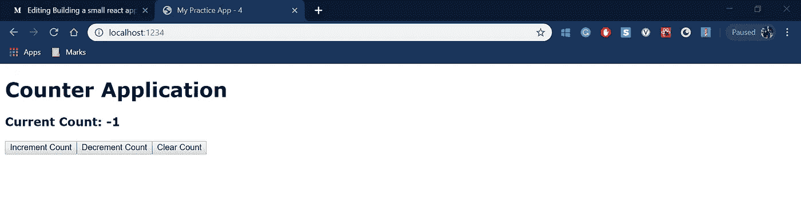

# 不使用 create-react-app 在 React 中构建计数器应用程序

> 原文：<https://javascript.plainenglish.io/building-a-counter-react-js-application-without-using-create-react-app-cc03c533f412?source=collection_archive---------2----------------------->

# 今天，我们将构建一个没有 create-react-app 的小型计数器 react 应用程序。

我们将使用 package Bundler 在您的计算机上引导 React 应用程序。这是一个伟大和非常强大的工具。

使用终端(Powershell)和 VS 代码的步骤列表-

1.  开放式电源外壳
2.  转到您想要创建 React 项目的目录
3.  使用 mkdir 命令创建目录，如下所示

> **mkdir 项目名称**

例如—mkdir my-practice-app-4(my-practice-app-4 是我的项目的名称)



4.使用以下命令进入您刚刚使用终端创建的文件夹-

> **cd 项目名称**

例如—CD my-practice-app-4(my-practice-app-4 是我的项目的名称)



5.要启动一个 NPM 项目，我们将初始化项目目录。这将使用以下命令在同一目录中创建一个 package.json 文件-

注意:如果你没有安装 Node.js，也请安装它。

> **npm 初始化**

当你运行`npm init`时，它会问你一堆问题。如果你不知道答案或者不在乎，就按回车。您可以随时在以后修改 package.json。这将允许我们开始安装和保存软件包。

如果你不想问太多的问题，你可以输入下面的命令来直接创建 package.json

> **npm init -y**



6.在 Visual Studio 代码中打开项目。你也可以使用任何其他编辑器，但是我喜欢 VS 代码，所以我会使用它。您可以使用以下命令从终端打开 VS 代码-

> **代码**

在 VS 代码打开后，点击打开文件夹选项并选择项目文件夹-



7.在 VS 代码中打开项目目录后，通过点击-在 VS 代码中打开终端

> **"ctrl" + "~"**



8.现在让我们专注于构建我们的第一个 React 应用程序。我们将安装 React、React-Dom 和 package Bundler。包[对于 JavaScript 项目来说是一个相对较新的捆绑器。这个包是一个神奇的零配置工具。它适用于我们想做的任何开箱即用的东西。因为这是对 React 的介绍，而不是对构建过程的介绍，所以这允许我们更多地关注 React。我们去看看它能为我们做什么。](https://parceljs.org/)

> **运行**运行`***npm install react react-dom***`

这将从 npm 下载 React@16.9.0(截至本文撰写时)和 ReactDOM@16.9.0(截至本文撰写时),并将其放在 node_modules 目录中。



> **通过做**安装包裹`***npm install -D parcel-bundler***`

这个包将接受一个入口点，遍历它的所有依赖项，并输出一个包含我们所有代码的完整文件。这意味着我们可以拥有包含许多文件和许多依赖项的大型应用程序。这将是一个不可收拾的烂摊子。

在运行以下命令后，您将看到依赖项和 dev-dependencies 在 package.json 文件中



9.我们将使用 VS Code -> New Folder 选项在根文件夹中创建一个源文件夹/目录



10.我们将在 src 文件夹/目录中创建两个文件(Index.html 和 App.js)



11.让我们为 Index.html 编写代码，我们必须确保 index.html 文件包含一个到 App.js react 组件的链接。**我们将使用脚本标签(< script src=)来完成这个任务。/app . js "></script>)**。这是代码的样子-

```
<!DOCTYPE html><html lang="en"><head><meta charset="UTF-8"><meta name="viewport" content="width=device-width, initial-scale=1.0"><meta http-equiv="X-UA-Compatible" content="ie=edge"><title>My Practice App - 4</title></head><body><div id="root"></div><script src="./App.js"></script></body></html>
```

12.让我们写 App.js 的代码，我们必须确保 app.js 文件链接回 Index.html 文件。我们将使用 React Dom 的渲染函数来实现这一点

```
import React, { useState } from 'react';import { render } from 'react-dom';const App = () => {const [count, setCount] = useState(0);return(<React.Fragment><h1>Counter Application</h1><h3>Current Count: {count}</h3><button onClick={() => setCount(count + 1)}>Increment Count</button><button onClick={() => setCount(count - 1)}>Decrement Count</button><button onClick={() => setCount(0)}>Clear Count</button></React.Fragment>);}render(<App/>, document.getElementById('root'));
```

注意:useState 是一个 react 钩子，通过它我们可以在函数组件中使用状态。

13.现在在你的`package.json`里面放上:

```
"scripts" {
  "dev": "parcel src/index.html"
}
```

> **运行** `***npm run dev***`

现在打开 [http://localhost:1234](http://localhost:1234) 。你应该看到你的网站出现了。这里的区别在于它是如何穿过包裹的。

您的 React 应用程序已经准备好并运行在端口 1234 上。看起来像这样-

