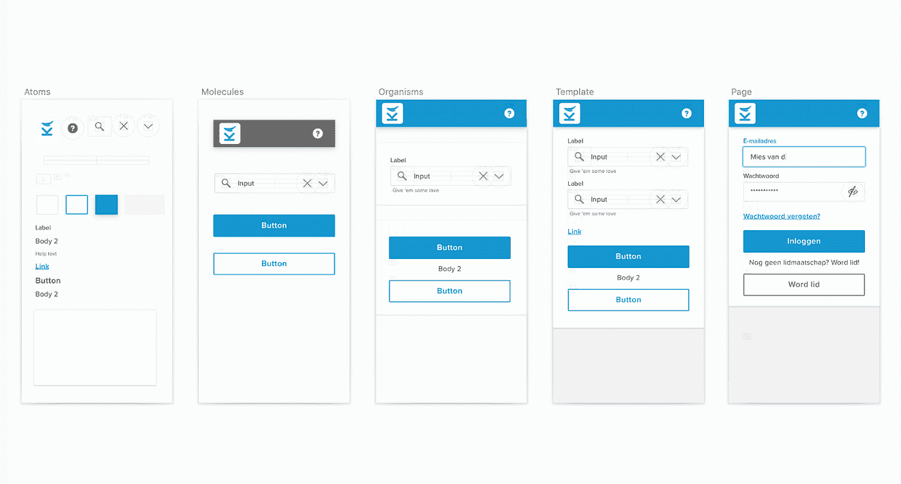
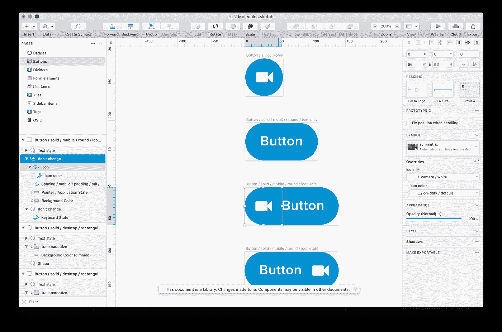
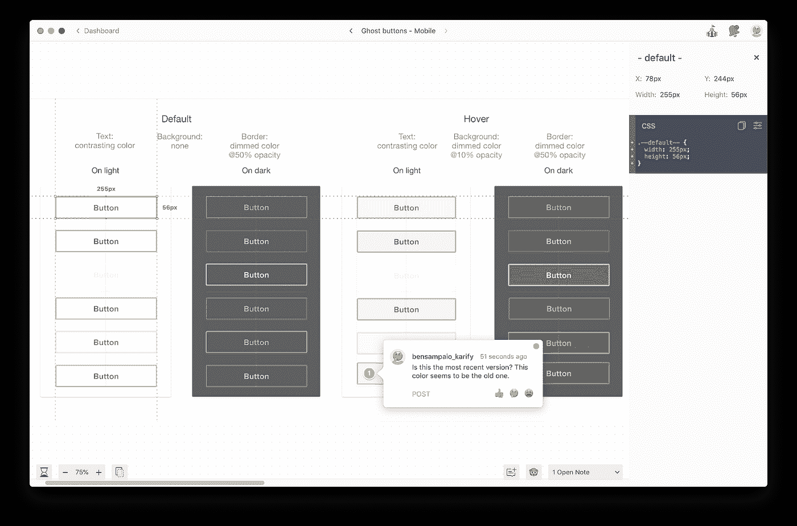
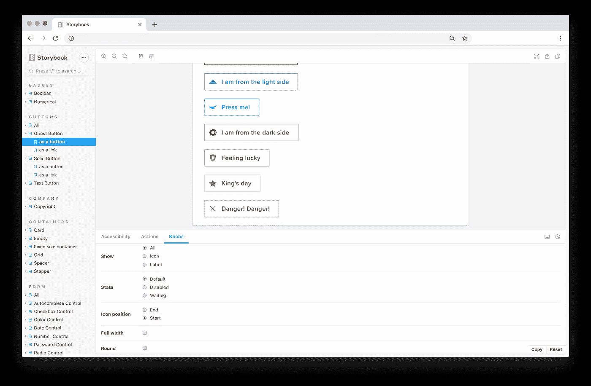

# 构建设计系统和组件库

> 原文：<https://javascript.plainenglish.io/building-a-design-system-and-a-component-library-3f4e01a7b0b4?source=collection_archive---------3----------------------->

这篇文章基于系列文章:*用 React* 更新 jQuery 前端。如果你想更好地了解这篇文章的动机，我们建议你首先阅读我们的[初始文章](https://medium.com/@bensampaio/8598b252ceb3)。

当我们开始在 React 中重建前端时，考虑可重用的 UI 组件还不是我们设计和开发工作流的一部分。我们的 jQuery 前端主要是由 Twitter bootstrap 组件构建的，这些组件适用于特定的用例或扩展了额外的功能。通过从旧设计中复制一些设计元素，并在那里对它们进行改进或调整，为每个新功能创建了新的设计。随着团队和应用程序的不断发展，我们的组件向多个方向发展。这导致了文本大小、颜色、按钮和链接的多种变化，从而导致我们的应用程序的用户体验脱节。

在 React 中重建我们的前端是一个机会，让我们重新思考我们的设计和开发工作流程，并专注于为用户提供更具凝聚力的体验。这一点尤其重要，因为我们知道我们需要让我们的应用程序更容易访问和响应。这导致了组件库的创建，激发了对设计系统的需求。这个过程开始时困难而缓慢，但随着时间的推移变得令人兴奋和有用。

# 什么是设计系统？

设计系统是关于如何创建、记录和使用 UI 组件的综合指南。它定义了适用于所有设计的规则、约束、原则和最佳实践的集合。设计系统的核心元素是 UI 组件的集合，比如按钮、链接和表格。对于每个设计的组件，您可以有使用指南，记录设计期间所做的选择、定义组件的规则、行为和约束、用例以及任何其他易于通过文字交流的细节。

# 什么是组件库？

组件库是用编程语言实现的可重用 UI 组件的集合。当被设计系统支持时，它也可以被看作是设计和它们的指导方针的交互实现。

# 你为什么要在乎？

正如 [Airbnb 的 Karri Saarinen](https://medium.com/airbnb-design/224748775e4e) 所说:“一个统一的设计系统对于更好更快地建设至关重要；更好是因为内聚的体验更容易被我们的用户理解，更快是因为它给了我们一个共同的工作语言”。

在 Karify，它帮助我们创建并遵循自己的约束。它有助于我们在多种平台和设备上创建一致的用户体验。最后，它帮助我们的团队更聪明、更快、更紧密地合作。这些是我们更详细发现的一些优势:

*   **沟通**:设计师理解开发者，反之亦然。以前双方都难以理解的概念现在清楚多了。谈论组件和使用我们在通信中定义的规则使得设计和开发过程变得更加容易。
*   **一致性**:应用程序页面的外观和感觉变得相同。我们确切地知道我们应该为标题或普通文本使用什么样的文本大小，我们应该为主要动作使用什么类型的按钮，使用什么颜色来传达特定动作或信息的类型，以及每种类型的元素之间应该有多大的间距。如果我们决定改变其中的任何一个，那么它们很容易在整个设计系统、组件库和应用中被改变。
*   **协作**:设计师和开发人员更加紧密地合作，能够更容易地分享想法和见解。因为更容易沟通，所以谈论功能约束并在早期阶段将它们纳入设计变得更容易。使用像 Zeplin 这样的工具使这个过程变得特别快，因为它允许你在设计的任何细节的背景下开始讨论。
*   文档**:组件指南提供了关于组件应该如何看、如何使用、如何表现以及为什么这样的清晰信息。如果将来某个组件设计或实现提出了问题，那么找到其背后的原因并防止重新思考之前已经考虑过的东西(除非它不再有意义)就变得更容易了。**
*   ****模块化**:所有的组件都代表了小块的设计和代码，以及它们有限的规则和关注点。这加强了设计和代码中关注点的分离。**
*   ****可维护性**:保持设计和代码最新变得更加容易，因为当一个组件被触及时，所有使用它的其他组件都会被更新。这也可能导致对旧组件的额外工作，但是让您可以看到更改的影响。**

**与任何其他方法一样，我们也发现了使用设计系统的一些缺点:**

*   ****耗时**:刚开始的时候尤其如此。定义所有的规则、约束和基本组件，如文本、颜色和间距，需要进行大量的讨论。随着时间的推移，它变得更快。这取决于在设计新特征之前需要创建多少个新组件。但是一旦有了一些，在现有的或新的设计中重用它们就会变得非常快。这同样适用于应用程序的开发。**
*   **创造力减少:由于所有的规则和限制，创造力的空间减少了。然而，这也可以被视为一种优势，因为这通常会导致一致性。**
*   ****陡峭的学习曲线**:这主要适用于新加入团队的人，因为他们需要熟悉很多规则，然后才能持续应用它们。另一方面，这也使他们更容易，因为设计系统传达了规则。**
*   ****复杂性**:如果组件对其他组件有太多的依赖，维护和重用它们也会变得复杂。**

**但是，不要让这些缺点吓到你。学会最小化它们是这个过程的一部分。随着时间的推移，优点变得比缺点更明显。**

# **怎么才能入门？**

**首先，我们建议您熟悉[原子设计](https://bradfrost.com/blog/post/atomic-web-design/)的概念，以及[设计系统最佳实践](https://airbnb.design/systems-thinking-unlocked/)和设计系统示例，如 Airbnb 中的[。此外，您还应该选择一个工具来构建您的设计系统。我们选择了](https://airbnb.design/building-a-visual-language)[草图](https://www.sketch.com/)，但也有其他选择，如[图玛](https://www.figma.com/)。**

**从那里你可以开始定义你的颜色，排版风格和间距大小，这将是你的第一个原子。这将允许您开始定义您的第一个分子，如按钮、链接、表面等。在第一次迭代中，您可能会错过一些用例，这将导致更多的迭代，直到一切都感觉正确并得到未来的证明。**

**如果你已经有了一个应用程序，但不能马上改变它，那么我们建议你根据你现有的东西来设计你的系统。对于每个组成部分，分析你有什么，挑选你喜欢的部分，并努力改善你不喜欢的部分。即使这也是太多的工作，从遗留组件中分离出未来的组件。这样，您可以阻止自己在新组件中使用遗留组件。慢慢地，这会让你达到你的目标。**

# **我们是怎么做到的？**

**我们的团队由两名设计师和一名前端开发人员组成。后来，又有一名开发人员加入了这个团队。这种团队规模过去和现在都足以让我们有足够的时间去关注细节，把事情做好。然而，我们认为团队的规模取决于项目的规模和公司的发展速度。**

**从头开始重建我们前端的机会也有好处，我们可以从过去的错误中学习。因此，我们根据用户的反馈来设计新组件，用户经常提到可访问性和响应性问题。为了解决这些问题，我们得出结论，我们需要首先重新设计我们的导航系统，然后重新设计应用程序中的每个页面。**

**我们从整体上设计我们的新导航系统开始，随着它变得更加坚固，我们开始将其分解成更小的组件。这导致了在原子、分子和生物体之间意想的原子设计划分。理想情况下，你应该从原子开始，但这很困难，因为你首先不知道我们想往哪个方向发展。如今，由于我们已经定义了几个原子和分子，开始将它们组合成新的有机体或页面变得更加容易。**

**在创建组件时，我们将它们定义为`symbols`，并在草图库文件中将它们拆分为`Atoms`、`Molecules`和`Organisms`。Sketch 便于我们的`Atom`组件作为符号在其他`Molecule`或`Organism`组件中重复使用。在草图中，它们被称为`nested symbols`。我们确保以层叠顺序使用我们的组件，因此更新只在一个方向上传播。**

****

***我们的草图* `*Molecules*` *库:按钮组件内部的图标组件是从* `*Atoms*` *草图库中重用的。***

**为了记录我们的选择，我们为每个组件(不管是原子、分子还是有机体)创建了指导方针，这些指导方针受到了材料 UI 组件指导方针的启发。除了组件指南，我们还有一些适用于所有组件的通用指南，因为有些指南是超越性的，比如可访问性和语调。这些指导方针是我们唯一的真理来源。他们确保不会留下任何想象的空间。为了给人一种印象，它们是一个简单的文档，包含以下几个部分:**

*   **使用**
*   **解剖**
*   **在不同视口中的放置**
*   **行为**
*   **易接近**

**我们在`Template`或`Page`文件中使用我们的组件，这些文件是我们为我们工作的每个特性/项目创建的。当一个组件或页面准备好了，我们通过 [Zeplin](https://zeplin.io/) 与开发者和其他利益相关者分享它的设计。这个工具允许他们从设计中提取信息，如颜色、尺寸和资产。它还允许每个组件进行通信，这可以极大地改善协作，因为讨论通常需要开会讨论的细节变得非常容易。**

****

***合作开发 Zeplin 中的按钮组件***

**从这一点开始，开发人员可以使用 Zeplin 中的信息开始构建相应的 React 组件。理想情况下，每个设计组件应该有一个 React 组件，以便设计和代码之间的关系尽可能紧密。为了获得灵感，我们经常看看其他组件库是如何做的，例如 [Material-UI](https://material-ui.com/) 。**

**为了简化这个过程，我们使用了[故事书](https://storybook.js.org/)，这有助于组件的独立开发。它还提供了一种可视化的方式，并与我们库中的所有组件进行交互，然后设计人员可以使用它来验证最终的实现。**

****

***故事书里一样的按钮:准备好复习***

**在我们的设计系统和组件库中，我们按照按钮、颜色、表单元素、布局、链接、排版等类别对组件进行分组。这有助于对不同的原子、分子和有机体进行分组，也有助于设计者和开发者之间的交流。**

**本质上，这些工具帮助我们在工作过程中开发反馈循环，这改善了沟通和协作:设计师可以通过查看 Storybook 轻松地对组件库提供反馈，开发人员可以轻松地对设计进行评论或从 Zeplin 下载资产。**

# **我们还能做得更好吗？**

**总的来说，我们觉得我们在这个过程中做得很好，但我们知道有些事情我们可以做得不同。以下是我们一路走来遇到的一些棘手问题:**

*   ****可访问性指南**:我们完全低估了可访问性。WCAG 有很多指导方针，你不可能在这么小的团队里全部执行。我们必须选择哪些对我们的用户来说是最重要的。然而，我们在这个过程的后期做出了这个选择，因为它对我们的原子组件产生了影响，主要是字体和颜色，这迫使我们重新思考几个分子和有机体。**
*   **复杂组件:我们太频繁地试图创建具有太多职责或者太多依赖于其他组件的组件。最好将它们分解成更小的组件，而不是试图使它们过于可定制。这可能需要一些重复的设计和代码，但它更容易理解。**
*   ****缺乏规划和无限的范围**:有一段时间，项目的范围只是不断扩大。有些事情非常重要，但有些则不那么重要。很难划清界限，因为这个项目没有结束日期。最终，我们开始更频繁地讨论这些问题，以便对真正重要的事情进行优先排序。**

**最后，在完成导航系统的重新设计后，我们设法了解并改进了这些问题。我们仍不时会遇到一些复杂的组件，但我认为在为时已晚之前犯下错误并识别它是过程的一部分。**

# **结论**

**在我们看来，构建设计系统和组件库是值得努力的。它带来了我们从一开始就在寻找的设计一致性。这并不意味着我们会向所有人推荐它。在您开始之前，我们真诚地建议您确保这是适合您项目的正确解决方案。我们会说，只有当你知道或预期产品需要大量不同的页面，这些页面具有重用相同组件的复杂交互时，你才需要这样做。当你还是一家初创公司或小公司，并希望在未来几年扩大规模时，这一点尤其重要。然而，如果你期望你的产品是一个简单的网站，不会随着时间的推移而改变太多，那么这可能是矫枉过正。**

**我希望这篇文章能帮助你做出更好的设计决策。如果你对这里的内容有任何问题、反馈或建议，我很乐意在下面的评论区听到你的意见。**

## **进一步阅读**

** [## 如何改进设计者和开发者的合作

### 随着远程/在家工作作为新的现状的出现，人员和预算紧缩，以及永恒的…

简明英语. io](https://plainenglish.io/blog/how-to-improve-designer-developer-collaboration-with-lifecycle) 

*更内容于* [***普通英语***](https://plainenglish.io/) *。报名参加我们的* [***免费周报***](http://newsletter.plainenglish.io/) *。* [***推特***](https://twitter.com/inPlainEngHQ) *和*[***LinkedIn***](https://www.linkedin.com/company/inplainenglish/)*追随我们。加入我们的* [***社群不和***](https://discord.gg/GtDtUAvyhW) *。***