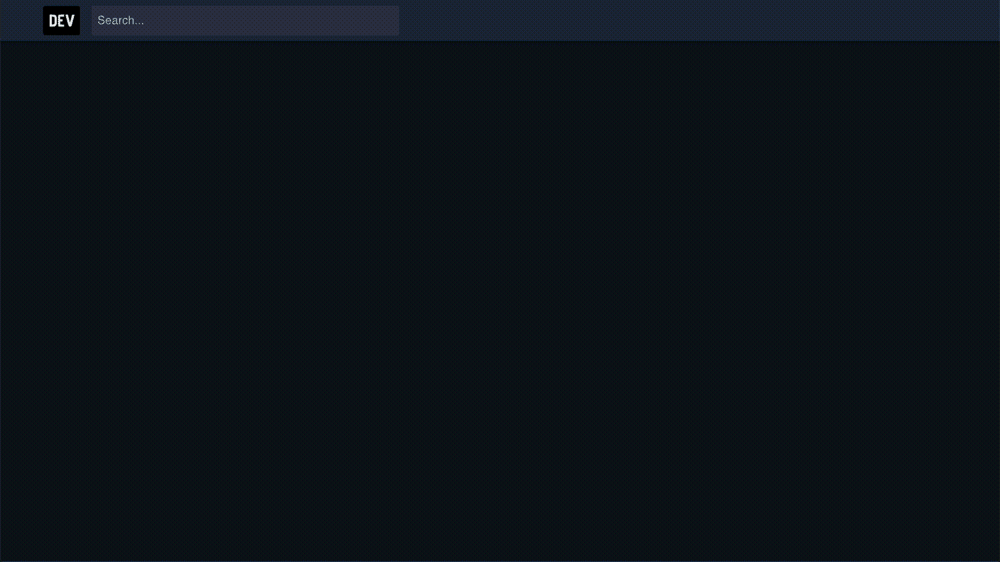
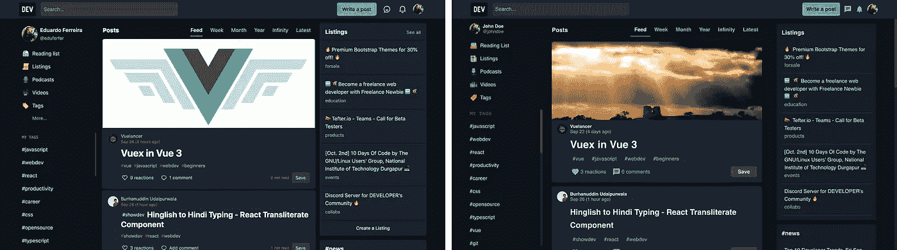
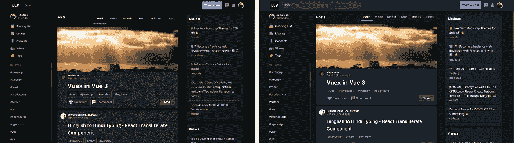
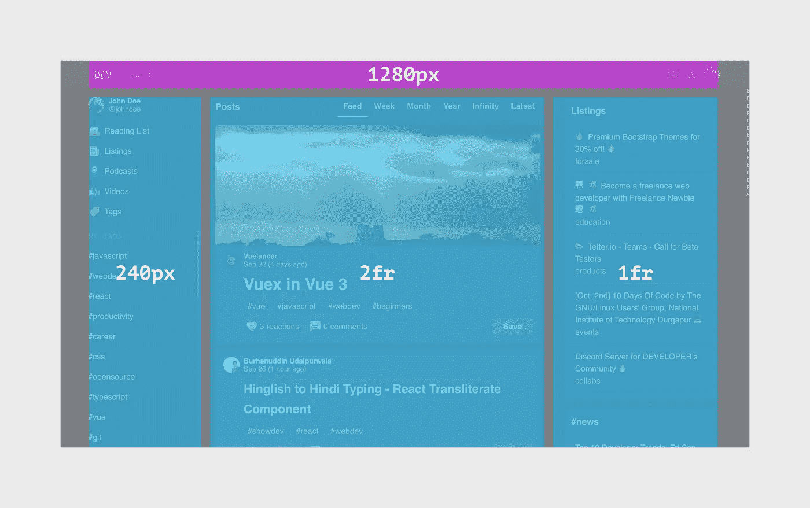

# 使用 Kor UI 构建要克隆的开发工具

> 原文：<https://javascript.plainenglish.io/building-a-dev-to-clone-using-kor-ui-8eb9347cf3b6?source=collection_archive---------13----------------------->

这个故事是我将使用 [Kor UI](https://kor-ui.com/) 克隆现有网站或网络应用的前端，以展示设计系统的一些功能以及如何使用它们来实现 UI 设计和开发的各种目标的系列中的第一个。

# 🗺️概述

[Dev.to](https://dev.to/) 是一个专注于围绕软件开发相关话题的社区讨论的网站。我选择主页作为我们项目的基础，因为它有丰富的布局和内容。

Left: original; Right: Kor UI clone

总共使用了 34 个 Kor 组件，8 个标准 HTML 元素(例如`div`、`br`)，仅应用了 27 个 CSS 规则。

我们为项目选择的技术是 Angular(使用 SCSS 样式表),代码库可以在 StackBlitz 项目中找到:

# 🎨第 1 部分:设置主题

可视化语言的开发已经非常接近 Kor UI 的默认风格，但是仍然有一些差异，这些差异已经通过 3 个层次的定制处理了:颜色、字体和组件风格。

在这种情况下，我选择扩展默认的深色主题，因为许多风格是共享的，不需要从头定义。

Left: Standard Kor UI dark theme; Right: Custom theme

## 颜色；色彩；色调

默认颜色和 dev.to 使用的颜色之间最明显的差异是蓝色基色。这两种方案的亮度相似，但色调已被调整，以准确匹配预期的视觉外观。

此外，主要强调颜色已经调整，以匹配开发工具中使用的紫色调(例如，请参见按钮或活动选项卡上的突出显示)。

## 字体

dev.to 中的排版风格与默认的 Kor UI 主题有两点不同:字体大小和字体系列。

因为在 dev.to 中字体变大了，所以所有文本样式的字体大小都增加了 2px。比如主体字体从 14px 改成了 16px。

字体系列也从开放的 Sans 变成了 sans-serif(为了方便起见，没有加载自定义字体)。

## 组件样式

一些组件必须定制它们的默认样式，以匹配 dev.to 中使用的那些组件的设计。以下是完整的列表:

*   **主** **按钮**的字体颜色设置为黑色而非白色。
*   **选项卡**移除了它们的下边框，并且选项卡项目的垂直/水平尺寸已经减小
*   **菜单项**悬停时文本颜色变为紫色(强调)
*   **标签**的边框被移除，字体颜色变为较浅的阴影

# 📐第 2 部分:定义布局

在宽度超过 1280 像素的视窗中，网站内容会在页面上居中显示，而不是从一条边延伸到另一条边。由于这个原因，水平填充被添加到`kor-app-bar`和`kor-grid`本身。

由于 dev.to 的主页是基于二维网格的，所以使用了`kor-grid`组件，并设置了`grid-template-columns: 240px 2fr 1fr`，如下图所示:

# 🏁结论

在这篇文章中，我展示了 Kor UI 的灵活性，以及开发人员和设计人员如何定制主题，以获得独特的视觉外观来表达他们的品牌个性。

除了展示如何改变颜色和字体之外，我还看到了单个组件可以在不影响其行为的情况下修改其外观。

此外，我还展示了如何通过最少的设置和使用网格等组件来实现复杂的布局。

在本系列的下一篇文章中，我将介绍更多不同的用例，包括移动应用程序。我希望这些信息对你有用，希望下次再见！

[Subscribe to Decoded, our official YouTube channel!](https://www.youtube.com/channel/UCtipWUghju290NWcn8jhyAw)