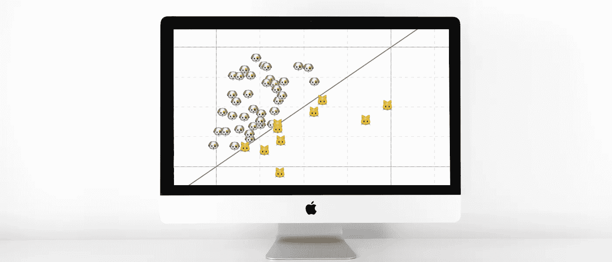
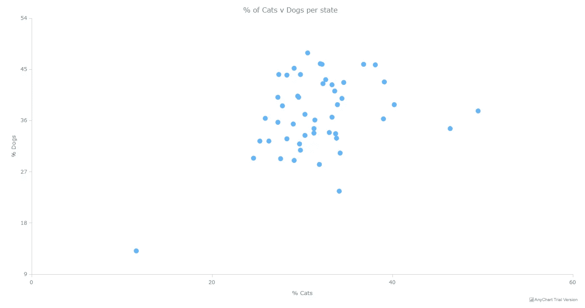
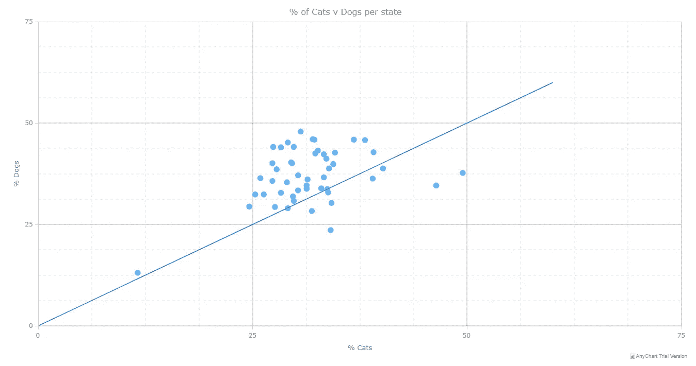
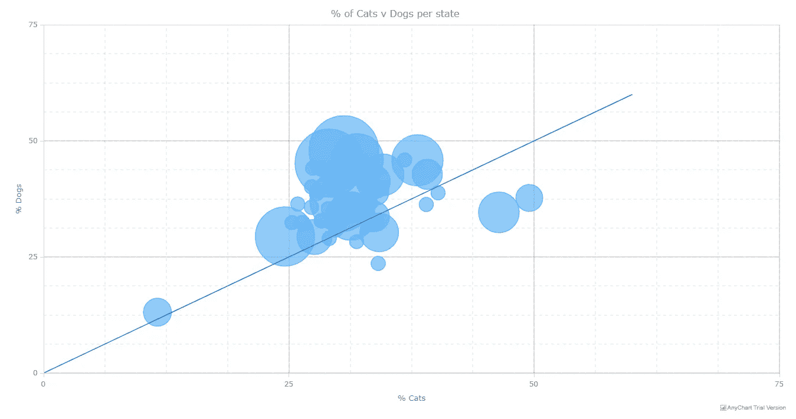

# 构建 JavaScript 散点图模块

> 原文：<https://javascript.plainenglish.io/building-a-javascript-scatter-plot-module-a8ab6bcd6067?source=collection_archive---------10----------------------->



散点图是一种可视化数据的好方法。数据被表示为笛卡尔平面上的点，其中每个点的 x 和 y 坐标表示一个变量。这些图表允许您调查两个变量之间的关系，检测数据集中的异常值以及趋势。它们是最常用的数据可视化技术之一，也是数据可视化的必备工具！

在本教程中，我将教你如何使用 JavaScript 构建自己的交互式散点图。

有没有想过美国的人口是不是爱狗的人？你马上就会知道了！为了帮助您了解更多关于构建散点图的信息，我将使用美国数据集中的*猫和狗的受欢迎程度。该数据集包含美国各州养猫养狗家庭的百分比。*

# 如何创建 JavaScript 散点图

构建数据可视化常常是一项过于复杂的工作(只要问问任何使用 Matplotlib 的人就知道了)，但是如果使用正确的工具，它会变得快速而轻松！有许多 JavaScript 库可以帮助你做到这一点，它们各有优缺点，选择正确的取决于你的用例及编码能力。

对于本教程，我选择使用 [AnyChart JavaScript 库](https://docs.anychart.com/Basic_Charts/Scatter_Plot/Overview)。我认为 AnyChart 对数据可视化的新手来说是完美的，对新手和中级程序员都有好处。用很少的编码知识很容易快速完成一些东西，但是也有很大的定制空间。此外，他们的文档确实在整个过程中帮助您。

# 1.创建 HTML 页面

我需要做的第一件事是设置我的 html 页面。

```
<!DOCTYPE html>
<html>
  <head>
    <title>JavaScript Scatter Chart</title>
  </head>
  <body>
    <div id="container" style="width: 100%; height: 500px"></div>
    <script>
 ***// code for chart goes here.***    </script>
  </body>
</html>
```

我创建了一个空白页面，然后为图表添加了一个 div 元素。我给这个 div 的 id 是“container ”,这样我以后可以很容易地引用它。我还包含了样式属性，以确保 div 填充整个页面。(您可以很容易地更改它以适应您自己的用例)。

# 2.添加必要的脚本

接下来，我添加必要的脚本。因为我使用 JavaScript 库来帮助我构建这个图表，所以我需要包含必要的脚本。这些脚本将取决于我使用哪个库，在这种特殊情况下，我需要添加 AnyChart 的“基础”和“数据适配器”模块。基本模块包含图表库，而数据适配器模块将允许我加载数据。

```
<script src="https://cdn.anychart.com/releases/8.7.1/js/anychart-base.min.js"></script>
<script src="https://cdn.anychart.com/releases/8.7.1/js/anychart-data-adapter.min.js"></script>
```

# 3.加载数据

如上所述，我将演示如何通过可视化美国数据集中的*猫和狗的受欢迎程度来构建散点图。该数据集可在专门研究数据集的网站 [Data.world](https://data.world/datanerd/cat-vs-dog-popularity-in-u-s) 获得。Data.world 称自己是一个数据“目录”,允许你浏览其他用户上传的数据，也可以保存你自己的数据。我鼓励你去看看这个网站，因为它是任何想要可视化数据的人的丰富资源。*

不同的图表库对数据的呈现方式有不同的要求。在我们的例子中，AnyChart 允许多种数据格式(JSONs、CSV、Google Sheets 等)，但是要求数据以特定的格式呈现。他们需要将 x 轴变量命名为“x ”, y 轴变量命名为“value”。

为了让本教程更容易理解，我做了所有必要的预处理(重命名列和删除未使用的列)，并制作了可供下载的 CSV 文件:[这里是](https://raw.githubusercontent.com/WaydeHerman/ScatterPlot/master/data.csv)。

# 4.绘制图表

最后，页面制作完成，数据准备就绪，我终于可以开始有趣的部分了:绘制我的图表。

我将把绘制图表的代码放在`anychart.data.loadCsvFile`函数中，把绘制图表的代码放在`anychart.onDocumentReady()`函数中。

这些函数是异步的。通常，代码是线性读取和执行的，但在某些情况下，这些功能需要时间。例如，上传和解析 CSV 需要时间。

因此，通过将绘制图表的代码放在*any chart . data . loadcsvfile*中，我可以确保绘制图表的代码只在数据加载后执行。并且将它放在*any chart . ondocumentready()*函数中可以确保只有当我的页面被加载后，代码才会被执行。这可能是最复杂的一步，所以如果你一开始感到困惑，不要太难过。

*Anychart.scatter()* 支持三种不同的绘图:气泡图、折线图和标记图。现在，我将使用标记，因为这些是我们的标准散点图点。

```
anychart.onDocumentReady(function() {
  anychart.data.loadCsvFile("data.csv", function (data) {
 ***// create the chart***    chart = anychart.scatter();
 ***// assign the data to a series***    var series1 = chart.marker(data);
 ***// set title***    chart.title("% of Cats v Dogs per state");
 ***// set axes titles***    chart.xAxis().title("% Cats");
    chart.yAxis().title("% Dogs");
 ***// draw chart***    chart.container("container").draw();
  });
})
```

这导致:



就是这样！通过遵循以上四个步骤，我已经成功构建了一个全功能的交互式 JavaScript 散点图。包含所有内容后，我的代码如下所示:

```
<!DOCTYPE html>
<html>
  <head>
    <title>JavaScript Scatter Chart</title>
    <script src="https://cdn.anychart.com/releases/8.7.1/js/anychart-base.min.js"></script>
    <script src="https://cdn.anychart.com/releases/8.7.1/js/anychart-data-adapter.min.js"></script>
  </head>
  <body>
    <div id="container" style="width: 100%; height: 500px"></div>
    <script>
      anychart.onDocumentReady(function() {
        anychart.data.loadCsvFile("catsvdogs_new.csv", function (data) {
 ***// create the chart***          chart = anychart.scatter();
 ***// assign the data to a series***          var series1 = chart.marker(data);
 ***// set title***          chart.title("% of Cats v Dogs per state");
 ***// set axes titles***          chart.xAxis().title("% Cats");
          chart.yAxis().title("% Dogs");
 ***// draw chart***          chart.container("container").draw();
        });
      })
    </script>
  </body>
</html>
```

[游乐场链接](https://playground.anychart.com/Kt0ayGuY/)
[CodePen 链接](https://codepen.io/waydeherman/pen/xxGaXdG)

# 如何自定义散点图外观

数据可视化就是讲述故事，数据可视化开发人员的工作就是定制他们的可视化来更好地讲述这些故事。您可能希望进行更改，以使您的图表更具吸引力，突出显示可视化中特别有趣的方面，或者添加一些功能来帮助更好地理解数据。

所有像样的图表库都会有很好的定制选项来允许你这样做，AnyChart 也不例外。使用他们的 API 允许许多不同的有用的定制。我会试着增加一些来从我的猫和狗的游戏中得到更多。

# 添加网格

网格是帮助用户理解数据的一种非常有用的方式。您可以使用`xGgrid()`和`yGgrid()`以及`xMinorGrid()`和`yMinorGrid()`分别创建主网格和次网格。您还可以使用`stroke()`和`palette()`方法定制它们的样式。

以下代码启用主网格和次网格，并为它们的样式设置参数。

```
***// enable major grids*** chart.xGrid(true);
chart.yGrid(true);
***// configure the visual settings of major grids*** chart.xGrid().stroke({color: "#212D40", thickness: 0.3});
chart.yGrid().stroke({color: "#212D40", thickness: 0.3});
***// enable minor grids*** chart.xMinorGrid(true);
chart.yMinorGrid(true);
***// configure the visual settings of minor grids*** chart.xMinorGrid().stroke({color: "#212D40", thickness: 0.15, dash: 5});
chart.yMinorGrid().stroke({color: "#212D40", thickness: 0.15, dash: 5});
```

# 添加趋势线

趋势线、最佳拟合线和其他线可用于帮助用户分析数据。通过利用受支持的系列`anychart.scatter()`，我可以轻松地在我的图表中添加一条线。

在我的图表中，我认为添加一条 45 度线可能是个好主意。它将剖析图表，并允许人们容易地发现一个州更像是一个狗州还是一个猫州。

为了添加这条线，我首先需要创建数据，一个点在原点，另一个点在更远处，然后将这些数据分配给一个线序列。

```
***// add data for line*** var data2 = [
  {x: 0, value: 0},
  {x: 60, value: 60}
];
***// assign the line data to a line series*** var series2 = chart.line(data2);
```

这导致我的图表看起来像这样:



正如你所看到的，美国显然对狗有偏见！你能称美国为狗国家吗？规则不是我定的！

[游乐场链接](https://playground.anychart.com/PQVE1AXB/)
[CodePen 链接](https://codepen.io/waydeherman/pen/jOPvGPK)

# 泡泡图

默认情况下，散点图只能支持两个变量，但有时需要支持更多变量。有多种扩展这些图表的方法，包括使每个点的颜色取决于一个附加变量，或者是数值变量的范围，或者是分类变量的不同，或者是根据第三个变量改变点的大小。

通过使用点的大小扩展散点图，您可以将散点图更改为气泡图。有了正确的数据，这些看起来真的令人印象深刻。它们也很容易用我用来做散点图的代码来实现。

我只是将系列从标记改为气泡。真的就这么简单。(我还改变了气泡的最小和最大尺寸，使事情不那么混乱)。

```
***// assign the data to a series*** var series1 = chart.bubble(data);
***// adjust bubble min/max size*** chart.minBubbleSize("2%");
chart.maxBubbleSize("10%");
```

这就产生了这个气泡图:



有多简单？…

# 结论

正如您现在所知道的，制作 JavaScript 散点图既快速又简单！它们是最流行的数据可视化之一，在探索两个变量之间的关系时非常有用。此外，只需做一点工作，它们就可以很容易地扩展以显示更多的变量。

我在这里制作的图表实际上只是散点图的皮毛。请在下面留言或在 twitter 上联系我，我会非常乐意给你发送一些我个人最喜欢的例子！

**见下一条:**

*   JS 散点图[示例](https://www.anychart.com/products/anychart/gallery/Scatter_Charts/)
*   JS 散点图[文档](https://docs.anychart.com/Basic_Charts/Scatter_Plot/Overview/)
*   更多 [JS 制图教程](https://www.anychart.com/blog/category/javascript-chart-tutorials/)

*原载于 2020 年 5 月 27 日 https://www.anychart.com**的* [*。*](https://www.anychart.com/blog/2020/05/27/scatter-plot-js-tutorial/)