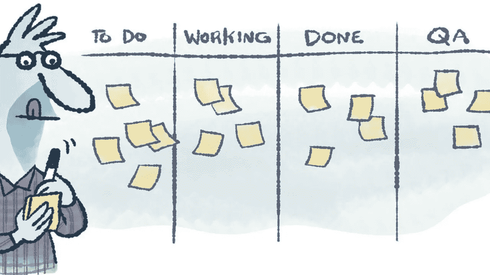
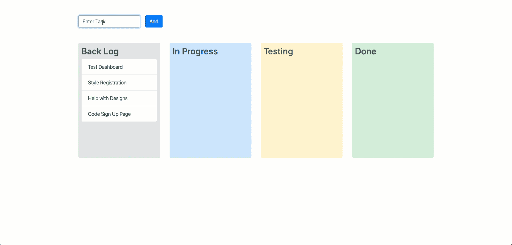

# 用 Vue.js 和 VueDraggable 构建一个 Trello 风格的看板

> 原文：<https://javascript.plainenglish.io/building-a-kanban-board-with-vue-js-and-vuedraggable-in-15-minutes-496dbe3685e2?source=collection_archive---------1----------------------->



Kanban Board Cartoon

## 在 web 应用程序中实现拖放可能是一件非常痛苦的事情。

但是，当你可以在屏幕上拖动项目并把它们放入桶中时，它确实使应用程序看起来更直观、更酷。幸运的是，对于那些使用 Vue.js 的用户来说，我们可以使用一个名为 VueDraggable 的包来轻松拖放。

在本教程中，我们将使用 Vue.js 和 Vue Draggable 构建一个拖放式看板。我们不会将任何东西保存到数据库中，但是这应该可以帮助您开始使用拖放操作。所以，让我们开始吧。



Project Kanban Board

# 视频教程

[https://www.youtube.com/watch?v=E8f5JR-K5DI](https://www.youtube.com/watch?v=E8f5JR-K5DI)

## Vue 项目设置

首先，让我们创建我们的 Vue 项目。打开您的终端，cd 到您选择的目录，并运行以下命令:

```
npx vue create vue-kanban-board
```

然后只需选择应用的默认设置:
请选择一个预设:**默认(babel，eslint)**

## 安装软件包

从终端将下一张 cd 放入项目的根目录，并运行以下命令:

```
npm i vuedraggable bootstrap-vue
```

## 导入包

在 src/main.js 中，为我们的样式导入 Bootstrap Vue。您的文件应该如下所示:

# 看板

由于这只是一个演示，我们将把所有代码放在 src/App.vue 文件中。在这个文件中，我们将添加一个具有 4 种状态的看板。我们还将在顶部放置一个表单，以便向公告板添加新任务。

首先，我们将通过在文件顶部导入 draggable 并将其注册为组件来添加它。在脚本标签的顶部添加:

```
//import draggable
import draggable from "vuedraggable";
```

接下来，将其作为组件添加到导出默认值中:

```
components: {
  //import draggable as a component   
  draggable
}
```

可拖动组件有一个名为 list 的属性。这就是它跟踪每个 dropzone 内部内容的方式。您将主要使用传递给 draggable 组件的对象数组。因此，我们将创建 4 个数组来跟踪我们不同的看板状态。在我们的第一个数组中，我们将添加一些模拟数据，这样我们就有东西可以拖动了。我们还需要一个属性来跟踪我们将通过看板上方的表单添加的新任务。

在导出默认值中添加:

```
data() {
    return {
      // for new tasks
      newTask: "",
      // 4 arrays to keep track of our 4 statuses
      arrBackLog: [
        { name: "Code Sign Up Page" },
        { name: "Test Dashboard" },
        { name: "Style Registration" },
        { name: "Help with Designs" }
      ],
      arrInProgress: [],
      arrTested: [],
      arrDone: []
    };
  }
```

接下来，我们将添加一个方法，将新任务推入我们的 backlog 数组。我们将在顶部的表格中使用它。在导出默认内添加:

```
methods: {
    //add new tasks method
    add: function() {
      if (this.newTask) {
        this.arrBackLog.push({ name: this.newTask });
        this.newTask = "";
      }
    }
}
```

现在我们可以开始编写模板了。我们需要在顶部的一个表单和 4 个不同的可拖动组件来跟踪我们的状态。在 click 或 keyup.enter 上的表单中，我们将触发前面实现的 add 方法。

```
<div class="row">
  <div class="col form-inline">
   <b-form-input
    v-model="newTask"
    placeholder="Enter Task"
    [@keyup](http://twitter.com/keyup).enter="add"
    >
    </b-form-input>
    <b-button [@click](http://twitter.com/click)="add" variant="primary" class="ml-3">
      Add
    </b-button>
  </div>
</div>
```

然后在表单下，我们将添加一个有 4 列的行，在那里我们将放置 4 个可拖动的组件。对于每个可拖动组件的列表属性，我们将传递我们之前添加的不同数组。我们还将把 group prop 设置为 tasks，让 draggable 知道我们可以在不同的 dropzones 之间传递项目。

在每个 draggable 内部，我们将添加一个带有 v-for 的 div 来循环遍历每个项目，并在我们各自的数组中显示它。

```
<div class="row mt-5">
  <div class="col-3">
    <div class="p-2 alert alert-secondary">
      <h3>Back Log</h3>
      <draggable
       class="list-group kanban-column"
       :list="arrBackLog"
       group="tasks"
       >
         <div class="list-group-item"
          v-for="element in arrBackLog"
          :key="element.name"
         >
           {{ element.name }}
         </div>
      </draggable>
    </div>
  </div> <div class="col-3">
     <div class="p-2 alert alert-primary">
        <h3>In Progress</h3>
         <draggable 
           class="list-group kanban-column"
           :list="arrInProgress"
           group="tasks"
          >
            <div
             class="list-group-item"
             v-for="element in arrInProgress"
             :key="element.name"
            >
             {{ element.name }}
            </div>
        </draggable>
     </div>
   </div> <div class="col-3">
    <div class="p-2 alert alert-warning">
      <h3>Testing</h3>
        <draggable
         class="list-group kanban-column"
         :list="arrTested"
         group="tasks"
         >
           <div
            class="list-group-item"
            v-for="element in arrTested"
            :key="element.name"
            >
              {{ element.name }}
            </div>
        </draggable>
    </div>
  </div> <div class="col-3">
    <div class="p-2 alert alert-success">
      <h3>Done</h3>
      <draggable
         class="list-group kanban-column"
         :list="arrDone"
         group="tasks"
        >
         <div
          class="list-group-item"
          v-for="element in arrDone"
          :key="element.name"
          >
          {{ element.name }}
        </div>
      </draggable>
    </div>
  </div>
</div>
```

对于样式，我们将把来自 bootstrap 的 alert CSS 添加到列中，把 list-group 添加到可拖动组件中，把 list-group-items 添加到每个数组中的项目中。我们还将在样式标签中添加一个自定义样式，为每个可拖动对象指定一个最小高度。这使得每个可拖动的 dropzone 更大，更容易将项目放入其中。

添加完所有这些内容后，您的文件应该如下所示:

我已经在代码中添加了注释来显示正在发生的事情，但是仅此而已。如果你对此有任何进一步的问题，请写在下面，我会尽力回答。下次见，编码快乐！

## 比特桶回购

 [## 比特桶

### 编辑描述

bitbucket.org](https://bitbucket.org/TheDiligentDev/vue-kanban-board/src/master/) 

## **用简单的英语写的 JavaScript 的注释:**

我们总是有兴趣帮助推广高质量的内容。如果你有一篇文章想用简单的英语提交给 JavaScript，用你的中级用户名发邮件到 submissions@javascriptinplainenglish.com[给我们，我们会把你添加为作者。](mailto:submissions@javascriptinplainenglish.com)