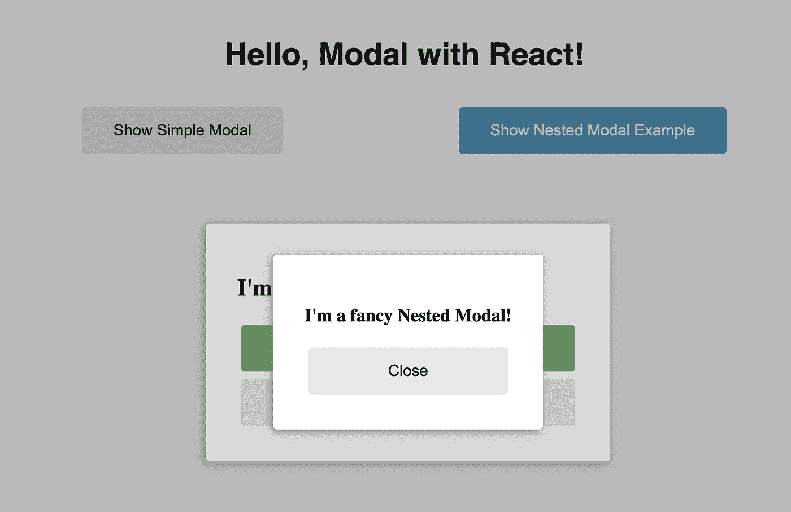

# 用 React 构建可定制的模态组件

> 原文：<https://javascript.plainenglish.io/building-a-modal-component-with-react-7ef486872c5f?source=collection_archive---------6----------------------->

## 在这个例子中，我们将使用 React 创建一个可定制的模态组件。

Modal example screenshot

# 入门指南

首先，让我们看看如何使用我们的模态组件:

注意，我们使用的是`Modal`和`Modal.Content`。这样，我们将能够从外部定制背景覆盖和模态内容元素。

# 警告

显示模态元素的最佳实践之一是在`body`标签中呈现它，而不是在父组件中内联呈现。

原因是:

1.  为了避免`z-index`的问题。
2.  即使父元素设置为`visibility: hidden`，也能显示模态。
3.  以避免在另一个模式中显示嵌套模式时出现问题。

在一个简单的场景中，我们可以将 Modal 直接附加到`body`元素上。然而，有一种更优雅的方式，使用一个特殊的`*Modal.Host*`组件，我们将呈现所有模态。通过这种方式，我们可以更加灵活地控制渲染模式的确切位置，只需将`*Modal.Host*`移动到我们想要渲染模式的位置:

# 先决条件

*   `react`和`react-dom`
*   `classnames` —只是为了方便使用带有 React 的 CSS 模块

开始编码吧。

# 实现模态组件

总体模式实施将包含:

*   `***Modal/common.js***`:包含共享内容
*   `***Modal/ModalHost.js***`:包含`Modal.Host`组件
*   `***Modal/ModalContent.js***`:包含`Modal.Content`组件
*   `***Modal/index.js***`:包含主`Modal`组件
*   `***Modal/modal.module.css***`:包含 CSS 样式(CSS 模块)

## Modal/common.js

## Modal/ModalHost.js

## Modal/ModalContent.js

## Modal/index.js

我们将使用 [React Portal](https://reactjs.org/docs/portals.html) 来呈现其父元素之外的模态，特别是在`Modal.Host`中。

## Modal/modal.module.css

# 摘要

查看 [Github Repo](https://github.com/erzhtor/building-customizable-modal-with-react) 中的完整示例。

另外，请随时订阅即将发布的文章！