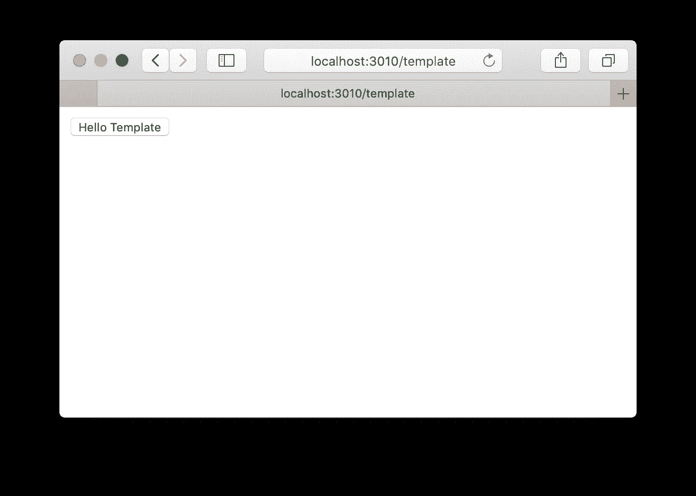
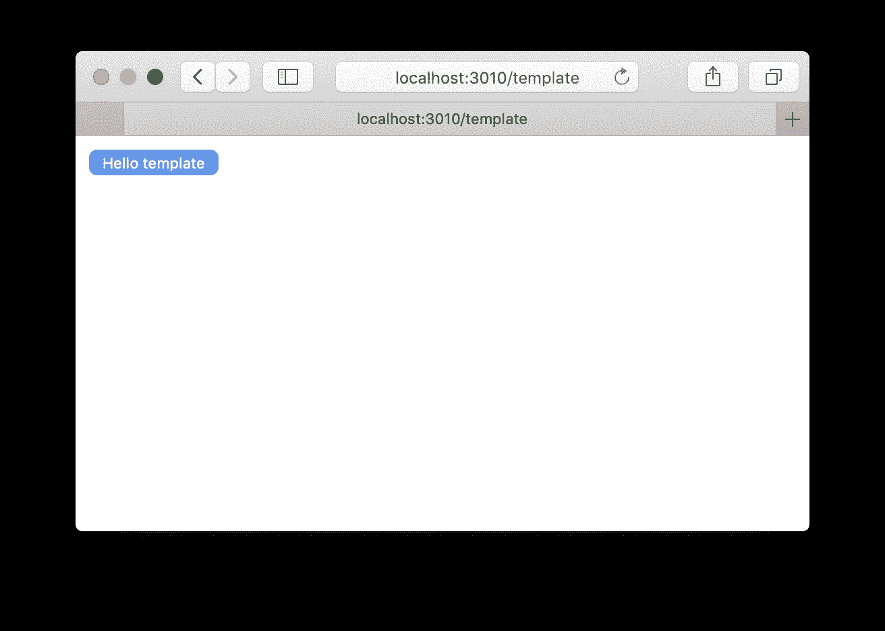
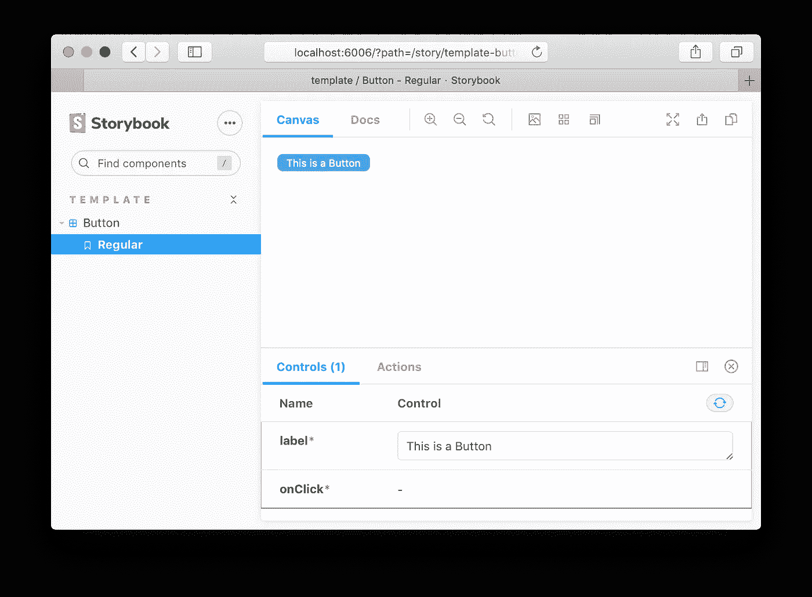
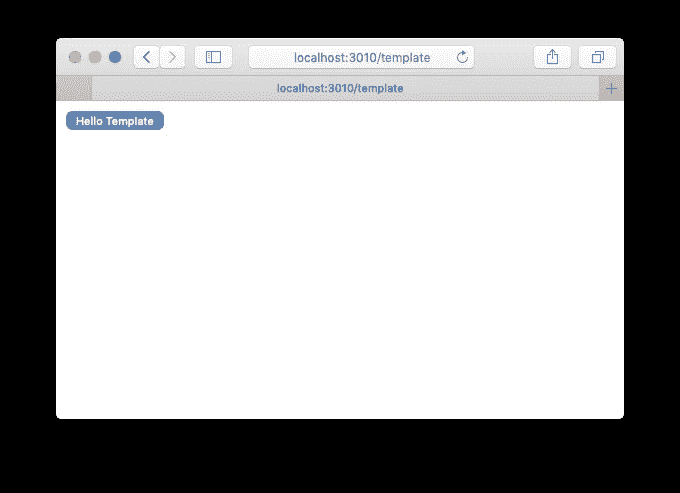
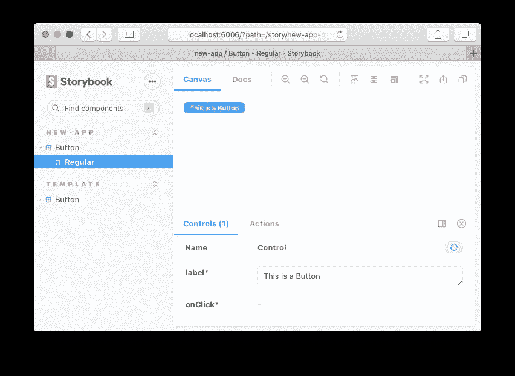
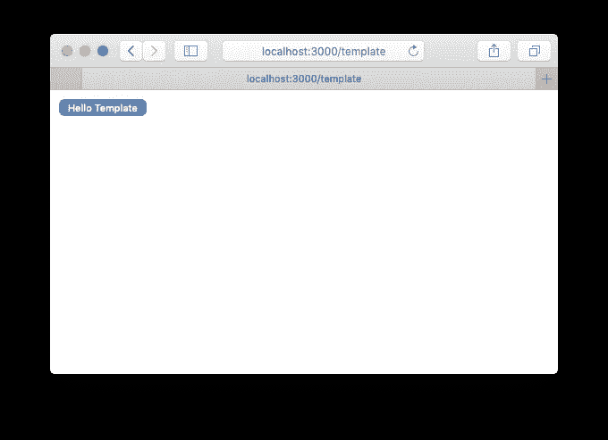
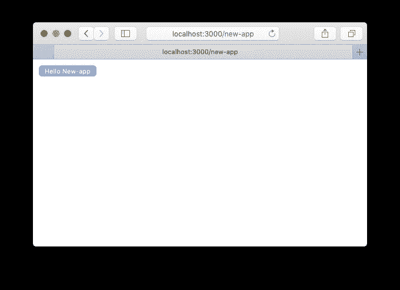

# 构建 NextJS Monorepo

> 原文：<https://javascript.plainenglish.io/building-a-nextjs-monorepo-ecd21ac04928?source=collection_archive---------2----------------------->


Photo by [Tiger Lily](https://www.pexels.com/@tiger-lily?utm_content=attributionCopyText&utm_medium=referral&utm_source=pexels) from [Pexels](https://www.pexels.com/photo/warehouse-with-concrete-floors-4483610/?utm_content=attributionCopyText&utm_medium=referral&utm_source=pexels)

你开始为你的公司创建一个前端应用程序，然后一个又一个，最终你得到了十几个前端应用程序和大量的重复代码。工具代码、林挺、测试、助手库和领域特定代码。

你可能以前见过这种情况。不是有效的并且容易出错。解决方案是将所有代码和依赖项放在一个存储库中，换句话说就是创建一个 monorepo。

我不会试图解释什么是单一回购协议，或者为什么你需要一个。像往常一样，在我所有的帖子中，我只是帮助你为你的 NextJS 应用程序构建一个。你可能已经决定 monorepo 是你的解决方案。

# 我需要从单向回购中得到什么？

任何前端 monorepo 都应该支持某些最低要求。我最关心的是:

*   包含应用程序和库:通常在 monorepo 中，你使用术语包来标识特定的代码单元，它可以是一个应用程序或一个共享模块。在我们的 monorepo 中，他们将分别生活在`/packages/app/*`和`/packages/shared/*`下。
*   使用 CLI 命令引导新的应用程序或共享模块。
*   用一个命令运行 monorepo 中的所有测试。或者，我们希望只在应用程序或共享模块上运行测试。
*   故事书几乎是构建前端应用程序(或类似工具)的一个需求。我们还需要打开一本故事书，里面有 monorepo 上的所有故事。或者，我们希望只打开来自单个应用程序或共享模块的故事。
*   共享工具配置。ESLint，更漂亮，打字稿，不需要在每个包装中重复我们自己。
*   每个应用程序都应该有自己的构建脚本。以及独立运行应用程序和作为组合运行应用程序的脚本。组合意味着，我们可以在单个域中拥有针对不同路径的应用程序，并同时运行它们(例如:`/customer-dashboard/...`代表客户仪表板应用程序，`/back-office/...`是内部员工使用的管理应用程序)

除此之外你还可以有其他要求。在这篇文章之后，你可以花更多的时间在他们身上。

# Monorepo 代码组织。

我们将把我们的 monorepo 建立在 Yarn work spaces(【https://classic.yarnpkg.com/en/docs/workspaces/】)上，它们足够简单，我们不需要在 monorepo 内部发布单独的模块(这是其他解决方案如 Lerna 真正擅长的)

*我不会在这篇文章中添加太多的代码细节，你可以从附带的资源库中获取代码，或者将其用作你自己 monorepo 的模板*

创建 monorepo 的第一步实际上是创建 repo 文件夹和`package.json`文件。在它的内部，我们需要添加一个`workspaces`部分。

```
{
  **"name": "@outsrc/monorepo",
  "private": true,
**  **...**
  **"workspaces": [
    "packages/app/*",
    "packages/shared/*"
  ]**
  ...
}
```

以及安装所有这些开发依赖项:

```
$ yarn add -W -D [@babel/core](http://twitter.com/babel/core) [@babel/preset-env](http://twitter.com/babel/preset-env) [@babel/preset-react](http://twitter.com/babel/preset-react) [@babel/preset-typescript](http://twitter.com/babel/preset-typescript) [@next/bundle-analyzer](http://twitter.com/next/bundle-analyzer) [@storybook/addon-actions](http://twitter.com/storybook/addon-actions) [@storybook/addon-docs](http://twitter.com/storybook/addon-docs) [@storybook/addon-essentials](http://twitter.com/storybook/addon-essentials) [@storybook/addon-links](http://twitter.com/storybook/addon-links) [@storybook/addon-storyshots](http://twitter.com/storybook/addon-storyshots) [@storybook/react](http://twitter.com/storybook/react) [@testing](http://twitter.com/testing)-library/jest-dom @testing-library/react [@types/jest](http://twitter.com/types/jest) [@types/node](http://twitter.com/types/node) [@types/react](http://twitter.com/types/react) [@typescript](http://twitter.com/typescript)-eslint/eslint-plugin [@typescript](http://twitter.com/typescript)-eslint/parser arg babel-jest babel-loader babel-plugin-module-resolver dev-kong eslint eslint-config-standard-with-typescript eslint-plugin-import eslint-plugin-jest eslint-plugin-jest-dom eslint-plugin-node eslint-plugin-prettier eslint-plugin-promise eslint-plugin-react eslint-plugin-react-hooks eslint-plugin-standard fs-extra globby identity-obj-proxy internal-ip jest jest-runtime next-transpile-modules plop pm2 prettier react-is react-test-renderer replace-in-files rimraf sass sass-loader ts-jest ts-node typescript
```

而这种常规的依赖关系:

```
$ yarn add -W next react react-dom
```

工具代码…

第一个`.gitignore`

```
node_modules
.next
out
*.log
coverage
```

ESLint 帮助我们的代码看起来更好，还有其他原因。对于 ESlint 配置，我们需要两个文件:`.eslintrc.yml`和`.eslintignore`

漂亮是一个代码格式化工具。有助于避免围绕如何格式化代码进行讨论。还需要根目录上的几个配置文件:`.prettierrc`和`.prettierignore`

由于 Yarn 工作空间(【https://github.com/yarnpkg/yarn/issues/7807】T21)上的一个突出问题，我们需要在我们的存储库上使用 Yarn v1.18 版。我们可以通过制定纱线政策来实现这一点。

```
$ yarn policies set-version 1.18.0
```

我们还需要一个`babel.config.js`文件。这只是包含了默认的 NextJS babel 设置。

`jest.config.js`文件将包含我们的 Jest 测试配置。

最后是我们的类型脚本配置文件。一个在根文件夹`tsconfig.json`中，一个主文件用作分散在 repo: `config/next.tsconfig.json`中的所有其他`tsconfig.json`文件的基础

root tsconfig.json

注意这里我们使用了一个`paths`属性来表示所有的`@outsrc/...`依赖项都来自于`packages/shared/*`文件夹。这意味着应用程序不会共享内部代码。如果你需要共享代码，你需要把它放在一个共享模块上。

## 创建一个 NextJS 模板应用程序

一个 NextJS 模板应用程序将帮助我们以后引导新的应用程序。我们将在`packages/app/template`创建它

我们需要这个应用程序的几个文件。我们将有一些简单的东西，尽管您可以稍后增加这个应用程序模板的复杂性，以包含您的应用程序所需的所有需求。

第一个`package.json`

正如你所看到的，这个`package.json`已经包含了以下脚本:**开发**、**构建**、**故事书**、**测试**和**启动。**

第二个`tsconfig.json`用于类型脚本配置:

还有几个 NextJS 文件:`next.config.js`和`next-end.d.ts`

注意，我们使用了**端口** `3010`和**基本路径** `/template`在这里，让我们在文件`src/pages/index.tsx`上创建第一个 NextJS 页面

测试我们的第一个应用

```
$ yarn workspace @outsrc/template dev
```

在浏览器上我们可以查看[http://localhost:3010/template](http://localhost:3010/template)



让我们在模板应用程序上创建一个按钮组件:5 个文件，`index.ts` `Button.tsx` `Button.module.scss` `Button.spec.tsx` `Button.stories.mdx`

(Check the source code of this file)

更改`src/page/index.tsx`文件以使用它:

将显示:



With Button component

故事书呢？要启用它，我们需要模板应用程序上的两个文件:`.storybook/main.js`和`.storybook/preview.js`

有了这两个文件，从`template`文件夹运行:

```
$ yarn storybook
```



Template App Storybook

对于测试，我们可以运行`yarn test`,但是在此之前，因为我们已经有了一本故事书，我们可以对所有故事进行快照测试。创建一个`__tests__/storyshots`文件夹，并在其中创建一个`__tests__/storyshots/storyshots.spec.ts`文件。

现在我们可以运行故事书和测试，包括来自模板应用程序文件夹的快照测试。

```
$ cd packages/app/template && yarn test
$ cd packages/app/template && yarn storybook
```

这两个命令也可以从根文件夹中执行

```
$ yarn workspace @outsrc/template test
$ yarn workspace @outsrc/template storybook
```

已经在`package.json`脚本部分的其他命令包括:

*   **构建**:为生产部署构建应用程序
*   **dev** :在开发模式下运行应用。
*   **开始**:构建并运行应用程序，无需开发

最后，为了支持打开全球故事书，我们需要在 monorepo 的根文件夹中创建两个文件:`.storybook/main.js`和`.storybook/preview.js`

*(这两个文件与模板应用程序文件夹中的文件几乎相同，但它们在故事路径上有微小的变化)*

此外，修改根文件夹`package.json`文件以包含几个脚本。

```
{
 ...
 "scripts": {
  ...
    **"storybook": "start-storybook -p 6006",
    "test": "jest --coverage",**
    ...
 },
 ...
}
```

现在我们可以运行一个全局故事书或者在 monorepo 上运行所有测试。

```
$ yarn test
$ yarn storybook
```

## 创建共享模块

共享模块要简单得多，它们包含将在 monorepo 中重用的代码，特别是在应用程序和其他共享模块上。

让我们创建一个`packages/shared/functions`文件夹和一个`package.json`文件，如下所示:

还有一个`tsconfig.json`,因为我们也在共享模块上写类型脚本。

在 monorepo 上共享模块的一个好处是我们不需要先编译它们。所以这个共享模块只是纯 TypeScript。让我们创建一个简单的函数，并进行测试。`src/index.ts`和`src/index.spec.ts`:

我们可以用一个命令运行测试:

```
$ yarn workspace @outsrc/functions test# all Tests on the monorepo
$ yarn test
```

这就是我们共享模块所需要的。

## 使用共享模块

一旦我们有了共享模块，从其他共享模块或应用程序中使用它们实际上是非常简单的。您可以通过以下方式导入它们:

```
import { capitalize } from '@outsrc/functions'
```

NextJS 应用程序不会自动从`node_modules`依赖项中传输代码。这就是为什么我们添加了一个 NextJS 插件 next-trans file-modules([https://www.npmjs.com/package/next-transpile-modules](https://www.npmjs.com/package/next-transpile-modules))为了工作，我们需要手动指定我们想要传输的模块，这就是为什么我们在`next.config.js`文件上添加了一小段代码，只要依赖关系列在`package.json`文件的**依赖关系**部分，它就会自动为我们完成这项工作。

因此，如果我们想在模板应用程序上使用新的`capitalize`函数，我们需要首先将`@outsrc/functions`添加到模板应用程序的依赖列表中。

```
{
 ...
 "dependencies": {
  ...
    **"@outsrc/functions": "0.0.0"**
    ...
 },
 ...
}
```

并更改代码以使用它，例如:

```
$ yarn workspace @outsr/template dev
```



到目前为止，我们已经涵盖了前端 monorepo 的大部分需求。少了什么？

*   从模板生成模块或应用程序(我们已经有几个模板)
*   启动所有合成应用程序。

## 从模板生成应用程序或模块

我们已经有几个模板。以运行应用和共享模块的形式分别:`**@outsrc/template**`和`**@outsrc/functions**`。我们可以用它们来引导新的应用程序或共享模块。

对于这个任务，我们将使用扑通([https://plopjs.com/](https://plopjs.com/))，因为我们将创建一些自定义的动作和助手文件，我们将把所有东西放在一个`.plop`文件夹中。文件将:`.plop/plopfile.ts`、`.plop/actions.ts`、`.plop/app-generator.ts`和`.plop/lib-generator.ts`(哦对了，扑通支持打字稿)

一旦我们在`.plop`文件夹中有了所有这些文件，我们就可以添加运行 plopfile 的生成脚本。

```
{
 ...
 "scripts": {
  ...
    **"generate": "plop --plopfile .plop/plopfile.ts"**
    ...
 },
 ...
}
```

运行它:

```
$ yarn generate
yarn run v1.18.0
$ plop --plopfile .plop/plopfile.ts
? [PLOP] Please choose a generator. (Use arrow keys)
❯ app - App Generator 
  lib - Shared Module Generator
```

我们避免在 plopfile 动作中使用 handlebars 模板。我们只是复制一个完整的模板文件夹，然后替换所有我们需要的属性，使它成为一个不同的应用程序，这包括:名称，路径，端口等。

```
$ yarn generate app new-app "New App" 3045 "/new-app"          
yarn run v1.18.0
$ plop --plopfile .plop/plopfile.ts app new-app 'New App' 3045 /new-app
⠋ - packages/app/new-app/next-env.d.ts
- packages/app/new-app/next.config.js
- packages/app/new-app/package.json
- packages/app/new-app/tsconfig.json
- packages/app/new-app/.storybook/main.js
- packages/app/new-app/.storybook/preview.js
- packages/app/new-app/__tests__/storyshoots/storyshots.spec.ts
- packages/app/new-app/src/pages/index.tsx
- packages/app/new-app/__tests__/storyshoots/__snapshots__/storyshots.spec.ts.snap
- packages/app/new-app/src/components/Button/Button.module.scss
- packages/app/new-app/src/components/Button/Button.spec.tsx
- packages/app/new-app/src/components/Button/Button.stories.mdx
- packages/app/new-app/src/components/Button/Button.tsx
- packages/app/new-app/src/components/Button/index.ts
✔  copy-files success
✨  Done in 2.42s.
```

运行您的新应用程序:

```
$ yarn workspace @outsrc/new-app dev
```


瞧啊。新应用程序在几秒钟内启动。这种方法的一个简单的好处是，我们可以为应用程序维护一个或多个完整的模板，并在其中包含所有必要的代码，如 UI 工具包、安全性等。

如果您现在从根文件夹运行故事书，您将会看到:



现在，请注意我们的新应用程序，即使使用不同的基路径(/new-app)托管在不同的端口上。这意味着我们不能在同一个端口上运行所有的应用程序。这对于微前端应用程序非常重要，在这些应用程序中，身份验证是在域级别处理的。为了完成这个任务，我们需要一个反向代理，将所有请求路由到运行我们的应用程序的不同端口。

我们使用了另外两个依赖项。([https://PM2 . key metrics . io](https://pm2.keymetrics.io/))和 Kong([https://konghq.com/](https://konghq.com/))但是由于我们不想通过 PM2 手动运行应用程序，然后使用 Kong REST API 将它们连接到 localhost 端口 3000，所以我们设计了几个自动化脚本来启动和停止 monorepo 上的所有应用程序。剧本是:`.scripts/start.ts`和`.scripts/stop.ts`

根文件`package.json`上也有一些新的脚本:

```
{
 ...
 "scripts": {
  ...
    **"start": "ts-node -P tsconfig.json .scripts/start.ts",
    "stop": "ts-node -P tsconfig.json .scripts/stop.ts"**
    ...
 },
 ...
}
```

启动所有应用程序:

```
$ yarn start
yarn run v1.18.0
$ ts-node -P tsconfig.json .scripts/start.ts
[ssg] - [@outsrc/new-app](http://twitter.com/outsrc/new-app)
[ssg] - [@outsrc/template](http://twitter.com/outsrc/template)
[kon] - /template                 - template
[kon] - /new-app                  - new-app
✨  Done in 11.27s.
```



All applications running under the same port 3000 different paths

要停止所有操作:

```
$ yarn stop
yarn run v1.18.0
$ ts-node -P tsconfig.json .scripts/stop.ts
- new-app
- template
All stopped
✨  Done in 3.30s.
```

现在，`yarn start`脚本将运行所有的应用程序，但他们不会热重装。通常不会同时在 monorepo 上运行所有应用程序。因此，要在单个(或多个)应用程序上启用热重装，我们需要使用 dev 参数(用逗号分隔)指定我们想要开发的应用程序。

```
yarn start --dev new-app
yarn run v1.18.0
$ ts-node -P tsconfig.json .scripts/start.ts --dev new-app
**[dev]** - [@outsrc/new-app](http://twitter.com/outsrc/new-app)
[ssg] - [@outsrc/template](http://twitter.com/outsrc/template)
[kon] - /template                 - template
[kon] - /new-app                  - new-app
✨  Done in 9.53s.
```

请注意我们指定为开发模式的应用程序上的`**[dev]**`标记。

但是原木呢？因为我们使用了 PM2:

```
$ pm2 list
┌────┬────────────────────┬──────────┬──────┬───────────┬──────────┬──────────┐
│ id │ name               │ mode     │ ↺    │ status    │ cpu      │ memory   │
├────┼────────────────────┼──────────┼──────┼───────────┼──────────┼──────────┤
│ 0  │ new-app            │ fork     │ 0    │ online    │ 0%       │ 69.2mb   │
│ 1  │ template           │ fork     │ 0    │ online    │ 0%       │ 70.0mb   │
└────┴────────────────────┴──────────┴──────┴───────────┴──────────┴──────────┘
```

对于日志，我们可以:

```
$ pm2 logs new-app
[TAILING] Tailing last 15 lines for [new-app] process (change the value with --lines option)
/Users/ernestofreyre/.pm2/logs/new-app-error.log last 15 lines:
/Users/ernestofreyre/.pm2/logs/new-app-out.log last 15 lines:
0|new-app  | λ  (Server)  server-side renders at runtime (uses getInitialProps or getServerSideProps)
0|new-app  | ○  (Static)  automatically rendered as static HTML (uses no initial props)
0|new-app  | ●  (SSG)     automatically generated as static HTML + JSON (uses getStaticProps)
0|new-app  |    (ISR)     incremental static regeneration (uses revalidate in getStaticProps)
0|new-app  | 
0|new-app  | info  - using build directory: /Users/ernestofreyre/Documents/nodeprojects/monorepo/packages/app/new-app/.next
0|new-app  | info  - Copying "static build" directory
0|new-app  | info  - No "exportPathMap" found in "next.config.js". Generating map from "./pages"
0|new-app  | info  - Launching 15 workers
0|new-app  | info  - Exporting (0/2)
0|new-app  | Export successful
0|new-app  | Listening on [http://codechap0.attlocal.net:3045](http://codechap0.attlocal.net:3045), [http://127.0.0.1:3045](http://127.0.0.1:3045), [http://192.168.1.94:3045](http://192.168.1.94:3045)
0|new-app  | $ next -p 3045
0|new-app  | ready - started server on [http://localhost:3045](http://localhost:3045)
0|new-app  | event - compiled successfully
```

## 结论

这几乎涵盖了我们在本文开始时设定的所有要求。

我们可以，创建新的应用程序，在它们之间共享代码，独立运行它们或者作为一个组合(微前端？)，运行应用程序或共享模块中的所有测试或测试子集。打开全局故事书或仅打开应用程序或共享模块上的故事书。而且都有共享的 TypeScript、ESLint 和更漂亮的配置。

本文未涉及的其他功能:

*   测试差异:仅对修改后的模块或其依赖项运行测试。这很重要，因为即使你想运行所有的测试，有时你只需要运行某些测试，因为保证其余的不会受到代码变化的影响。提高速度，特别是在 CI/CD 环境中。
*   构建在 monorepo 之外使用的共享模块:到目前为止，唯一正在构建的构件是 NextJS 应用程序。但是，如果我们还需要导出共享模块，您将需要在每个需要它的模块上构建一个步骤。
*   对模块和导入实施依赖图限制:如果您希望实施应用程序之间没有依赖关系，并且所有共享的代码都应该在一个共享的模块上，或者围绕依赖关系实施更复杂的规则。(我用 dependency-cruiser([https://github.com/sverweij/dependency-cruiser](https://github.com/sverweij/dependency-cruiser))做了一些实验，但仍然试图解决 monorepo 上的打字稿路径解析的一些问题)

在邮报上走这么远的代价是…

Monorepo 模板。

[](https://github.com/outsrc/monorepo) [## 外包/单一报告

### 这是 NextJS 应用程序的前端 monorepo 模板。

github.com](https://github.com/outsrc/monorepo) 

本文中显示的所有代码都在 monorepo 模板库中共享。

此外，您可以使用额外的`change-org`脚本获得这个 monorepo 的所有权

```
$ yarn change-org --from @outsrc --to @yourcompany
```

黑客快乐…

## 进一步阅读

[](https://bit.cloud/blog/painless-monorepo-dependency-management-with-bit-l4f9fzyw) [## 使用 Bit 进行无痛 monorepo 依赖管理

### 简化 monorepo 中的依赖关系管理，以避免虚拟依赖关系和版本问题。了解…

比特云](https://bit.cloud/blog/painless-monorepo-dependency-management-with-bit-l4f9fzyw) 

*更多内容请看*[***plain English . io***](https://plainenglish.io/)*。报名参加我们的* [***免费周报***](http://newsletter.plainenglish.io/) *。关注我们关于*[***Twitter***](https://twitter.com/inPlainEngHQ)[***LinkedIn***](https://www.linkedin.com/company/inplainenglish/)*[***YouTube***](https://www.youtube.com/channel/UCtipWUghju290NWcn8jhyAw)***，以及****[***不和***](https://discord.gg/GtDtUAvyhW) *对成长黑客感兴趣？检查* [***电路***](https://circuit.ooo/) ***。*****