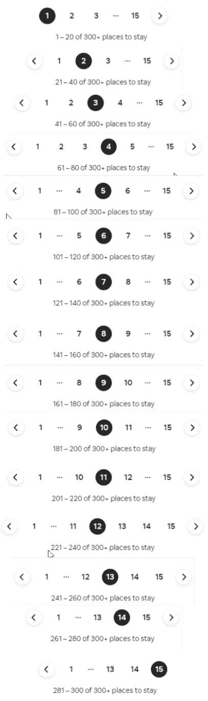
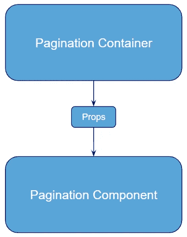
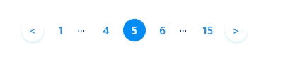
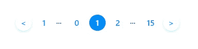
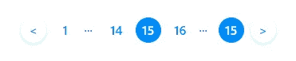
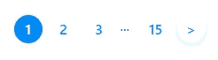
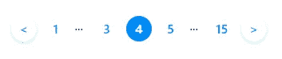
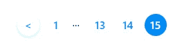
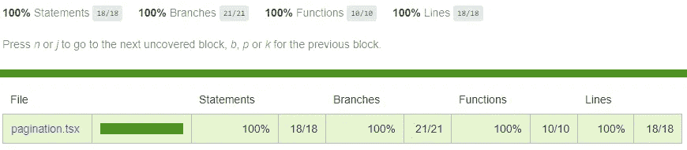

# 在 React with TypeScript 中构建分页组件

> 原文：<https://javascript.plainenglish.io/building-a-pagination-component-in-react-with-typescript-2e7f7b62b35d?source=collection_archive---------0----------------------->

## 如何在 react with TypeScript 中创建分页组件

在本文中，我将介绍如何在 react with TypeScript 中创建分页组件。目的是使它尽可能通用。它将是一个表示组件，也称为“哑组件”，因为它只显示带有样式的 html(没有状态或逻辑)。

像往常一样，我的目标是能够在 10 分钟之内让它工作。我将使用 React TypeScript 构建它，并使用带有 Sass 的 CSS 模块。我开始非常喜欢它，因为它允许将样式本地化到您的组件，所以我不必担心应用程序中的命名。为了测试，我将 jest 与酶一起使用。

## 它应该如何工作？

作为参考，我们将使用 Airbnb 的分页组件。你可以在下图中看到它是如何工作的。这些是主要特征:

*   它总是显示第一页和最后一页。
*   它总是显示至少 3 个连续的页面，通常是你所在的页面，上一页在左边，下一页在右边。在第一页的情况下，显示前 3 页，在最后一页显示最后 3 页。
*   它使用 3 个点作为第一页和上一页之间的分隔符。在下一页和最后一页之间。
*   除非在第一页，否则会出现上一页指示器。除非在最后一页，否则会出现下一页指示器。



## 建筑物

最好的方法可能是从最常见的案例开始，然后从那里改进。极端数字可能具有更复杂的逻辑，所以最好从中间数字开始。例如 5 到 8。为了使组件尽可能通用，我们将使用一个回调，这样我们可以处理父组件中的转换。



Component Tree Diagram

分页组件使用的属性有:

*   `page`:我们所在的页码。
*   `totalPages`:总页数。
*   `handlePagination`:处理分页变化的回调函数。

所以让我们开始吧！首先，我要分享所有的造型，让它更容易。你可以随意更新它。

```
// pagination.module.scss[@import](http://twitter.com/import) 'src/styles/colours.scss';
// Colour variables used: $primary, $white.paginationWrapper {
  padding: 2rem 0;
  display: flex;
  justify-content: center;
}.separator {
  width: 1rem;
  margin: 0 0.25rem;
}.pageItem {
  background: transparent;
  border: none;
  height: 2rem;
  width: 2rem;
  margin: 0 0.25rem;
  border-radius: 50%;
  font-weight: 600;
  color: $primary;&:hover {
    text-decoration: underline;
  }&:focus {
    outline: 0;
  }
}.active {
  background-color: $primary;
  color: $white;
}.sides {
  box-shadow: transparent 0px 0px 0px 1px, transparent 0px 0px 0px 4px, rgba(0, 0, 0, 0.18) 0px 2px 4px;&:hover {
    text-decoration: none;
    box-shadow: transparent 0px 0px 0px 1px, transparent 0px 0px 0px 4px, rgba(0, 0, 0, 0.12) 0px 6px 16px;
  }
}
```

为了有一个工作原型，而不是消耗一个 API，你可以使用这个`pagination container`

```
import React, { useState } from 'react';import { Pagination } from './pagination';export const PaginationContainer = () => {
  const [page, setPage] = useState(1);
  const totalPages = 15;
  const handlePages = (updatePage: number) => setPage(updatePage);return (
    <div className="container">
      <Pagination
        page={page}
        totalPages={totalPages}
        handlePagination={handlePages}
      />
    </div>
  );
};
```

这是一个非常简单的方法，初始化页面为 1，总共 15 页，回调函数会更新状态。

对于组件，第一步是显示用户所在的页面、旁边的页面、表示还有更多页面的点、第一页和最后一页以及上一页和下一页的边。

```
import React from 'react';
import classNames from 'classnames';import styles from './pagination.module.scss';export interface Props {
  page: number;
  totalPages: number;
  handlePagination: (page: number) => void;
}export const PaginationComponent: React.FC<Props> = ({
  page,
  totalPages,
  handlePagination,
}) => {
  return (
    <div className={styles.pagination}>
      <div className={styles.paginationWrapper}>
        <button
          onClick={() => handlePagination(page - 1)}
          type="button"
          className={classNames([styles.pageItem, styles.sides].join(' '))}
        >
          &lt;
        </button> <button
          onClick={() => handlePagination(1)}
          type="button"
          className={classNames(styles.pageItem)}
        >
          {1}
        </button> <div className={styles.separator}>...</div> <button
          onClick={() => handlePagination(page - 1)}
          type="button"
          className={styles.pageItem}
        >
          {page - 1}
        </button> <button
          onClick={() => handlePagination(page)}
          type="button"
          className={[styles.pageItem, styles.active].join(' ')}
        >
          {page}
        </button> <button
          onClick={() => handlePagination(page + 1)}
          type="button"
          className={styles.pageItem}
        >
          {page + 1}
        </button><div className={styles.separator}>...</div> <button
          onClick={() => handlePagination(totalPages)}
          type="button"
          className={classNames(styles.pageItem, {
            [styles.active]: page === totalPages,
          })}
        >
          {totalPages}
        </button> <button
          onClick={() => handlePagination(page + 1)}
          type="button"
          className={[styles.pageItem, styles.sides].join(' ')}
        >
          &gt;
        </button>
      </div>
    </div>
  );
};export const Pagination = PaginationComponent;
```

有了这个组件，它在开头和结尾看起来会非常奇怪，但是在中间的页面上会很棒。



Page 5 good view



Page 1 looks awful



Last page looks badly

为了解决这个问题，我们只需要一些基于特定案例的逻辑显示。

```
import React from 'react';
import classNames from 'classnames';import styles from './pagination.module.scss';export interface Props {
  page: number;
  totalPages: number;
  handlePagination: (page: number) => void;
}export const PaginationComponent: React.FC<Props> = ({
  page,
  totalPages,
  handlePagination,
}) => {
  return (
    <div className={styles.pagination}>
      <div className={styles.paginationWrapper}>
        {page !== 1 && (
          <button
            onClick={() => handlePagination(page - 1)}
            type="button"
            className={classNames([styles.pageItem, styles.sides].join(' '))}
          >
            &lt;
          </button>
        )} <button
          onClick={() => handlePagination(1)}
          type="button"
          className={classNames(styles.pageItem, {
            [styles.active]: page === 1,
          })}
        >
          {1}
        </button> {page > 3 && <div className={styles.separator}>...</div>} {page === totalPages && totalPages > 3 && (
          <button
            onClick={() => handlePagination(page - 2)}
            type="button"
            className={styles.pageItem}
          >
            {page - 2}
          </button>
        )} {page > 2 && (
          <button
            onClick={() => handlePagination(page - 1)}
            type="button"
            className={styles.pageItem}
          >
            {page - 1}
          </button>
        )} {page !== 1 && page !== totalPages && (
          <button
            onClick={() => handlePagination(page)}
            type="button"
            className={[styles.pageItem, styles.active].join(' ')}
          >
            {page}
          </button>
        )} {page < totalPages - 1 && (
          <button
            onClick={() => handlePagination(page + 1)}
            type="button"
            className={styles.pageItem}
          >
            {page + 1}
          </button>
        )} {page === 1 && totalPages > 3 && (
          <button
            onClick={() => handlePagination(page + 2)}
            type="button"
            className={styles.pageItem}
          >
            {page + 2}
          </button>
        )} {page < totalPages - 2 && <div className={styles.separator}>...</div>} <button
          onClick={() => handlePagination(totalPages)}
          type="button"
          className={classNames(styles.pageItem, {
            [styles.active]: page === totalPages,
          })}
        >
          {totalPages}
        </button> {page !== totalPages && (
          <button
            onClick={() => handlePagination(page + 1)}
            type="button"
            className={[styles.pageItem, styles.sides].join(' ')}
          >
            &gt;
          </button>
        )}
      </div>
    </div>
  );
};export const Pagination = PaginationComponent;
```

多亏了这些更新，我们将能够看到该组件在所有情况下都可以工作



Initial values



Middle values



End values

这是具有显示逻辑的组件。现在，是时候测试它了！

## 测试

为了测试它，我认为最好的选择是结合快照测试和点击一些按钮来触发`handlePagination`

在这里，我们添加了如此多的逻辑，我们将需要至少 3 个场景:一个具有初始值 1，另一个具有中间值，另一个具有最大值。

```
import React from 'react';
import { mount } from 'enzyme';import { Pagination, Props } from '../pagination';describe('<Pagination />', () => {
  it('renders the component from the beginning', () => {
    const mockProps: Props = {
      page: 1,
      totalPages: 5,
      handlePagination: jest.fn(),
    };
    const wrapper = mount(<Pagination {...mockProps} />); wrapper.find('button').at(0).simulate('click');
    expect(mockProps.handlePagination).toBeCalledWith(1); wrapper.find('button').at(1).simulate('click');
    expect(mockProps.handlePagination).toBeCalledWith(2); wrapper.find('button').at(2).simulate('click');
    expect(mockProps.handlePagination).toBeCalledWith(3); wrapper.find('button').at(3).simulate('click');
    expect(mockProps.handlePagination).toBeCalledWith(5); wrapper.find('button').at(4).simulate('click');
    expect(mockProps.handlePagination).toBeCalledWith(2); expect(wrapper.render()).toMatchSnapshot();
  });it('renders the component from the end', () => {
    const mockProps: Props = {
      page: 5,
      totalPages: 5,
      handlePagination: jest.fn(),
    };
    const wrapper = mount(<Pagination {...mockProps} />); wrapper.find('button').at(0).simulate('click');
    expect(mockProps.handlePagination).toBeCalledWith(4); wrapper.find('button').at(1).simulate('click');
    expect(mockProps.handlePagination).toBeCalledWith(1); wrapper.find('button').at(2).simulate('click');
    expect(mockProps.handlePagination).toBeCalledWith(3); wrapper.find('button').at(3).simulate('click');
    expect(mockProps.handlePagination).toBeCalledWith(4); wrapper.find('button').at(4).simulate('click');
    expect(mockProps.handlePagination).toBeCalledWith(5);expect(wrapper.render()).toMatchSnapshot();
  });it('renders the component from the middle', () => {
    const mockProps: Props = {
      page: 3,
      totalPages: 5,
      handlePagination: jest.fn(),
    };
    const wrapper = mount(<Pagination {...mockProps} />); wrapper.find('button').at(0).simulate('click');
    expect(mockProps.handlePagination).toBeCalledWith(2); wrapper.find('button').at(1).simulate('click');
    expect(mockProps.handlePagination).toBeCalledWith(1); wrapper.find('button').at(2).simulate('click');
    expect(mockProps.handlePagination).toBeCalledWith(2); wrapper.find('button').at(3).simulate('click');
    expect(mockProps.handlePagination).toBeCalledWith(3); wrapper.find('button').at(4).simulate('click');
    expect(mockProps.handlePagination).toBeCalledWith(4); wrapper.find('button').at(5).simulate('click');
    expect(mockProps.handlePagination).toBeCalledWith(5); wrapper.find('button').at(6).simulate('click');
    expect(mockProps.handlePagination).toBeCalledWith(4); expect(wrapper.render()).toMatchSnapshot();
  });
});
```

这样，我们就可以对所有组件进行正确的测试！！



## 丰富

一如既往，可能还有改进的空间。如果您有任何想法或建议，请在下面发表评论。