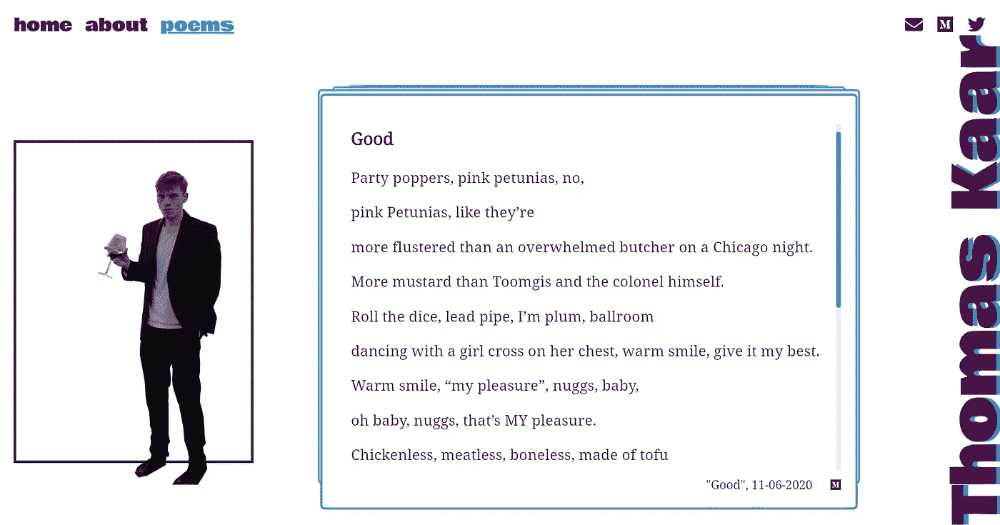

# 用盖茨比和一个媒体源建立一个诗歌网站

> 原文：<https://javascript.plainenglish.io/building-a-poetry-site-with-gatsby-and-a-medium-feed-a481951855a0?source=collection_archive---------16----------------------->

## 我如何用 GatsbyJS 和一个中等作者的 feed 建立一个静态诗歌网站。



# 目录

## 简介
技术
重点&考虑事项
开发
将您的 Gatsby 站点部署到 S3
应用摘要
要点

# 介绍

托马斯·卡尔，也被称为内特·阿斯特罗，写诗反映过渡和安全时期。他的作品藏在他的个人日记、电脑上的文本文件以及 Medium 的无限卷轴中。诗人需要一个平台来反映他的散文的声音和节奏，所以这就是我寻求建立的。

你可以点击查看网站[。(自从我发表这篇文章后，它可能已经发生了变化，因为我把它交给了 Tommy，他也是一名开发人员。)](http://poems-by-thomas-kaar.s3-website.us-east-2.amazonaws.com/)

现在，这不是一个关于如何建立一个 Gatsby 站点的严格的教程——它更多的是为 Tommy 准备的文档，所以我没有多少时间亲自解释。

# 技术

## 为什么是盖茨比？

我熟悉 React，但我很想试试 Next 或 Gatsby。以下是我选择盖茨比的原因:

*   **无路由器** — Gatsby 设置了 react-router，将页面/目录中的所有组件转换为路由。
*   **插件** —你可以找到任何你需要的插件。
*   **GraphQL** — Gatsby 自带 GraphQL 集成。

## 媒体免费数据存储

作者已经在 Medium 上发布了他的作品 Medium 有丰富的内容编辑系统、用户认证和免费托管。我可以选择创建我自己的内容编辑系统，由 cross 发布在他的网站上，或者我可以直接从他的媒体源获取。

Medium 没有一种优雅的方式来获取用户的故事。幸运的是，[约翰·克拉克](https://medium.com/u/54593f6dc404?source=post_page-----a481951855a0--------------------------------)创造了**盖茨比-媒体-rss-feed** 为我做到了这一点。也没有办法(据我所知)在用户的故事和回复之间进行过滤——所以我要求作者永远不要用那个媒介账号发布任何回复，这样诗歌提要就不会和他的回复混在一起了。

# 重点和注意事项

## 松散地遵循设计

因为我是设计者和开发者，我可以做任何我想做的事情。因此，如果我在开发过程中发现了潜在的设计改进，我就会去做。

## 移动响应能力

在我建立的所有网站中，我从来没有耐心去做一个合适的移动响应设计。这一次，我强迫自己在构建组件时测试每个组件的响应性，而不是把响应性留到最后。

## CSS 预处理程序

我通常只使用普通的 CSS，但我需要开始使用预处理器。我最初是用普通的 CSS 来构建这个站点的，但是后来把我的。css 文件到。更简洁的代码。跟踪$紫色和$蓝色肯定比到处跟踪#4A0D4A 和#398FC7 容易。

# 发展

## 01.盖茨比入门

我只是按照[快速入门教程](https://www.gatsbyjs.com/docs/quick-start/)来的。然后，你开始编码！

```
> gatsby develop
```

一旦你运行了它，你就可以访问你的站点和你的 GraphQL 服务器了。

*   站点— [http://localhost:8000/](http://localhost:8000/)
*   graph QL—[https://localhost:8000/_ _ _ graph QL](http://localhost:8000/___graphql)

以下是我遇到的一些设置问题:

*   不要在依赖关系中包含 **gatsby-cli** 。(是的，我犯了那个错误)。
*   在 Ubuntu bash for windows 10 上运行 Node 和命令行有出入。因此，如果您使用的是 Windows，请使用命令行。

## 02.开发页面

我将大部分静态内容存储在 *siteMetadata* 下的 *gatsby.config.js* 中(现在已经很重了)，并用 gatsby 的 GraphQL 静态查询组件进行查询(参见步骤 05 中的例子)。我创建了一个布局组件，包含我的标题、导航条、侧边图片和标题，可以在每个页面上使用。

## 03.发展风格

*   **Gatsby-plugin-we b-font-loader—**导入并使用“Bowlby one”和“Noto serif”谷歌字体

*   **gatsby-plugin-sass** —使用 sassy css (scss)。除非插件已经更新到现在(2020 年 12 月)，确保你安装的 **node-sass v14.14.1** 而不是 v15.0.0，否则会出错。
*   **Gatsby-plugin-font awesome-CSS**—导入并使用“信封”、“中”和“推特”图标作为可重用的图标组件。

## 04.开发屏幕对媒体询问的响应能力

*   **标题&文字大小** —根据屏幕大小计算的字体大小。

*   **@ artsy/fresnel**—一个用于媒体查询的 npm 包，因为基于媒体大小的有条件渲染无法与服务器端渲染设置一起正常工作。通过使用这个包，所有断点都由服务器呈现。请继续阅读，看看我是如何使用它的，或者阅读他们的[文档](https://github.com/artsy/fresnel)了解更多信息。

要使用它， **@artsy/fresnel** ，您必须生成媒体组件，并用 MediaContextProvider 组件包装您的应用程序。

文件 *media.js* 创建媒体组件集。

*gatsby-browser.js* 文件允许您在浏览器中响应操作。 *gatsby-ssr.js* 文件让您可以在静态 HTML 文件呈现时对其进行修改。您必须在两个文件中用 MediaContextProvider 组件包装您的应用程序(它们应该看起来相同)。

这是我如何在 *layout.js* 中使用媒体组件的一个例子——这里我想在手机屏幕的一些页面上隐藏一些组件。

## 05.发展诗歌的堆栈

*   **gatsby-medium-rss-feed 插件**—获取一个 medium 作者的 feed 并将其转换为 JSON 节点，该节点可由名为< name > Feed 的 GraphQL 端点访问。请参见下一个代码块中的查询示例。

*   **react-swipe able-cards**——一个类似 tinder 的可刷卡的 npm 包。这是一种痛苦，因为 swipe 功能已经过时或者不适合 Gatsby……无论如何，我使用 GraphQL 查询从 Medium feed 的每首诗中获取我需要的信息字段和内容。

【更新】如果你没有把卡组件包装在自己的组件里，刷卡功能也是可以的。

*   **显示诗歌正文—**Medium 中的故事正文是一个很长的 html 字符串，所以我危险地显示了这个 html 字符串，并用一个正则表达式字符串删除了我不想要的部分(图形、图像和标题)。

# 将您的 Gatsby 站点部署到 S3

*   **gatsby-plugin-s3**——将你构建的 Gatsby 应用程序直接部署到一个 S3 桶上——非常简单！

1.  安装插件并在 *gatsby.config.js.* 中包含您的 bucket 名称和地区

2.在您的环境中获取并保存您的 AWS_ACCESS_KEY_ID 和 AWS_SECRET_ACCESS_KEY。

```
@ windows cmd
> set AWS_ACCESS_KEY_ID = xxxxxxxxxx
> set AWS_SECRET_ACCESS_KEY = xxxxxxxxx@ linux terminal
> AWS_ACCESS_KEY_ID = xxxxxxxxxx
> AWS_SECRET_ACCESS_KEY = xxxxxxxxx
```

3.在*http://<bucket-name>. S3-website 构建、部署和查看您的站点。region > .amazon.com* 或者随便你的网站名称是什么。

```
> npm run clean (optional)
> npm run build && npm run deploy
```

# 应用程序摘要

这里是我的文件结构和我用来构建这个应用程序的包的一个小概述。

这是我的文件结构(只显示相关文件)

```
| src/
| | components/        // components
| | pages/             // pages(routes)
| | scss/              // scss styles
| html.js
| media.js             // Media components
| static/              // images
| gatsby-browser.js    // catch browser actions
| gatby-config.js      // Gatsby plugins & metadata
| gatsby-ssr.js        // alter static html
| package-lock.json
| package.json
```

这些是我安装的软件包

这些是我的盖茨比插件

# 外卖食品

盖茨比值得大肆宣传。开发人员节省了大量的时间，不用试图找出路由、设置 GraphQL、合并大量 npm 包、部署等等，因为 Gatsby 为他们做了这些。如果没有我的插件和路由器，我想我会花两倍的时间来建立这个网站。

如果我继续做这个网站，我会把它变成一个进步的网络应用。但是，我认为在这发生之前，刷卡功能应该是完美的。

接下来，我要用 Next 做一些东西，看看它和盖茨比相比如何。

## 感谢阅读！

如果你想了解这个网站是如何设计的，可以看看这个案例研究。

[](https://medium.com/design-bootcamp/case-study-designing-a-unique-poetry-reading-experience-8c858b92133b) [## 案例研究:设计独特的诗歌阅读体验

### 设计一种有趣且现代的诗歌阅读方式。

medium.com](https://medium.com/design-bootcamp/case-study-designing-a-unique-poetry-reading-experience-8c858b92133b) 

看看汤米的诗——因为这是这个网站的全部内容。

[](https://www.medium.com/@thomkaar) [## 托马斯·卡尔-中等

### 派对狂欢者，粉红矮牵牛花，不，粉红矮牵牛花，就像他们比芝加哥的一个不知所措的屠夫还要慌张…

www.medium.com](https://www.medium.com/@thomkaar)