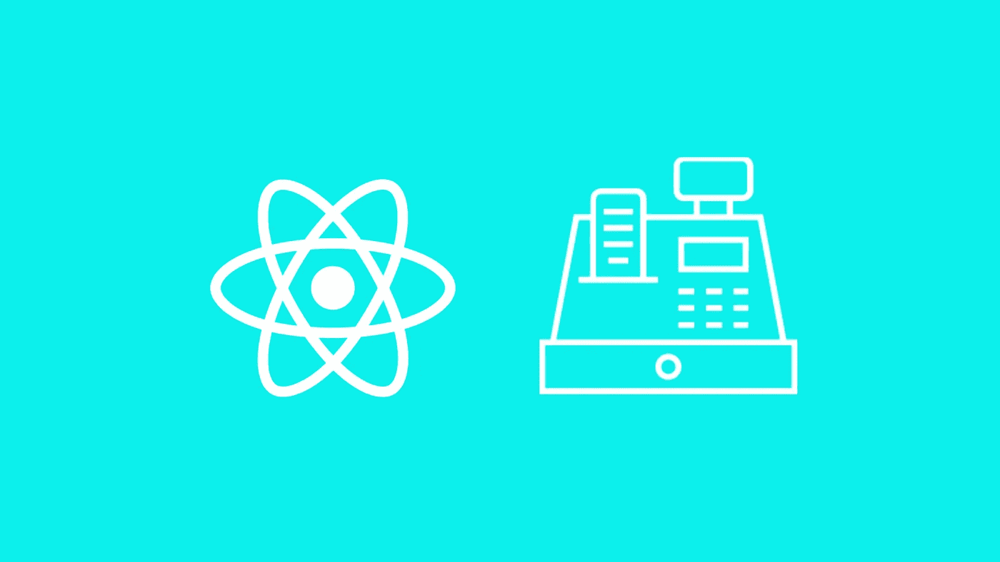

# 用 Node & React 构建销售点系统

> 原文：<https://javascript.plainenglish.io/building-a-point-of-sale-system-with-node-react-c2c0395ccaca?source=collection_archive---------0----------------------->



## 用 React 和 Node 构建一个实时应用的前端和后端！

本教程将由两部分组成

## **第一部分(后端)**

1.  框架描述
2.  从头开始构建节点应用程序
3.  邮递员测试

## **第二部分(前端)**

1.创建模板 React 应用程序。

2.创建路线和视图。

*本教程推荐使用* [*VSCode 编辑器*](https://code.visualstudio.com/download) *。*

## **框架描述和安装**

下面是我们将使用的库和框架:

[](https://github.com/louischatriot/nedb)**:NeDB 与 SQLite 非常相似，它是一个更大的数据库系统的较小的可嵌入版本。NeDB 是一个模仿 MongoDB 的较小的 NoSQL 数据存储。**

**[**Socket . io**](https://socket.io/):Socket。IO 支持基于事件的实时双向通信。它可以在任何平台、浏览器或设备上运行，同样注重可靠性和速度。
[**express**](https://expressjs.com/):Express 是 Node.js 的一个快速、非个性化、极简的 web 框架，Express 的特性将使我们能够创建我们的 web 服务器。
**async**
[**Nodemon**](https://nodemon.io/):Nodemon 检查源代码中的更改，并自动重启服务器。
**body-parser**:body-parser 提取传入请求流的整个主体部分，并在 req.body 上公开它。
**HTTP** : Http 允许 Node.js 通过超文本传输协议(HTTP)传输数据。**

**让我们继续用 node.js 创建后端，我假设您已经安装了 [node 和 NPM](https://nodejs.org/en/download/)。**

# **第 1 部分:后端**

**在本教程中，我们将从头开始创建节点应用程序(快速应用程序)。也可以使用 [ejs 模板](http://www.embeddedjs.com/)自动完成。**

**通过命令行界面(CLI)创建一个名为`real-time-pos-system`的目录**

**`mkdir real-rime-pos-system`**

**通过 CLI 访问文件夹，因此:**

**`cd real-time-pos-system`**

**在您的`real-time-pos-system`文件夹中，从 CLI 创建名为`server`的新文件夹**

**`mkdir server`**

**让我们安装我们的依赖项:**

**`npm init`**

**按下`enter`按钮，出现以下问题:**

```
package name: (server) Press Enter
version: (1.0.0) Press Enter
description:    Node.js app that connect the react-pos app to the Database 
entry point:(index.js) Press Enter
test command:     Press Enter
git repository: Press Enter
keywords:   Press Enter
author: Enter Your Name
license: (ISC) MIT
```

**您将看到以下消息:**

```
{
    "name": "server"
    version: "1.0.0"
    "description": "Node.js app that connect the react-pos app to the Database 
    "main" : "index.js",
    "scripts": {
       test": "echo \"Error: no test specified\ specified\" && exit 1"
},
"author": "Your Name",
"license": "MIT"
}Is this ok?(yes) yes
```

## ****安装以下依赖项**:**

**`npm install express --save`**

**`npm install http --save`**

**`npm install nodemon --save`**

**`npm install nedb --save`**

**使用编辑器在`real-time-pos-system`文件夹中创建一个名为`index.js`的文件。**

**`index.js`是我们的节点应用程序的入口点，如你所见，它位于我们的应用程序的根目录中。**

**在您的`index.js`文件中插入以下代码**

```
var express = require("express"),
  http = require("http"),
  port = 80,
  app = require("express")(),
  server = http.createServer(app),
  bodyParser = require("body-parser"),
  io = require("socket.io")(server),
  liveCart;console.log("Real time POS running");
console.log("Server started");
app.use(bodyParser.json());
app.use(bodyParser.urlencoded({ extended: false }));app.all("/*", function(req, res, next) {
  // CORS headers
  res.header("Access-Control-Allow-Origin", "*"); // restrict it to the required domain
  res.header("Access-Control-Allow-Methods", "GET,PUT,POST,DELETE,OPTIONS");
  // Set custom headers for CORS
  res.header(
    "Access-Control-Allow-Headers",
    "Content-type,Accept,X-Access-Token,X-Key"
  );
  if (req.method == "OPTIONS") {
    res.status(200).end();
  } else {
    next();
  }
});app.get("/", function(req, res) {
  res.send(" Real time POS web app running.");
});app.use("/api/inventory", require("./api/inventory"));
app.use("/api", require("./api/transactions"));// Websocket logic for Live Cart
io.on("connection", function(socket) {
  socket.on("cart-transaction-complete", function() {
    socket.broadcast.emit("update-live-cart-display", {});
  });// on page load, show user current cart
  socket.on("live-cart-page-loaded", function() {
    socket.emit("update-live-cart-display", liveCart);
  });// when client connected, make client update live cart
  socket.emit("update-live-cart-display", liveCart);// when the cart data is updated by the POS
  socket.on("update-live-cart", function(cartData) {
    // keep track of it
    liveCart = cartData;// broadcast updated live cart to all websocket clients
    socket.broadcast.emit("update-live-cart-display", liveCart);
  });
});server.listen(port, () => console.log(`Listening on port ${port}`));
```

## ****index.js 解释****

**这个文件是我们的 node express 应用程序的入口点。它由处理浏览器的请求和响应的路由组成。**

**下面是分配给变量的依赖关系。**

```
var express = require("express"),
  http = require("http"),
  port = 80,
  app = require("express")(),
  server = http.createServer(app),
  bodyParser = require("body-parser"),
  io = require("socket.io")(server),
  liveCart
```

**下面，express 变量`app`用于允许使用 http 请求体将数据发送到数据库。**

```
app.use(bodyParser.json());
app.use(bodyParser.urlencoded({ extended: false }))
```

**以下是代表库存和交易路线的导入文件。**

**`app.use("/api/inventory", require("./api/inventory"))`**

**`app.use("/api/transactions", require("./api/transactions"))`**

**跨源资源共享(CORS)是一种机制，它允许从提供第一资源的域之外的另一个域请求网页上的受限资源(例如字体)。—维基百科**

**下面，节点应用程序被限制为使用 CORS 内的资源，并允许使用指定的方法`GET` `PUT` `POST` `DELETE`和`OPTIONS`。**

```
app.all("/*", function(req, res, next) {
  // CORS headers
  res.header("Access-Control-Allow-Origin", "*"); // restrict it to the required domain
  res.header("Access-Control-Allow-Methods", "GET,PUT,POST,DELETE,OPTIONS");
  // Set custom headers for CORS
  res.header(
    "Access-Control-Allow-Headers",
    "Content-type,Accept,X-Access-Token,X-Key"
  );
  if (req.method == "OPTIONS") {
    res.status(200).end();
  } else {
    next();
  }
});
```

**下面是节点 app 默认路由**

```
app.get("/", function(req, res) {
  res.send(" Real time POS web app running.");
});
```

**Live Cart 的 Websocket 逻辑**

```
io.on("connection", function(socket) {
  socket.on("cart-transaction-complete", function() {
    socket.broadcast.emit("update-live-cart-display", {});
  });
```

**在页面加载时，给用户当前购物车**

```
socket.on("live-cart-page-loaded", function() {
    socket.emit("update-live-cart-display", liveCart);
  });
```

**在页面加载时，让客户端更新实时购物车**

```
socket.emit("update-live-cart-display", liveCart)
```

**当购物车数据被 POS 更新并跟踪它时**

```
socket.on("update-live-cart", function(cartData) {
    liveCart = cartData;
```

**向所有 WebSocket 客户端广播更新的实时购物车**

```
socket.broadcast.emit("update-live-cart-display", liveCart);
 });
```

**让我们继续，在`server`目录下创建一个目录:**

**`mkdir api`**

**在 api 文件夹中创建两个名为`inventory.js`和`transactions.js`的文件**

**将以下代码插入到您的`inventory.js`中:**

```
var app = require("express")();
var server = require("http").Server(app);
var bodyParser = require("body-parser");
var Datastore = require("nedb");
var async = require("async");app.use(bodyParser.json());module.exports = app;// Creates  Database
var inventoryDB = new Datastore({
  filename: "./server/databases/inventory.db",
  autoload: true
});// GET inventory
app.get("/", function(req, res) {
  res.send("Inventory API");
});// GET a product from inventory by _id
app.get("/product/:productId", function(req, res) {
  if (!req.params.productId) {
    res.status(500).send("ID field is required.");
  } else {
    inventoryDB.findOne({ _id: req.params.productId }, function(err, product) {
      res.send(product);
    });
  }
});// GET all inventory products
app.get("/products", function(req, res) {
  inventoryDB.find({}, function(err, docs) {
    console.log("sending inventory products");
    res.send(docs);
  });
});// Create inventory product
app.post("/product", function(req, res) {
  var newProduct = req.body;inventoryDB.insert(newProduct, function(err, product) {
    if (err) res.status(500).send(err);
    else res.send(product);
  });
});app.delete("/product/:productId", function(req, res) {
  inventoryDB.remove({ _id: req.params.productId }, function(err, numRemoved) {
    if (err) res.status(500).send(err);
    else res.sendStatus(200);
  });
});// Updates inventory product
app.put("/product", function(req, res) {
  var productId = req.body._id;inventoryDB.update({ _id: productId }, req.body, {}, function(
    err,
    numReplaced,
    product
  ) {
    if (err) res.status(500).send(err);
    else res.sendStatus(200);
  });
});app.decrementInventory = function(products) {
  async.eachSeries(products, function(transactionProduct, callback) {
    inventoryDB.findOne({ _id: transactionProduct._id }, function(
      err,
      product
    ) {
      // catch manually added items (don't exist in inventory)
      if (!product || !product.quantity_on_hand) {
        callback();
      } else {
        var updatedQuantity =
          parseInt(product.quantity_on_hand) -
          parseInt(transactionProduct.quantity);inventoryDB.update(
          { _id: product._id },
          { $set: { quantity_on_hand: updatedQuantity } },
          {},
          callback
        );
      }
    });
  });
};
```

## ****inventory.js 解释****

**必要的依赖关系被分配给变量`app`、`server`、`bodyParser`和`Datastore`。`app.use(bodyParser.json())`将允许将 HTTP 请求的正文发送到数据库。**

**库存变量`inventoryDB`被分配了一个我们之前创建的
**nedb** 变量`Datastore`的实例。一个实例的`DataStore`
有两个选项`filename`指定数据库的路径和自动加载，如果设置为真，自动加载数据库。**

**`app.get("/, function(req, res)`功能是库存数据库的默认路径。**

**`app.get("/product/:/productId`功能使应用程序能够使用产品的 ID 从库存数据库中获取产品。**

**`app.get("/products", function(req, res)`功能从库存数据库中获取所有产品。**

**`app.post("/product", function(req, res)`功能用于将库存产品保存到数据库中。**

**`app.delete("/product/:productId", function(req, res)`用于删除使用产品标识的产品。**

**`app.put("/product", function(req, res)`使用产品标识更新产品。**

**让我们继续，将以下代码插入到您的`transaction.js`文件中:**

```
var app 	= require('express')()
var server 	= require('http').Server(app)
var bodyParser = require('body-parser')
var Datastore = require('nedb')var Inventory = require('./inventory')app.use(bodyParser.json())module.exports = app// Create Database
var Transactions = new Datastore({ 
	filename: './server/databases/transactions.db', 
	autoload: true 
})app.get('/', function (req, res) {
	res.send('Transactions API')
})// GET all transactions
app.get('/all', function (req, res) {Transactions.find({}, function (err, docs) {
		res.send(docs)
	})
})// GET all transactions
app.get('/limit', function (req, res) {var limit = parseInt(req.query.limit, 10)
	if (!limit) limit = 5Transactions.find({}).limit(limit).sort({ date: -1 }).exec(function (err, docs) {
	  res.send(docs)
	})
})// GET total sales for the current day
app.get('/day-total', function (req, res) {// if date is provided
	if (req.query.date) {
		startDate = new Date(req.query.date)
		startDate.setHours(0,0,0,0)endDate = new Date(req.query.date)
		endDate.setHours(23,59,59,999)
	}
	else {// beginning of current day
		var startDate = new Date()
		startDate.setHours(0,0,0,0)// end of current day
		var endDate = new Date()
		endDate.setHours(23,59,59,999)	
	}Transactions.find({ date: { $gte: startDate.toJSON(), $lte: endDate.toJSON() } }, function (err, docs) {

		var result = {
			date: startDate
		}if (docs) {var total = docs.reduce(function (p, c) {
				return p + c.total
			}, 0.00)result.total = parseFloat(parseFloat(total).toFixed(2))res.send(result)
		}
		else {
			result.total = 0
			res.send(result)
		}
	})	
})// GET transactions for a particular date
app.get('/by-date', function (req, res) {

	var startDate = new Date(2018, 2, 21)
	startDate.setHours(0,0,0,0)var endDate = new Date(2015, 2, 21)
	endDate.setHours(23,59,59,999)Transactions.find({ date: { $gte: startDate.toJSON(), $lte: endDate.toJSON() } }, function (err, docs) {
		if (docs)
			res.send(docs)
	})
})// Add new transaction
app.post('/new', function (req, res) {var newTransaction = req.body

	Transactions.insert(newTransaction, function (err, transaction) {
		if (err) 
			res.status(500).send(err)
		else {
			res.sendStatus(200)
			Inventory.decrementInventory(transaction.products)
		} 
	})
})// GET a single transaction
app.get('/:transactionId', function (req, res) {Transactions.find({ _id: req.params.transactionId }, function (err, doc) {
		if (doc)
			res.send(doc[0])
	})
})
```

## ****交易. js 解释****

**如前所述，必要的依赖关系被分配给变量。**

**如前所述，使用文件名创建事务变量，并使用 **nedb** 变量`Datastore`自动加载。**

**`app.get("/, function(req, res)`功能是`transactions`数据库的默认路径。**

**`app.get('/all', function (req, res)`功能从事务数据库中检索所有事务。**

**`app.get('/limit', function (req, res)`功能检索指定限额的交易。**

**`app.get('/day-total', function (req, res)`功能是获取当天的总销售额。**

**`app.get('/by-date', function (req, res)`功能用于获取特定日期的交易**

**`app.post('/new', function (req, res))`功能用于添加新的交易**

**`app.get('/:transactionId', function (req, res)`函数用于检索单个交易。**

****要使用 CLI 从根目录启动 Node app，请键入命令**:**

**`nodemon index.js`**

**这就是后端排序！**

# **第 2 部分:前端**

**我们将完成以下任务:**

**1.创建模板 React 应用程序。
2。使用代码描述创建路线和视图。**

**参见[此处](https://github.com/kels-orien/real-time-pos-system)了解我们将使用的源代码
框架:**

**axios 是一个基于 Promise 的 HTTP 客户端，用于浏览器和 node.js。**

****Bootstrap** 是一个免费的开源库，包含用于设计网站和 web 应用程序的 HTML 和 CSS 设计模板。**

****React-Bootstrap** 是用 React 构建的 Bootstrap 3 组件。**

**是一个轻量级的 JavaScript 日期库，用于解析、验证、操作和格式化日期。**

****React** 是一个用于构建用户界面的 JavaScript 库。**

## ****创建模板 React App****

**确保您已经安装了[节点和 NPM](https://nodejs.org/en/download/) 。**

**通过命令行界面(CLI)检查节点和 Npm 版本**

**`node -v`**

**`npm -v`**

**使用 CLI 访问我们在第 1 部分中使用的`real-time-pos-folder`,使用 npm 全局创建 react 应用程序:**

**对于 npm 版本 5.1 或更低版本
`npm install -g create-react-app`**

**要创建您的应用程序，运行一个命令
NPM install create-react-app react-pos**

**对于 npm 版本 5.2 及更高版本
`npx install -g create-react-app`**

**要创建我们的约会计划程序，运行一个命令
`npx install create-react-app react-pos`**

**您的应用程序的目录如下所示:**

**react-pos
`├── README.md`
`├── node_modules`
`├── package.json`
`├── .gitignore`
`├── public`
`│ └── favicon.ico`
`│ └── index.html`
`│ └── manifest.json`
`└── src`
`└── App.css`
`└── App.js`
`└── App.test.js`
`└── index.css`
`└── index.js`
`└── logo.svg`
`└── registerServiceWorker.js`**

**通过 CLI
`npm start`以开发模式启动项目**

**使用
`cd react-pos`访问您的应用目录**

**安装以下依赖项:
`npm install bootstrap`**

**`npm install react-bootstrap`**

**`npm install axios`**

**`npm install moment`**

****创建路线和视图****

**我们将从创建路线开始**

**首先用下面的代码编辑根目录中的`App.js`:**

```
import React from "react";
import Header from "./js/components/Header";
import Main from "./js/components/Main";const App = () => (
  <div>
    <Main />
  </div>
);export default App;
```

**同时更新根目录中的`index.js`:**

```
import React from "react";
import { render } from "react-dom";
import { BrowserRouter } from "react-router-dom";
import registerServiceWorker from "./registerServiceWorker";
import "./index.css";
import "bootstrap/dist/css/bootstrap.css";
import { makeRoutes } from "./routes";
import App from "./App";render(
  <BrowserRouter>
    <App />
  </BrowserRouter>,
  document.getElementById("root")
);
registerServiceWorker();
```

**您可能想知道`Main`和`Header`组件，但是我们很快就会创建它们:**

**在 react-pos 应用程序的“src”文件夹目录中创建以下路径:**

**`js/components`**

**使用以下代码在`js/components`文件夹中创建 Main.js:**

```
import React from "react";
import { Switch, Route } from "react-router-dom";
import Inventory from "./Inventory";
import Pos from "./Pos";
import Transactions from "./Transactions";
import LiveCart from "./LiveCart";const Main = () => (
  <main>
    <Switch>
      <Route exact path="/" component={Pos} />
      <Route path="/inventory" component={Inventory} />
      <Route path="/transactions" component={Transactions} />
      <Route path="/livecart" component={LiveCart} />
    </Switch>
  </main>
);export default Main;
```

**注意我们的`Main.js`组件不是一个类；相反，它是一个功能组件。准确地说是箭头功能。我们正在使用函数创建路线。**

**让我们为应用程序的导航创建我们的`Header.js`组件**

```
import React from "react";
import { Link } from "react-router-dom";// The Header creates links that can be used to navigate
// between routes.
const Header = () => (
  <div className="text-center">
    <h1>
      <a href="/#/">Real Time Point POS</a>
    </h1><ul className="nav-menu">
      <li className="lead">
        <Link to="/inventory">Inventory</Link>
      </li>
      <li className="lead">
        <Link to="/">POS</Link>
      </li>
      <li className="lead">
        <Link to="/transactions">Transactions</Link>
      </li>
      <li className="lead">
        <Link to="/livecart">LiveCart</Link>
      </li>
    </ul>
  </div>
);export default Header;
```

**随着我们的继续，你会注意到`Header`组件包含在所有父组件中。**

**现在让我们创建我们的视图，让我们从`src/js/component/`文件夹中的`Inventory.js`组件开始。**

```
import React, { Component } from "react";
import "./App.css";
import Header from "./Header";
import Product from "./Product";
import axios from "axios";const HOST = "[http://localhost:80](http://localhost/)";class Inventory extends Component {
  constructor(props) {
    super(props);this.state = { products: [] };
  }
  componentWillMount() {
    var url = HOST + `/api/inventory/products`;
    axios.get(url).then(response => {
      this.setState({ products: response.data });
    });
  }
  render() {
    var { products } = this.state;var renderProducts = () => {
      if (products.length === 0) {
        return <p>{products}</p>;
      }
      return products.map(product => <Product {...product} />);
    };return (
      <div>
        <Header /><div class="container">
          <a
            href="#/inventory/create-product"
            class="btn btn-success pull-right"
          >
            <i class="glyphicon glyphicon-plus" /> Add New Item
          </a>
          <br />
          <br /><table class="table">
            <thead>
              <tr>
                <th scope="col">Name</th>
                <th scope="col">Price</th>
                <th scope="col">Quantity on Hand</th>
                <th />
              </tr>
            </thead>
            <tbody>{renderProducts()}</tbody>
          </table>
        </div>
      </div>
    );
  }
}export default Inventory;
```

**注意，我们为上面的`inventory`组件使用了一个类。`componentWillMount`是一种用于修改组件状态的生命周期方法，在这种特殊情况下，我们通过在第 1 部分中创建的 Node.js Express 应用程序从库存数据库中检索产品。使用`setState`将响应分配给产品阵列。所有这些都是在页面完全加载之前完成的。**

**`render`函数将在 DOM(文档对象模型)中显示我们的 UI 元素。`renderFunction`检查产品数组并在 DOM 中显示结果。**

**让我们继续讨论`POS.js`组件。`Pos`组件将允许用户添加价格的购物车项目。购物车会实时更新。**

**在`src/js/component/`文件夹中创建一个`Pos.js`文件:**

```
import React, { Component } from "react";
import "./App.css";
import Header from "./Header";
import io from "socket.io-client";
import axios from "axios";
import moment from "moment";
import { Modal, Button } from "react-bootstrap";
import LivePos from "./LivePos";const HOST = "[http://localhost:80](http://localhost/)";
let socket = io.connect(HOST);class Pos extends Component {
  constructor(props) {
    super(props);
    this.state = {
      items: [],
      quantity: 1,
      id: 0,
      open: true,
      close: false,
      addItemModal: false,
      checkOutModal: false,
      amountDueModal: false,
      totalPayment: 0,
      total: 0,
      changeDue: 0,
      name: "",
      price: 0
    };
    this.handleSubmit = this.handleSubmit.bind(this);
    this.handleName = this.handleName.bind(this);
    this.handlePrice = this.handlePrice.bind(this);
    this.handlePayment = this.handlePayment.bind(this);
    this.handleQuantityChange = this.handleQuantityChange.bind(this);
    this.handleCheckOut = this.handleCheckOut.bind(this);
  }
  componentDidUpdate() {
    if (this.state.items.length !== 0) {
      socket.emit("update-live-cart", this.state.items);
    }
  }
  handleSubmit = e => {
    e.preventDefault();
    this.setState({ addItemModal: false });const currentItem = {
      id: this.state.id++,
      name: this.state.name,
      price: this.state.price,
      quantity: this.state.quantity
    };
    var items = this.state.items;
    items.push(currentItem);
    this.setState({ items: items });
  };
  handleName = e => {
    this.setState({ name: e.target.value });
  };
  handlePrice = e => {
    this.setState({ price: e.target.value });
  };
  handlePayment = () => {
    this.setState({ checkOutModal: false });
    var amountDiff =
      parseInt(this.state.total, 10) - parseInt(this.state.totalPayment, 10);
    if (this.state.total <= this.state.totalPayment) {
      this.setState({ changeDue: amountDiff });
      this.setState({ receiptModal: true });
      this.handleSaveToDB();
      this.setState({ items: [] });
      this.setState({ total: 0 });
    } else {
      this.setState({ changeDue: amountDiff });
      this.setState({ amountDueModal: true });
    }
  };
  handleQuantityChange = (id, quantity) => {
    var items = this.state.items;
    for (var i = 0; i < items.length; i++) {
      if (items[i].id === id) {
        items[i].quantity = quantity;
        this.setState({ items: items });
      }
    }
  };
  handleCheckOut = () => {
    this.setState({ checkOutModal: true });
    var items = this.state.items;
    var totalCost = 0;
    for (var i = 0; i < items.length; i++) {
      var price = items[i].price * items[i].quantity;
      totalCost = parseInt(totalCost, 10) + parseInt(price, 10);
    }
    this.setState({ total: totalCost });
  };
  handleSaveToDB = () => {
    const transaction = {
      date: moment().format("DD-MMM-YYYY HH:mm:ss"),
      total: this.state.total,
      items: this.state.items
    };
    axios.post(HOST + "/api/new", transaction).catch(err => {
      console.log(err);
    });
  };
  render() {
    var { quantity, modal, items } = this.state;var renderAmountDue = () => {
      return (
        <Modal show={this.state.amountDueModal}>
          <Modal.Header closeButton>
            <Modal.Title>Amount</Modal.Title>
          </Modal.Header>
          <Modal.Body>
            <h3>
              Amount Due:
              <span class="text-danger">{this.state.changeDue}</span>
            </h3>
            <p>Customer payment incomplete; Correct and Try again</p>
          </Modal.Body>
          <Modal.Footer>
            <Button onClick={() => this.setState({ amountDueModal: false })}>
              close
            </Button>
          </Modal.Footer>
        </Modal>
      );
    };
    var renderReceipt = () => {
      return (
        <Modal show={this.state.receiptModal}>
          <Modal.Header closeButton>
            <Modal.Title>Receipt</Modal.Title>
          </Modal.Header>
          <Modal.Body>
            <h3>
              Total:
              <span class="text-danger">{this.state.totalPayment}</span>
            </h3>
            <h3>
              Change Due:
              <span class="text-success">{this.state.changeDue}</span>
            </h3>
          </Modal.Body>
          <Modal.Footer>
            <Button onClick={() => this.setState({ receiptModal: false })}>
              close
            </Button>
          </Modal.Footer>
        </Modal>
      );
    };var renderLivePos = () => {
      if (items.length === 0) {
        return <p> No products added</p>;
      } else {
        return items.map(
          item => (
            <LivePos {...item} onQuantityChange={this.handleQuantityChange} />
          ),
          this
        );
      }
    };return (
      <div>
        <Header />
        <div class="container">
          <div class="text-center">
            <span class="lead">Total</span>
            <br />
            <span class="text-success checkout-total-price">
              ${this.state.total}
              <span />
            </span>
            <div>
              <button
                class="btn btn-success lead"
                id="checkoutButton"
                onClick={this.handleCheckOut}
              >
                <i class="glyphicon glyphicon-shopping-cart" />
                <br />
                <br />
                C<br />
                h<br />
                e<br />
                c<br />
                k<br />
                o<br />
                u<br />
                t
              </button>
              <div className="modal-body">
                <Modal show={this.state.checkOutModal}>
                  <Modal.Header closeButton>
                    <Modal.Title>Checkout</Modal.Title>
                  </Modal.Header>
                  <Modal.Body>
                    <div ng-hide="transactionComplete" class="lead">
                      <h3>
                        Total:
                        <span class="text-danger"> {this.state.total} </span>
                      </h3><form
                        class="form-horizontal"
                        name="checkoutForm"
                        onSubmit={this.handlePayment}
                      >
                        <div class="form-group">
                          <div class="input-group">
                            <div class="input-group-addon">$</div>
                            <input
                              type="number"
                              id="checkoutPaymentAmount"
                              class="form-control input-lg"
                              name="payment"
                              onChange={event =>
                                this.setState({
                                  totalPayment: event.target.value
                                })
                              }
                              min="0"
                            />
                          </div>
                        </div><p class="text-danger">Enter payment amount.</p>
                        <div class="lead" />
                        <Button
                          class="btn btn-primary btn-lg lead"
                          onClick={this.handlePayment}
                        >
                          Print Receipt
                        </Button>
                      </form>
                    </div>
                  </Modal.Body>
                  <Modal.Footer>
                    <Button
                      onClick={() => this.setState({ checkOutModal: false })}
                    >
                      Close
                    </Button>
                  </Modal.Footer>
                </Modal>
              </div>
            </div>
          </div>
          {renderAmountDue()}
          {renderReceipt()}
          <table class="pos table table-responsive table-striped table-hover">
            <thead>
              <tr>
                <td colspan="6" class="text-center">
                  <span class="pull-left">
                    <button
                      onClick={() => this.setState({ addItemModal: true })}
                      class="btn btn-default btn-sm"
                    >
                      <i class="glyphicon glyphicon-plus" /> Add Item
                    </button>
                  </span>
                  <Modal show={this.state.addItemModal} onHide={this.close}>
                    <Modal.Header closeButton>
                      <Modal.Title>Add item(Product)</Modal.Title>
                    </Modal.Header>
                    <Modal.Body>
                      <form
                        ref="form"
                        onSubmit={this.handleSubmit}
                        class="form-horizontal"
                      >
                        <div class="form-group">
                          <label class="col-md-2 lead" for="name">
                            Name
                          </label>
                          <div class="col-md-8 input-group">
                            <input
                              class="form-control"
                              name="name"
                              required
                              onChange={this.handleName}
                            />
                          </div>
                        </div>
                        <div class="form-group">
                          <label class="col-md-2 lead" for="price">
                            Price
                          </label>
                          <div class="col-md-8 input-group">
                            <div class="input-group-addon">$</div><input
                              type="number"
                              step="any"
                              min="0"
                              onChange={this.handlePrice}
                              class="form-control"
                              name="price"
                              required
                            />
                          </div>
                        </div><p class="text-danger">Enter price for item.</p>
                      </form>
                    </Modal.Body>
                    <Modal.Footer>
                      <Button onClick={this.handleSubmit}>Add</Button>
                      <Button
                        onClick={() => this.setState({ addItemModal: false })}
                      >
                        Cancel
                      </Button>
                    </Modal.Footer>
                  </Modal>
                </td>
              </tr>
              <tr class="titles">
                <th>Name</th>
                <th>Price</th>
                <th>Quantity</th>
                <th>Tax</th>
                <th>Total</th>
                <th />
              </tr>
            </thead>
            <tbody>{renderLivePos()}</tbody>
          </table>
        </div>
      </div>
    );
  }
}export default Pos;
```

**`Pos`组件使用户能够将商品添加到购物车，通过结账接受付款，打印收据并保存到数据库。**

**每次组件更新时，`componentDidUpdate`生命周期方法用于检查`items`数组的状态。如果`item`阵列包含一个或多个产品，则使用`socket.io`实时更新`LiveCart`。**

**`handleSubmit`函数将一个项目添加到项目数组中。**

**`handlePrice`函数使用`setState`将物品的当前价格分配给价格变量**

**`handleName`函数使用`setState`将项目的当前名称分配给名称变量**

**`handlePayment`功能根据总成本检查客户为商品支付的金额。**

**`handleQuantityChange`函数是子组件`LivePos`的一个道具，当用户增加或减少一个物品的数量时，它会更新这个数量。**

**`handleCheckout`函数计算顾客购买商品的总成本，并使用 setState 更新`total`。**

**`renderLivePos`函数使用子组件`LivePos`呈现添加到项目数组中的项目。**

**`renderReceipt`显示确认支付的模式。**

**`renderAmountDue`显示一个通知用户未完成支付的模式。**

**`LivePos`是`Pos`组件的子组件。它显示添加到`Pos`组件中的每个项目。`LivePos`也称为表示组件。检查源代码[代码](https://github.com/kels-orien/real-time-pos-system/blob/master/react-pos/src/js/components/LivePos.js)这个组件**

**`handleSaveToDB`函数将交易保存到数据库中**

**让我们继续讨论 Livecart 组件:**

```
import React, { Component } from "react";
import "./App.css";
import io from "socket.io-client";
import Header from "./Header";
import axios from "axios";
import RecentTransactions from "./RecentTransactions";
import LiveTransactions from "./LiveTransactions";
import moment from "moment";const HOST = "[http://localhost:80](http://localhost/)";
var url = HOST + `/api//day-total/`;
class LiveCart extends Component {
  constructor(props) {
    super(props);
    this.state = { transactions: [], liveTransactions: [] };
  }
  componentWillMount() {
    // console.dir(socket);
    axios.get(url).then(response => {
      this.setState({ transactions: response.data });
      console.log("response", response.data);
    });var socket = io.connect(HOST);socket.on("update-live-cart-display", liveCart => {
      this.setState({ liveTransactions: liveCart });
    });
  }
  componentWillUnmount() {
    // socket.disconnect();
    // alert("Disconnecting Socket as component will unmount");
  }
  render() {
    var { transactions, liveTransactions } = this.state;
    var renderRecentTransactions = () => {
      if (transactions.length === 0) {
        return <p>No recent transactions available</p>;
      } else {
        return transactions.map(transaction => (
          <RecentTransactions {...transaction} />
        ));
      }
    };
    var renderDate = () => {
      return moment().format("DD-MMM-YYYY HH:mm:ss");
    };
    var renderLiveTransactions = () => {
      if (liveTransactions.length === 0) {
        return (
          <div>
            <div class="col-md-5 pull-right">
              <div>
                <div class="alert alert-warning text-center" role="alert">
                  <strong>Not Active:</strong> No items added at the moment.
                </div>
              </div>
            </div>
          </div>
        );
      } else {
        return liveTransactions.map(liveTransaction => (
          <LiveTransactions {...liveTransaction} />
        ));
      }
    };
    return (
      <div>
        <Header />
        <div class="livecart">
          <div class="col-md-5 pull-right">
            <div class="panel panel-primary">
              <div class="panel-heading text-center lead">{renderDate()}</div><table class="receipt table table-hover">
                <thead>
                  <tr class="small">
                    <th> Quantity </th>
                    <th> Product </th>
                    <th> Price </th>
                  </tr>
                </thead>
                <tbody>{renderLiveTransactions()}</tbody>
              </table>
            </div>
          </div>
          <div class="col-md-5 pull-left">
            <div class="panel panel-default">
              <div class="panel-heading lead text-center">
                Recent Transactions
              </div><div class="panel-body">
                <div class="text-center">
                  <span>Today's Sales</span>
                  <br />
                  <span class="text-success checkout-total-price">
                    $<span />
                  </span>
                </div><table class="table table-hover table-striped">
                  <thead>
                    <tr>
                      <th>Time</th>
                      <th>Total</th>
                    </tr>
                  </thead>
                  <tbody>{renderRecentTransactions()}</tbody>
                </table>
              </div>
            </div>
          </div>
        </div>
      </div>
    );
  }
}export default LiveCart;
```

**`LiveCart`组件呈现最近和当前的事务。**

**在`ComponentWillMount`上，检索最近的交易，然后使用`socket.io-client`检索 livecart 上的当前商品**

**`render`函数显示 DOM 的用户界面。`renderRecentTransactions`子组件用于呈现最近保存到数据库中的事务。`renderLiveTransactions`也是用于呈现当前交易的子组件。`renderRecentTransactions`和`renderLiveTransactions`都是表示性组件。**

**让我们转到事务组件:**

```
import React, { Component } from "react";
import "./App.css";
import Header from "./Header";
import CompleteTransactions from "./CompleteTransactions";
import axios from "axios";const HOST = "[http://localhost:80](http://localhost/)";
const url = HOST + `/api/all`;class Transactions extends Component {
  constructor(props) {
    super(props);
    this.state = { transactions: [] };
  }
  componentWillMount() {
    axios.get(url).then(response => {
      this.setState({ transactions: response.data });
      console.log("response:", response.data);
    });
  }
  render() {
    var { transactions } = this.state;var rendertransactions = () => {
      if (transactions.length === 0) {
        return <p>No Transactions found</p>;
      }
      return transactions.map(transaction => (
        <CompleteTransactions {...transaction} />
      ));
    };return (
      <div>
        <Header />
        <div class="text-center">
          <span class="">Today's Sales</span>
          <br />
          <span class="text-success checkout-total-price">
            $ <span />
          </span>
        </div><br />
        <br /><table class="table table-hover table-striped">
          <thead>
            <tr>
              <th>Time</th>
              <th>Total</th>
              <th>Products</th>
              <th>Open</th>
            </tr>
          </thead>
          <tbody>{rendertransactions()}</tbody>
        </table>
      </div>
    );
  }
}export default Transactions;
```

**在`componentWillMount`上所有的交易和从数据库中检索。**

**`rendertransactions`功能显示使用`CompleteTransactions`在线组件的所有交易。有关“CompleteTransactions”的更多信息，请参见源代码。**

**我们已经成功地建立了前端和后端的实时销售点系统。我希望你玩得开心。**

**[**获取源代码**](https://github.com/krissnawat/simple-pos-in-node) **并在这里看到一个** [**演示**](http://mysterious-plateau-79413.herokuapp.com)**