# 如何用 Vue.js 建立作品集网站

> 原文：<https://javascript.plainenglish.io/building-a-portfolio-website-with-vuejs-20d908973fe7?source=collection_archive---------1----------------------->

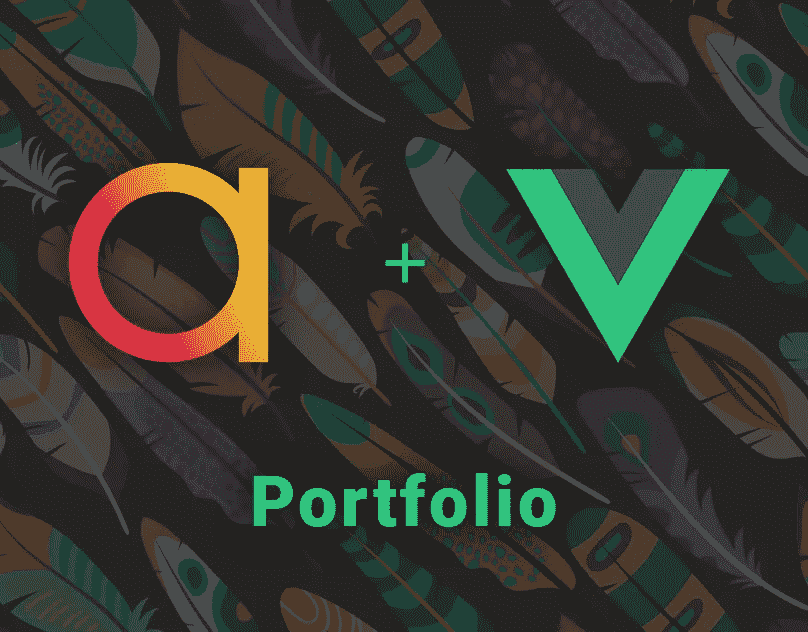

从头开始构建一个作品集网站是学习 web 开发的一个好方法。它帮助开发人员展示他们的创造力，提高他们解决问题的能力。这是我想要改进的两个关键点。几个月前，我选择了 Vue.js，并希望进一步探索这个框架。

[*进行现场预览，点击这里。*](https://ayushman.me/)

## Vue.js 是什么？

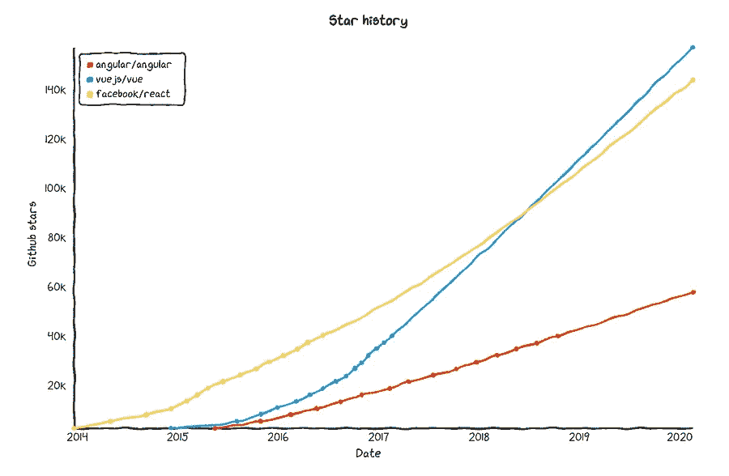

目前主导市场的三个主要前端框架是 React、Angular 和 Vue.js，其中 React 最受欢迎，Vue.js 最简单。这些框架帮助构建用户界面和单页应用程序。我选择 Vue.js 而不是其他框架的原因是因为它易于浏览的文档和简洁的语法。

## 研究和寻找想法

从一开始，我就意识到创建过于艺术化的用户界面可能会将用户体验抛之脑后。我看过一些网站，它们的美学让我惊讶不已，但我从来不明白我应该点击哪里，或者流量是多少。因此，我读了一些关于作品集网站和排版的文章，并为自己创造了一些要点。

*   拥有适当的行动号召(CTA)。
*   不要让用户感到失落。
*   让用户少点击。

我希望我的设计遵循这些要点。

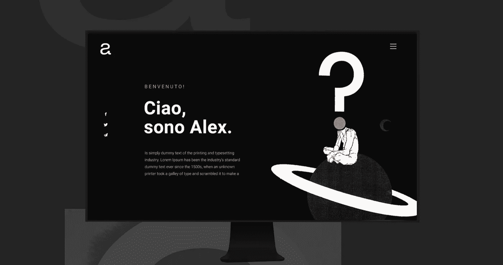

在设计任何 UI 之前，我都是这样做的。去[运球](https://dribbble.com/)和 [Behance](https://www.behance.net/) 找灵感，搜投资组合网站。有这么多的设计，但我最喜欢的一个是由亚历克斯·桑马丁诺设计的。

## 线框和设计

我为每个部分画了草图。在我的设计中，一个单独的部分需要至少 100%的视口高度(vh)和视口宽度(vw)。这些是 CSS 单位。基本上，这意味着每个部分将覆盖从可见浏览器视图的左上角到右下角的所有内容。

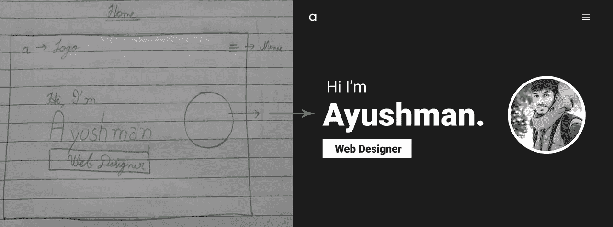

Home Section

对于家居部分，我保持了最小的设计。有我的名字，图片，还有一个大大的 CTA 按钮。在右上角，有一个方便导航的汉堡菜单，在左上角，有我的标志。

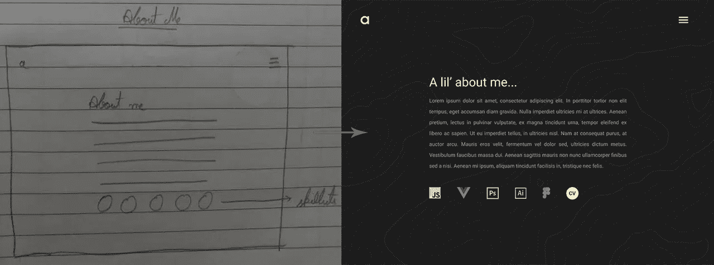

About Me Section

在第二部分，我简单介绍了一下自己。在描述下面，有几个我擅长的技术的 logos。这也有助于让观众快速了解我的技能。

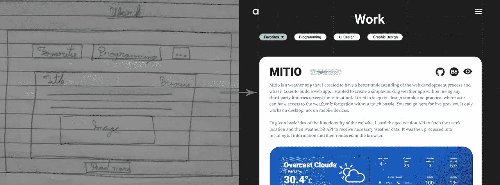

Work Section

每个框包含单个项目的详细信息。这些框包含标题、描述项目类型的标签、右上角的预览按钮、描述、封面图像和“阅读更多”按钮。我还在顶部给了一个过滤器选项，让用户快速列出相似类型的项目。

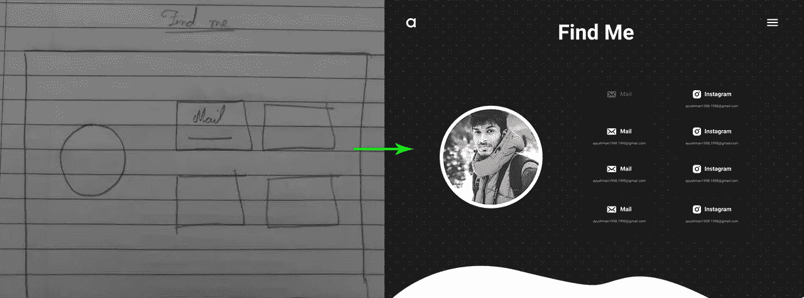

Find Me Section

在最后一部分，有一个不同平台的网格，观众可以去那里探索更多关于我的信息。

## 将碎片拼在一起

在完成投资组合的设计后，下一步是研究它的编程方面。我不会涉及太多的技术细节，但我会尝试给出一个逻辑和项目结构的概述。

让我们从更深入地了解 Vue.js 开始。

Vue.js 的工作方式是将其自身注入到 HTML 文件中的 div 中，该 div 中的所有内容都由 Vue.js 引擎呈现。

在上面的代码片段中，HTML 文件除了一个 id 为“app”的 div 外，大部分都是空的。

在 Vue.js 中，我们有可重用的 Vue 实例组件。这些组件是网站的组成部分。

我们以 Medium 的侧边栏为例。

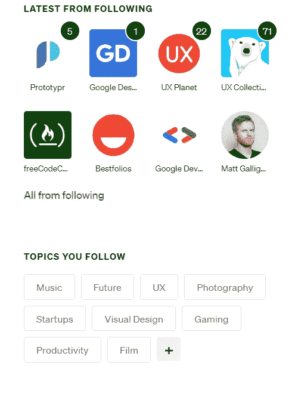

这里我们有两个不同的块:一个是“之后的“ **Latest”，它有带名称和通知的图标；另一个是“**你关注的话题”**，里面只有我关注的话题的名字。**

如果我们想在 Vue.js 中重新创建它，我们将有两个组件，每个部分一个。第一个组件将获得名称、图像和通知号等值作为道具(道具是父组件发送给其子组件的值)，然后我们将使用这些值来呈现单个概要文件。第二个组件可以用于您关注的“**主题”**，它接受名称并返回一个标签。然后，我们可以重用具有不同值的相同组件，这将为我们提供一个配置文件列表和一个标签列表。

可以用***vue create<project-name>***创建一个 Vue.js 项目。它创建了大多数样板文件。但是我对项目的结构做了一些调整。

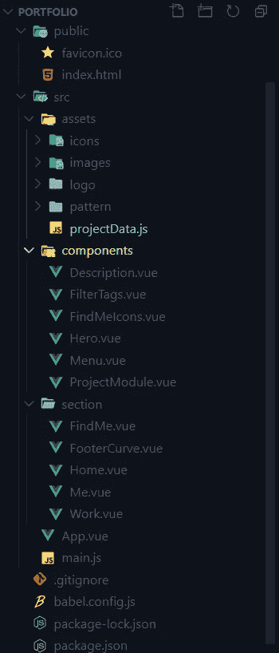

Project structure

这就是我如何组织我的项目。“资产”文件夹包含我的工作项目的图标、图像、图案和数据。这个 **projectData.js** 文件正在导出一个对象数组，我在其中存储了每个项目的详细信息。

在我的组件文件夹中，有我在整个项目中使用的组件。稍后我将详细介绍每个组件。

在我的分区文件夹中，我正在处理页面的各个部分。Home.vue 负责第一部分。所以如果我们把我项目的整个结构分成树，它看起来会像这样。

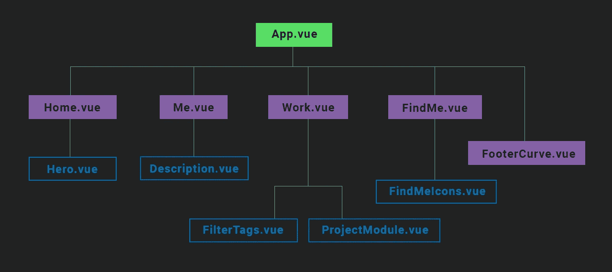

Tree of components

## 成分

**Home.vue > Hero.vue**

这是一个包含两个元素的 flexbox。一个是 div，左侧包含文本，右侧包含图像。我使用 **vw** 单位进行测量，这样如果浏览器的宽度变小，那么文本和图像的大小也会变小。我还应用了 flex-wrap，以便文本和图像片段在某一点后换行。

**App.vue > Menu.vue**

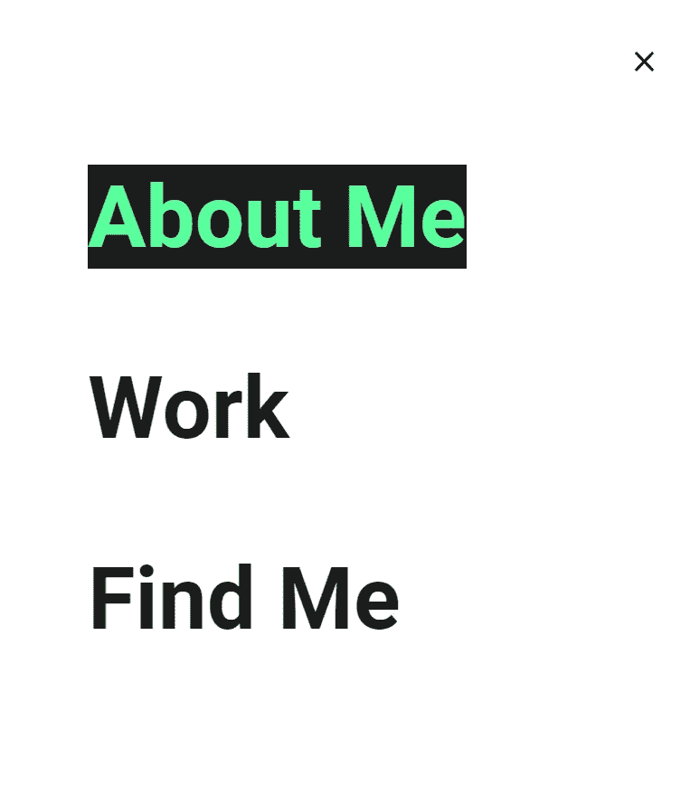

菜单栏提供了对页面各部分的快速浏览。这是一个带有无序列表的导航条。它在桌面上占页面的 40%宽，在移动设备上占 100%宽。

**me . vue>description . vue**

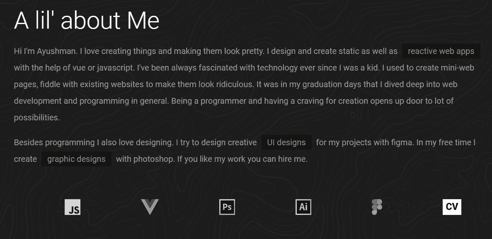

这是一个简单的组件，有标题、文本和列表元素。在这里，我也使用了响应式单元，因此它们的大小会根据用户的屏幕分辨率而变化。

**work . vue>filter tags . vue**

这个组件只是一个包含文本的 div。

**work . vue>project module . vue**

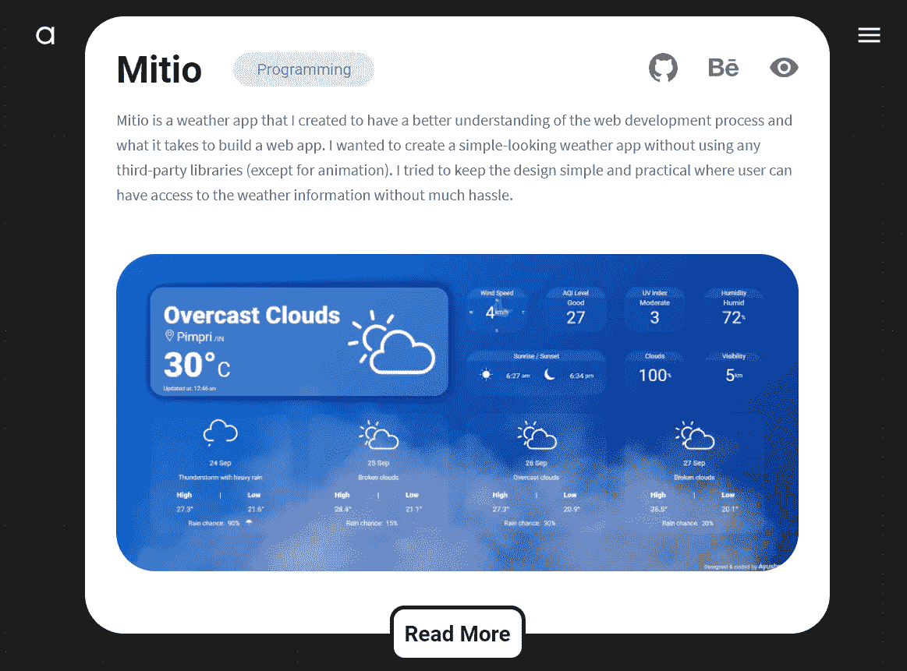

这是这个项目中最复杂的模块。但一般看来没那么复杂。当我在回顾项目结构时，我谈到了 assets 文件夹中的 **projectData.js** ，这是我的项目详细信息的集合。我在这里导入这些细节，并将它们作为道具发送给 **ProjectModule.vue** 组件。

**find me . vue>find meicons . vue**

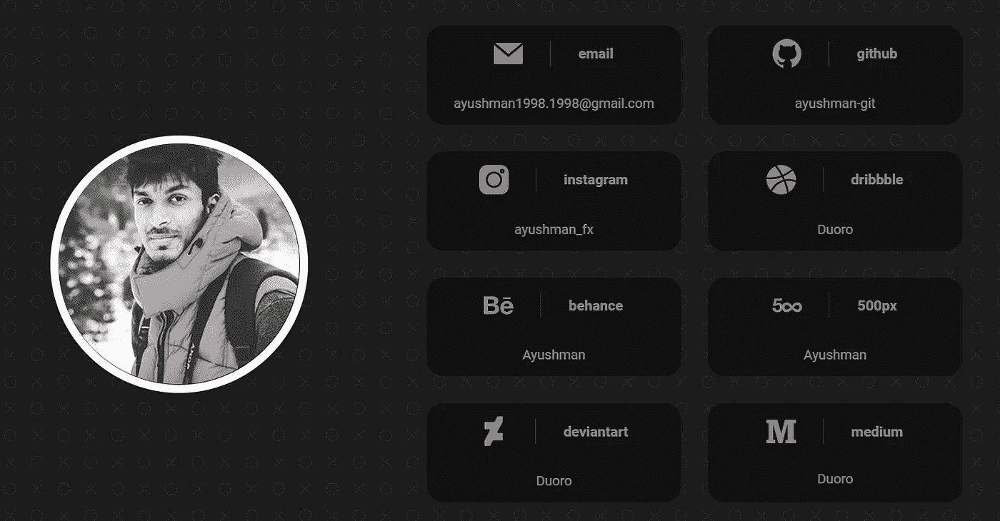

在 **FindMe.vue** 部分，我在 flexbox 中有两个 div。右边的 div 是一个带有 **FindMeIcons** 组件的网格。这个组件也从 **FindMe.vue** 获取道具来渲染最终的视图。

## 结论

这是一个为期一周的项目，我学到了很多。我一直在混乱的代码和组织中挣扎，但这个项目帮助我以科学的方式组织我的项目结构和我的逻辑。

现在我对 Vue.js 也有了更好的理解，我大量使用了它内置的 **<转场>** 配合 GSAP 库使用钩子来获得平滑的转场和动画。

最后，这是一次很好的学习经历，给了我机会去学习很多我以前不知道的新东西。我会用新的项目继续这个冒险。

*更多内容请看*[*plain English . io*](http://plainenglish.io/)