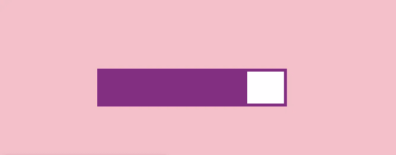
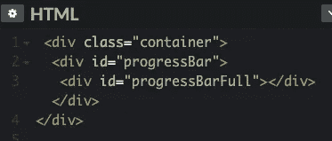
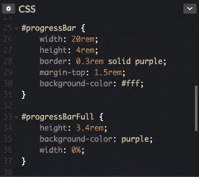
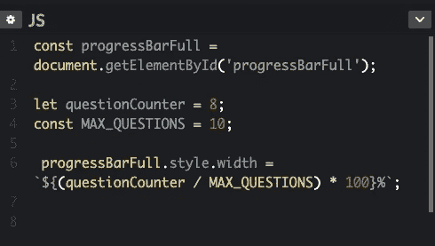

# 从头开始用 CSS，JavaScript 和 HTML 创建一个进度条

> 原文：<https://javascript.plainenglish.io/building-a-progress-bar-in-css-js-html-from-scratch-6449da06042?source=collection_archive---------4----------------------->

## 这是你如何做它。



Progress Bar purple with pink background.

首先，为您的 HTML 设置一个 id 为 progressBar 的 div。然后，在该 div 内部，创建另一个 id 为 progressBarFull 的 div。这两者都将存在于容器 div 中，但这纯粹是为了设计样式。

```
// HTML<div class="container">
  <div id="progressBar">
   <div id="progressBarFull"></div>     
  </div>
</div>
```



HTML for the Progress Bar.

接下来，设置 CSS 通过它们各自的 id 来访问这些元素。

所以对于 progressBar，它是以 JavaScript 约定命名的，因为我们稍后将使用 JS 来访问它，看起来像这样:

```
// CSS #progressBar {
    width: 20rem;
    height: 4rem;
    border: 0.3rem solid purple;
    margin-top: 1.5rem;
    background-color: #fff;
}
```

当然，你可以随心所欲地设计。这里的主要思想是，它是某种矩形或形状，可以填充，我们通过 id 访问它。

为了创建填充效果，我们将使用数学和 JavaScript。首先，我们将设置我们的 CSS 来完成进度条的填充颜色的视觉效果。

看起来会像这样:

```
// CSS#progressBarFull {
    height: 3.4rem;
    background-color: purple;
    width: 0%;
}
```

它包括设置不同的背景色属性，以便在视觉上区分形状上的进展。将宽度设置为 0%，因为它将基于回答问题数量的进度百分比，这将通过 JavaScript 中的一些数学计算来设置。

这是进度条和完整进度条的 CSS 外观:



CSS for Progress Bar and Progress Bar Full.

现在，我们来看看 JavaScript。首先，我们通过 id #progressBarFull 设置一个变量来访问我们的 DOM 元素:

```
// JavaScript const progressBarFull = document.getElementById('progressBarFull');
```

接下来，我们要为问题计数器设置一个变量，并用默认值实例化它。这里的想法是，我们将根据用户完成的问题的数量或进度来增加我们的问题计数器。因此，您可以对此进行调整，以满足您特定情况的需要。

```
// JavaScript let questionCounter = 0;
```

这个概念是，当计数器增加，或者值增加时，进度条的百分比将会用颜色填充，以表示正在进行的进度。所以这个数字，这个变量会随着用户的进步而改变。

接下来，我们要为问题的最大数量设置一个变量，或者说完成看起来像什么。这将意味着进度条的结束。所以我们看到的是一个分数，本质上，问题的最大数量或最大数量是分母，当我们解决问题或迭代时，我们当前的进度是分子。

出于我们的目的，我们将设置一个不需要更改的变量，因此我们将使用 ES6 常量:

```
// JavaScript const MAX_QUESTIONS = 10;
```

好吧。现在，还记得我们在 CSS 中是如何将宽度设置为 0%的吗？我们将使用 JavaScript 通过 id 访问 DOM 元素，然后动态更改 width 属性的值:

```
// JavaScript progressBarFull.style.width = `${(questionCounter / MAX_QUESTIONS) * 100}%`;
```

首先，我们调用变量 progressBarFull 通过 id 访问特定的 DOM 元素。然后，我们将方法链接到它上面，使用点符号来访问特定 DOM 节点的样式属性。从那里，我们链接到样式属性的宽度属性，并将其设置为等于一个数学公式。

就像我们之前提到的，这里是我们要使用分数公式的地方。我们用回溯法来完成进度除以问题总数。那个操作放在括号里，因为这是一个遵守操作顺序的情况，请原谅我亲爱的萨莉阿姨。PEMDAS 将确保我们得到我们在这里寻找的东西，首先执行我们的括号，然后将结果乘以 100，然后为 CSS 设置一个百分比。

总之，JavaScript 将如下所示:



JavaScript for Progress Bar Full.

这是我的 CodePen，为了测试进度，在 JavaScript 中改变 questionCounter 的数字，你会看到横条的变化。

所以弄清楚你的 progress 版本是什么样子，下次不用框架或库，用这个概念从头开始实现你自己的进度条！

## 用简单英语写的 JavaScript 的注释

我们已经推出了三种新的出版物！请关注我们的新出版物:[**AI in Plain English**](https://medium.com/ai-in-plain-english)[**UX in Plain English**](https://medium.com/ux-in-plain-english)[**Python in Plain English**](https://medium.com/python-in-plain-english)**——谢谢，继续学习！**

**我们也一直有兴趣帮助推广高质量的内容。如果您有一篇文章想要提交给我们的任何出版物，请发送电子邮件至[**submissions @ plain English . io**](mailto:submissions@plainenglish.io)**，并附上您的 Medium 用户名，我们会将您添加为作者。另外，请让我们知道您想加入哪个/哪些出版物。****