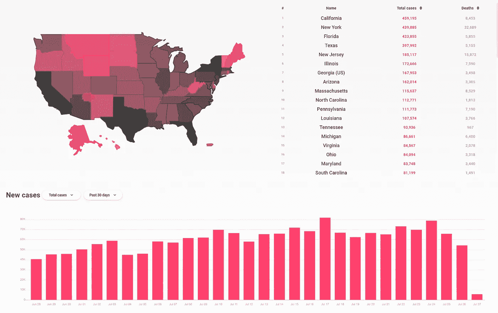
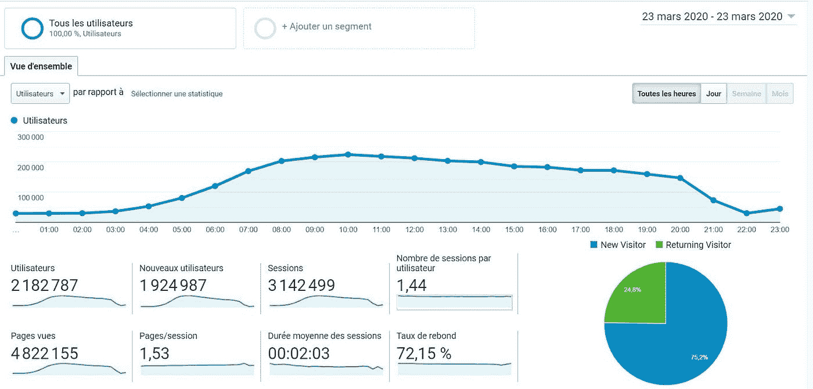
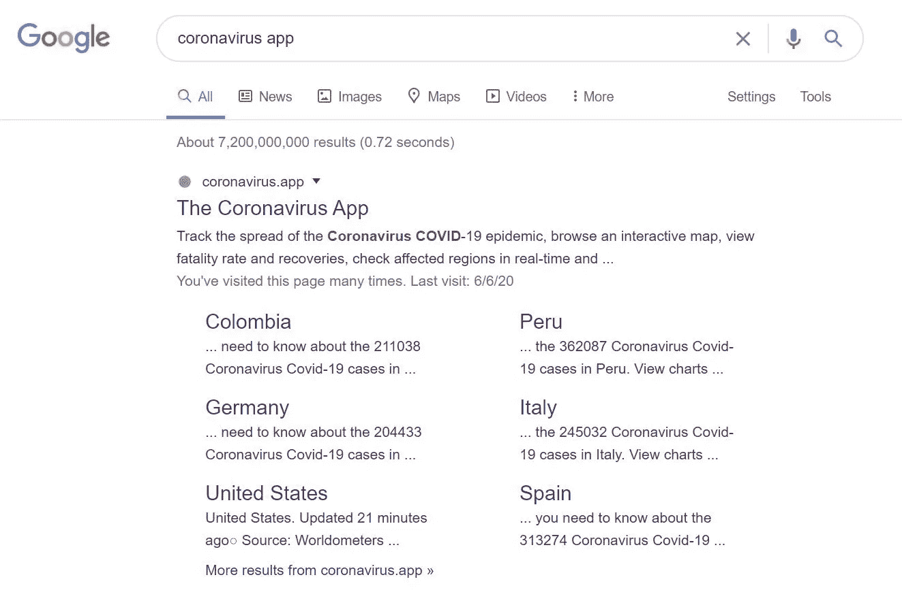

# 建造公共工程部是我们有史以来最好的主意

> 原文：<https://javascript.plainenglish.io/building-a-pwa-was-our-best-idea-ever-b7b233726b41?source=collection_archive---------0----------------------->

The Coronavirus App has been helping the world track the spread of COVID-19 since January 28

今年早些时候，我们建立了第一个新冠肺炎 PWA，谦虚地命名为“[冠状病毒应用](https://coronavirus.app)”(如果你无法访问这个链接，请查看[这个](https://www.notion.so/Why-can-t-I-access-coronavirus-app-859a165044e4474d8191a5ab1dd23c7f))。渐进式网络应用程序(或 PWA)很棒。它们提供了两个世界的最佳之处:它们看起来和感觉上都像本地应用，但在引擎盖下，它们实际上是网站——用标准的 HTML、CSS 和 Javascript 构建。

在这个动荡的时代，冠状病毒应用程序是一个 PWA 的事实不仅有所帮助——这可能是它成功的主要原因之一。

## 重新控制你自己的应用程序

我们能够很快推出我们的 PWA。我们在 1 月 25 日提出了这个应用的想法。然后在 1 月 28 日推出。从创意到发布只需 3 天，这种转变是本机应用根本无法实现的。发布 Android 或 iOS 应用程序需要将其上传到各自的应用程序商店。仅仅是最初的审查过程——苹果/谷歌检查你的应用程序不包含欺诈——通常需要更长的时间。

ABC News had a segment about the Coronavirus App on February 3rd.

能够快速发布意味着我们最大化了获得媒体报道的变化。事实上，我们得到了[商业内幕](https://www.businessinsider.com/wuhan-coronavirus-app-where-is-how-dangerous-number-infections-2020-1)、[、福布斯](https://www.forbes.com/sites/johnkoetsier/2020/02/05/ai-predicts-coronavirus-could-infect-25b-and-kill-53m-doctors-say-thats-not-credible-and-heres-why/#366d095511cd)、美国广播公司新闻以及更多媒体的惊人报道。

当你访问域名 [coronavirus.app](https://coronavirus.app) 时，你现在看到的应用程序看起来也与我们推出时有着根本的不同。在发布后的 7 个月里，我们进行了数百次小的更新和至少 3 次完整的设计修改。我们能够根据用户的反馈快速迭代。部署新版本的应用程序很快——使用我们正在使用的 [Firebase CLI 工具](https://github.com/firebase/firebase-tools)不到 2 分钟。而且也不需要 app stores 的批准。我们部署应用程序，更改版本号以确保我们用户的浏览器自动获得所有文件的最新版本，然后我们就完成了。

发布几个月后，谷歌和苹果[都宣布禁止未经国家政府或医疗机构批准的冠状病毒相关应用](https://www.forbes.com/sites/thomasbrewster/2020/03/24/google-bans-coronavirus-apps-but-after-400000-downloads/#238191ee34c0)进入各自的应用商店。我们非常幸运。如果我们选择在商店上推出这款应用，几个月后它就会被撤下。

使用 PWAs，它是您的域、您的客户端代码和您的服务器。你能控制一切。

## 你可以保留 100%

如果你使用应用内购买，你必须向苹果和/或谷歌支付 30%的收入。如果你不想使用应用内购买，那么……你根本不能在你的应用中向用户收费(至少理论上是这样)。

应用商店的承诺是成为分销渠道。十年前，你可以发布一个应用程序，仅此一项就能为你带来新用户。这真是太棒了。

这在 2020 年还有意义吗？Google Play 上大约有[300 万个应用。尝试上传一个应用程序，然后不做任何其他事情。你有可能总共获得两次下载:你和你的联合创始人。](https://www.statista.com/statistics/266210/number-of-available-applications-in-the-google-play-store/)

对于开发者来说，应用商店似乎已经成为一种必要的邪恶，而不是一种有用的工具。他们没有做你期望他们做的事情——也就是说，做一个分销渠道——但他们仍然向你收取大笔费用。越来越多的公司[正在远离应用内购买](https://venturebeat.com/2018/12/28/netflix-permanently-pulls-itunes-billing-for-new-users/)，但即便如此也不是没有一些障碍。

有了 PWAs，就没有应用商店，也没有应用内购买。你可以实现任何你喜欢的支付系统(如果你还没有，试试 [Stripe](https://stripe.com) )。你可以保留你辛辛苦苦挣来的所有美元。

## 更少的代码，更好的产品

PWA 最大的优点之一就是只需要维护一个代码库。当然，您可以使用 [React Native](https://reactnative.dev/) ，但是这看起来更像是一种变通方法，而不是真正的解决方案。

将你的应用构建成 PWA 会使它更快更简单(除非你是那些讨厌 Javascript 的人之一，在这种情况下，太糟糕了，你不走运了！).

我们的整个冠状病毒应用程序非常容易维护和更新，因为它本质上是 3 个文件:

*   运行在 [Firebase 云函数](https://firebase.google.com/docs/functions)上的 *Server.js* (180Kb)，其中包含我们的 [API](https://coronavirus.app/api) 的所有代码，以及我们用来从政府网站收集数据的所有[预定函数](https://cloud.google.com/scheduler)。它还包含我们的基本 HTML 模板，我们在其中添加了 [Progressier 脚本](https://progressier.com)，为应用程序提供了 PWA 的所有功能。
*   *Client.js* (197Kb)，里面包含了你访问 app 时浏览器将执行的所有前端代码。
*   *Style.css* (125Kb)，包含所有的 css。

(此外，我们正在使用的仅有的三个第三方客户端库是用于地图的[传单](https://leafletjs.com/)，用于图表的 [Charts.js](https://www.chartjs.org/) ，以及用于你可以用时间做的所有酷东西的 [Moment.js](https://momentjs.com/) )。

PWAs 感觉像是网络的自然进化——让开发者更快、更容易地快速构建大规模的东西。见鬼……这甚至让非开发人员也很容易做到。毕竟，冠状病毒应用程序[是由营销人员](https://www.linkedin.com/in/kevinbasset/)开发的。

当脸书在 2004 年推出时，他们不得不购买/租用和维护服务器。现在我们有了 AWS、GCP 和 Azure，所以我们不必关心底层基础设施中发生的任何事情。由于它也是这个星球上最大的科技公司的动力，你可以非常确定基础设施本身是一流的。

3 月 23 日是我们最美好的一天。仅在这 24 小时内，冠状病毒应用程序就获得了 2，182，787 个用户和 4，822，155 次页面浏览。这就是让这款应用屈服的原因。我们达到了谷歌云平台允许的 GPU 调用量的硬性限制，这导致了自发布以来我们仅有的 2 小时停机时间。幸运的是，Firebase support 很快增加了我们的配额。这是一个罕见的事件。大多数应用程序不太可能达到这个极限。

在我看来，Progressier 在应用程序方面有着类似的使命:构建现代应用程序的底层基础设施——这些基础设施将直接存在于网络上，不受原生应用程序的限制——所以你不必关心幕后发生的事情。

## 功能差距正在缩小

然而，这并不完全是黑白分明的。PWAs 也有缺点。你可以用一个本地应用做什么是有差距的。你可以用 PWA。但这一差距正在逐年缩小。

因为你的 PWA 是在你的用户浏览器中运行的，所以有一些烦人的事情需要注意。不同的浏览器对 Javascript 和 CSS 的理解略有不同。因此，对于我们开发的每一个功能，我们都必须在 Chrome、Safari、Firefox、Edge 以及 Mac、PC、iPad、Android 平板电脑、新款 iPhone 和旧款 iPhone 上进行测试。让某个特定的东西在任何地方都完美地工作是很棘手的，所以你求助于一些丑陋的手段。

有趣的是——因为我不是苹果用户，我曾经蹲在美丽的台北[苹果旗舰店的地下室里。我会编码、部署，然后在商店里到处跑，在我能接触到的每一台苹果设备上测试我的改变。不过，那是在我发现这个叫做](https://goo.gl/maps/MdCd8MsntRnGWDhj7)[浏览器堆栈](https://www.browserstack.com/)的神奇产品之前。

Unsurprisingly, we rank #1 for “coronavirus app” on Google

此外，如果你足够幸运地购买了一个看起来像冠状病毒一样纯粹的域名，你肯定会享受到随之而来的搜索引擎优化。pwa 使应用程序更易访问。没有要下载的内容。没有强制安装。没有搜索可做。你输入网址，嘣，这就是应用程序。

优化在线转换的一个很好的步骤是减少流程结束所需的步骤。艾滋病人正是这样做的。获得应用程序的步骤越少，人们实际使用你的应用程序的几率就越大。

事实上，一些业务[强调了 PWA 实施后各种关键绩效指标的显著改善](https://ymedialabs.com/progressive-web-apps)，如在页面、转化或收入上花费的时间增加。

PWAs 的一个非常好的特性是人们可以在他们的手机(和桌面)上安装你的应用。).能够占据用户主屏幕的空间显然是非常有价值的——并且对保持用户有很大帮助。

PWAs 很棒。我不认为冠状病毒应用程序会被 1000 多万人使用，如果我们没有把它变成 PWA 的话。

这也激发了 Progressier 的灵感，它将很快允许任何人在他们自己的网站和应用程序中免费使用我们的 PWA 实现。顺便说一下，我们改进后的 PWA 实现将比我们在冠状病毒应用程序上的实现好 7 到 10 倍。

对 Progressier 感到兴奋吗？关于冠状病毒 App 的问题？请在下面的评论中告诉我们。