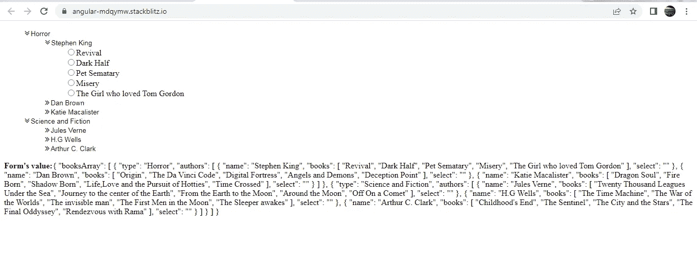
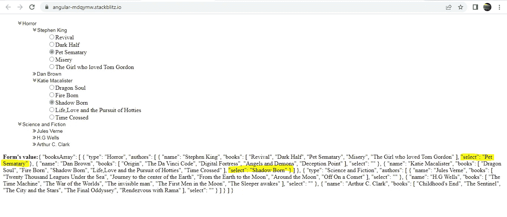

# 如何使用角度数组构建单选按钮树

> 原文：<https://javascript.plainenglish.io/building-a-radio-button-tree-using-angular-formarray-b30c4c49e65c?source=collection_archive---------5----------------------->


Photo by [Glenn Carstens-Peters](https://unsplash.com/@glenncarstenspeters?utm_source=medium&utm_medium=referral) on [Unsplash](https://unsplash.com?utm_source=medium&utm_medium=referral)

我在许多 web 应用程序中发现了单选按钮树结构。这个故事展示了实现它的许多方法之一。

在我们要用的数据下面。这是一个从 **books.ts** 导出的对象数组

每个对象都描述了书的类型、写过这种类型的书的作者以及他们写过的书。我们已经将上述数据填入如下表格。我们还打印了表单的值。



**AppComponent 模板:**

1.  从 books.ts 导出的**book list**数组对应下面的形式数组 **booksArray** 。

```
<ng-container **formArrayName=”booksArray”**>
```

2.books 数组中的每个对象包含两个属性:类型和作者。type 是字符串，authors 是对象数组。

所以每个对象都是一个**表单组**，**类型字符串**对应于**类型表单控件**，而**作者数组**对应于**作者数组**。

```
<li *ngFor=”let x of booksFormArray.controls; let i = index”
[formGroupName]=”i”>
<i #bookType appToggleChevron class=”fa fa-angle-double-right”>
<input type=”text” formControlName=”type” />
</i>
<ng-container formArrayName=”authors”>
```

3.在 authors 数组中，我们再次拥有具有两个属性的对象:name 和 books。name 是字符串，books 是字符串数组。

所以每个对象都是一个**表单组。name 属性**对应于 **name FormControl** ，而 **books 数组属性**对应于 **select FormArray** 。

```
<li *ngFor=”let y of x.get(‘authors’).controls; let j = index”
[formGroupName]=”j”
<i #authorName appToggleChevron class=”fa fa-angle-double-right”>
<input type=”text” formControlName=”name” />
</i>
<ul [ngClass]=”[authorName.classList.contains(‘fa-angle-double-right’)? ‘close’: ‘open’]”>
<li *ngFor=”let z of y.get(‘books’).value”>
<input type=”radio” formControlName=”select” [value]=”z” />{{z}}
</li>
</ul>
```

**AppComponent 类:**

我们从 **books.ts** 中导出的数据是一个包含对象数组的对象。我们已经将这个对象数组存储在属性**数据**中。

因此，我们将首先使用名为 **booksArray** 的**for array**构建数组，如下所示。数组被初始化为[]。

```
ngOnInit() {
this.radioForm=this.fb.group({
booksArray: this.fb.array([]),
});
this.displayBooks();
}
```

**属性数据**中的每个 book 对象对应一个 FormGroup，对象中的每个属性基于属性值对应一个 form control/FormArray/form group。

下面的 **displayBooks()** 将把属性数据中的每个 book 对象映射到一个 FormGroup。这个映射是通过 **createBookFormGroup()完成的。**此方法以 book 对象作为参数。

映射的结果是存储在变量 **transformedBooks** 中的 FormGroups 数组。然后使用 **setControl()将**转换后的 Books** 设置为格式数组 **booksArray** 的值。**

```
displayBooks() {
let transformedBooks = this.data.map((book: any) =>
this.createBookFormGroup(book)
);
this.radioForm.setControl(‘booksArray’, this.fb.array(transformedBooks));
}
```

```
createBookFormGroup(book: any) {
return this.fb.group({
type: [book.type],
authors: this.fb.array(this.loadAuthors(book.authors)),
});
}
```

createBookFormGroup() 返回一个包含 2 个 FormControls 的新 FormGroup。每个 FormGroup 包含一个名为 **type** 的 FormControl 和一个名为 **authors** 的 FormArray。

FormControl 类型包含书的类型，而 FormArray authors 又是一个对象数组，其中每个对象包含作者的姓名和作者写的书。

格式数组 **authors** 由 **loadAuthors()** 填充，它将 book 对象的 **authors 属性**作为参数。

```
loadAuthors(authorsList: any) {
return authorsList.map((author: any) => this.createAuthorFormGroup(author));
}
```

我们正在做和以前非常相似的事情。我们将每个 author 对象映射到一个新的 FormGroup。映射是通过 **createAuthorFormGroup()** 完成的，它将 author 对象作为参数。映射的结果是一个 FormGroups 数组，它被返回给调用者以填充 **authors** FormArray。

```
createAuthorFormGroup(author: any) {
return this.fb.group({
name: [author.name],
books: [author.books],
select: [‘’],
});
}
```

上述方法返回的每个 FormGroup 包含 3 个 form control:**name**告诉我们作者的名字，而 **books** 是作者写的书的数组。

**选择**是单选按钮的表单控件。

当我选中几个单选按钮并提交表单时，表单的值将更新如下。为作者选择的图书将在“选择属性”下可见。



检查下面的整个工作:

[](https://stackblitz.com/edit/angular-mdqymw?file=src/app/app.component.html) [## 角形(叉形)堆叠

### 一个基于 rxjs，tslib，core-js，zone.js，font-awesome，@angular/core，@angular/forms 的 angular-cli 项目…

stackblitz.com](https://stackblitz.com/edit/angular-mdqymw?file=src/app/app.component.html) 

*更多内容请看*[***plain English . io***](http://plainenglish.io/)