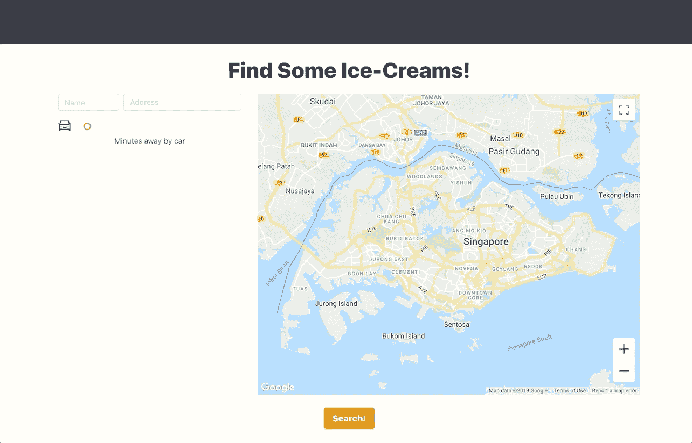
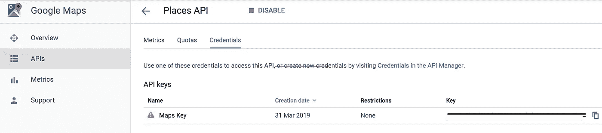
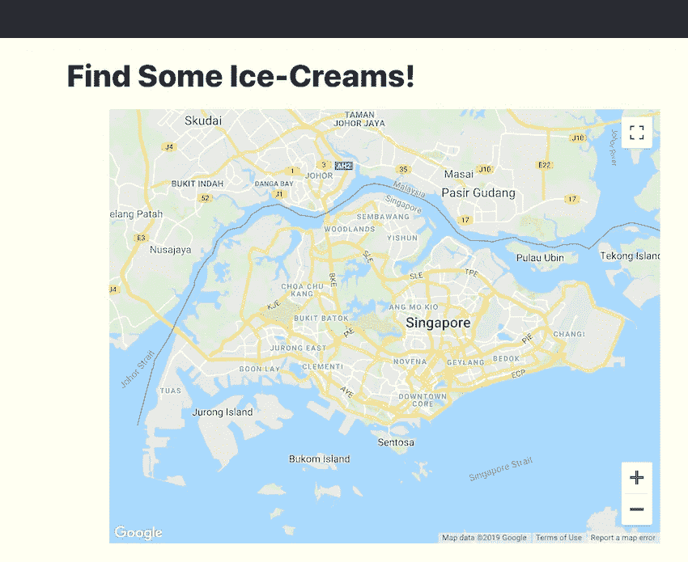
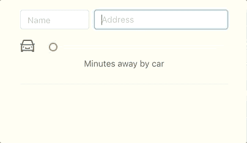

# 用 Google Maps API 构建一个 React“冰激凌查找器”应用程序

> 原文：<https://javascript.plainenglish.io/building-a-react-ice-cream-finder-app-with-the-google-maps-api-7e39339e0261?source=collection_archive---------1----------------------->



Get yo Ice creams

# 冰淇淋！

现在我已经引起了你的注意…

用一个新的库创建任何自定义组件总是很困难的。谷歌地图应用编程接口的情况更加夸张，这里不是只有一个，而是有几个你必须学习的 T2 应用编程接口。

在本帖中，我们将使用谷歌地图 API 创建一个 React web 应用程序，以**过滤乘车前往**一段时间内供应冰淇淋的地点列表。

[Github 上的完整源代码在这里](https://github.com/marxlow/google-maps-component-guide)。

# 放弃

让我先说谷歌地图 API 是一个非常强大的服务。但是随着强大的能力而来的是大量的文档。

这篇文章的目标不是涵盖 Google Maps API 的所有功能。谷歌已经在这方面做得非常出色。

然而，您将学到的是足够的知识来导航他们的许多服务，并希望能够在它们的基础上构建您自己的组件。

我们将专注于构建谷歌地图的三个主要服务。

*   自动完成-查找位置作为行驶时间的参考点。
*   地点——找到卖冰淇淋的地方。
*   方向-过滤行驶时间限制内的地点。

## 设置—获取 Google Maps API 密钥

1.  首先，按照这里的指南[注册谷歌云平台](https://developers.google.com/maps/documentation/embed/get-api-key)。在注册时，你应该会得到价值 400 美元的信用点数，所以不要担心被收费。
2.  登录后，导航至[控制台](https://console.cloud.google.com/apis/)，点击“启用 API 和服务”以搜索并添加以下 4 项服务。
    **地点，地图 Javascript，地理编码，**和**方向** API。
3.  通过在控制台上导航，搜索上述服务的 API 密钥。(重要:确保这也是您其余服务的相同密钥)
    位置 API →凭证→密钥



Cloud Console Dashboard

## 创建地图组件

首先，安装 React [谷歌地图库](https://github.com/google-map-react/google-map-react)。

```
npm install google-map-react
```

安装了库之后，我们可以创建第一个组件来加载地图。姑且称之为`MapContainer.js`。代码:

一些笔记。

*   记得使用你自己的 API 密匙。
*   在渲染我们的`MapContainer.js`时，我们应该看到由`defaultCenter`和`defaultZoom`字段设置的以**新加坡**为中心的地图。



Rendered Google Maps Component

*   我们想要使用的库必须被明确声明，这样我们才能访问它们的服务。参考`bootstrapURLKeys`处的字段。
*   我们可以将标记(谷歌地图上的大头针)渲染成`<GoogleMapReact>`的孩子。

```
<GoogleMapReact ... >
  <AnyReactComponent lat={123} lng={123} name="Some pin"/>
</GoogleMapReact>
```

*   我们的`<GoogleMapReact>`组件**必须由父 HTML 标签包装**。
*   父 HTML 标签必须显式设置其**高度**。你会发现`h-lg` CSS 类是这样声明的:

```
.h-lg {
  height: 35rem; // This will work
  /* height: 100%; This will NOT work */
}
```

## 创建自动完成组件

随着地图的加载，我们终于可以开始访问它的服务了。

我们这样做的方式是通过我们的地图库提供的`onGoogleApiLoaded`字段。该字段接受一个回调函数，该函数在地图加载后运行。

`onGoogleApiLoaded`给我们两个对象，分别是`map` & `maps`。对于我们的自动完成组件，我们只对`maps`中的感兴趣，这使我们能够访问我们的**自动完成服务** **API** 。让我们将它加载到我们的`mapsContainer`状态中。

```
// maps === mapsApi. But I changed it for clearer naming.apiHasLoaded = ((map, mapsApi) => {
  this.setState({
    mapsApi,
    autoCompleteService: new mapsApi.places.AutocompleteService(),
    placesService: new mapsApi.places.PlacesService(map),
    directionService: new mapsApi.DirectionsService(),
    geoCoderService: new mapsApi.Geocoder(),
    singaporeLatLng: new mapsApi.LatLng(1.3521, 103.8198)
});
```

现在，我们可以将 API 传递给自动完成组件，以便从文本中检索地点建议。我将使用**和**库来自动完成[。代码:](https://ant.design/components/auto-complete/#header)

再来点笔记。

*   检查我们的`MapAutoComplete.js`组件是否工作。



Hello World is actually a real place…

*   我们的`onSelect`(第 28 行)函数需要`geoCoderService`来帮助我们检索地址字符串的经度和纬度信息。这些是我们在地图上绘制标记所需的信息。
*   您可以通过`location`(使用 mapsApi 创建的特殊 **LatLng** 对象)和`searchQuery`中的`radius` (int)字段来配置搜索。
*   为了从一个字符串中获得建议位置的列表，我们必须调用函数`getQueryPredictions(searchQuery, callback function)`。搜索结果可以在我们的回调函数中访问。
*   回调函数中的`response`对象是一个形状为:

```
[ { description: 'Place A' ... }, { description: 'Place B' ... }]
```

## 当下

是的，我们已经到了。

## 寻找冰淇淋

我们现在将为冰淇淋构建我们的**搜索&过滤函数**。我们只需要两项服务。

*   `placesService`:查找提供冰淇淋的地方(咖啡馆&餐馆)列表。
*   `directionService`:从一个位置检索每个地方的旅行时间(设置这个位置可以在我们的自动完成组件中完成。参考源代码)

您可以在`MapContainer.js`中构建这个功能，或者将其重构为一个更小的组件(将这些服务作为道具传递给另一个组件，如`MapAutoComplete.js`)。我选择了前者。

让我们来看一下这个函数的代码。应该比较直截了当。

更多注意事项:

*   【步骤 1】`types`(第 9 行)是搜索中包含的字符串数组。选项非常广泛，有关支持类型的完整列表，请查看此处的。
*   [步骤 3]我们的`iceCreamPlace`对象(第 20 行)包含许多其他字段，如照片 URL、价格水平、评级等等。有关返回响应的更多信息，请查看这里的。
*   [Step 4–5]有关 directionsService 的请求和返回响应的更多信息，请查看此处[。](https://developers.google.com/maps/documentation/javascript/directions)
*   并非文档中提到的所有字段都被返回。一定要测试。
*   【第七步，*重要*】确保你的总决赛成绩`setState`的代码**在** `placesService.TextSearch` **回调函数**的范围内。这是为了避免运行空数组`setState`的风险，因为异步回调函数还没有执行完。

## 结论

我只介绍了应用程序的重要功能和组件。在 [Github 上浏览完整的源代码可能有助于更好地理解应用程序的工作流程。](https://github.com/marxlow/google-maps-component-guide)

我希望这对您开始使用 GoogleMaps API 的旅程有所帮助。祝你好运！