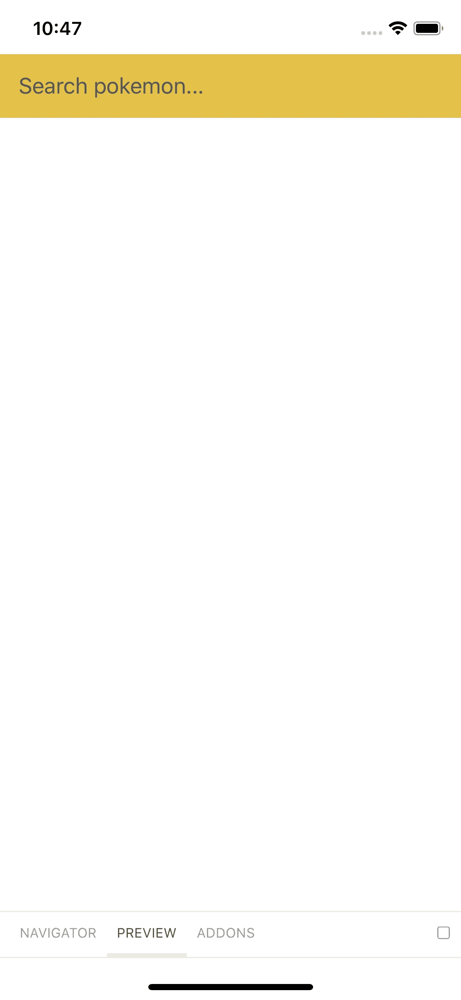
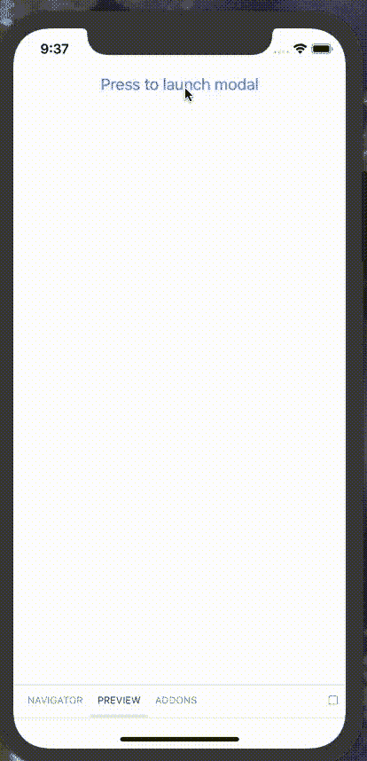

# 用 Storybook 构建 React 原生组件库。射流研究…

> 原文：<https://javascript.plainenglish.io/building-a-react-native-component-library-with-storybook-js-76db79ceb359?source=collection_archive---------0----------------------->

Photo by [Henry Be](https://unsplash.com/@henry_be?utm_source=medium&utm_medium=referral) on [Unsplash](https://unsplash.com?utm_source=medium&utm_medium=referral)

在过去的几个月里，我一直在使用一个遗留的 React 本地代码库，我在使用该代码库时面临的一个更大的问题是，不同 UI 组件的关注点没有清晰的分离。

没有为单元格、行和表格提供单独的、可测试的组件来呈现数据表，而是使用一个具有呈现功能的组件来创建较小的组件，以构建较大的组件。

有鉴于此，我目前正在做的工作之一是创建这些独立的组件，并制作纯组件，即没有任何内部状态的组件。

为了使代码库更容易使用，我将这些较小的纯组件抽象到它们自己的库中，这些库将包含自己的文档和测试，并允许核心应用程序专注于处理状态并向纯组件提供数据以进行渲染。

这种方法还允许另一个团队完全专注于应用程序的 UI 和 UX 方面，并且通过建立组件所期望的道具的合同，将这些更改集成到主应用程序中应该没有问题。

为了帮助在 UI 开发和应用程序开发团队之间建立共同的理解，我使用了 [Storybook.js 来呈现组件，作为一个交互式的风格指南。](https://storybook.js.org/)

# 设置组件库

该库是一个新的 npm 项目，但它最终将由主应用程序使用，因此有一些事情需要考虑:

*   主应用程序中使用的 React 版本(作为对等依赖项添加)
*   主应用程序中使用的生命周期管理(第三方组件可能会导致问题)
*   由于主应用程序是私有应用程序，如何在不上传到公共 npm repo 的情况下安装库

## 创建新的 React 本机项目

为了开始构建这个库，我需要建立一个新的 React Native 项目。

为了做到这一点，我使用了`[create-react-native-app](https://www.npmjs.com/package/create-react-native-app)`(在全球安装之后)，它给了我一个基础项目。

我还安装了 [Expo CLI 工具，以便使用 Expo](https://docs.expo.io/versions/latest/workflow/expo-cli/) 运行应用程序，因为组件库目前不使用非 JS 代码。

一旦我有了一个运行的 React 本地应用，就该开始设置 storybook 了。

## 添加故事书

设置 storybook 最简单的方法是全局安装 S [torybook CLI，然后运行](https://www.npmjs.com/package/@storybook/cli) `[getstorybook](https://www.npmjs.com/package/@storybook/cli)` [命令](https://www.npmjs.com/package/@storybook/cli)，它会为您的项目完成设置 Storybook 的所有艰苦工作。

然后，我只需将`export default from './storybook';`添加到`App.js`中，当我运行应用程序时，Expo 会处理剩下的事情。

## 添加组件

一旦我建立并运行了故事书，我就可以添加组件了。

我使用组件库的目标是创建纯粹的无状态组件，因为这些组件更容易测试，也更容易组合。

我为组件创建了一个`src`文件夹，这将是创建库和添加我的第一个组件时打包的文件夹。

An example of a pure component — there’s no state

然后，我在根级别创建了一个`__tests__`文件夹，并为该组件创建了一个快照测试来验证渲染逻辑。

Snapshot test for the input component

最后，我为组件创建了一个故事，它将显示在展示组件的故事书中。

Story showing the search input

Input pokemon rendered in Storybook

# 流程的改进

当我开始构建组件库时，我发现了一些改进过程的方法。

为了减少测试和故事书中重复代码的数量，我决定使用[story shots——故事书的一个插件，负责快照测试](https://www.npmjs.com/package/@storybook/addon-storyshots)。

我不完全确定 Storyshots 是正确的方法，但是因为它将所有快照捆绑到一个大文件中，我更喜欢对此进行更多的控制，以便在测试下的组件和快照文件之间有一个清晰的映射。

为了帮助测试和显示 Storybook 中的组件，我创建了一个`data`文件夹，其中包含要传递给组件的数据对象。

这允许我有一个存放所有数据的地方，然后导入我需要在测试和故事中使用的对象。

## 处理情态动词

其中一个较难解决的问题是如何显示一个模态组件，因为模态组件将覆盖在故事书的用户界面上，如果没有办法管理可见性状态，故事书就无法使用。

将这种类型的功能添加到故事中，并不像声明一个布尔变量来保存值并通过 Storybook 的函数进行更改那样简单，因为当值更改时，story book 不会重新呈现组件。相反，你需要一个状态管理插件来保存这个值。

story book dump 247/story book-state 和 [sambego/storybook-state 有两个状态插件。](https://www.npmjs.com/package/@sambego/storybook-state)

我发现 dump247 遇到了一个 bug，由于 React Native 版本 Storybook 中的一个竞争条件，它试图访问一个尚未设置的值，但爆炸了，但 [sambego/storybook-state 插件非常有效](https://www.npmjs.com/package/@sambego/storybook-state)。

使用 storybook-state 插件，我可以创建一个初始的按钮组件，当它被点击时会显示出模态组件，然后我可以在按下关闭按钮时关闭模态组件。

Adding state to story to render Modal on button press

Modal launching on button press in Storybook

# 摘要

通过将 UI 组件抽象到一个库中，我已经能够消除原始代码库的大部分复杂性，并且由于关注点的分离，使 UI 组件和主要应用程序代码库更加集中。

此外，UI 组件现在有一个单独的位置，可以在主应用程序状态之外显示它们，这意味着具有更多基于设计的背景的团队成员可以自由地试验 UI，而不必担心破坏主应用程序。

## **简明英语团队的笔记**

你知道我们有四种出版物吗？给他们一个关注来表达爱意吧:[**JavaScript in Plain English**](https://medium.com/javascript-in-plain-english)，[**AI in Plain English**](https://medium.com/ai-in-plain-english)，[**UX in Plain English**](https://medium.com/ux-in-plain-english)，[**Python in Plain English**](https://medium.com/python-in-plain-english)**—谢谢，继续学习！**

**此外，我们总是有兴趣帮助推广好的内容。如果您有一篇文章想要提交给我们的任何出版物，请发送电子邮件至[**submissions @ plain English . io**](mailto:submissions@plainenglish.io)**，并附上您的媒体用户名和您感兴趣的内容，我们将会回复您！****