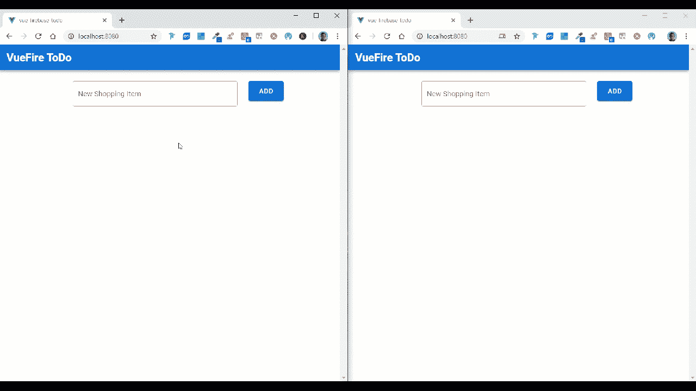
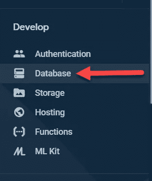
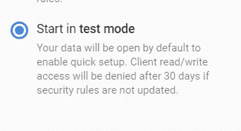
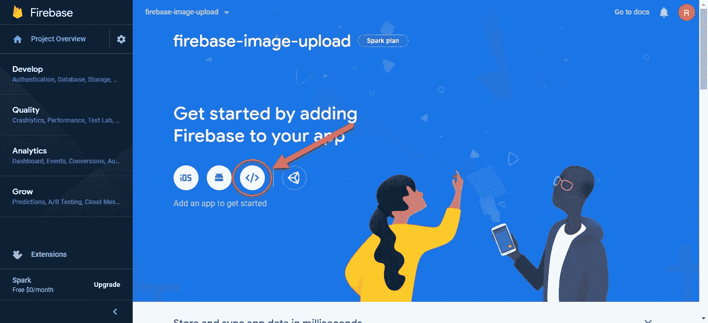

# 用 Vue、Vuetify、VueFire 和 Firebase 在 15 分钟内构建一个实时完整的 ToDo 应用程序

> 原文：<https://javascript.plainenglish.io/building-a-realtime-full-stack-todo-app-in-15-minutes-with-vue-vuetify-vuefire-and-firebase-e9b3cac2b190?source=collection_archive---------9----------------------->


ToDo List

在本教程中，我们将使用 Vue 和 Firebase 非常快速地构建一个实时待办事项应用程序。对于造型，我选择了 Vuetify。我们还将使用一个名为 VueFire 的包，它将用最少的代码设置我们所有的实时功能。



ToDo App

# Firebase 项目设置

我们需要做的第一件事是在 Firebase 中建立一个项目。前往[https://firebase.google.com/](https://firebase.google.com/)创建一个账户，然后点击“前往控制台”。接下来，点击“添加项目”按钮，给它起你喜欢的名字。单击其他选项，选择默认值。

接下来，单击左侧菜单中的“数据库”。



Firebase Database

然后，在屏幕顶部单击“创建数据库”。


Firestore

现在，选择在测试模式下启动，并选择默认的服务器位置。



Firestore test mode

**警告:这将使你的数据库对任何人开放，可以读写。如果您打算在生产设置中使用此功能，请熟悉** [**Firestore 规则**](https://firebase.google.com/docs/firestore/security/get-started) **并实现** [**认证**](https://firebase.google.com/docs/auth) **。**

# Vue 项目设置

如果您没有安装 Vue CLI，请在终端中运行以下命令进行安装:

```
npm install -g @vue/cli
```

接下来，让我们创建我们的 Vue 项目。打开您的终端，cd 到您选择的目录，并运行以下命令:

```
vue create vue-firebase-todo
```

选择默认设置。

## 添加 Vuetify

现在，cd 进入项目的根目录(cd vue-firebase-todo)并运行以下命令:

```
vue add vuetify
```

系统将提示您选择一个预设。选择:**默认(推荐)**

## 导入包

Vuetify 完成安装后，运行以下命令:

```
npm install vuefire firebase
```

## 将 Firebase 添加到 Vue

现在我们需要返回 Firebase，获取我们的应用程序的配置。在 Firebase 项目的主屏幕上，单击 web 图标。



Firebase

给你的应用取一个昵称，然后点击下一步。然后你会看到一些代码。在


Firebase config

在 src 文件夹中，创建一个名为 firebase 的新文件夹。然后添加一个名为 db.js 的文件。在该文件中，添加以下代码:

```
import firebase from 'firebase/app'
import 'firebase/firestore'//Paste in your firebase config we copied from the last step
var firebaseConfig = {  
  apiKey: '<your-api-key>',
  authDomain: '<your-auth-domain>',
  databaseURL: '<your-database-url>',
  projectId: '<your-cloud-firestore-project>',
  storageBucket: '<your-storage-bucket>',
  messagingSenderId: '<your-sender-id>',
  appId: '<your-app-id>',
  measurementId: '<your-measurement-id>'
};// Get a Firestore instance
export const db = firebase
  .initializeApp(firebaseConfig)
  .firestore()

// Export types that exists in Firestore
// This is not always necessary, but it's used in other examples
const { Timestamp, GeoPoint } = firebase.firestore
export { Timestamp, GeoPoint }
```

接下来，在 src/main.js 中，在现有导入下添加以下内容:

```
*import* { firestorePlugin } *from* 'vuefire'*Vue.use*(firestorePlugin)
```

## 清理 App.vue

现在，在 src/App.vue 中，让我们删除两个 Vuetify 徽标，并替换为:

## VueFire ToDo

。接下来，移除垂直应用程序栏右侧的垂直 btn。最后，我们将从文件中移除 HelloWorld 组件，并将其从项目中删除。您可以在 components/HelloWorld.vue 中找到

完成所有这些后，App.vue 文件应该如下所示:

Initial App.vue

## 待办事项列表组件

**Template**
接下来，在 components 文件夹中，创建一个名为 ToDoList.vue 的新文件。在 Template 标签中，我们将创建一个文本字段，允许我们添加新的 ToDos。我们还将添加一个包含行的虚拟卡片。在行内，我们将有两列。一个用于 ToDo 的名称，另一个用于删除按钮。我们将把每张卡片包装在一个过渡组中，这样它就会淡入淡出。

我们将为卡片添加一个 v-for，它将为待办事项列表中的每个待办事项生成一个新卡片。当用户单击删除图标按钮时，我们将触发逻辑，从集合中删除 ToDo。

ToDoList.vue Template

**脚本**顶部的
脚本标签，我们将导入数据库。接下来，我们将添加导出默认值。然后，我们将添加一个包含两个变量属性的数据属性。一个用于待办事项列表，另一个作为新项目的占位符。然后我们将添加我们的方法。一个用于添加项目，另一个用于删除项目。

最后，我们将通过添加 firestore 属性和添加 ToDos 集合来添加 VueFire。通过添加这个属性，我们可以获得实时功能，而不必添加大量代码来订阅我们的 firestore 集合。

ToDoList.vue Script

对于我们的过渡组，我们需要添加一些样式来淡入淡出。

ToDoList.vue Style

# 视频教程

Video Tutorial

# 结论

正如你所看到的，vue-fire 与 Firebase 的结合使得创建实时应用程序变得非常容易。添加一个健壮的样式包，比如 Vuetify，你就可以在创纪录的时间内编写一个应用程序。

请在下面的评论区告诉我你的想法。

bit bucket Repo:[https://bit bucket . org/the diligent dev/vue-fire-todo/src/master](https://bitbucket.org/TheDiligentDev/vue-fire-todo/src/master/)

## **简明英语笔记**

你知道我们推出了一个 YouTube 频道吗？我们制作的每个视频都旨在教给你一些新的东西。点击此处 查看我们，并确保订阅该频道😎