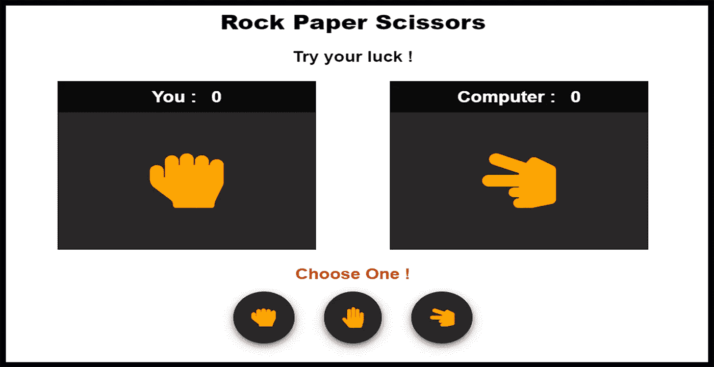

# 用 JavaScript 构建石头剪刀布游戏

> 原文：<https://javascript.plainenglish.io/building-a-rock-paper-scissors-game-with-javascript-bce23d39509d?source=collection_archive---------2----------------------->

## 让我们用普通的 JavaScript 构建一个石头剪刀布游戏

Image By Mehdi Aoussiad.

# 介绍

为了提高你的 JavaScript 技能，石头剪子布游戏是你必须尝试的令人兴奋的项目之一。上个月，我制作了这个简单的游戏，这是我在 100 天代码挑战中尝试过的项目之一。所以在尝试这个项目之前，你需要对 **HTML** 、 **CSS** 和 **JavaScript** 有基本的了解。正如你所看到的，这个项目非常简单，它只是一个石头剪刀布的游戏，你可以和电脑玩，然后把你的分数和电脑的分数进行比较。让我们看看我们的游戏怎么样。

# 项目演示

正如你在上面的例子中看到的，你有能力在石头、布和剪刀之间进行选择。之后，它会为你和电脑生成一个随机图标。如果你赢了，你的分数会增加，电脑也一样。

# 让我们从 HTML 开始

首先，我们将创建一个包含两个部分的容器。一个给电脑，另一个给播放器。每个部分将包含分数和图标。在容器下面，我们将放上石头、纸和剪刀按钮。让我们看看下面的例子:

The HTML Structure.

# 让我们来设计我们的元素

所以现在，我们将使用 CSS 样式化我们的元素。您可以阅读下面的代码来查看我们的样式表。

Styling Our Elements with CSS.

# JavaScript 部分

现在，这是令人兴奋的部分，将使我们的游戏功能。在我们的 JavaScript 逻辑中，我们为计算机分数和玩家分数创建了一个变量，然后我们选择了 HTML 元素。之后，我们创建了一个包含石头、布和剪刀图标的数组，以便从数组中随机获取它们。然后，我们创建了包含所有逻辑的游戏函数，例如从数组中获取随机图标，将它们放在 dom 中，以及每种情况下的 if 语句(石头砸在纸上，等等)。该函数将为每个单击的按钮运行。仔细阅读下面的代码，理解我们的逻辑。

Our JavaScript Code.

现在恭喜你，你已经用普通的 JavaScript 轻松地创建了一个简单的石头剪子布游戏。

# 结论

成为一名优秀的开发人员的最好方法是实践你所学到的东西。熟能生巧。构建一个 JavaScript 游戏将帮助你练习和提高你的编码技能。这就是这篇文章，我希望你今天学到了一些新的东西。

> **:*无限制访问媒体上的所有报道*

* [## 通过我的推荐链接加入 Medium-Mehdi Aoussiad

### 作为一个媒体会员，你的会员费的一部分会给你阅读的作家，你可以完全接触到每一个故事…

mehdiouss.medium.com](https://mehdiouss.medium.com/membership)*