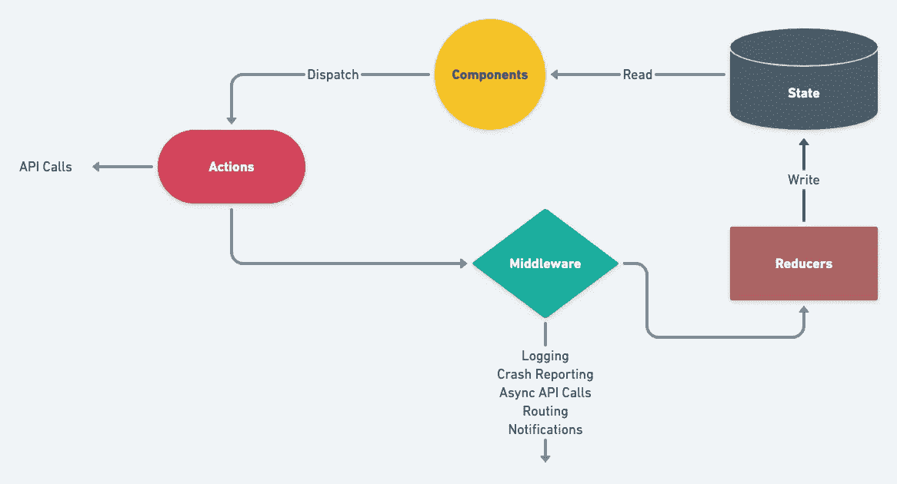

# 使用 React 和 Redux 构建可扩展的用户界面

> 原文：<https://javascript.plainenglish.io/building-a-scalable-user-interface-using-react-and-redux-a5b753722366?source=collection_archive---------10----------------------->

说到在前端进行扩展，对不同的人来说可能意味着不同的事情。在大多数情况下，这仅仅意味着编写易于扩展的模块化代码。无缝处理添加更多视图以及增加数据和副作用的能力，无需担心破坏已经存在的东西。

The Architecture (created w/ Whimsical)

**有意义的建筑。**

React 遵循单向数据绑定的圣杯，以保持事物的模块化和性能化。构建外观组件并将其包装在[容器](https://reactjs.org/docs/higher-order-components)中解决了许多问题。

> 容器组件是在高层和低层关注点之间划分责任的策略的一部分。容器管理订阅和状态之类的事情，并将道具传递给处理呈现 UI 之类事情的组件。

但是这些容器仍然必须管理数据。多个容器可能想要访问相同的数据。[提升状态](https://reactjs.org/docs/lifting-state-up.html)不能很好地扩展，并且会导致性能问题，因为即使是父状态中的一个小更新也会重新渲染所有子组件。

**进入 Redux。**

Redux 提供了一个 JavaScript 对象，以及一些称为*存储区*的有用方法，该存储区类似于应用程序数据的状态树。数据真实性的唯一来源。

当 UI 工作与状态更新工作很好地分离时，前端繁重的 web 应用程序变得更容易管理。Redux 毫不费力地做到了。修改状态树的唯一方法是在其上调度 [*动作*](https://redux.js.org/glossary#action) 。动作还会处理副作用，使我们的组件更具有确定性，因此更容易测试。

redux 商店由 [*还原剂*](https://redux.js.org/glossary#reducer)*的树定义，每个还原剂返回自己的商店。缩减器是接受当前状态和动作作为参数并返回新状态的纯函数。*

*每次调度一个动作，redux 都会将该动作通过减速器树，修改与*动作类型*匹配的状态。这使得修改具有相同动作类型的几个减速器的状态成为可能。*

*redux 中的中间件用于解释动作，并在到达减速器之前做一些事情。*

> *中间件的最大特点是它可以在一个链中组合。您可以在单个项目中使用多个独立的第三方中间件。*

*日志记录、崩溃报告、异步 API 调用是您可以使用中间件执行的一些功能。这里有一个有趣的故事，关于中间件是如何成为一件东西的。*

*【Redux 有什么帮助？*

*Redux 帮助我们管理一个全局状态，它可以被不同的组件单独使用，使它们更具确定性和可测试性。它提供了一种状态更新机制，以更可预测的方式管理全局存储，确保任何给定时间的数据一致性。它还为我们提供了一些很酷的功能，比如热重装和时间旅行调试，这节省了开发人员的大量时间。*

***使用 Webpack。***

*Webpack 是一个强大的构建工具。它可以做很多事情，可以做成一个完整的独立系列。它提供的一些功能—*

*   *[将公共模块](https://webpack.js.org/plugins/commons-chunk-plugin/#root)从捆绑包中分离出来。*
*   *死代码消除又名[树摇动](https://webpack.js.org/guides/tree-shaking/)。*
*   *[绩效预算](https://webpack.js.org/configuration/performance)用于强调更好的绩效模式。*
*   *[内置优化的生产模式](https://webpack.js.org/configuration/mode/#mode-production)。*
*   *[将](https://webpack.js.org/concepts/entry-points/#separate-app-and-vendor-entries)应用代码与第三方代码分开。*
*   *[惰性加载](https://webpack.js.org/guides/lazy-loading/#root)*
*   *它可以做更多的事情。*

***还有什么？***

*为应用程序构建一个优化的[文件结构](https://reactjs.org/docs/faq-structure.html)对于轻松遍历应用程序代码至关重要。按功能对文件进行分组可能会使它不那么单调乏味。使用 CSS 语言扩展工具，如 [*Sass*](https://sass-lang.com/) 或 [*Less*](http://lesscss.org/) 有助于构建可维护和可重用的模块化 CSS。整合 [Redux-sagas](https://github.com/redux-saga/redux-saga) 可以更有效地管理副作用。*

***延伸阅读。***

*[建立大规模 React 应用](http://Setting up a large scale React application)*

*[对大型项目做出反应的技巧](https://hackernoon.com/tips-on-react-for-large-scale-projects-3f9ece85983d)*

*[改善 Redux 架构的 10 个技巧](https://medium.com/javascript-scene/10-tips-for-better-redux-architecture-69250425af44)*

*[保持 Webpack 快速运行:提高构建性能的现场指南](https://slack.engineering/keep-webpack-fast-a-field-guide-for-better-build-performance/)*