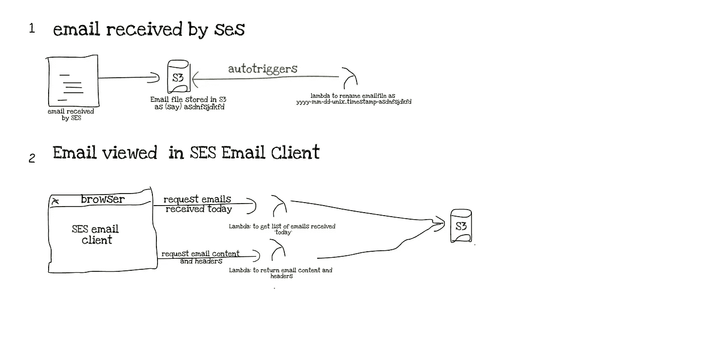
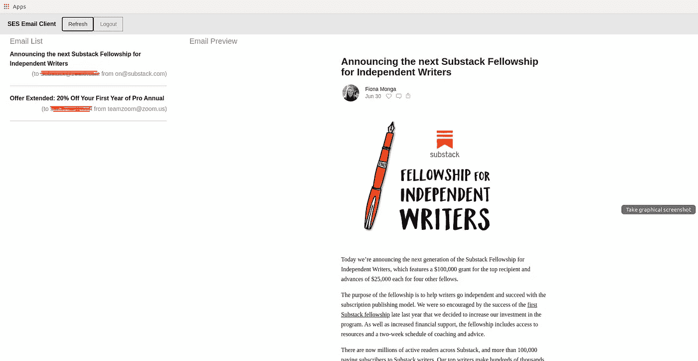

# 为 AWS SES 构建无服务器电子邮件客户端

> 原文：<https://javascript.plainenglish.io/building-a-serverless-email-client-for-aws-ses-933234244f3c?source=collection_archive---------3----------------------->

## 如何管理您的电子邮件，获得无限的电子邮件 id，改变您与收件箱的联系方式，并在 Amazon sca le 从收件箱中挖掘可行的见解

自 2006 年 3 月推出以来，AWS 已经成长为其母公司的克隆体，尽管是在软件领域，也就是说，AWS 现在相当于云服务和计算服务的[百货店](https://en.wikipedia.org/wiki/The_Everything_Store)。

在本文中，我们特别感兴趣的是 AWS 提供的简单电子邮件服务(SES)。

以下是 SES 可以为我们做的:*【SES】是一个电子邮件平台，为您提供一种简单、经济的方式，让您使用自己的电子邮件地址和域名发送和接收电子邮件。*

当 AWS SES 首次推出时，它仅限于代表我们发送电子邮件。这里有一个来自 2011 年的 ServerFault 帖子的[回复，有人在那里询问通过 SES 接收电子邮件的方法。](https://serverfault.com/a/338365/415326)

*亚马逊的 SES 严格用于发送电子邮件。如果你想接收电子邮件，你必须在 EC2 服务器实例上设置一个邮件传输代理(MTA ),如 Sendmail、Postfix、Qmail 等，并将你的 DNS MX 记录指向该实例。*

从推出到 2015 年，SES 一直是一项只发送的服务。

2015 年，SES 为收到的邮件增加了一种做事的方式。

因为，在它的核心，SES 仍然是一个电子邮件规模的服务，你只能以准程序化的方式与收到的电子邮件进行交互。

## 处理收到的电子邮件

SES 不是让你像 Gmail 或 Outlook 一样阅读收到的邮件，而是让你在接收邮件时做三件基本的事情:

1.  在 S3 保存收到的邮件
2.  向监听者发送社交网络通知
3.  触发 Lambda 函数

如你所见，这些解决方案都不太人性化。SES 仍然是一种不是为人类使用而设计的事务性服务。

他们的[关于接收电子邮件的文档](https://docs.aws.amazon.com/ses/latest/DeveloperGuide/receiving-email.html)间接地告诉了我们这一点。

> Amazon SES 不包括接收电子邮件的 POP 或 IMAP 服务器

没有 POP 或 IMAP 意味着没有电子邮件客户端，因此，没有人类友好的方式来查看收到的电子邮件。

POP 代表邮局协议，而 IMAP 代表互联网消息访问协议。这两种协议都支持从服务器访问电子邮件。为了发送电子邮件，电子邮件客户端使用 SMTP，但是因为这篇文章是关于接收电子邮件的，我们现在将忽略 SMTP。

***注*** :从技术上来说，你可以以 4 美元/用户/月的价格购买一个[亚马逊工作邮件](https://aws.amazon.com/workmail/)账户来接收 SES 邮件，但我已经使用工作邮件两年多了，我可以告诉你，你最好把你的邮件钱花在别的地方。

## 建议

现在，我们对 AWS SES 有了一个大致的了解，接下来就可以讨论为 SES 创建电子邮件客户端的可能性了。

这个电子邮件客户端将下载并在浏览器上显示保存在 S3 的电子邮件，而不是依赖于无论如何都不可用的 POP 或 IMAP。

## 问题

要实现这个电子邮件客户端，我们必须克服 SES 强加给我们的某些限制:

1.  没有 POP/IMAP——如上所述，由于 SES 没有为我们提供 POP/IMAP 服务，我们已经编写了自己的 API 来下载电子邮件
2.  电子邮件接收于。eml 格式。虽然您可以重命名. eml 文件，但是只有 IE 本身可以打开该文件。eml 文件到。mht 并在任何浏览器中打开它。
3.  在 S3，电子邮件文件以一个长(41 个字符)字母数字字符串保存，文件名没有可识别的模式。因此，您可能首先会收到一封电子邮件，文件名为*82 vendohoan 4 Rb 4 poes 26 r 8 RDA 5s b5 vbg H9 s 3c C1*，然后是*7 EPE 24 edptua 4 mjepr 8 hlhypt 444 c0krvkkrn 181*。
4.  所有电子邮件元数据(如发送时间、发送对象、主题等)都存储在电子邮件文件本身中。您必须解析电子邮件文件来提取这些信息。

## 解决办法

总体而言，我们的战略如下:

1.  设置一种在 S3 按接收日期降序存储电子邮件的方式。我们需要这样做，以便按照正确的接收顺序向用户显示电子邮件。这解决了问题 3。这个函数的源代码是[@这里](https://github.com/psiCode/ses-email-client/blob/master/lambdas/rename-eml-file-s3.js)
2.  从提取电子邮件元数据和内容。eml 文件。这解决了问题 4，这样一来，问题 2 就没有实际意义了。对于这个任务，我们使用优秀的[邮件解析器](https://github.com/nodemailer/mailparser)模块。
3.  创建两个 API——一个按照收到日期的降序返回收到的电子邮件列表( [*源代码*](https://github.com/psiCode/ses-email-client/blob/master/lambdas/get-eml-file-ids-s3.js) )，另一个返回电子邮件的元数据和内容( [*源代码*](https://github.com/psiCode/ses-email-client/blob/master/lambdas/get-eml-contents.js) )。这解决了问题 1。

Architecture diagram

完成后，最后一步是创建基于浏览器的 UI，以:

1.  请求已接收邮件的列表
2.  对于上面列表中的每封电子邮件，请求元数据和内容
3.  在浏览器中显示元数据和内容

浏览器 UI 的源代码是[@此处](https://github.com/psiCode/ses-email-client/tree/master/email)。完整的源代码在 [Github](https://github.com/psiCode/ses-email-client) 上。

This is what the client looks like!

## 限制

客户端只显示收到的邮件`today.`，这意味着它只显示收到的邮件`today`和`today-1`。

结果限于最近收到的 100 封电子邮件`today`。还有`today-1.`

## 其他增强功能

其他实现的无关增强包括使用 AWS Cognito 来控制对电子邮件客户端的访问。毕竟，你不想让全世界都看到你的邮件，对吧？

UI 是使用 Foundation CSS 和 Vuejs 构建的。

# 结论

这种只读客户端填补了我们与 SES 交互方式的一大空白。从历史上看，SES 一直是基础架构级别的产品，也就是说，它不适合人类友好的使用情形。

有了这个电子邮件客户端，我们开始了将 SES 带入人类可用性空间的过程。

## 我们能从这里去哪里

既然我们可以直接访问自己的电子邮件，而不需要像 Gmail 或 Microsoft Outlook 这样的邮件提供商的介入，我们可以开始以不同的方式想象我们的收件箱。

最简单的改进可能是为我们的域名获取无限的电子邮件，以帮助摆脱监视资本主义，它使用我们的电子邮件 id 作为数据点来描述我们。

通过一次只显示有限数量的电子邮件，我们可以改善我们与收件箱的关系，减少我们看到数百封电子邮件时的焦虑。

随着对电子邮件的更好控制，我们可以开始重新想象我们的电子邮件是如何呈现给我们的。我们可以将电子邮件显示为博客文章，或者显示收件箱的文字云。

API 对电子邮件内容和元数据的访问使我们能够从收件箱中挖掘可操作的见解。

选择是无穷无尽的。只需要一些想象力。