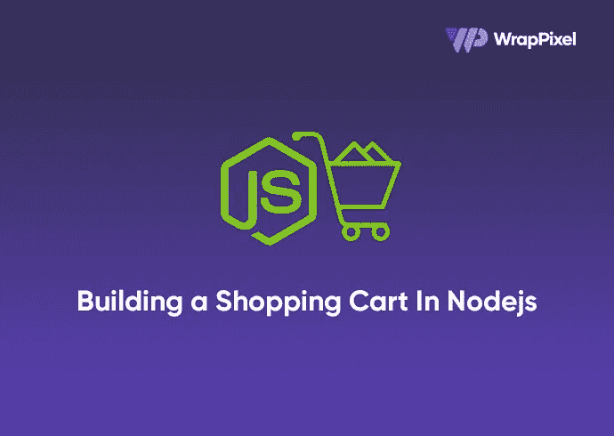
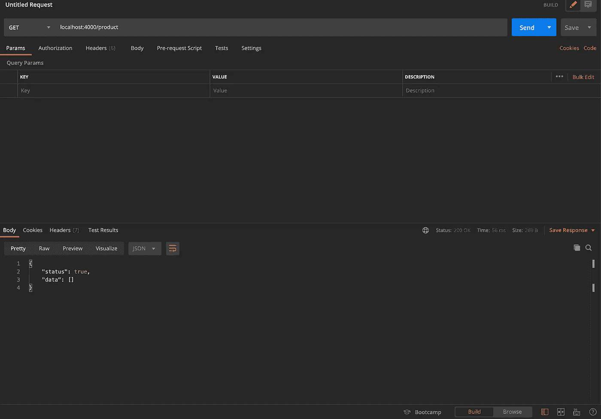
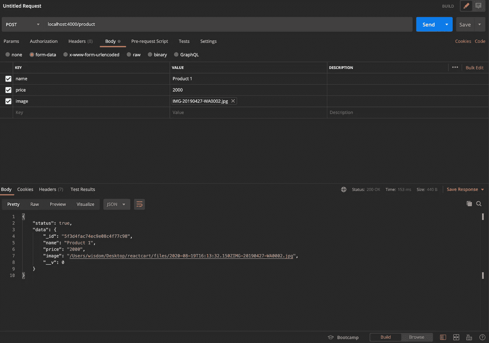
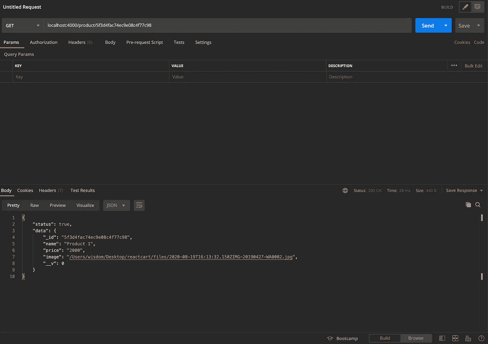
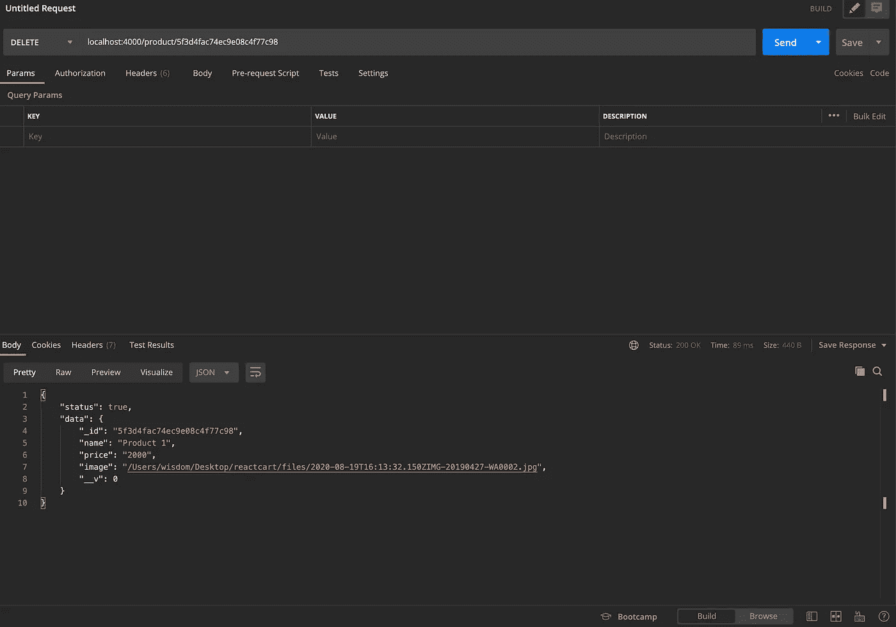
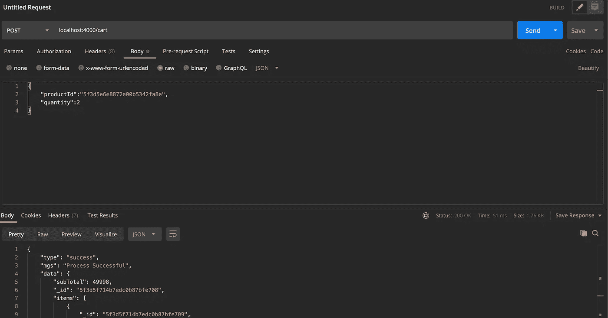
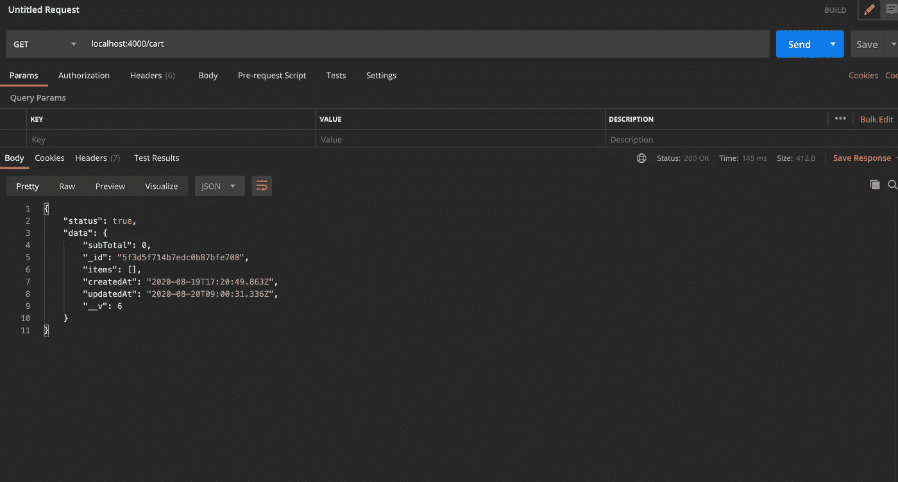
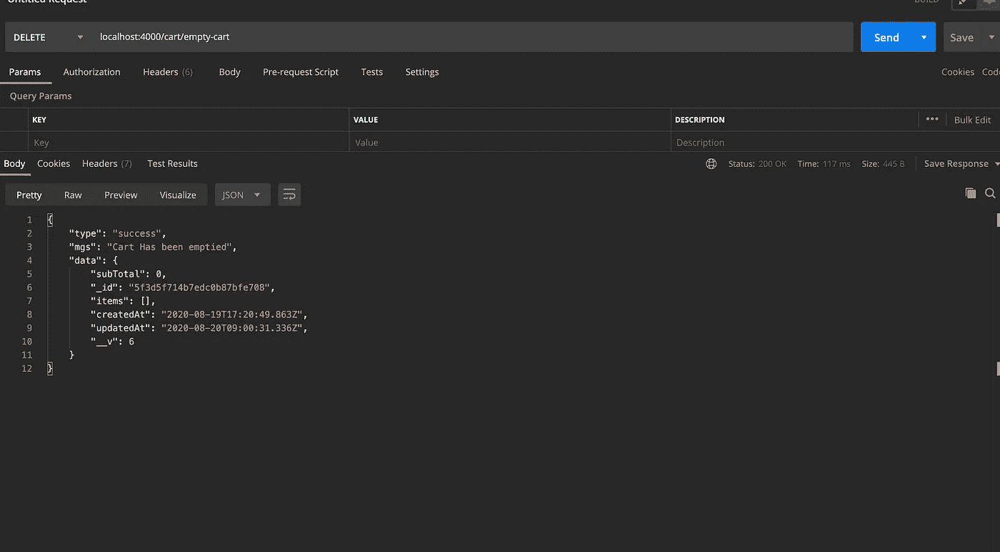

# 在 Node.js 中构建购物车

> 原文：<https://javascript.plainenglish.io/building-a-shopping-cart-in-node-js-bdbe02614eb9?source=collection_archive---------1----------------------->



在这篇文章中，我们将建立一个电子商务平台，Node.js 作为后端和前端，我们将有 3 种不同的技术(Angular，React 和 Vue.js)。我刚刚用 Vue Vite 完成了[前端部分，你可以阅读](https://www.wrappixel.com/build-a-shopping-cart-in-nodejs-and-vue-vite/)。Angular 和 React 将很快推出。

我们将这篇文章分成两部分，后端和前端。我们的应用程序将有像添加产品和添加产品到购物车的基本功能。

**先决条件**

*   熟悉 HTML、CSS 和 JavaScript (ES6+)。
*   Vs 代码或安装在开发机器上的任何代码编辑器。
*   Postman 安装在您的开发机器上。
*   React 和 Express.js 的基础知识。

我们将从设置应用程序的后端开始。让我们为应用程序创建一个新目录，并初始化一个新的 Node.js 应用程序。打开您的终端，键入以下内容:

```
cd desktop
mkdir reactcart && cd reactcart
npm init -y
code .
```

# 安装必要的软件包

我们必须为我们的应用程序安装一些包:

*   `body-parser`:是一个 express 中间件，它读取表单的输入，并将其存储为一个 javascript 对象，可通过 req.body 访问。
*   `nodemon`:将监视我们的文件是否有任何更改，然后在发生任何更改时重启服务器。
*   `express`将用于构建我们的 Node.js 服务器。
*   `cors`:这是一种机制，它使用额外的 HTTP 报头来告诉浏览器，让运行在一个来源的 web 应用程序访问来自不同来源的选定资源。
*   `dotenv`:将存储我们所有的环境变量。这是我们存储电子邮件变量的地方。
*   是一个将记录我们所有申请路线的包。
*   `mongoose`:用于异步查询 MongoDB 的对象建模工具。
*   `multer`:是处理`multipart/form-data`的 Node.js 中间件，主要用于上传文件。

要安装此软件包，请打开您的终端并键入:

```
npm i express mongoose morgan dotenv multer body-parser cors nodemon --save
```

运行该命令将创建一个`node_modules`文件夹。您必须创建一个`.gitignore`文件并在其中添加`node_modules`文件。

# 设置服务器

我们将继续创建一个`src/index.js`文件，并添加以下代码行:

```
const express = require('express');
const cors = require('cors');
const bodyParser = require('body-parser');
const morgan = require('morgan');
const app = express();
app.use(morgan('dev'));
app.use(cors());
app.use(bodyParser.json())
app.get('/', (req, res) => {
    res.json({
        message: 'Arise MERN developers'
    });
});
const port = process.env.PORT || 4000;
app.listen(port, () => {
    console.log(`Application is running on ${port}`);
});
```

添加之后，我们可以通过在终端中键入`nodemon src`来使用 nodemon 运行我们的应用程序。运行此命令将输出`Application is running on 4000`。

现在我们的服务器正在运行，我们必须设置我们的 mongoDB 服务器。为此，创建一个新目录`src/config`并创建一个`mongoose.js`文件，然后添加以下代码:

```
const mongoose = require("mongoose");
module.exports = app => {
    mongoose.connect('mongodb://localhost:27017/cart', {
        useUnifiedTopology: true,
        useNewUrlParser: true,
        useFindAndModify: false
    }).then(res => console.log("connected")).catch(err => console.log(err))
    mongoose.Promise = global.Promise;
    process.on("SIGINT", cleanup);
    process.on("SIGTERM", cleanup);
    process.on("SIGHUP", cleanup);
    if (app) {
        app.set("mongoose", mongoose);
    }
};
function cleanup() {
    mongoose.connection.close(function () {
        process.exit(0);
    });
}
```

现在我们需要在我们的`index.js`文件中注册这个配置:

```
require("./config/mongoose.js")(app);
```

添加它将在 Node.js 服务器运行时连接到数据库。

请注意，您必须在声明 express 的实例之后声明这一点。

我们现在必须为我们的产品和购物车创建我们的 mongoDB 模型和路线。

创建一个`src/app`目录，这是我们创建模块的地方。在此目录中，创建一个产品目录并添加以下文件:

*   model.js
*   controller.js
*   知识库. js
*   route.js

将所有 DB 通信放入存储库文件也是一个好主意。

让我们通过将它添加到我们的 **model.js** 文件来定义我们的产品模型:

```
const mongoose = require("mongoose");
const productSchema = mongoose.Schema({
  name: {
    type: String,
    required: [true, "Please include the product name"],
  },
  price: {
    type: String,
    required: [true, "Please include the product price"],
  },
 image: {
    type: String,
    required: true,
  },
});
const Product = mongoose.model("Product", productSchema);
module.exports = Product;
```

我们的产品模型将尽可能基本，因为它包含产品名称、价格和图像。

我们现在需要在我们的 **repository.js** 文件中定义我们的 DB 请求:

```
const Product = require("./model");
exports.products = async () => {
    const products = await Product.find();
    return products;
};
exports.productById = async id => {
    const product = await Product.findById(id);
    return product;
}
exports.createProduct = async payload => {
    const newProduct = await Product.create(payload);
    return newProduct
}
exports.removeProduct = async id => {
    const product = await Product.findByIdAndRemove(id);
    return product
}
```

我们需要定义获取所有产品、获取单个产品的详细信息、删除产品和创建产品的基本路线。逻辑是路由将与我们的控制器对话，控制器与存储库对话，存储库与我们的模型对话。

在我们定义我们的路线之前，我们需要为我们的图片上传配置 multer。创建一个 **multer.js** 文件并添加以下代码:

```
const multer = require("multer");
const path = require("path");
//image upload
const storage = multer.diskStorage({
    destination: (req, res, cb) => {
         cb(null, path.join("./files/"));
    },
    filename: (req, file, cb) => {
        cb(null, new Date().toISOString() + file.originalname);
    }
});
// checking file type
const fileFilter = (req, file, cb) => {
    if (file.mimetype.startsWith('image')) {
        cb(null, true);
    } else {
        cb(new Error('Not an image! Please upload an image.', 400), false);
    }
};
exports.upload = multer({
    storage: storage,
    limits: {
        fileSize: 1024 * 1024 * 6
    },
    fileFilter: fileFilter
});
```

在应用程序的根目录下创建一个`files`目录。这是所有上传图像的存储位置。

由于所有图像都放在文件目录中，我们必须创建一个`files`文件夹。要做到这一点，请转到 **index.js** 文件并添加以下内容:

```
app.use('/files', express.static("files"));
```

完成后，我们现在可以提供存储在文件目录中的图像。

将此添加到 **routes.js** 文件中:

```
const router = require("express").Router();
const productController = require("./controller");
const multerInstance = require('../../config/multer')
router.post("/", multerInstance.upload.single('image'), productController.createProduct);
router.get("/", productController.getProducts);
router.get("/:id", productController.getProductById);
router.delete("/:id", productController.removeProduct);
module.exports = router;
```

我们现在必须为这条路线定义方法。为此，创建添加到**控制器. js** 文件:

```
const productRepository = require('./repository')
exports.createProduct = async (req, res) => {
    try {
        let payload = {
            name: req.body.name,
            price: req.body.price,
            image: req.file.path
        }
        let product = await productRepository.createProduct({
            ...payload
        });
        res.status(200).json({
            status: true,
            data: product,
        })
    } catch (err) {
        console.log(err)
        res.status(500).json({
            error: err,
            status: false,
        })
    }
}
exports.getProducts = async (req, res) => {
    try {
        let products = await productRepository.products();
        res.status(200).json({
            status: true,
            data: products,
        })
    } catch (err) {
        console.log(err)
        res.status(500).json({
            error: err,
            status: false,
        })
    }
}exports.getProductById = async (req, res) => {
    try {
        let id = req.params.id
        let productDetails = await productRepository.productById(id);
        res.status(200).json({
            status: true,
            data: productDetails,
        })
    } catch (err) {
        res.status(500).json({
            status: false,
            error: err
        })
    }
}
exports.removeProduct = async (req, res) => {
    try {
        let id = req.params.id
        let productDetails = await productRepository.removeProduct(id)
        res.status(200).json({
            status: true,
            data: productDetails,
        })
    } catch (err) {
        res.status(500).json({
            status: false,
            error: err
        })
    }
}
```

在`src`目录中创建一个 **routerHandler.js** 文件，这将是我们的全局路由处理程序:

```
const productRoutes = require("./Product/routes")
module.exports = app => {
    app.use("/product", productRoutes);
}
```

然后在`index.js`文件中注册。确保在 mongoose 实例之后注册这个文件。

```
require('./app/routeHandler')(app)
```

# 测试我们的路线

获取所有产品



创建帖子



按 id 获取产品



移除产品



我们现在可以开始开发我们的购物车功能了。在`src/app`目录中创建一个新目录`Cart`。就像我们对产品模块所做的那样，我们将定义模型、路线、仓库和控制器文件。

**让我们从定义购物车模型开始:**

```
const mongoose = require('mongoose');
const Schema = mongoose.Schema;
let ItemSchema = new Schema({
    productId: {
        type: mongoose.Schema.Types.ObjectId,
        ref: "Product",
    },
    quantity: {
        type: Number,
        required: true,
        min: [1, 'Quantity can not be less then 1.']
    },
    price: {
        type: Number,
        required: true
    },
    total: {
        type: Number,
        required: true,
    }
}, {
    timestamps: true
})
const CartSchema = new Schema({
    items: [ItemSchema],
    subTotal: {
        default: 0,
        type: Number
    }
}, {
    timestamps: true
})
module.exports = mongoose.model('cart', CartSchema);
```

这里，我们创建第一个模式来保存当前产品的实例，并创建第二个文件来保存购物车中的商品数组。

现在我们必须定义我们的 **repository.js** 文件:

```
const Cart = require("./model");
exports.cart = async () => {
    const carts = await Cart.find().populate({
        path: "items.productId",
        select: "name price total"
    });;
    return carts[0];
};
exports.addItem = async payload => {
    const newItem = await Cart.create(payload);
    return newItem
}
```

基本上，我们编写了两个方法来获取数据库中的所有购物车商品，并将一个商品添加到购物车模型中。

我们现在可以为购物车创建控制器，我们将有 3 个控制器:

*   获取所有购物车商品
*   将产品添加到购物车
*   空车

```
const cartRepository = require('./repository')
    const productRepository = require('../Product/repository'); exports.addItemToCart = async (req, res) => {
        const {
            productId
        } = req.body;
        const quantity = Number.parseInt(req.body.quantity);
        try {
            let cart = await cartRepository.cart();
            let productDetails = await productRepository.productById(productId);
                 if (!productDetails) {
                return res.status(500).json({
                    type: "Not Found",
                    msg: "Invalid request"
                })
            }
            //--If cart exists ----
            if (cart) {
                //---- Check if index exists ----
                const indexFound = cart.items.findIndex(item => item.productId.id == productId);
                //------This removes an item from the the cart if the quantity is set to zero, We can use this method to remove an item from the list  -------
                if (indexFound !== -1 && quantity <= 0) {
                    cart.items.splice(indexFound, 1);
                    if (cart.items.length == 0) {
                        cart.subTotal = 0;
                    } else {
                        cart.subTotal = cart.items.map(item => item.total).reduce((acc, next) => acc + next);
                    }
                }
                //----------Check if product exist, just add the previous quantity with the new quantity and update the total price-------
                else if (indexFound !== -1) {
                    cart.items[indexFound].quantity = cart.items[indexFound].quantity + quantity;
                    cart.items[indexFound].total = cart.items[indexFound].quantity * productDetails.price;
                    cart.items[indexFound].price = productDetails.price
                    cart.subTotal = cart.items.map(item => item.total).reduce((acc, next) => acc + next);
                }
                //----Check if quantity is greater than 0 then add item to items array ----
                else if (quantity > 0) {
                    cart.items.push({
                        productId: productId,
                        quantity: quantity,
                        price: productDetails.price,
                        total: parseInt(productDetails.price * quantity)
                    })
                    cart.subTotal = cart.items.map(item => item.total).reduce((acc, next) => acc + next);
                }
                //----If quantity of price is 0 throw the error -------
                else {
                    return res.status(400).json({
                        type: "Invalid",
                        msg: "Invalid request"
                    })
                }
                let data = await cart.save();
                res.status(200).json({
                    type: "success",
                    mgs: "Process Successful",
                    data: data
                })
            }
            //------------ This creates a new cart and then adds the item to the cart that has been created------------
            else {
                const cartData = {
                    items: [{
                        productId: productId,
                        quantity: quantity,
                        total: parseInt(productDetails.price * quantity),
                        price: productDetails.price
                    }],
                    subTotal: parseInt(productDetails.price * quantity)
                }
                cart = await cartRepository.addItem(cartData)
                // let data = await cart.save();
                res.json(cart);
            }
        } catch (err) {
            console.log(err)
            res.status(400).json({
                type: "Invalid",
                msg: "Something Went Wrong",
                err: err
            })
        }
    }
    exports.getCart = async (req, res) => {
        try {
            let cart = await cartRepository.cart()
            if (!cart) {
                return res.status(400).json({
                    type: "Invalid",
                    msg: "Cart not found",
                })
            }
            res.status(200).json({
                status: true,
                data: cart
            })
        } catch (err) {
            console.log(err)
            res.status(400).json({
                type: "Invalid",
                msg: "Something went wrong",
                err: err
            })
        }
    } exports.emptyCart = async (req, res) => {
        try {
            let cart = await cartRepository.cart();
            cart.items = [];
            cart.subTotal = 0
            let data = await cart.save();
            res.status(200).json({
                type: "Success",
                mgs: "Cart has been emptied",
                data: data
            })
        } catch (err) {
            console.log(err)
            res.status(400).json({
                type: "Invalid",
                msg: "Something went wrong",
                err: err
            })
        }
    }
```

为了方便和更好的理解，对代码片段进行了注释。

我们现在可以定义我们的模块路由，然后定义全局路由。将此添加到 **routes.js** 文件中:

```
const router = require("express").Router();
const cartController = require("./controller");
router.post("/", cartController.addItemToCart);
router.get("/", cartController.getCart);
router.delete("/empty-cart", cartController.emptyCart);
module.exports = router;
```

然后将 **routeHandler.js** 文件更新为:

```
const productRoutes = require("./Product/routes");
const cartRoutes = require('./Cart/routes')
module.exports = app => {
    app.use("/product", productRoutes);
    app.use("/cart", cartRoutes);
}
```

# 测试购物车功能

将商品添加到购物车:



获取购物车商品:



# 空车



出于测试目的，使用 POSTMAN 创建一些产品。这是我们将在前端应用程序中用于测试目的的内容。

# 锻炼

*   从购物车中添加或减去产品数量
*   从购物车中移除单个产品

实现之后，将您的工作推送到 git，并在评论部分添加链接。让我们找点乐子😁

既然我们的后端已经准备好了，我们现在可以继续我们的前端。对于前端，我打算写 3 种不同的前端技术， [Vuejs](https://www.wrappixel.com/build-a-shopping-cart-in-nodejs-and-vue-vite/) ，Angular 和 React，将很快在这里发布链接。

## **简单英语的 JavaScript**

你知道我们有三份出版物和一个 YouTube 频道吗？在[**plain English . io**](https://plainenglish.io/)找到所有内容的链接！