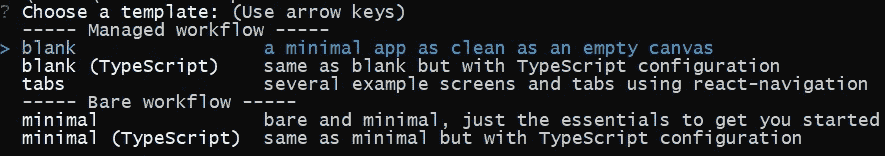
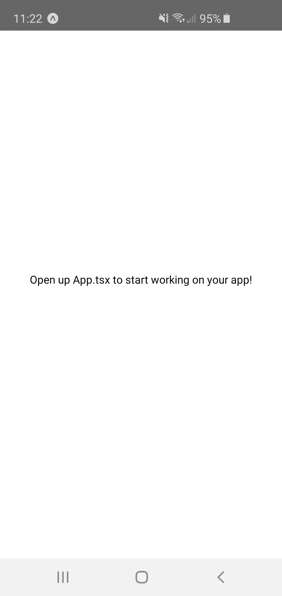
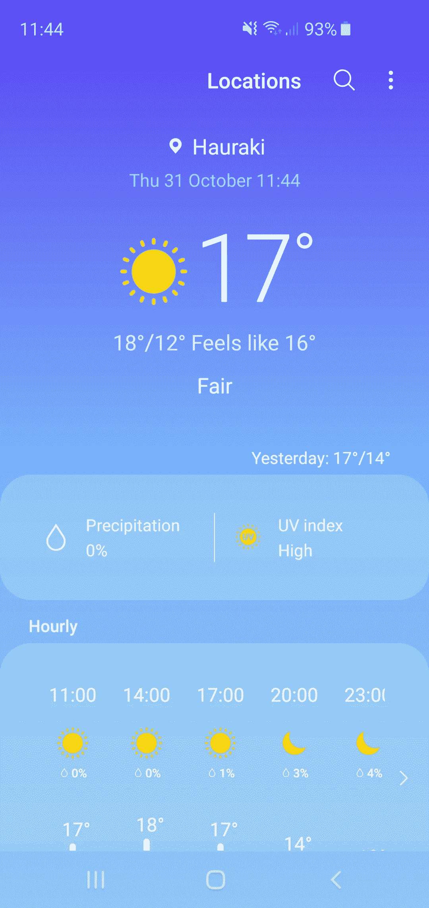
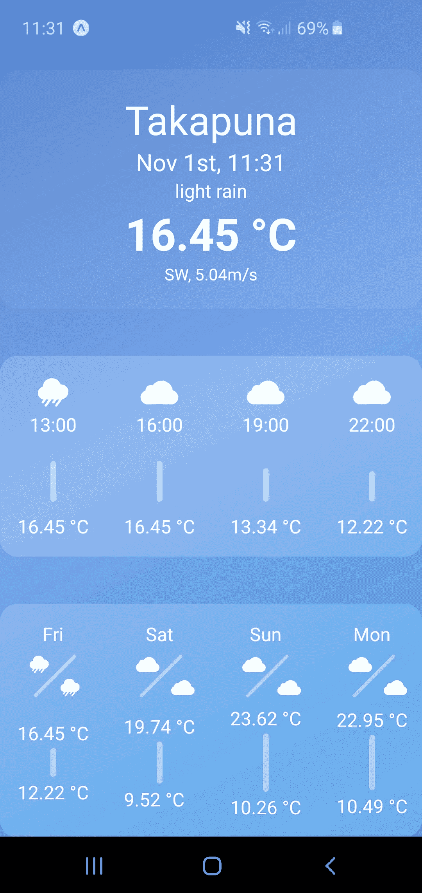

# 在 React Native 中制作简单的应用程序

> 原文：<https://javascript.plainenglish.io/building-a-simple-app-in-react-native-with-expo-d43b629152bf?source=collection_archive---------4----------------------->

## 能有多压倒性？


Photo by [Artem Sapegin](https://unsplash.com/@sapegin?utm_source=medium&utm_medium=referral) on [Unsplash](https://unsplash.com?utm_source=medium&utm_medium=referral)

我已经和“React”一起工作了一段时间，但是不愿意变成“native”。

一个下雨天，我终于鼓起勇气尝试了一下。其中一个主要原因是我有多余的时间，另一个原因是我的天气信息应用程序在最新更新后变得更糟。它是三星智能手机的内置设备。我必须滚动视频才能找到我喜欢的日出/日落时间，为什么？为什么天气应用程序中会有视频部分？好了，咆哮结束，是时候建立我自己的天气应用程序了。

在这里，我将分享我使用该技术构建第一个项目的第一手经验。

[*链接到仓库*](https://github.com/MustSeeMelons/rn-weather-app)

# 做好准备

与任何事情一样，这一切都始于一次无辜的谷歌搜索。在那里我找到了一个叫做`Expo`的工具包，看起来很简单，所以我坚持使用它。通过这样做，我能够在几分钟内让一个简单的`ReactNative`应用程序在我的手机上运行。只需在全球范围内安装`Expo`并运行`expo init`:

```
npm install -g expo-cliexpo init
```

迎接我的是一份精美的菜单，其中甚至有一个开箱即用的`Typescript`选项。



I chose blank with Typescript

***注:****12.11 及以上版本有问题，我用的是 12.09，一切正常。更多 info* [*此处*](https://stackoverflow.com/questions/58120990/question-getting-error-on-react-native-start/58199866#58199866) *。*

在`init`过程完成后，我所要做的就是运行`npm start`，在我的浏览器中打开`Metro Bundler`，然后在我的 Android 设备上下载`Expo`应用程序，扫描二维码，瞧，我的手机上运行了一个裸应用程序。我没有检查这在 iOS 上的效果，因为我没有任何设备。



The blank preset app

看着代码，它似乎很熟悉，但又不同，因为没有任何地方可以看到`div`元素。

```
import React from 'react';
import { StyleSheet, Text, View } from 'react-native';export default function App() { return (
        <View style={styles.container}>
            <Text>
                Open up App.tsx to start working on your app!  
            </Text>
        </View>
    );
}const styles = StyleSheet.create({
    container: {
    flex: 1,
    backgroundColor: '#fff',
    alignItems: 'center',
    justifyContent: 'center'
    }
});
```

# 什么是 React Native？

它是一个使用 Javascript 和 React 的能力构建原生应用程序的框架，这导致了一个几乎完全的原生应用程序。写一次，为`iOS`和`Android`编译。

我们使用由`react-native`包提供的元素来代替您的旧的`div`和`span`，它们根据构建目标被翻译成它们的本地对应物。我们甚至用`CSS`来设计一切！

由于我们必须在用户设备上运行 javascript 和本地代码，因此会有一点性能损失，但是考虑到现代设备的性能，这应该不是问题。

# 什么是世博会？

一个管理所有正在进行的`black magic`的工具集，这样您就可以专注于应用程序的业务逻辑。

当安装依赖项时，使用`expo install`而不是`npm install`是一个好主意，因为这将为您的`expo`版本提供正确的库版本，否则您可能会得到警告或最坏的情况——错误。

# 应用程序的目标



Should resemble this app

我们将使用的是:

*   `Redux`用于状态管理
*   `Axios`为`API`通话
*   `Moment`关于截止日期的操作
*   [https://openweathermap.org/forecast5](https://openweathermap.org/forecast5)作为`API`来消费我们对于数据的需求

必要时会添加更多，现在应该没问题了。我不会描述整个过程，而是描述我与`React`一起工作时所面临的挑战。

# 渐变背景

如果这是一个`React`应用程序，我会创建一个无状态的容器组件，它会简单地呈现它的孩子，同时有一些`CSS`来做渐变。可悲的是，`React Native`不支持`linear-gradient()`，所以我不得不做一些搜索。为了我的运气，这个`expo-linear-gradient`有一个`npm`包，提供了一个组件，里面有道具配置渐变的颜色和方向。

```
<LinearGradient
    style={{
        flexGrow: 1
    }}
    colors={["#5281cc", "#78a4eb", "#349beb"]}
    start={{ x: 0, y: 0 }}
    end={{ x: 1, y: 1 }}>

    ...children</LinearGradient>
```

除了这个小问题，我需要的所有其他风格都很好。乍一看，我并不是一个“JS 中的 CSS”的粉丝，因为我的大脑“单一责任原则”开始起作用了，但在使用它之后，我对它产生了兴趣。如果一个组件有一些样式，我可以在一个地方看到，如果你按照惯例在文件中放置`styles`对象，它不会增加认知负荷，甚至可能有所帮助，因为我不必一直打开`*.scss`文件。

# 状态栏

让它工作需要一些时间，文档对我个人来说不够清楚。

*   有一个`StatusBar`组件，但是它自己不会工作
*   应用程序需要使用`react-navigation`包来让`StatusBar`组件做任何事情，这反过来可能需要`react-native-gesture-handler`和`react-native-reanimated`，这取决于你的`react-native`版本。当使用`react-navigation`时，你还需要从那个包中导入`ScrollView`，而不是`react-native`。
*   `expo`的`app.json`也需要编辑。您可以在这里设置任何您想要的颜色，然后简单地用`StatusBar`组件覆盖它。

```
"androidStatusBar": {
  "backgroundColor": "#00000000"
}
```

# 导航栏

我想让它透明，但遗憾的是当使用`Expo`时这是不可能的，这是对工具包的第一次打击。

# 使用定位服务

漂亮、干净，最重要的是，我们可以在上面`await`:

```
export const getLocation = async (): Promise<Position> => {
    return new Promise((resolve, reject) => {
        navigator.geolocation.getCurrentPosition(
            (position: Position) => {
                return resolve(position);
            },
            (error: PositionError) => {
                console.warn(error);
            reject(error);
            },
            {
                enableHighAccuracy: true,
                timeout: 15000,
                maximumAge: 10000
            }
        );
    });
}
```

# 下拉以刷新

我用的大部分应用都有这个功能，那么能有多难呢？事实证明，很简单。

`react-native`包提供了一个`RefreshControl`组件，你必须将它传递给你的`ScrollView`并在父组件中做一些内务处理。

```
<ScrollView refreshControl={
    <RefreshControl
        refreshing={isRefreshing}
        onRefresh={onRefresh}
        colors={["#349beb", "#349beb"]}
        size={1} />
    }
>const [isRefreshing, setIsRefreshing] = useState(false);const onRefresh = useCallback(async () => {
    setIsRefreshing(true);
    props.refreshBegin();

    setTimeout(async () => {
        props.refreshEnd();
        props.clear();
        await fetchData();
        setIsRefreshing(false);
    }, SLIDE_TIME);
}, [isRefreshing]);
```

没看过`useCallback`？太棒了。您在数组中传递需要调用的函数及其参数。如果参数没有改变，将不会有函数调用，在这种情况下，它用于在旧的刷新尚未完成时不启动另一次刷新。虽然你必须小心:如果一个未处理的错误被抛出，它将无限期地锁定，所以处理错误！

# 最小可行产品

由于我们使用的是天气 API 的免费层，我们在某种程度上受限于所能获得的数据，因此需要进行一些功能调整。降水和紫外线指数必须删除:我不知道如何将 3 小时内的降雨量转换成百分比，我们根本没有紫外线数据。

我们获得的数据始终是未来的 40 个数据点，我们可以将这些数据汇总成天，尽管如果当天晚了，当天就不准确，因为我们没有获得历史数据，如果当天早了，最后一天也不准确，因为当天只有一两个数据点。

我相信对于我们的意图和目的来说，这是很好的。

# 动画片

我真的很喜欢和他们一起开发这个应用程序，因为我获得了很大的控制权。需要动画元素的外观？非常简单灵活。

```
useEffect(() => {
    Animated.timing(
        position,
        {
            easing: Easing.elastic(0.8),
            toValue: 0,
            duration: SLIDE_TIME,
        }
    ).start();
}, []);
```

制作失踪的动画有点复杂。我想让所有的`content boxes`在用户刷新数据后消失，但是我们不能动画化一个元素，因为它已经像渡渡鸟一样消失了。`Redux`来救援:

*   触发一个`refresh`动作，将我们店里的`isRefreshing` 设置为`true`
*   我们的`content boxes`检查值并开始动画
*   由于动画时间是一个`const`，我们超时清除我们在存储中的数据，并通过这个`const`获取新数据

# 结论



Final result

我发现这是一次愉快的经历，非常熟悉的场地，所以用`React Native`开发速度相当快。我肯定会再次使用这个框架。

管理了很多复杂性，我只遇到了一个关于导航栏透明度的问题。如果我要开发一个商业应用程序，我会做大量的研究和原型制作，以检查我们是否不会在一些计划好的功能上碰壁，对于许多人来说，这应该做得很好。

那我呢？我想我会在没有`Expo`的情况下检查工作流，看看这个过程会变得多么令人难以承受，可能是通过退出这个项目:)

如果你有任何问题，请随意提问，我甚至会用这些信息更新这个故事。