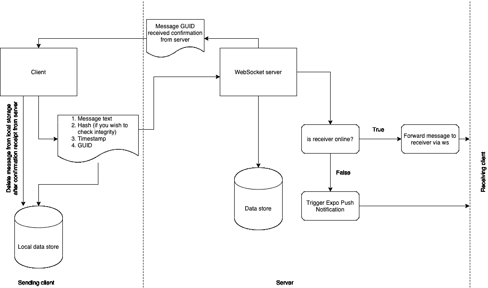
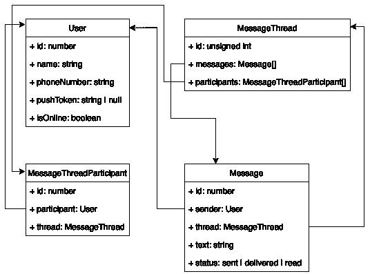
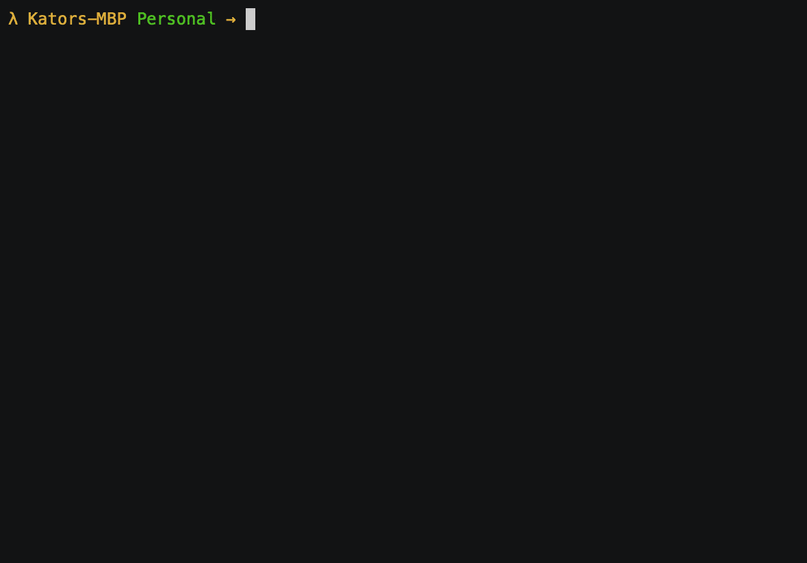

# 用 Expo 推送通知和 React Native 构建一个简单的聊天应用程序:第 1 部分

> 原文：<https://javascript.plainenglish.io/building-a-simple-chat-application-with-expo-push-notifications-and-react-native-part-1-fb144d86a83e?source=collection_archive---------10----------------------->

我最近在一个个人项目上使用了世博会通知，从那以后，我一直想在这个非常容易使用的工具上写点什么，但我一直没有找到合适的时间。无论如何，我决定用一个简单的聊天应用程序，因为我认为它可能很容易，我们可以方便地将整个事情分成一系列，每个不到一个小时。

也就是说，这将是该系列的第一部分，第二部分将在下周的某个时候推出。

说够了，让我们进入正题。

因此，这里的业务是建立一个简单的聊天应用程序有点像 WhatsApp，我们将使用 WebSockets，Expo 平台上的 React Native，Koa 和后端的 TypeORM。见鬼，也许我们甚至可以使用 Twilio 添加一点电话验证(只是也许)。

我们将从定义我们的整体架构和流程开始这一部分。下面是不是最设计，但我可以想出一些，所以我可以保持在一个小时以下。

# 设计



Design document

让我们浏览一下我们的设计

1.  首先，当用户登录时，我们将收集用户的 expo 推送令牌以及用户名和电话号码。然后我们将用户导航到主应用程序。
2.  每当用户打开主应用程序时，他们都通过 WebSocket 连接到服务器。在连接时，服务器会将连接对象存储在内存中的[映射](https://developer.mozilla.org/en-US/docs/Web/JavaScript/Reference/Global_Objects/Map)中。
3.  客户端将构建消息 JSON，它由消息文本、时间戳、接收者标识符、生成的 GUID 和生成的 hash 组成，使用 GUID 作为关键字，消息文本作为种子。我们将在设计的*上下文*中将*这个*对象称为 JSON 对象(双关语)。
4.  根据保证交付的原则，构造的 JSON 对象将被临时保存到本地存储，然后在服务器确认收到后被删除。只有当消息被接收并持久化时，服务器才会确认接收。
5.  服务器将使用 JSON 对象中的接收者标识符来检索接收者的 WebSocket 连接对象。如果找到，这意味着用户很可能在线，否则用户很可能离线。
    a .如果用户在线，消息将通过找到的套接字*单播*给接收者。
    b .如果用户离线，我们将向已经注册的世博推送令牌触发世博推送通知。
6.  当接收客户端确认消息传递时，服务器会将传递报告发送回发送用户，实现传说中的*双滴答。*

这就是总体设计，当然是简化的。请留下您的意见，告诉我们如何改进这个系统，但仍然保持它的超级简单，任何人都可以遵循。

接下来，我们将设计我们的数据库模型。我将在 [PostgreSQL](https://www.postgresql.org/) 之上使用 [TypeORM](https://typeorm.io) 。你可以选择 ORM 和 db 组合，无论哪种方式都可以锻炼。也就是说，我们将继续设计我们的模型。



Model document. v1

我们可能会迭代设计，因为文章将是交互式的，需求可能会发生变化。

# 代码

现在我们已经有了基本的设计和目标，让我们面对真正的交易。我们不会在这里使用 TDD 方法，因为我们的需求可能会随着时间的推移而改变，但是我们应该在系列的最后编写测试。

我们将使用[打字稿](https://www.typescriptlang.org/)来构建我们的项目。Typescript 非常简单，如果你熟悉 Javascript，你会发现适应它不费吹灰之力。

我们将从引导我们的后端和 React 本地项目并为两者创建 Github 库开始这一部分。继续安装[节点、NPM](https://docs.npmjs.com/downloading-and-installing-node-js-and-npm) 、 [PostresSQL](https://www.postgresqltutorial.com/install-postgresql/) 和 [Expo](https://docs.expo.io/) 如果你还没有安装的话。对了，我以为我们把我们的聊天 app 叫做 *Heya！*。所以对于后端，我们将创建一个名为“heya-api”的空文件夹，并初始化它的基本要求。因此在这一点上，我们可以说我们的 NPM 需求将是 *typescript，typeorm* (这取决于 PostgreSQL 的 *pg* 和类型分解的 *reflect-medata* 。更多信息见文档)和 *ws* (用于 WebSockets)。

```
$ mkdir heya-api && cd heya-api
$ npm init -y
$ npm install typescript @types/node --save-dev
$ npm install typeorm reflect-metadata pg ws
```

然后我们运行下面的命令来初始化这个项目的 typescript。

```
$ tsc --init
```

这将为项目创建我们的 typescript 配置文件。在你的编辑器中打开文件 *tsconfig.json* 并做一些修改。在第 4 行，我们将目标更改为“ES2017”。在第 6 行，取消对 *lib* 的注释，并将值改为 *["es6"]* 。最重要的是，确保取消对 *experimentalDecorators* 和 *emitDecoratorMetadata* 的注释，因为您将需要这些标志用于 TypeORM 实体声明。我的最终配置如下:

我们将继续初始化 Git 并创建一个*。gitignore* 文件

```
git init
touch .gitignore
```

我的*的内容。gitignore* 文件:

我们将继续把它推到 master 上，下周再继续。

现在，我们也将启动 Expo 应用程序。



把这个也往上游推。在下一集，我们将专注于为我们的应用程序设计用户界面，甚至可能添加一些功能。如前所述，请留下您的评论，感谢阅读。

[](https://github.com/16kilobyte/heya-app) [## 16kb/heya-app

### 在 GitHub 上创建一个帐户，为 16kb/heya-app 开发做贡献。

github.com](https://github.com/16kilobyte/heya-app) [](https://github.com/16kilobyte/heya-api) [## 16 千字节/heya-api

### 在 GitHub 上创建一个帐户，为 16kb/heya-API 开发做贡献。

github.com](https://github.com/16kilobyte/heya-api)