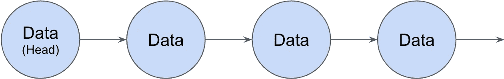
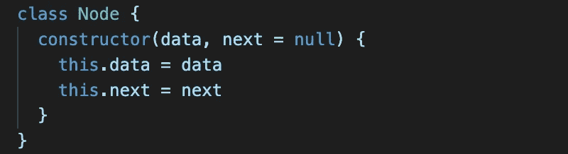
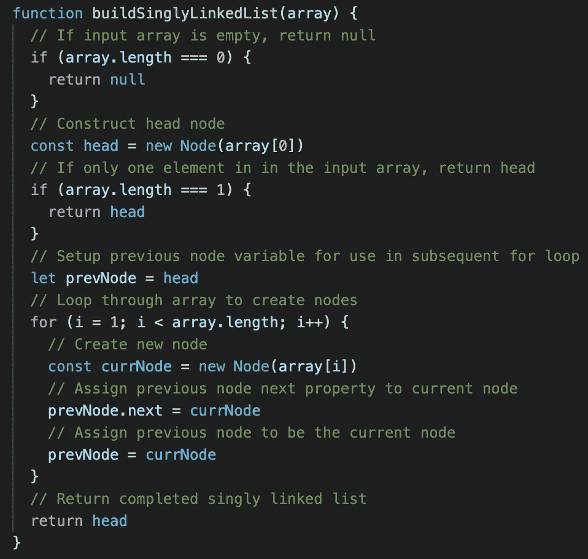

# 构建一个单链表

> 原文：<https://javascript.plainenglish.io/building-a-singly-linked-list-86b777451119?source=collection_archive---------13----------------------->

## JavaScript 中的数据结构

Photo by [Stephen Leonardi](https://unsplash.com/@stephenleo1982?utm_source=medium&utm_medium=referral) on [Unsplash](https://unsplash.com?utm_source=medium&utm_medium=referral)

很可能你看到这篇文章是因为你对面试的准备让你掉进了一个兔子洞。链表是许多面试官最喜欢的测试对象对基本数据结构的理解以及你解决问题的技巧。不管你是对学校有点生疏，还是这是你第一次遇到链表，一开始理解它们可能有点棘手。

和大多数问题一样，从图表开始是有帮助的。链表是一种线性数据结构，可以看作一个链，链中的每个链接都与下一个链接相连。在一个链表中，链中的每个链接将被表示为一个节点。

Figure 1: Singly Linked List Diagram

在单链表中，每个节点都包含一些数据，然后是指向下一个节点的指针。对于双向链表，也有一个指向前一个节点的指针。列表中的第一个节点通常被称为头，而最后一个节点的 next 指针不指向任何东西。有了这个图，现在是时候开始用 JavaScript 编写一个单链表了。

## 编码节点类

由于单链表由许多注释组成，所以创建一个类`Node`是有意义的，这样一个新的节点就可以容易地、一致地被实例化。在新节点的实例化时，它将包含的数据应该是已知的，但是下一个节点可能是未知的。

Figure 2: JavaScript Node Class

一个双向链表节点类看起来与图 2 非常相似，但是有一个额外的属性`previous`,它也将初始化为`null`,因为它可能是未知的或者它可能是头节点。

## 构建一个单链表

有了节点类，我们就可以开始构建单链表了。假设我们有一个数组，其中每个元素表示应该存储在一个节点中的数据，后续元素应该是下一个节点。索引零处的元素将是这个链表的头部。

Figure 3: JavaScript Building Singly Linked List Function

上面的函数首先检查两种情况，要么没有创建节点，要么只创建了一个节点。然后，for 代码遍历剩余的数组，为每个元素数据创建一个节点，然后将`next`属性添加到前一个节点。一旦完成，列表的头就被返回，因为它现在指向下一个节点，下一个节点指向下一个节点，依此类推，直到最后一个节点的`next`属性指向`null`。

## 附加注释

虽然本文没有介绍如何在现有的链表中插入或删除节点，但还是值得快速讨论一下。因为链表是没有索引的，所以任何节点的插入或删除都需要从头节点开始，然后遍历后续节点，直到找到所需的位置。从这里开始，必须更新前一个节点的`next`属性，以指向适当的节点。更详细的讨论请参见“JavaScript 中的数据结构”系列的后续文章:[编辑单链表](https://mathewpwheatley.medium.com/editing-a-singly-linked-list-b243a2b6d428)。

我肯定我不是第一个推荐[破解编码面试](https://www.amazon.com/Cracking-Coding-Interview-Programming-Questions/dp/0984782850/ref=sr_1_3?dchild=1&gclid=Cj0KCQjwuL_8BRCXARIsAGiC51C8K8coH5kbFaXvN9vjUvuDvFRlsKf557A3R_k1hb1acPt2pCETEPIaAoSnEALw_wcB&hvadid=241870593966&hvdev=c&hvlocphy=9033306&hvnetw=g&hvqmt=e&hvrand=4311980203673614389&hvtargid=kwd-20040243067&hydadcr=16409_10304044&keywords=cracking+the+coding+interview&qid=1603315477&sr=8-3&tag=googhydr-20)的人，但是如果你正在为面试学习数据结构和算法，这是一个很好的资源。