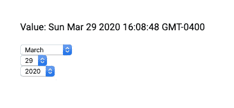
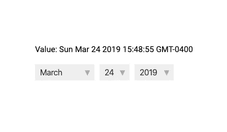
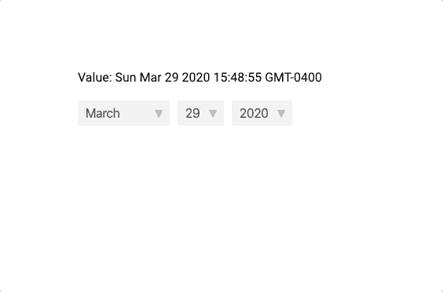

# 构建 VueJS DatePicker 组件 Vue3 教程

> 原文：<https://javascript.plainenglish.io/building-a-vuejs-datepicker-component-a-vue3-tutorial-899c235de025?source=collection_archive---------2----------------------->


Photo by [Nick Hillier](https://unsplash.com/@nhillier?utm_source=medium&utm_medium=referral) on [Unsplash](https://unsplash.com?utm_source=medium&utm_medium=referral)

**精心设计的输入是提高表单转化率的好方法**。它们可以让你的网站看起来更专业、更值得信赖，并让访问者更快地完成表单。

在本教程中，我们将构建一个基本的 DatePicker 组件，您可以轻松地对其进行样式化和调整，以匹配您自己的项目。它将使用<select>元素来建模数据并向父组件发出事件。</select>

让我们快速浏览一下我们将要制作的产品。


好了，介绍够了——让我们直接开始构建吧。

## 我们要怎么做

首先，让我们看看在高层次上发生了什么。

在我们的 DatePicker.vue 组件中，我们将有 3 个 select 元素—月、日和年各一个。

然后，为了更容易处理日期，我们将使用 [moment.js 库](https://momentjs.com/docs/)。这让我们可以在日期选择元素中显示适当的天数，这是一件非常有用的事情。

由于月份可以有不同的天数，我们必须根据当前选择的月份来更改日期选择元素。

为了对我们的数据建模，我们所有的 select 元素将改变单个 moment 对象的值，并且每当值改变时，我们希望向我们的父组件发出一个事件。

## 创建我们的基本<select>元素</select>

好的，让我们从构建更简单的选择元素开始——月份和年份。

在我们的设置方法中，我们想要创建一些数据。如果你不知道 setup 方法在新的 Composition API 中是如何工作的，[下面是我们的初学者教程。](https://learnvue.co/2020/01/a-first-look-at-vue3-alpha-release-example-app-in-15-minutes/)

我们将创建三个属性:一个月数组、一个起始年和若干年。它们不必是被动的——它们只需在模板中可访问即可。

所以我们的设置方法看起来有点像这样。

```
import { ref, onMounted } from 'vue'

export default {
  setup (props, context) {
    const months = ['January', 'February', 'March', 'April', 'May', 'June', 'July', 'August', 
      'September', 'October', 'November', 'December']

    const startingYear = 2010
    const numberofYears = 20

    return {
      months,
      numberofYears,
      startingYear
    }
  }
}
```

然后，在我们的模板中，我们可以使用 [v-for 循环](https://learnvue.co/2020/02/6-techniques-to-write-better-vuejs-v-for-loops)来迭代这个数据并创建我们的 select 元素。我们将它们包装在一个 div 中的原因是为了使它们的样式更加简单。

```
<template>
  <div class='date-picker'>
    <div class='custom-select'>
      <select>
        <option
          v-for='(month, index) in months'
          :key='month'
          :value='index'>
          {{ month }}
        </option>
      </select>
    </div>
    <div class='custom-select'>
      <select>
        <option
          v-for='i in numberofYears'
          :key='i'
          :value='startingYear + (i - 1)'>
          {{ startingYear + (i - 1) }}
        </option>
      </select>
    </div>
  </div>
</template>
```

我们的应用程序现在应该是这样的。



让我们把它变得漂亮一点，并添加以下 CSS 样式。样式化选择元素有点棘手，所以我们将使用包装器`<div>`覆盖它们。

```
<style scoped>

  /* wrapper-div for including arrow */
  .custom-select {
    background-color: #eee;
    float: left;
    margin-right: 10px;
    position: relative;    
  }

  .custom-select select {
    -moz-appearance: none;
    -webkit-appearance: none;
    appearance: none; /* remove default styling */
    background-color: inherit;
    border: none;
    color: #333;
    display: block;
    font-size: 16px;
    height: 32px;
    padding: 5px 30px 5px 10px;
    margin: 0;
    outline: none;
  }

  /* drop arrow */
  .custom-select:after {
    content: '\25bc'; 
    color: #AAA;
    font-size: 12px;
    position: absolute;
    right: 8px;
    top: 10px;
  }

</style>
```

这是我们目前的应用程序和我们的新风格。



## 构建我们的日期<select>元素</select>

静态 select 元素已经不存在了，让我们来处理 select 元素。正如我前面所说的，可用的选项取决于 select 元素的值。

所以我们要做的第一件事是创建一个 Moment 对象，它将代表我们的 DatePicker 的当前值——我们称之为`dateValue`。

让我们首先通过说`npm i moment`来导入 moment，然后我们可以像这样在我们的组件中使用它。

```
import moment from 'moment'

export default {
  setup (props, context) {

    const dateValue = moment() // defaults to current date

    // ....

   }
}
```

然后，因为我们使用 Moment，所以有一个简洁的内置方法叫做`daysInMonth()` ，它返回我们的对象当前月份的天数。因此，我们将创建一个反应性数据，并将其设置为等于该值。

```
const daysInMonth = ref(dateValue.daysInMonth())

// ...

return {
   daysInMonth,
   // ...
}
```

现在，我们可以在另一个`v-for`循环中使用组件内部的这个值。

```
<div class='custom-select'>
      <select>
        <option
          v-for='i in daysInMonth'
          :key='i'
          :value='i'>
          {{ i }}
        </option>
      </select>
    </div>
```

我们的三个要素都具备了。然而，我们仍然没有改变我们的价值观，我们只是能够编辑我们的选择。在下一节中，我们将真正开始编辑我们的 value 属性。

## 建模数据

我们要做的第一件事是创建一个允许我们编辑 Moment 对象的方法。我们称它为`editValue`，它有两个值:

*   代表我们正在编辑的当前单位(月、日、年)的字符串
*   我们的事件对象，我们可以用它来获取选择的值

然后，我们要做的就是调用`moment.set(unit, value)` 方法并更新我们的`daysInMonth`值。

```
const editValue = (unit, evt) => {
      dateValue.set(unit, evt.target.value)
      daysInMonth.value = dateValue.daysInMonth()
}

// ...

return {
   editValue, // add editValue to everything we're returning
   // ...
}
```

现在，每当我们的一个选择改变时，我们希望能够调用这个方法，并把它传递给适当的参数。

```
<select @change='editValue("months", $event)'>
<!-- ... -->
<select @change='editValue("date", $event)'>
<!-- ... -->
<select @change='editValue("year", $event)'>
<!-- ... -->
```

现在，每当我们改变月份时，天数应该反映我们的选择。



## 更新我们的展示

如果您注意到，我们的 dateValue 属性从当前日期开始，但是我们的 select 元素的原始值没有反映这一点。因此，要改变这一点，我们将不得不写一个方法，改变我们的选择元素的值。

我们可以使用模板引用来做到这一点。

为了在 Vue3 中创建一个模板引用，我们可以通过使用 Vue 公开的新的`ref`方法在我们的脚本中声明它们。

```
const month = ref(null)
const date = ref(null)
const year = ref(null)

// ...

return {
   month,
   date,
   year,
   // ...
}
```

然后，在我们的组件中，我们可以像以前一样声明引用。

```
<select @change='editValue("months", $event)' ref='month'>
<!-- ... -->
<select @change='editValue("date", $event)' ref='date'>
<!-- ... -->
<select @change='editValue("year", $event)' ref='year'>
<!-- ... -->
```

让我们编写一个基于 dateValue 更新这些 refs 的方法。它将使用矩方法来帮助格式化我们的日期。您必须确保从我们的设置方法返回 refs，以便它们在模板中可用。

```
const updateElements = () => {
      // month.value gives us the <select> 
      month.value.value = dateValue.month()
      date.value.value = dateValue.date()
      year.value.value = dateValue.format('YYYY')
}
```

为了改变组件的初始值，我们必须在 [onMounted event hook](https://learnvue.co/2020/03/how-to-use-lifecycle-hooks-in-vue3/) 期间调用这个方法。这是因为我们的`setup()`方法是在 DOM 挂载之前调用的，所以在 onMounted 事件之前，我们所有的模板引用都将是 null。

每当我们的`editValue`方法运行时，我们还想调用这个方法。

代码将如下所示。

```
const editValue = (unit, evt) => {
      dateValue.set(unit, evt.target.value)
      daysInMonth.value = dateValue.daysInMonth()
      updateElements()
}

onMounted(() => {
      updateElements()
})
```

现在，如果我们启动我们的应用程序，您会看到起始值确实是当前日期。

## 如何使用我们的 DatePicker 组件

现在我们已经有了 DatePicker 组件——让我们看看如何将它包含在父组件中。

首先，每当我们的值改变时，我们必须发出一个方法。

如果你不知道，在 Vue3 中，我们可以通过使用 setup 方法的第二个参数— `context`来访问 emit 方法。

所以我们的`editEvent`方法现在应该是这样的。

```
const editValue = (unit, evt) => {
      dateValue.set(unit, evt.target.value)
      daysInMonth.value = dateValue.daysInMonth()
      updateElements()
      context.emit('update', dateValue)
}
```

然后，在另一个组件中——我们可以只监听我们的 updateVal 事件，并按照我们想要的方式处理数据。

```
<div id='root'>
    <p> Value: {{ date }} </p>
    <date-picker @update='date = $event'/>
</div>
```

再一次，这是我们做的。


## 你有它！

这只是构建 DatePicker 组件的冰山一角。

有很多很棒的扩展可以添加到这个项目中，比如:

*   通过道具传递[默认值](https://learnvue.co/2020/01/4-vue3-composition-api-tips-you-should-know/)
*   添加弹出日历以选择日期
*   为组件添加更好的样式
*   为 Vuelidate 编写自定义[验证](https://learnvue.co/2020/01/getting-smart-with-vue-form-validation-vuelidate-tutorial/)

希望本教程对处理复合 API 中的数据有所帮助。如果你有任何问题，请在下面的评论中告诉我，我会尽力帮助你的。

干杯！

如果你有兴趣学习更多关于 Vue 3 的知识，下载我的免费的 Vue 3 备忘单，里面有一些基本的知识，比如组合 API、Vue 3 模板语法和事件处理。

## JavaScript 用简单的英语写的一个注释:

我们总是有兴趣帮助推广高质量的内容。如果你有一篇文章想用简单的英语提交给 JavaScript，用你的中级用户名发邮件到[submissions@javascriptinplainenglish.com](mailto:submissions@javascriptinplainenglish.com)给我们，我们会把你添加为作者。