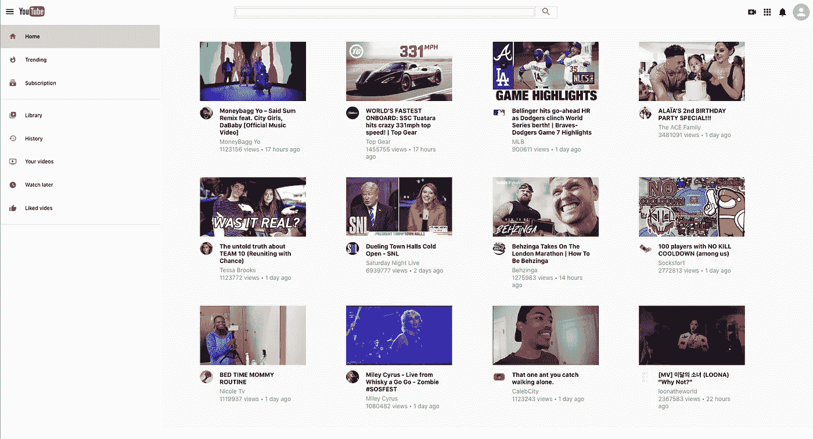
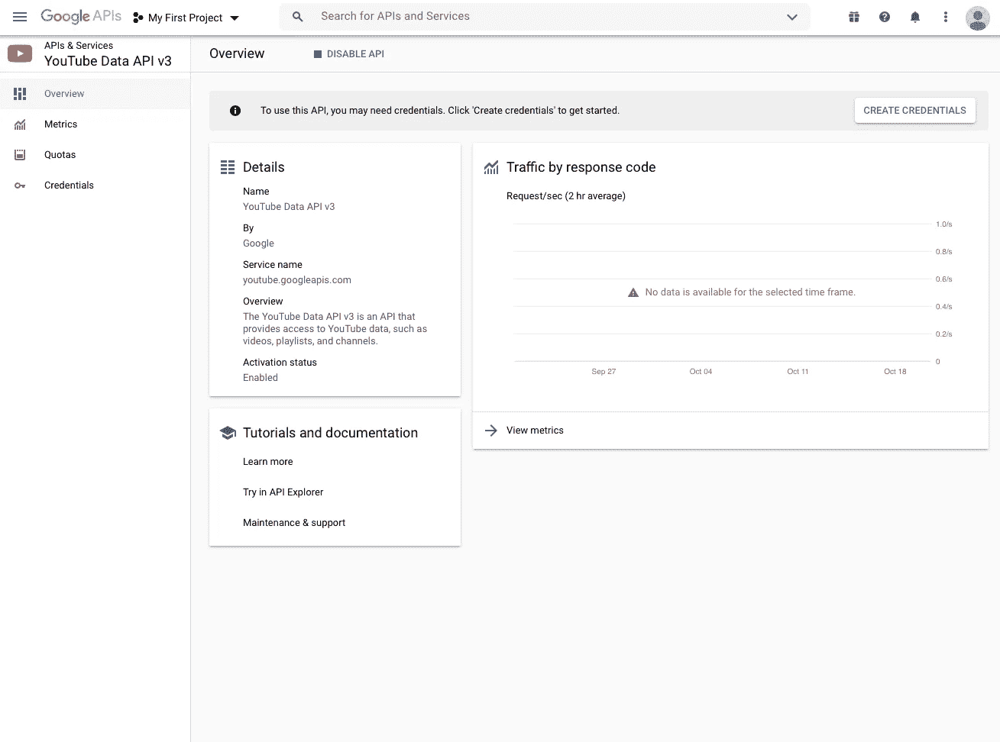
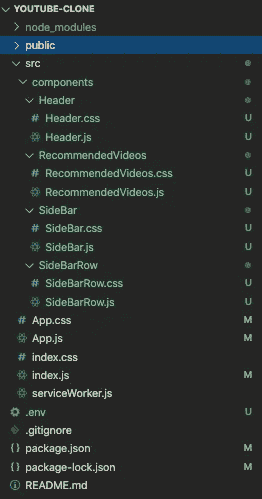
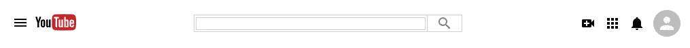
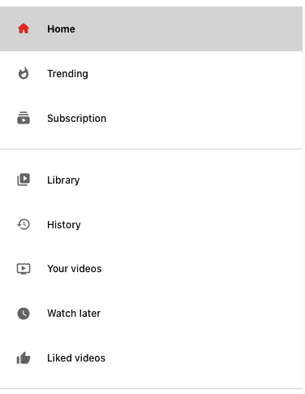

# 让我们用 React 构建一个 YouTube 克隆

> 原文：<https://javascript.plainenglish.io/building-a-youtube-clone-using-react-part-1-40fb09ae2837?source=collection_archive---------1----------------------->

## 第 1 部分:在本教程中，我们将使用 YouTube 数据 API v3 和 React 开始构建我们的 YouTube 克隆

你是否曾经看着一些世界上最受欢迎的网站，想知道这些网站的开发者有多优秀？你可以成为开发者。



The Recommended Videos page of our YouTube clone

在这个由四部分组成的系列中，我们将从头构建一个 YouTube 克隆，它将从 YouTube 获取数据，并使用 React 呈现这些数据。以下是本教程的不同部分

*   第 1 部分—获取 API 键并构建侧栏和标题(这一部分)
*   第 2 部分—建立推荐视频页面([此处](https://nouman10.medium.com/building-a-youtube-clone-using-react-part-2-a23a9dded270))
*   第 3 部分—构建搜索页面([这里是](https://nouman10.medium.com/building-a-youtube-clone-using-react-part-3-d86db83d3b33))
*   第 4 部分—构建视频播放器页面([此处为](https://nouman10.medium.com/lets-build-a-youtube-clone-with-react-part-4-48dd9e9d8cef))

如果你不喜欢阅读，对源代码感兴趣，可以滚动到这个故事的结尾。

> **注意:**本教程假设您对 JavaScript 和 React 有基本的了解。
> 
> 注意:本教程不包含所有的代码，尤其是样式，而是解释了项目的主要部分

## **访问 YouTube 数据 API v3**

在 React 中构建网站之前，我们必须首先创建必要的凭证(API KEY)来访问 API。登录您首选的 Google 帐户，然后转到[https://console . developers . Google . com/APIs/library/YouTube . Google APIs . com](https://console.developers.google.com/apis/library/youtube.googleapis.com)选择您选择的项目，然后单击“启用”。您将被定向到 API 页面，在该页面中，您可以单击创建凭据。



将会提示您一个表单。选择以下选项:

*   **你用的是哪个 API？** YouTube 数据 API v3
*   **您将从哪里调用 API？**网络浏览器(Javascript)
*   **您将访问哪些数据？**公开数据

在**上选择我需要什么凭证？按钮，您将获得一个 API 密钥。把它复制下来，放在安全的地方。我们以后会需要它。**

## **创建 React 应用**

我们将使用`create-react-app`构建我们的 React 应用程序。只需在终端中键入以下内容:

```
npx create-react-app youtube-clone
```

这将创建一个基本的 React 应用程序所需的所有必要文件。在主文件夹中创建一个. env 文件，与 src/文件夹处于同一层次结构。在中键入以下内容。env 文件，并用您在上一节中复制的内容替换<your_youtube_data_api_key>。</your_youtube_data_api_key>

```
REACT_APP_YOUTUBE_API_KEY=<YOUR_YOUTUBE_DATA_API_KEY>
```

## **基本清洁和安装**

我们将在这一部分建立侧边栏和标题。因此，让我们为此创建一些文件。我们也将删除一些不必要的文件。您的文件层次结构应该如下所示:



我们将使用`react-router`来路由到网站上的各个页面，`axios`用于从 Youtube 数据 API 请求数据，`material-ui`用于样式化组件。让我们先安装它们:

```
npm install react-router react-router-dom axios @material-ui/core @material-ui/lab @material-ui/icons
```

让我们设置我们的 App.js。除了最外面的 div 元素之外，删除 return 语句中的所有内容。我们现在将建立一个主页路径，现在只显示`Header`和`SideBar`组件。下面是我们目前的 App.js

让我们检查一下这个。主路由器组件包含我们网站中的所有路由。我们在这里使用 Switch，因为我们想根据 URL 显示不同的组件。如果没有开关，浏览器将显示当前路线组件以及主页组件。单个路线组件显示了与路径相对应的组件。目前，我们只有一条路线，即展示`SideBar`组件的主页。注意，`Header`组件在`Switch`组件之外，因为我们希望它显示在每条路线上。让我们开始构建这些组件

## **`**Header**`**组件****

**先说`Header`组件。它有三个主要方面。左侧包含一个图标和 YouTube 徽标，中间包含输入文本栏和搜索图标，最后，右侧包含视频通话、应用程序、通知图标和一个头像。我们将在它们各自的父 div 中分别创建这些文件。**

**我们使用 BEM 作为 CSS 类命名约定。你可以在这里阅读。暂时创建一个空的`SideBar`组件，否则，将会有一个导入错误，并且 React 将无法渲染`Header`**

**目前，没有造型。所有的图标、输入框等都集中在页面的中央。我们将使用 flexbox 为`Header`添加样式**

**这将使我们的`Header`看起来像这样**

****

## ****`**SideBar**`**组件******

****我们可以创建一个`SideBarRow`组件，`SideBar`组件多次调用它来显示其中的每一行。这将是一个简单的组件，显示图标和行的标题。我们可以接受图标和标题作为道具，也可以选择指示行是否被选中。****

****让我们在`SideBarRow`组件上应用一些样式****

****之后，我们将创建`SideBar`组件，它将简单地显示多个`SideBarRow`组件****

****这个组件的样式非常简单。我们将让`SideBar`覆盖 20%的屏幕，并设置`<hr />`标签的样式。****

****我们的`SideBar`组件将如下所示:****

********

******结论******

****这部分到此为止。让我们总结一下我们在本教程中所做的工作:****

1.  ****创建一个 API 键来访问 YouTube 数据 API v3。****
2.  ****设置我们的 React 项目。****
3.  ****创建`SideBar`和`Header`组件****

****在下一堂课中，我们将创建`RecommendedVideos`组件，它将成为我们的主页，它将显示 YouTube 上特定地区最受欢迎的视频。****

****你可以在我的 GitHub 上查看完整的源代码****

****如果您觉得以上内容对您有用，请分享并随时支持我-->****

*   ****[https://www.buymeacoffee.com/nouman10](https://www.buymeacoffee.com/nouman10)****