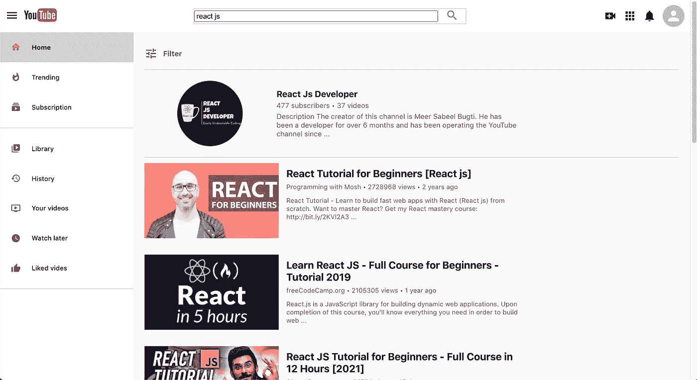
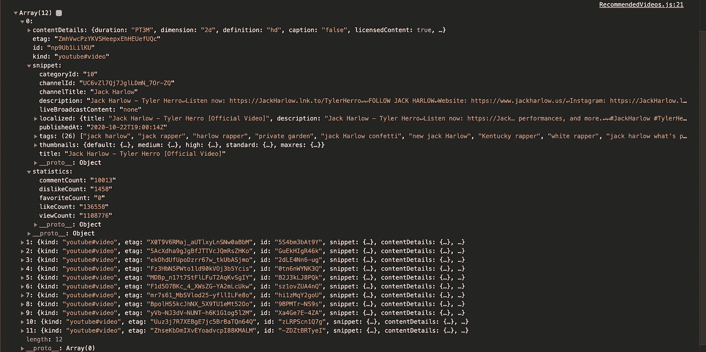
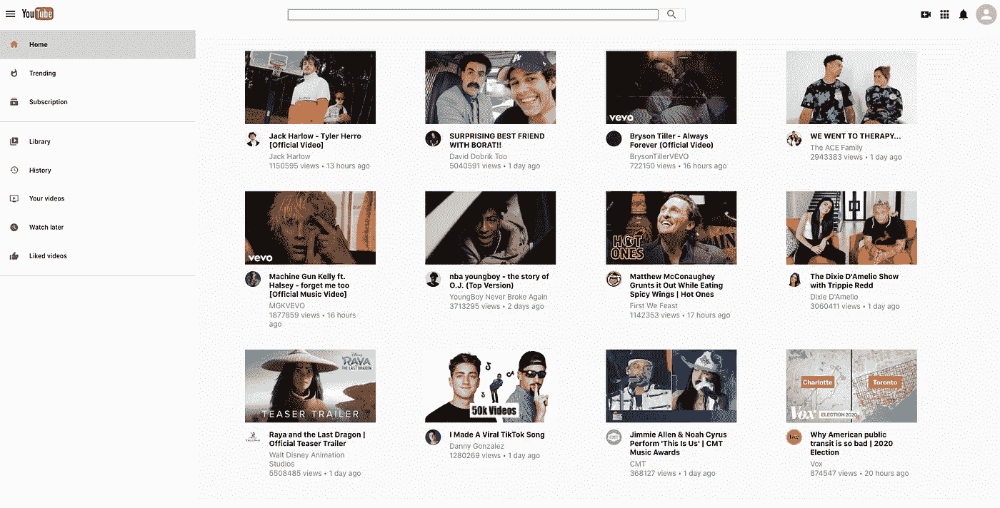

# 让我们用 React 构建一个 YouTube 克隆

> 原文：<https://javascript.plainenglish.io/building-a-youtube-clone-using-react-part-2-a23a9dded270?source=collection_archive---------7----------------------->

## 第 2 部分:在本教程中，我们将通过构建显示推荐视频的主页来继续构建 YouTube 克隆

在第 1 部分的[中，我们设置了 React 项目，从 YouTube 数据 API v3 中获取 API 密钥，并创建了`Header`和`SideBar`组件。在这一部分，我们将致力于创建`RecommendedVideos`页面，该页面将从 API 获取最受欢迎的视频并进行渲染。我们开始吧](https://medium.com/@nouman10/building-a-youtube-clone-using-react-part-1-40fb09ae2837)

Search page of our Youtube clone

下面是构建这个 YouTube 克隆的部分列表:

*   第 1 部分—获取 API 密钥并构建侧栏和标题([此处为](https://medium.com/@nouman10/building-a-youtube-clone-using-react-part-1-40fb09ae2837))
*   第 2 部分—构建推荐视频页面(这一页)
*   第 3 部分—构建搜索页面([此处为](https://nouman10.medium.com/building-a-youtube-clone-using-react-part-3-d86db83d3b33))
*   第 4 部分—构建视频播放器页面([此处为](https://nouman10.medium.com/lets-build-a-youtube-clone-with-react-part-4-48dd9e9d8cef))

如果你不喜欢阅读，对源代码感兴趣，可以滚动到故事的结尾。

> **注意:**本教程假设您对 JavaScript 和 React 有基本的了解。
> 
> **注意:**本教程不包含所有的代码，尤其是样式，而是解释了项目的主要部分

## 使用`axios`访问 API

我们将从访问 API 开始，以获取 YouTube 上最受欢迎的视频。为此，我们将使用`axios`。该请求将在页面加载时执行一次，因此我们将使用`useEffect()` hook 来发送请求。我们现在只需要`console.log`回应。确保将以下内容放入`React`组件中。

您可以在 YouTube Data API v3 页面上查看各种类型的请求。让我们看看这里的输出:

Response from the YouTube API

为了更好地显示内容，我扩展了一个数组。这里有很多信息。让我们列出我们感兴趣的数据:

1.  视频 ID
2.  频道标题
3.  频道 ID(我们将发送另一个请求来获取频道的头像)
4.  标题
5.  缩略图图像
6.  出版时间
7.  视频视图

## 从 API 中清除数据

我们现在将编写一个函数，它将接受上述信息，并根据我们的需要提取这些信息。最后，我们将在组件的状态中存储干净的数据。

我们将使用`useState()`钩子来设置视频项，以存储组件是否仍在访问和清理响应，以及在出现错误的情况下。

注意，我们在这里使用`async/await`,因为我们需要等待来自通道 API 的响应，以便用更新的数据调用`setVideoCards()`。

因此，我们已经访问了 API，清理了响应，并将其存储在我们的状态中。现在我们必须呈现响应。

## 视频卡组件

`React`的主要优势是它允许我们创建可重用的组件，这有助于遵循 DRY(不要重复自己)原则。因此，我们将创建一个`VideoCard`组件，它将接受我们清理的数据作为道具并呈现视频，而不是分别呈现每个视频。

遵循我们最初使用的相同模式，在`components/`文件夹中创建一个视频卡文件夹，分别包含两个文件`VideoCard.js`和`VideoCard.css`。

正如我们所见，`VideoCard`组件将接受视频细节作为道具并进行渲染。让我们给组件添加样式。

# 渲染视频

让我们最后连接一切，渲染元素。我们将使用`.map()`函数将每个视频的细节映射到`videoCards`数组中，以返回一个`VideoCard`组件。

注意，我们在这里给每个元素分配了`key`。这在`React`中非常重要，无论你何时呈现一个列表。这有助于`React`跟踪列表中哪些组件发生了变化，这样它只能在需要的地方重新呈现组件，而不是整个列表。你可以在这里读到更多

最后，让我们给组件添加一些样式:

我们最终的输出会是这样的:

Final Output of the RecommendedVideos Component

这是我们最后的`RecommendedVideos.js`文件:

## **结论**

这部分到此为止。让我们总结一下我们在本教程中所做的工作:

1.  使用`axios`向 Youtube 数据 API 发出请求
2.  从 API 中提取并清理响应。
3.  创建了一个`VideoCard`组件来渲染单个视频。
4.  创建了一个`RecommendedVideos`组件来呈现所有的视频。

在下一堂课中，我们将创建`SearchPage`组件，每当您搜索某个内容时，它都会呈现，并显示相关的频道和视频。

你可以在我的 GitHub 上查看完整的源代码

如果您觉得以上内容对您有用，请分享并随时支持我-->

*   https://www.buymeacoffee.com/nouman10